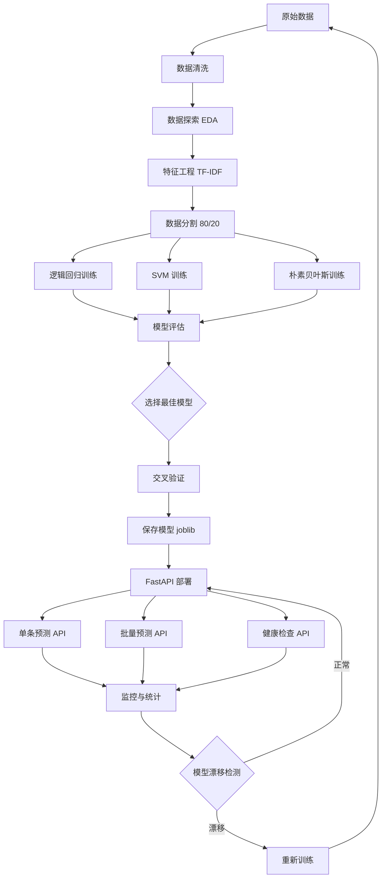

# Day 125 — 综合 AI 应用：图解

## 1. 端到端 ML 项目流程

```
┌─────────────────────────────────────────────────────────────────┐
│                    综合 AI 应用 - 端到端流程                      │
├─────────────────────────────────────────────────────────────────┤
│                                                                 │
│  Phase 1: 数据阶段                                               │
│  ┌──────────┐    ┌──────────┐    ┌──────────┐    ┌──────────┐  │
│  │  数据获取  │───▶│  数据清洗  │───▶│ 数据探索  │───▶│ 特征工程  │  │
│  │ CSV/API  │    │ 去重/缺失 │    │ EDA分析  │    │ TF-IDF   │  │
│  └──────────┘    └──────────┘    └──────────┘    └──────────┘  │
│                                                       │        │
│  Phase 2: 模型阶段                                    │        │
│  ┌──────────┐    ┌──────────┐    ┌──────────┐         │        │
│  │ 模型训练  │◀───│ 数据分割  │◀───│ 特征矩阵  │◀────────┘        │
│  │ 多模型   │    │ 80/20    │    │ X_train  │                   │
│  └──────────┘    └──────────┘    └──────────┘                   │
│       │                                                         │
│       ▼                                                         │
│  ┌──────────┐    ┌──────────┐    ┌──────────┐                   │
│  │ 评估对比  │───▶│ 选择最佳  │───▶│ 保存模型  │                   │
│  │ F1/Acc   │    │ 交叉验证  │    │ joblib   │                   │
│  └──────────┘    └──────────┘    └──────────┘                   │
│                                       │                          │
│  Phase 3: 部署阶段                      │                          │
│  ┌──────────┐    ┌──────────┐         │                          │
│  │ FastAPI  │◀───│ 加载模型  │◀────────┘                          │
│  │ REST API │    │ 预测接口  │                                   │
│  └──────────┘    └──────────┘                                   │
│       │                                                          │
│       ▼                                                          │
│  ┌──────────┐    ┌──────────┐                                   │
│  │ 监控统计  │───▶│ 持续迭代  │                                   │
│  │ 漂移检测  │    │ 模型更新  │                                   │
│  └──────────┘    └──────────┘                                   │
│                                                                 │
└─────────────────────────────────────────────────────────────────┘
```

## 2. TF-IDF 特征工程

```
输入文本: "这款手机壳质量很好，推荐购买"

┌──────────────────────────────────────────────────────────────┐
│                    TF-IDF 向量化过程                          │
├──────────────────────────────────────────────────────────────┤
│                                                              │
│  Step 1: 分词                                                │
│  ┌─────────────────────────────────────────────┐            │
│  │ ["这款", "手机壳", "质量", "很好", "推荐", "购买"] │            │
│  └─────────────────────────────────────────────┘            │
│                         │                                    │
│                         ▼                                    │
│  Step 2: 计算 TF (词频)                                      │
│  ┌─────────────────────────────────────────────┐            │
│  │ TF(质量) = 1/6 ≈ 0.167                      │            │
│  │ TF(很好) = 1/6 ≈ 0.167                      │            │
│  └─────────────────────────────────────────────┘            │
│                         │                                    │
│                         ▼                                    │
│  Step 3: 计算 IDF (逆文档频率)                                │
│  ┌─────────────────────────────────────────────┐            │
│  │ IDF(质量) = log(N/df) = log(1000/200) ≈ 1.61│            │
│  │ IDF(很好) = log(N/df) = log(1000/50) ≈ 3.00 │            │
│  └─────────────────────────────────────────────┘            │
│                         │                                    │
│                         ▼                                    │
│  Step 4: TF-IDF = TF × IDF                                   │
│  ┌─────────────────────────────────────────────┐            │
│  │ TF-IDF(质量) = 0.167 × 1.61 ≈ 0.269        │            │
│  │ TF-IDF(很好) = 0.167 × 3.00 ≈ 0.501        │            │
│  └─────────────────────────────────────────────┘            │
│                                                              │
│  输出: 稀疏向量 [0, 0, ..., 0.269, ..., 0.501, ..., 0]       │
│                                                              │
└──────────────────────────────────────────────────────────────┘
```

## 3. 模型训练与评估流程

```
┌──────────────────────────────────────────────────────────────┐
│                    模型训练评估流程                            │
├──────────────────────────────────────────────────────────────┤
│                                                              │
│  ┌─────────────┐                                             │
│  │ 训练数据集   │                                             │
│  │ X_train     │                                             │
│  │ y_train     │                                             │
│  └──────┬──────┘                                             │
│         │                                                    │
│         ├──────────────────────────────────┐                 │
│         ▼                                  ▼                 │
│  ┌─────────────┐                   ┌─────────────┐          │
│  │  逻辑回归    │                   │    SVM      │          │
│  │  训练       │                   │   训练      │          │
│  └──────┬──────┘                   └──────┬──────┘          │
│         │                                  │                 │
│         ▼                                  ▼                 │
│  ┌─────────────┐                   ┌─────────────┐          │
│  │  预测评估    │                   │  预测评估    │          │
│  │  F1=0.85    │                   │  F1=0.87    │          │
│  └──────┬──────┘                   └──────┬──────┘          │
│         │                                  │                 │
│         └──────────┬───────────────────────┘                 │
│                    ▼                                         │
│           ┌─────────────┐                                    │
│           │  模型对比    │                                    │
│           │  选择最佳    │                                    │
│           └──────┬──────┘                                    │
│                  │                                           │
│                  ▼                                           │
│           ┌─────────────┐                                    │
│           │  保存模型    │                                    │
│           │  部署上线    │                                    │
│           └─────────────┘                                    │
│                                                              │
└──────────────────────────────────────────────────────────────┘
```

## 4. FastAPI 部署架构

```
┌──────────────────────────────────────────────────────────────┐
│                    FastAPI 部署架构                            │
├──────────────────────────────────────────────────────────────┤
│                                                              │
│  客户端层                                                     │
│  ┌──────────┐  ┌──────────┐  ┌──────────┐                   │
│  │ Web 前端  │  │ 移动端    │  │ 其他服务  │                   │
│  └─────┬────┘  └─────┬────┘  └─────┬────┘                   │
│        │              │              │                        │
│        └──────────────┼──────────────┘                        │
│                       │ HTTP/JSON                             │
│                       ▼                                       │
│  API 层                                                        │
│  ┌──────────────────────────────────────────┐                │
│  │              FastAPI Server               │                │
│  │  ┌─────────┐  ┌─────────┐  ┌─────────┐ │                │
│  │  │ /predict │  │ /batch  │  │ /health │ │                │
│  │  │ 单条预测 │  │ 批量预测 │  │ 健康检查 │ │                │
│  │  └────┬────┘  └────┬────┘  └─────────┘ │                │
│  │       │             │                    │                │
│  │       ▼             ▼                    │                │
│  │  ┌─────────────────────────┐             │                │
│  │  │     模型推理引擎         │             │                │
│  │  │  ┌──────────────────┐  │             │                │
│  │  │  │ TF-IDF Vectorizer│  │             │                │
│  │  │  └────────┬─────────┘  │             │                │
│  │  │           ▼             │             │                │
│  │  │  ┌──────────────────┐  │             │                │
│  │  │  │  ML Model        │  │             │                │
│  │  │  │  (LogisticReg)   │  │             │                │
│  │  │  └──────────────────┘  │             │                │
│  │  └─────────────────────────┘             │                │
│  └──────────────────────────────────────────┘                │
│                                                              │
│  存储层                                                       │
│  ┌──────────┐  ┌──────────┐  ┌──────────┐                   │
│  │ 模型文件  │  │ 配置文件  │  │ 日志文件  │                   │
│  │ .joblib  │  │ .yaml    │  │ .log     │                   │
│  └──────────┘  └──────────┘  └──────────┘                   │
│                                                              │
└──────────────────────────────────────────────────────────────┘
```

## 5. Mermaid 流程图


