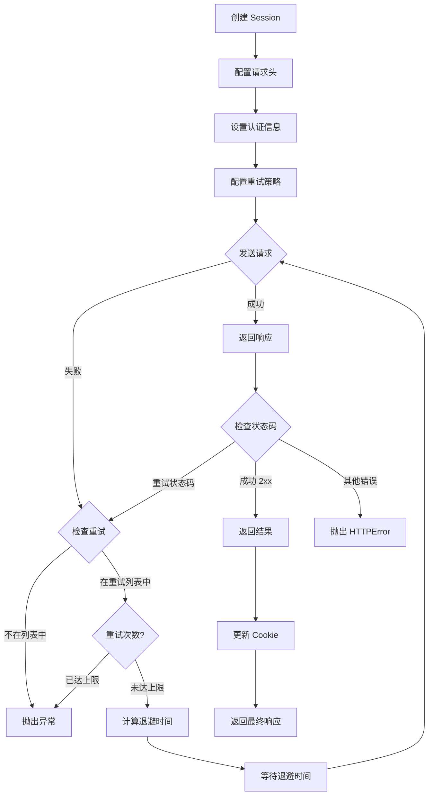

# Day 126 — Requests 深入：图解

## 1. Session 与独立请求对比

```
┌──────────────────────────────────────────────────────────────┐
│              独立请求 vs Session 会话                         │
├──────────────────────────────────────────────────────────────┤
│                                                              │
│  独立请求 (无状态)                                            │
│  ┌──────────┐    ┌──────────┐    ┌──────────┐               │
│  │ 请求 1   │───▶│ 请求 2   │───▶│ 请求 3   │               │
│  │ 无Cookie │    │ 无Cookie │    │ 无Cookie │               │
│  └──────────┘    └──────────┘    └──────────┘               │
│       │               │               │                      │
│       ▼               ▼               ▼                      │
│  ┌──────────┐    ┌──────────┐    ┌──────────┐               │
│  │ TCP 握手  │    │ TCP 握手  │    │ TCP 握手  │               │
│  │ TLS 握手  │    │ TLS 握手  │    │ TLS 握手  │               │
│  │ 发送请求  │    │ 发送请求  │    │ 发送请求  │               │
│  └──────────┘    └──────────┘    └──────────┘               │
│                                                              │
│  Session (有状态)                                            │
│  ┌──────────────────────────────────────────────────────┐   │
│  │ requests.Session                                      │   │
│  │                                                      │   │
│  │  ┌──────────┐    ┌──────────┐    ┌──────────┐       │   │
│  │  │ 请求 1   │───▶│ 请求 2   │───▶│ 请求 3   │       │   │
│  │  │ 自动管理 │    │ 自动管理 │    │ 自动管理 │       │   │
│  │  │ Cookie   │    │ Cookie   │    │ Cookie   │       │   │
│  │  └──────────┘    └──────────┘    └──────────┘       │   │
│  │       │               │               │              │   │
│  │       ▼               ▼               ▼              │   │
│  │  ┌──────────┐    ┌──────────┐    ┌──────────┐       │   │
│  │  │ TCP 握手  │    │ 复用连接  │    │ 复用连接  │       │   │
│  │  │ TLS 握手  │    │          │    │          │       │   │
│  │  └──────────┘    └──────────┘    └──────────┘       │   │
│  │                                                      │   │
│  └──────────────────────────────────────────────────────┘   │
│                                                              │
│  性能对比:                                                    │
│  独立请求: ████████████████ (慢，每次建立新连接)               │
│  Session:  ████████ (快，复用连接 + 自动管理状态)              │
│                                                              │
└──────────────────────────────────────────────────────────────┘
```

## 2. 重试策略流程

```
┌──────────────────────────────────────────────────────────────┐
│                    重试策略流程                                │
├──────────────────────────────────────────────────────────────┤
│                                                              │
│  ┌─────────┐                                                 │
│  │ 发送请求 │                                                 │
│  └────┬────┘                                                 │
│       │                                                      │
│       ▼                                                      │
│  ┌─────────┐     成功      ┌─────────┐                      │
│  │ 检查结果 │─────────────▶│ 返回响应 │                      │
│  └────┬────┘              └─────────┘                       │
│       │ 失败                                                 │
│       ▼                                                      │
│  ┌─────────┐     否        ┌─────────┐                      │
│  │ 在重试   │─────────────▶│ 抛出异常 │                      │
│  │ 列表中?  │              └─────────┘                       │
│  └────┬────┘                                                 │
│       │ 是                                                   │
│       ▼                                                      │
│  ┌─────────┐     是        ┌─────────┐                      │
│  │ 重试次数 │─────────────▶│ 抛出异常 │                      │
│  │ 用完了?  │              └─────────┘                       │
│  └────┬────┘                                                 │
│       │ 否                                                   │
│       ▼                                                      │
│  ┌─────────────────────────────────────┐                    │
│  │         计算退避时间                  │                    │
│  │  backoff_factor × (2 ^ (重试次数-1)) │                    │
│  │                                     │                    │
│  │  第1次: 0.5s                        │                    │
│  │  第2次: 1.0s                        │                    │
│  │  第3次: 2.0s                        │                    │
│  └─────────────────────────────────────┘                    │
│       │                                                      │
│       ▼                                                      │
│  ┌─────────┐                                                 │
│  │ 等待并   │                                                 │
│  │ 重新发送 │──────▶ 返回发送请求步骤                          │
│  └─────────┘                                                 │
│                                                              │
└──────────────────────────────────────────────────────────────┘
```

## 3. 连接池工作原理

```
┌──────────────────────────────────────────────────────────────┐
│                    连接池工作原理                              │
├──────────────────────────────────────────────────────────────┤
│                                                              │
│  ┌──────────────────────────────────────────────────────┐   │
│  │                requests.Session                       │   │
│  │                                                      │   │
│  │  ┌─────────────────────────────────────────────┐    │   │
│  │  │           HTTPAdapter (连接适配器)           │    │   │
│  │  │                                             │    │   │
│  │  │  ┌──────────────────────────────────────┐  │    │   │
│  │  │  │         连接池 (Connection Pool)      │  │    │   │
│  │  │  │                                      │  │    │   │
│  │  │  │  ┌──────┐ ┌──────┐ ┌──────┐         │  │    │   │
│  │  │  │  │Conn 1│ │Conn 2│ │Conn 3│  ...     │  │    │   │
│  │  │  │  │  ✅  │ │  ✅  │ │  ✅  │         │  │    │   │
│  │  │  │  └──┬───┘ └──┬───┘ └──┬───┘         │  │    │   │
│  │  │  │     │        │        │              │  │    │   │
│  │  │  └─────┼────────┼────────┼──────────────┘  │    │   │
│  │  └────────┼────────┼────────┼─────────────────┘    │   │
│  └───────────┼────────┼────────┼──────────────────────┘   │
│              │        │        │                           │
│              ▼        ▼        ▼                           │
│  ┌──────────────────────────────────────────────────────┐  │
│  │              目标服务器                                │  │
│  └──────────────────────────────────────────────────────┘  │
│                                                              │
│  工作流程:                                                    │
│  1. 请求到达 → 检查连接池                                     │
│  2. 有空闲连接 → 复用连接 (跳过 TCP/TLS 握手)                 │
│  3. 无空闲连接 → 创建新连接 (如果未达上限)                     │
│  4. 请求完成 → 连接返回连接池 (而不是关闭)                     │
│                                                              │
└──────────────────────────────────────────────────────────────┘
```

## 4. Mermaid 流程图



## 5. 请求头伪装效果对比

```
┌──────────────────────────────────────────────────────────────┐
│              请求头伪装效果对比                                │
├──────────────────────────────────────────────────────────────┤
│                                                              │
│  ❌ 未伪装 (python-requests)                                 │
│  ┌──────────────────────────────────────────────────────┐   │
│  │ GET /api/data HTTP/1.1                               │   │
│  │ Host: target-site.com                                │   │
│  │ User-Agent: python-requests/2.31.0                   │   │
│  │ Accept: */*                                          │   │
│  │ Accept-Encoding: gzip, deflate                       │   │
│  │ Connection: keep-alive                               │   │
│  └──────────────────────────────────────────────────────┘   │
│  结果: 🚫 被识别为爬虫，返回 403 Forbidden                    │
│                                                              │
│  ✅ 伪装后 (真实浏览器)                                       │
│  ┌──────────────────────────────────────────────────────┐   │
│  │ GET /api/data HTTP/1.1                               │   │
│  │ Host: target-site.com                                │   │
│  │ User-Agent: Mozilla/5.0 (Windows NT 10.0; ...)      │   │
│  │ Accept: text/html,application/xhtml+xml,...          │   │
│  │ Accept-Language: zh-CN,zh;q=0.9,en;q=0.8            │   │
│  │ Accept-Encoding: gzip, deflate, br                   │   │
│  │ Connection: keep-alive                               │   │
│  │ Upgrade-Insecure-Requests: 1                         │   │
│  │ Sec-Fetch-Dest: document                             │   │
│  │ Sec-Fetch-Mode: navigate                             │   │
│  │ Sec-Fetch-Site: none                                 │   │
│  │ Sec-Fetch-User: ?1                                   │   │
│  │ Sec-Ch-Ua: "Not_A Brand";v="8",...                  │   │
│  │ Sec-Ch-Ua-Mobile: ?0                                 │   │
│  │ Sec-Ch-Ua-Platform: "Windows"                        │   │
│  └──────────────────────────────────────────────────────┘   │
│  结果: ✅ 正常访问，返回 200 OK                               │
│                                                              │
└──────────────────────────────────────────────────────────────┘
```
