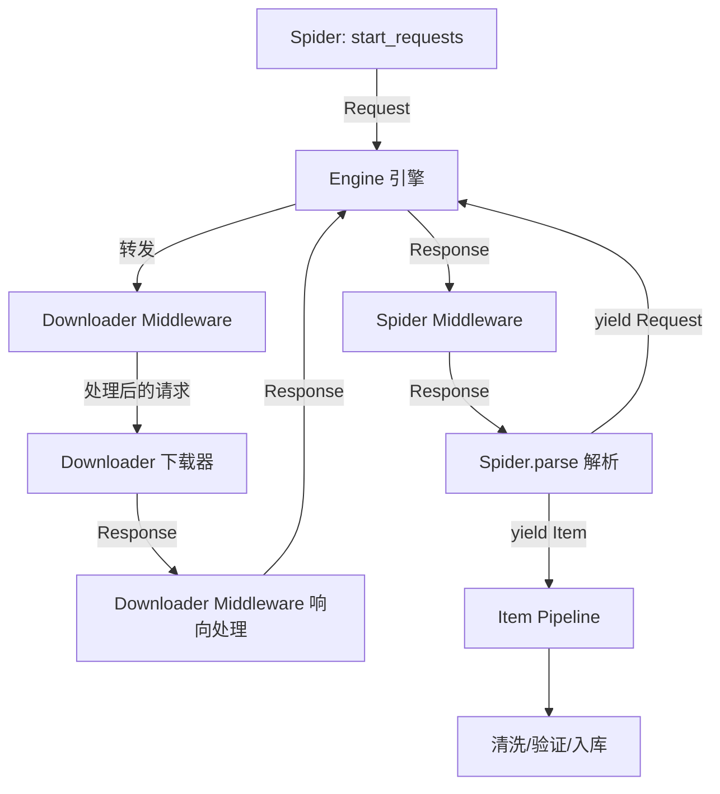

# Day 128 - Scrapy 框架

> 🎯 **今日目标**：掌握 Python 最强大的爬虫框架 Scrapy，理解其项目结构、Spider/Item/Pipeline/Middleware 四大核心组件，能独立开发完整爬虫项目。

---

## 📋 概念总览

### 为什么需要 Scrapy？

前两天我们学的 requests + BeautifulSoup 是"手动挡"爬虫：要自己写循环、自己去重、自己存数据、自己处理异常。当项目规模变大（几万个页面、多线程并发、数据清洗入库）时，手写这些"基建"代码会非常痛苦。

**Scrapy 就是爬虫界的"自动挡 + 全套改装"**：

| 手写 requests 爬虫 | Scrapy 框架 |
|---|---|
| 自己写循环逐个请求 | 内置异步并发调度（基于 Twisted） |
| 手动维护 URL 队列去重 | 内置 Scheduler + 去重过滤器 |
| 解析函数里顺带存数据 | Item + Pipeline 数据流水线分离 |
| 每个 site 重写一遍逻辑 | Spider 类按网站复用框架能力 |
| 异常处理靠 try/except 到处包 | Middleware 统一拦截重试 |

**一句话**：Scrapy 把爬虫拆成了"流水线上的不同工位"，你只需要在每个工位写自己的逻辑，框架负责调度和串联。

---

## 🏗️ 一、Scrapy 项目结构

### 1.1 安装与创建项目

```bash
pip install scrapy
scrapy startproject myproject   # 创建项目
cd myproject
scrapy genspider example example.com  # 生成一个爬虫模板
```

### 1.2 目录结构（必须背下来）

```
myproject/                  ← 项目根目录
├── scrapy.cfg              ← 部署配置文件（本地开发基本不用动）
└── myproject/              ← Python 包
    ├── __init__.py
    ├── items.py            ← 数据结构定义（要抓什么字段）
    ├── middlewares.py      ← 中间件（请求/响应的拦截器）
    ├── pipelines.py        ← 数据管道（抓到后怎么处理）
    ├── settings.py         ← 全局配置（并发数、延迟、UA 等）
    └── spiders/            ← 爬虫目录（一个网站一个 Spider）
        ├── __init__.py
        └── example.py      ← 具体的爬虫逻辑
```

**为什么这样分？** 这是"关注点分离"思想：
- **抓什么**（Spider）→ **装什么**（Item）→ **怎么处理**（Pipeline）→ **怎么发请求**（Middleware）→ **全局参数**（settings）
- 每个文件职责单一，改数据存储不用碰爬虫逻辑，改请求头不用碰解析代码。

---

## ⚙️ 二、核心组件与数据流

### 2.1 五大组件

1. **Engine（引擎）**：总指挥，负责在所有组件之间流转数据，本身不干活。
2. **Spider（爬虫）**：你写的解析逻辑——发哪些初始请求、怎么解析响应、怎么发现新 URL。
3. **Scheduler（调度器）**：请求队列管家，负责排队和去重。
4. **Downloader（下载器）**：真正发 HTTP 请求的工人（内置异步，不用你写多线程）。
5. **Item Pipeline（数据管道）**：数据清洗、验证、去重、入库。

### 2.2 一次请求的完整旅程

```
Spider 生成请求
      │
      ▼
Engine ──► Middleware(process_request) ──► Scheduler 排队去重
                                                    │
Engine ◄── Middleware(process_response) ◄── Downloader 下载
      │
      ▼
Spider.parse() 解析 Response
      │
      ├──► yield Item ──► Pipeline: process_item() ──► 存储
      └──► yield Request ──► 回到 Scheduler（循环往复）
```

**关键理解**：Scrapy 的核心是一个**异步事件循环**。当 Downloader 在等某个响应时，Engine 不会干等，而是继续调度其他请求——这就是它不用多线程也能高并发的原因（协作式异步）。

### 2.3 Mermaid 流程图



---

## 🕷️ 三、Spider：爬虫的"大脑"

### 3.1 最简单的 Spider

```python
import scrapy

class BookSpider(scrapy.Spider):
    name = "books"                        # 爬虫唯一名，运行时用 scrapy crawl books
    allowed_domains = ["books.toscrape.com"]  # 安全阀：只允许爬这个域名
    start_urls = ["http://books.toscrape.com/"]  # 起始 URL 列表

    def parse(self, response):
        # response 就是下载好的响应，可直接用 CSS/XPath 选择器
        for book in response.css("article.product_pod"):
            yield {
                "title": book.css("h3 a::attr(title)").get(),
                "price": book.css("p.price_color::text").get(),
            }
        # 翻页：找到下一页链接，yield 新请求，回调还是 parse
        next_page = response.css("li.next a::attr(href)").get()
        if next_page:
            yield response.follow(next_page, callback=self.parse)
```

**逐行解释为什么：**
- `name` 必须唯一，Scrapy 用它定位爬虫（类似数据库主键）。
- `allowed_domains` 防止你解析到外链后"爬飞了"，跑去爬别的网站。
- `start_urls` 里的 URL 会被框架自动转成 Request 并调用 `parse`。
- `yield` 字典/Item：Scrapy 是生成器驱动的，yield 出去的数据自动流向 Pipeline。
- `response.follow()` 会自动把相对 URL 补全成绝对 URL（比 urljoin 省心）。

### 3.2 两个选择器：CSS 与 XPath

```python
response.css("h1::text").get()             # CSS 选择器，::text 取文本
response.css("a::attr(href)").get()         # ::attr() 取属性
response.css("li.item").getall()            # 取所有匹配（返回列表）
response.xpath("//h1/text()").get()         # XPath，功能更强
response.xpath('//a[@class="next"]/@href').get()
```

**选择建议**：简单结构用 CSS（可读性好）；需要"找父节点""按文本匹配"这种操作时用 XPath，例如 `//a[contains(text(), "下一页")]/@href`。

### 3.3 分层解析（多级页面）

列表页 → 详情页是常见需求，用回调串联：

```python
def parse(self, response):
    for link in response.css("h3 a::attr(href)").getall():
        yield response.follow(link, callback=self.parse_detail)  # 详情页交给另一个方法

def parse_detail(self, response):
    yield {
        "title": response.css("h1::text").get(),
        "desc": response.css("#product_description ~ p::text").get(),
    }
```

**为什么拆成两个方法？** 单一职责。列表页逻辑和详情页逻辑分开，出错时容易定位；也方便不同页面用不同解析规则。

---

## 📦 四、Item：数据的"模具"

直接 yield 字典也能跑，但正式项目要定义 Item：

```python
# items.py
import scrapy

class BookItem(scrapy.Item):
    title = scrapy.Field()
    price = scrapy.Field()
    stock = scrapy.Field()
    url = scrapy.Field()
```

**为什么要用 Item 而不是字典？**
1. **字段预声明**：拼错字段名立刻能发现；字典拼错了悄悄就存进去了。
2. **Pipeline 可按类型分流**：`isinstance(item, BookItem)` 决定走哪条管道。
3. **配合 ItemLoader** 可以统一做清洗（去空格、提取数字）。

---

## 🔧 五、Pipeline：数据的"流水线"

Pipeline 是一组按顺序执行的 `process_item(item, spider)` 方法：

```python
# pipelines.py
import json

class PriceCleanPipeline:
    """清洗价格：'£51.77' -> 51.77"""
    def process_item(self, item, spider):
        item["price"] = float(item["price"].replace("£", "").strip())
        return item  # 必须返回 item，否则数据断流！

class ValidationPipeline:
    """校验：标题为空的数据直接丢弃"""
    def process_item(self, item, spider):
        if not item.get("title"):
            raise scrapy.DropItem("缺少标题，丢弃")  # 丢弃但不报错
        return item

class JsonPipeline:
    """保存到 JSON 文件"""
    def open_spider(self, spider):      # 爬虫启动时调用一次
        self.file = open("books.json", "w", encoding="utf-8")

    def close_spider(self, spider):     # 爬虫结束时调用一次
        self.file.close()

    def process_item(self, item, spider):
        self.file.write(json.dumps(dict(item), ensure_ascii=False) + "\n")
        return item
```

**启用 Pipeline（settings.py）**：

```python
ITEM_PIPELINES = {
    "myproject.pipelines.ValidationPipeline": 100,  # 数字越小越先执行
    "myproject.pipelines.PriceCleanPipeline": 200,
    "myproject.pipelines.JsonPipeline": 300,
}
```

**为什么用数字排序？** 校验应该最先（脏数据别浪费后续计算），入库最后。数字让你像流水线工位一样自由排列组合。

---

## 🛡️ 六、Middleware：请求的"安检门"

中间件分两类：
- **Downloader Middleware**：拦截"引擎 ↔ 下载器"之间的请求/响应（加 UA、代理、重试）。
- **Spider Middleware**：拦截"引擎 ↔ Spider"之间的数据（改写 response 输入、丢弃 item 输出）。

```python
# middlewares.py —— 自定义 UA 中间件
class RandomUaMiddleware:
    USER_AGENTS = [
        "Mozilla/5.0 (Windows NT 10.0; Win64; x64) ...",
        "Mozilla/5.0 (Macintosh; Intel Mac OS X 10_15_7) ...",
    ]

    def process_request(self, request, spider):
        request.headers["User-Agent"] = random.choice(self.USER_AGENTS)

# settings.py 启用
DOWNLOADER_MIDDLEWARES = {
    "myproject.middlewares.RandomUaMiddleware": 400,
}
```

**process_request 返回值决定走向**（这是面试高频题）：

| 返回值 | 效果 |
|---|---|
| `None` | 继续走下一个中间件，最终交给 Downloader |
| `Response` | 直接短路返回，不下载了（可用来做本地缓存） |
| `Request` | 重新排队（可用来做重定向/重试） |
| `raise IgnoreRequest` | 丢弃该请求，process_exception 会被调用 |

---

## ⚙️ 七、settings.py 必知配置

```python
BOT_NAME = "myproject"

# 礼貌爬取（Day 131 会深入讲）
ROBOTSTXT_OBEY = True          # 是否遵守 robots.txt
DOWNLOAD_DELAY = 0.5           # 同一网站两次请求间隔（秒）
CONCURRENT_REQUESTS = 16       # 全局并发数
CONCURRENT_REQUESTS_PER_DOMAIN = 8  # 单域名并发（防打爆单站）

# 下载细节
DOWNLOAD_TIMEOUT = 15          # 超时秒数
RETRY_ENABLED = True
RETRY_TIMES = 3                # 失败重试次数

# 防被识别
USER_AGENT = "Mozilla/5.0 ..."

DEFAULT_REQUEST_HEADERS = {
    "Accept": "text/html,application/xhtml+xml",
}

# 自动限速扩展（比固定 delay 更智能）
AUTOTHROTTLE_ENABLED = True
AUTOTHROTTLE_START_DELAY = 0.5
AUTOTHROTTLE_MAX_DELAY = 10
```

---

## 🚀 八、运行方式

```bash
scrapy crawl books                       # 运行爬虫
scrapy crawl books -o books.json         # 结果导出 JSON（Feed exports）
scrapy crawl books -o books.csv          # 导出 CSV
scrapy shell "http://books.toscrape.com" # 交互式调试（强烈推荐！）
scrapy list                              # 列出所有爬虫
scrapy version -v                        # 查看版本
```

**`scrapy shell` 为什么是调试神器？** 它把响应下载好放进交互环境，你可以现场试选择器，写对了再贴进代码，比"改代码→跑爬虫→看报错"快十倍。

### 在 .py 脚本里运行（调试友好）

```python
from scrapy.crawler import CrawlerProcess
process = CrawlerProcess(settings={"FEEDS": {"books.json": {"format": "json"}}})
process.crawl(BookSpider)
process.start()
```

---

## 🧠 九、底层原理：为什么 Scrapy 快？

1. **基于 Twisted 事件循环**：单线程异步 IO。发起请求后不阻塞等待，注册回调后立刻处理下一个请求。100 个请求在途时 CPU 几乎不空转。
2. **对比 requests**：requests.get() 是同步的，等一个响应时线程干瞪眼；要么串行慢死，要么多线程吃内存且有 GIL 开销。
3. **代价**：Scrapy 代码必须写成回调/生成器风格，不能写 `time.sleep()`（会阻塞整个事件循环）——想延时要用 `DOWNLOAD_DELAY` 或 `twisted.internet.defer`。

```
同步 requests（串行）：         Scrapy（异步）：
请求1 ██░░░░░░                  请求1 ██▓▓░░
     等待...                          请求2 ░░██▓▓
请求2     ██░░░░░░                     请求3 ░░░░██▓▓
     等待...                    ↓ 三个请求的等待时间重叠
请求3           ██░░░░░░        总耗时 ≈ 最慢的那个
```

---

## 💻 十、完整实战：爬取 books.toscrape.com

实战代码见 `code/03-practical-crawler.py`（单文件可运行版，内嵌 Scrapy 组件写法，无需 `scrapy startproject` 也能体验完整流程），流程：

1. 定义 `BookItem`（title/price/rating/url）
2. `BookSpider` 列表页解析 + 翻页
3. `CleaningPipeline` 清洗价格 + `JsonPipeline` 落盘
4. `CrawlerProcess` 启动并导出 JSON

---

## ❓ 思考题

1. Scrapy 为什么不用多线程也能实现高并发？它依赖的核心机制是什么？
2. `yield item` 和 `yield Request` 分别流向哪个组件？如果在 `parse` 里既不 yield 也不 return，会发生什么？
3. Pipeline 中 `process_item` 忘记 `return item` 会怎样？如何避免？
4. `allowed_domains` 有什么安全意义？如果列表页里混入了第三方域名的链接，Scrapy 会怎么处理？
5. `DOWNLOAD_DELAY=0.5` 和 `AUTOTHROTTLE_ENABLED=True` 有什么区别？哪个对目标网站更"礼貌"？

---

## 📚 延伸阅读

- 官方文档：https://docs.scrapy.org/
- 选择器文档：https://docs.scrapy.org/en/latest/topics/selectors.html
- 明天预告：Day 129 动态渲染 —— 当页面内容是 JS 画出来的，Scrapy 抓到的只是空壳，怎么办？
