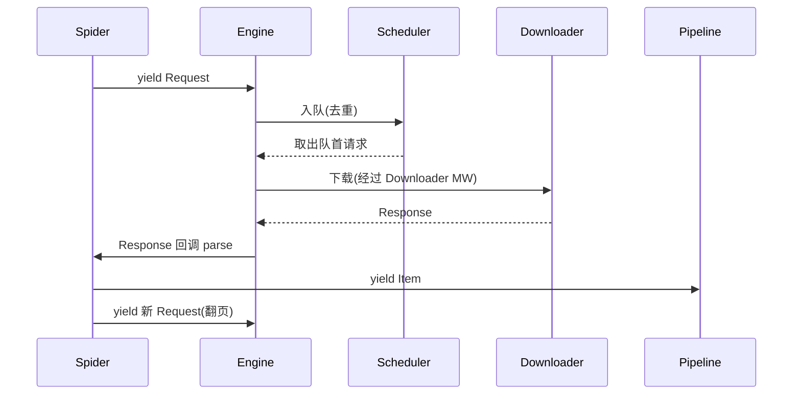

# Day 128 - Scrapy 框架 图解

## 1. Scrapy 架构总览（官方架构的精简版）

```
                        ┌──────────────┐
                        │   SPIDER     │  你写的解析逻辑
                        │ (parse 回调) │
                        └──────┬───────┘
                     Request ↑ │ ↓ yield Item
                        ┌──────┴───────┐        ┌─────────────┐
                        │    ENGINE    │───────►│  PIPELINE   │
                        │   (总调度)   │ Item   │ 清洗→去重→入库│
                        └──┬────────▲──┘        └─────────────┘
              Request      │        │  Response
                     ┌─────▼────────┴─────┐
                     │  DOWNLOADER        │
                     │  MIDDLEWARES       │  加 UA / 代理 / 重试
                     └─────┬────────▲─────┘
                     ┌─────▼────────┴─────┐
                     │  DOWNLOADER        │  异步并发下载
                     └─────┬────────▲─────┘
                           ▼        │
                     ┌──────────────┐
                     │  SCHEDULER   │  请求队列 + 去重过滤
                     └──────────────┘
```

## 2. 请求生命周期（时序）



## 3. 同步 vs 异步耗时对比

```
requests 串行（总耗时 = 各请求之和）:
  req1: [下载███][解析]
  req2:            [下载███][解析]
  req3:                     [下载███][解析]
  总计: ████████████████████████

Scrapy 异步（总耗时 ≈ 最慢请求）:
  req1: [下载███][解析]
  req2: [下载███][解析]
  req3: [下载███][解析]     ← 下载等待时间完全重叠
  总计: ███████
```

## 4. Pipeline 执行顺序（settings 里的数字）

```
Item ──► [100 校验] ──► [200 清洗] ──► [300 去重] ──► [400 入库] ──► 文件/数据库
             │  DropItem 直接丢弃，后面工位不再处理
             ▼
           丢弃
```
