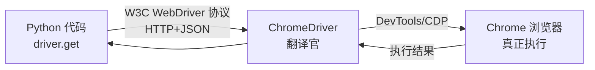

# Day 129 - 动态渲染（Selenium） 图解

## 1. 静态 vs 动态渲染页面

```
【静态页面】
  浏览器 ──GET──► 服务器
         ◄──完整 HTML（数据在标签里）
  requests 同样能拿到 ✅

【动态渲染页面（SPA/Ajax）】
  浏览器 ──GET──► 服务器
         ◄──空壳 HTML + <script>
  浏览器执行 JS
         ──XHR/Ajax──► API 服务器
         ◄──JSON 数据
  JS 把 JSON 写进 DOM ──► 页面才"长出"内容
  requests 只能拿到空壳 ❌ → 需要真浏览器（Selenium）
```

## 2. Selenium 架构



## 3. 等待策略对比

```
time.sleep(5)          ████████████████░░░░  固定 5s：快时浪费，慢时崩
WebDriverWait.until    ████✓                 条件满足立刻返回：快且稳

显式等待循环内部：
  ┌─────────────────────────────┐
  │ 检查条件 → 满足？返回        │
  │   ↓ 否                      │
  │ sleep(poll_frequency=0.5s)  │
  │   ↓                         │
  │ 超过 timeout → 抛           │
  │ TimeoutException            │
  └─────────────────────────────┘
```

## 4. iframe 定位陷阱

```
主文档 DOM
├── <div id="header">      ← 直接 find_element ✅
└── <iframe id="fr">
        └── <h2 id="inner"> ← 直接 find_element ❌ NoSuchElementException
                             switch_to.frame("fr") 后 ✅
                             switch_to.default_content() 切回主文档
```
