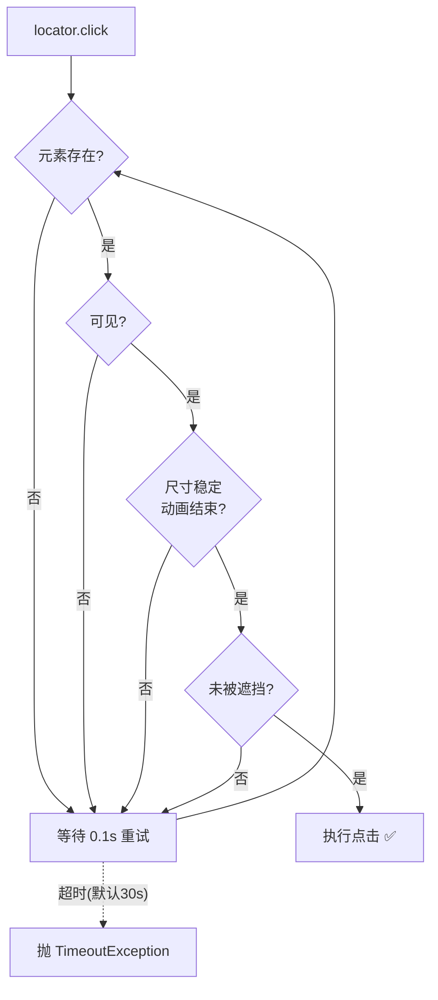

# Day 130 - Playwright 现代爬虫 图解

## 1. Selenium vs Playwright 架构

```
Selenium:                          Playwright:
Python                             Python
  │ W3C HTTP 协议                    │ 驱动进程（pip 自带，一条 install 命令）
  ▼                                  ▼
ChromeDriver（每个浏览器一个）        CDP / 内部协议直连
  ▼                                  ▼
Chrome                              Chromium / Firefox / WebKit
                                    （内核由 playwright install 统一管理，无版本地狱）
```

## 2. 自动等待（actionability）流程



## 3. BrowserContext 并发模型

```
             1 个浏览器进程（重，慢启动）
                    │
     ┌──────────────┼──────────────┐
     ▼              ▼              ▼
 Context A      Context B      Context C     （秒级创建，≈无痕窗口）
  UA/UA-A        UA-B           UA-C          各自 Cookie/存储隔离
     │              │              │
   page          page           page          模拟 N 个独立用户并发
```

## 4. Locator（惰性+重试） vs WebElement（快照）

```
Selenium WebElement:  find_element 拿到"引用快照" ──页面刷新──► StaleElementReferenceException 💥

Playwright Locator:   locator() 只是"描述"（CSS/XPath 字符串）
                      ──每次操作时实时查找 + 自动重试──► 永远指向当前 DOM ✅
```
