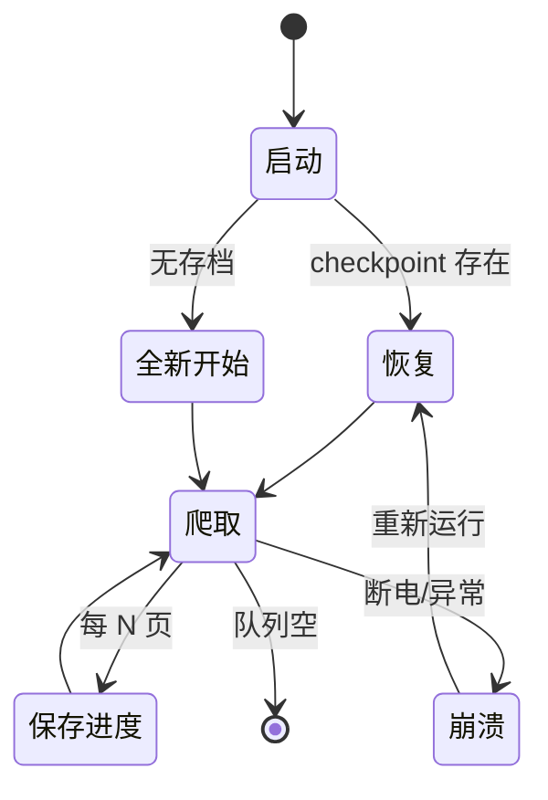

# Day 131 - 爬虫策略 图解

## 1. 去重方案内存对比

```
1000 万 URL 去重：
┌──────────────┬─────────────┬──────────────────┐
│ 方案          │ 内存        │ 误判             │
├──────────────┼─────────────┼──────────────────┤
│ set（存字符串）│ ~2-3 GB     │ 0                │
│ Bloom (1%)    │ ~120 MB     │ 假阳性 1%（可接受）│
│ Redis set     │ ~2 GB+ 网络 │ 0（可分布式共享）  │
└──────────────┴─────────────┴──────────────────┘
```

## 2. Bloom Filter 原理

```
        bit 数组（m 位）        插入 "url_A"（k=3 个哈希）
  0 1 2 3 4 5 6 7 8 ...    h1 -> 位 2，h2 -> 位 7，h3 -> 位 11
  ─────────────────────
  0 0 [1] 0 0 0 0 [1] 0 0 0 [1] ...

查询 "url_A"：位 2,7,11 全是 1 -> 可能存在 ✅（也可能是别的 URL 置的）
查询 "url_B"：位 5 = 0      -> 肯定不存在 ✅（100% 确定）
```

## 3. 断点续爬生命周期



## 4. 令牌桶 vs 固定延迟

```
固定 sleep(1s)：  ●────●────●────●────●    永远匀速，突发也无法更快

令牌桶 rate=1, cap=3：
  空闲后连发：     ●●●─────●────●────●     前 3 个立即放行（突发），
                                          之后平均 1 个/秒
  优点：吞吐更高 + 行为更像真实用户
```

## 5. 指数退避

```
重试间隔: 1s → 2s → 4s → 8s → 16s（base * 2^n）
收到 429: 优先尊重 Retry-After 响应头
连续失败 5 次: 记入失败清单，留给下次补爬（绝不无限硬撞）
```
