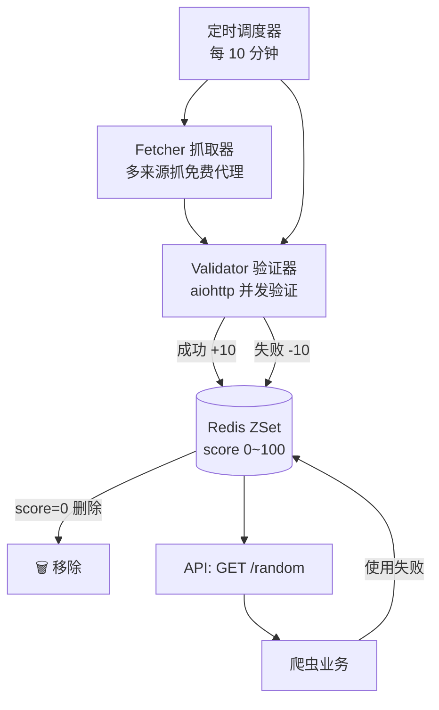

# Day 132 - 代理池搭建 · 图解

## 1. 代理请求链路（HTTP vs HTTPS）

```
HTTP 站点:
  爬虫 ──"GET http://site.com/x"──▶ 代理 ──"GET /x Host:site.com"──▶ 站点
  （代理能看到并修改全部明文内容）

HTTPS 站点（CONNECT 隧道）:
  爬虫 ──"CONNECT site.com:443"──▶ 代理
  代理 ──"200 Connection Established"──▶ 爬虫
  爬虫 ══(TLS 加密隧道，代理只转发字节)══▶ 站点
  （代理只看得见域名，看不到内容）
```

## 2. 代理池架构（Mermaid）



## 3. 分数流转

```
   抓取入库(50) ──验证成功──▶ 100（顶）
        │                      │
        │                      └─失败-10─▶ 90 ─失败─▶ ... ─失败─▶ 0 → 删除
        └─首次验证失败─▶ 40 ─失败─▶ 30 ─失败─▶ 20 ─失败─▶ 10 ─失败─▶ 0 → 删除
```
