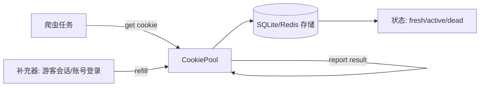

# Day 133 - UA 与 Cookie 池

> 主题：浏览器指纹 UA 随机化、Cookie 持久化与轮换、绕过反爬检测实战

---

## 一、概念解释

### 1.1 User-Agent（UA）是什么

User-Agent 是 HTTP 请求头中的一个字段，用于标识发起请求的客户端类型：操作系统、浏览器、版本号、渲染引擎等。服务器（尤其是 WAF / 反爬系统）通过它判断"这是不是一个正常的浏览器"。

一个典型的 Chrome UA：

```
Mozilla/5.0 (Windows NT 10.0; Win64; x64) AppleWebKit/537.36 (KHTML, like Gecko) Chrome/126.0.0.0 Safari/537.36
```

**为什么爬虫 UA 是反爬第一道防线**：
- `requests` / `httpx` 默认 UA 是 `python-requests/2.x`，一眼假
- 大量请求使用同一个 UA + 同一个 IP = 明显的机器特征
- 反爬系统维护"UA 黑名单"，非浏览器 UA 直接拦截或返回假数据

### 1.2 UA 池（UA Pool）

UA 池 = 维护一批真实、常见的浏览器 UA，每次请求随机选一个（或按会话轮换），让请求特征接近真实用户的多样性分布。

设计要点：
- **真实性**：只用近两年主流浏览器 UA（过老的 UA 反而可疑）
- **一致性**：一次"会话"内 UA 应保持不变（真实用户不会一个会话换 5 种浏览器），且 UA 声称的操作系统要与 `Sec-CH-UA-Platform` 等头一致
- **权重分布**：Chrome 用户最多，按市场份额加权抽取更真实

### 1.3 Cookie 是什么（复习 + 深化）

Cookie 是服务器发送给客户端、由客户端保存并在后续请求中回传的小段数据（`Set-Cookie` 响应头 → `Cookie` 请求头）。反爬中 Cookie 常承担：

- **会话标识**（Session ID）：登录态、游客态
- **反爬令牌**：服务端下发的一次性/时效性 token，如 `acw_sc__v2`、`__jsluid`（加速乐）、Cloudflare `cf_clearance`
- **频率标记**：访问过快时服务器种一个"被限速"标记 Cookie

### 1.4 Cookie 池（Cookie Pool）

Cookie 池 = 维护一批可用 Cookie（通常对应一批账号或游客会话），每个请求轮换使用，实现：

- 单 Cookie 请求量分摊 → 降低单账号触发风控的概率
- 某个 Cookie 被封禁后自动剔除、补充新 Cookie

**UA 池 vs Cookie 池**：

| 维度 | UA 池 | Cookie 池 |
|---|---|---|
| 成本 | 几乎为零（字符串列表） | 高（需注册账号 / 请求获取游客 Cookie） |
| 有效性判断 | 不存在"失效" | 会过期、会被封 |
| 轮换粒度 | 每请求可换 | 通常每会话/每 N 请求换 |
| 核心问题 | 伪装身份 | 分摊风险、保持登录态 |

### 1.5 浏览器指纹

UA 只是"自述身份"，现代反爬还会校验真实行为指纹：TLS 指纹（JA3）、HTTP/2 指纹、Header 顺序、`navigator.webdriver`、Canvas 指纹等。UA 随机化是必要非充分条件。

---

## 二、原理解析

### 2.1 反爬如何检测 UA

```
客户端                          反爬系统
  │  GET /api/data                 │
  │  User-Agent: python-requests   │
  │ ─────────────────────────────► │
  │                                │ 1. UA 规则匹配（非浏览器 UA → 拦）
  │                                │ 2. UA 与其他头交叉验证
  │                                │    (缺少 Accept-Language 等 → 可疑)
  │                                │ 3. UA + IP 频率统计
  │ ◄─── 403 / 蜜罐假数据 ─────────│
```

**交叉验证原理**：真实 Chrome 请求会带一整套头。只改 UA 不带配套头（`Accept`、`Accept-Language`、`sec-ch-ua` 等），头组合的"指纹"依然是异常的。所以 UA 池最好搭配"完整请求头模板"使用。

### 2.2 Cookie 会话生命周期

```
┌─────────────────────────────────────────────────┐
│ 1. 冷启动：GET 首页，无 Cookie                    │
│    ◄── Set-Cookie: sid=abc; jsluid=xxx           │
│ 2. 携带 Cookie 请求 → 通过校验                    │
│ 3. Cookie 被服务端标记 / 过期                      │
│    ◄── Set-Cookie: 限速标记 / 401 / 302 跳验证    │
│ 4. 池管理器感知失效 → 剔除 → 补充                  │
└─────────────────────────────────────────────────┘
```

关键机制：
- **会话保持**：`requests.Session` 自动管理 Cookie（内存中）；`httpx` 用 `Client(cookies=...)` 同理
- **持久化**：手动 `pickle`/`sqlite` 存储 CookieJar，程序重启后可恢复登录态
- **失效感知**：响应状态码（401/403/302）、响应体特征（"登录失效"）、Cookie 被服务端 `Set-Cookie` 覆盖删除（`Max-Age=0`）

### 2.3 Cookie 池状态机

```
            ┌──────────┐
   补充策略  │  未使用    │
  ┌────────►│ (fresh)  │────┐
  │         └──────────┘    │ 取用
  │                         ▼
┌─┴───────┐           ┌──────────┐
│  失效    │  检测失效  │  使用中   │
│ (dead)  │◄──────────│ (active) │
└──────────┘           └────┬────┘
     │ 剔除                  │ 健康检查通过
     ▼                      │
   删除/降权 ◄───────────────┘
```

每个 Cookie 有状态：`fresh → active → (dead | 回到 active)`。池子核心 API：
- `get()`：按策略（轮询/随机/加权）取一个可用 Cookie
- `report(cookie, ok/fail)`：反馈使用结果
- `refill()`：补充新 Cookie（注册/游客会话）

### 2.4 UA 一致性原理

一个"会话"应该像同一个用户。正确做法：

```python
# 每个会话固定一个身份（UA + 配套头 + Cookie）
identity = pick_identity()   # UA + platform + locale
session = requests.Session()
session.headers.update(identity.headers)
# 整个会话生命周期内不再变化
```

错误做法：每请求换 UA 但复用同一 Session Cookie —— 服务端看到"同一会话、5 秒内换了 3 种浏览器"，比固定 UA 更可疑。

---

## 三、API 速查表

### requests 相关

| API | 作用 |
|---|---|
| `requests.get(url, headers={"User-Agent": ua})` | 单请求指定 UA |
| `s = requests.Session()` | 会话对象，自动管理 Cookie |
| `s.headers.update({...})` | 设置会话级默认头 |
| `s.cookies` | `RequestsCookieJar`，可读/写/序列化 |
| `pickle.dumps(s.cookies)` | CookieJar 二进制持久化 |
| `requests.utils.dict_from_cookiejar(jar)` | CookieJar → dict |
| `requests.utils.add_dict_to_cookiejar(jar, d)` | dict → CookieJar |
| `http.cookiejar.MozillaCookieJar(path)` | 标准 Netscape 格式存取 |

### 常用反伪装请求头模板

| Header | 说明 |
|---|---|
| `User-Agent` | 浏览器标识 |
| `Accept` | `text/html,application/xhtml+xml,...` |
| `Accept-Language` | `zh-CN,zh;q=0.9,en;q=0.8` |
| `Referer` | 来源页，很多站点校验 |
| `sec-ch-ua` / `sec-ch-ua-platform` | Client Hints，与 UA 一致 |

### faker 相关（生成随机身份）

| API | 作用 |
|---|---|
| `fake.user_agent()` | 随机 UA（需 `pip install faker`） |
| `fake.locale()` / `fake.language_code()` | 随机语言环境 |

---

## 四、图解

### 请求伪装层次

```
        请求伪装金字塔
        ┌────────────┐
        │ 行为模拟     │  ← 鼠标轨迹/浏览节奏（最高级）
        ├────────────┤
        │ 指纹一致性   │  ← TLS/HTTP2/Header顺序
        ├────────────┤
        │ Cookie 池   │  ← 分摊风控风险
        ├────────────┤
        │ UA + 头模板 │  ← 本日重点
        ├────────────┤
        │ IP 代理池   │  ← Day 132
        └────────────┘
```

### Cookie 池整体架构



---

## 五、实战代码案例

场景：采集一个有 UA 校验 + 游客 Cookie 限频的站点（演示站点 `httpbin.org` 模拟）。

```python
import random
import requests

UA_POOL = [
    "Mozilla/5.0 (Windows NT 10.0; Win64; x64) AppleWebKit/537.36 (KHTML, like Gecko) Chrome/126.0.0.0 Safari/537.36",
    "Mozilla/5.0 (Macintosh; Intel Mac OS X 10_15_7) AppleWebKit/605.1.15 (KHTML, like Gecko) Version/17.4 Safari/605.1.15",
    "Mozilla/5.0 (X11; Linux x86_64; rv:127.0) Gecko/20100101 Firefox/127.0",
]

def make_session():
    ua = random.choice(UA_POOL)
    s = requests.Session()
    s.headers.update({
        "User-Agent": ua,
        "Accept": "text/html,application/xhtml+xml,application/xml;q=0.9,*/*;q=0.8",
        "Accept-Language": "zh-CN,zh;q=0.9,en;q=0.8",
    })
    return s

s = make_session()
r = s.get("https://httpbin.org/get")   # 首次请求自动接收 Cookie
print(r.json()["headers"].get("User-Agent"))
r = s.get("https://httpbin.org/cookies/set/token/abc", allow_redirects=True)
print(s.cookies.get("token"))          # Cookie 已被 Session 持有
```

完整可运行版本见 `code/` 目录。

---

## 六、思考题

1. 为什么"每个请求随机换 UA"反而可能比"固定一个真实 UA"更容易被识别？什么场景下该换、什么场景下不该换？
2. Cookie 池和 IP 代理池通常**绑定使用**（一个 IP 固定用某几个 Cookie），为什么？如果不绑定会发生什么？
3. 如果目标站点使用 Cloudflare，`cf_clearance` Cookie 与访问 IP 绑定。这对你的池子设计有什么约束？
4. `requests` 发出的请求即使带了完美 UA，TLS 指纹仍是 Python 的。你会怎么解决？（提示：`curl_cffi` / `tls-client`）
5. Cookie 池的"健康检查"本身也会产生请求量。如何设计检查频率才能不因检查而触发限频？

---

## 相关天数

- Day 132：代理池（IP 层伪装）
- Day 134：验证码识别（Cookie 失效后的下一步）
