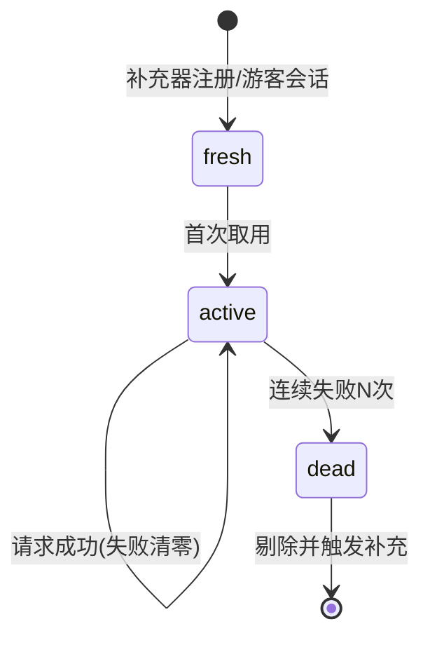
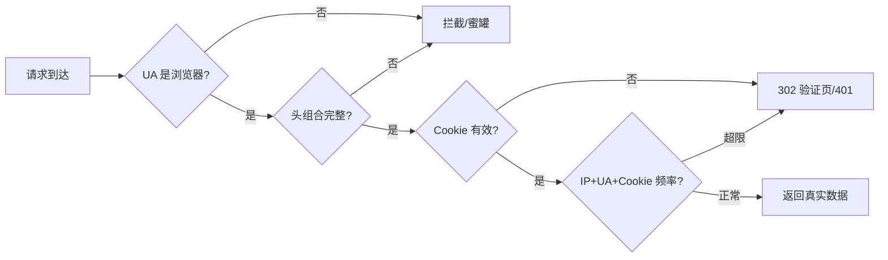

# Day 133 - UA 与 Cookie 池 图解

## 1. 请求伪装金字塔

```
            ┌──────────────────┐
            │    行为模拟        │  鼠标轨迹、浏览节奏（最高级伪装）
            ├──────────────────┤
            │   指纹一致性       │  TLS指纹 / HTTP2指纹 / Header顺序
            ├──────────────────┤
            │    Cookie 池      │  分摊风控风险 ★本日重点
            ├──────────────────┤
            │  UA + 请求头模板  │  伪装客户端身份 ★本日重点
            ├──────────────────┤
            │    IP 代理池      │  Day 132
            └──────────────────┘
```

## 2. Cookie 池状态机



## 3. 会话身份一致性（关键原理）

```
✅ 正确：一个身份 = UA + 头模板 + Cookie，整体绑定、整体轮换
   身份A(Chrome/Win)  ──►  请求1, 2, 3 ...  (Cookie_A, UA_A)
   身份B(Safari/Mac)  ──►  请求1, 2, 3 ...  (Cookie_B, UA_B)

❌ 错误：同一 Session 每请求换 UA
   服务器视角: 会话sid=xxx 在 5 秒内换了 3 种浏览器 → 机器人实锤
```

## 4. 反爬交叉验证流程


