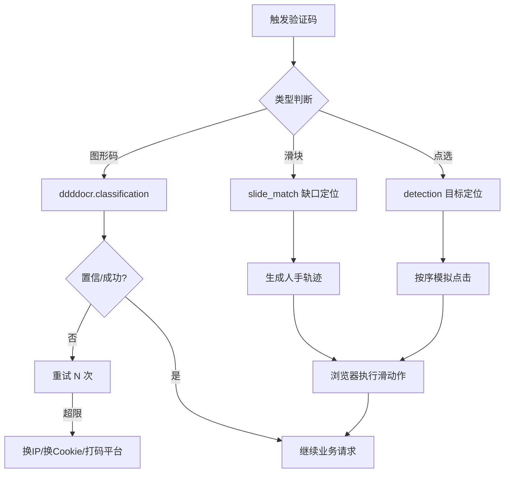

# Day 134 - 验证码识别

> 主题：图形验证码处理（ddddocr）、滑块验证码识别思路、OCR tesserocr 基础、自动化验证码处理实战

---

## 一、概念解释

### 1.1 验证码为什么存在

验证码（CAPTCHA，Completely Automated Public Turing test to tell Computers and Humans Apart）的本质是一次**成本不对称博弈**：让正常用户几乎无感地通过，让机器通过的成本高到不划算。反爬体系中验证码通常出现在：

- 登录/注册表单（防撞库、防批量注册）
- 请求频率异常时（升级挑战，"软封禁"的一种）
- 敏感数据接口（订单、票务、查询）

### 1.2 验证码的类型与难度阶梯

```
难度从低到高：
图形字符码 ──► 算术/变形字符码 ──► 点选验证码 ──► 滑块拼图 ──► 行为验证 ──► reCAPTCHA/极验4代
   │              │                  │              │            │              │
 ddddocr        ddddocr          目标检测+       缺口检测+     全行为链       需浏览器指纹
 直接识别       直接识别         轨迹模拟        轨迹模拟      模拟           +环境伪装
```

### 1.3 ddddocr 是什么

`ddddocr`（带带弟弟 OCR）是一个开箱即用的验证码识别库：

- 基于深度学习模型（ONNX Runtime 推理），自带预训练模型
- 能识别绝大多数"图形字符码"（数字、字母、变形、干扰线）
- 还内置**滑块缺口检测**（`slide_match`）与**目标点选检测**（`detection`）
- 安装：`pip install ddddocr`（依赖 onnxruntime，纯 CPU 即可跑）

### 1.4 tesserocr / Tesseract 是什么

Tesseract 是 HP 开发、Google 维护的经典 OCR 引擎：

- 传统视觉管线：二值化 -> 版面分析 -> 字符切分 -> 识别
- `tesserocr` 是其 Python 绑定（比 `pytesseract` 少一层子进程调用，更快）
- 对印刷体文本效果好；对变形验证码效果一般，通常需要**预处理**配合
- 适用场景：验证码干扰弱、字符规整；或验证码之外的一般 OCR 需求

### 1.5 滑块验证码的原理

滑块验证码 = 一张带缺口的背景图 + 一个拼图块。要求用户把拼图滑到缺口处。服务端校验：

1. **位置**：滑动终点与缺口 x 坐标的偏差（通常允许 ±5px）
2. **轨迹**：滑动过程的 (时间, 位移) 序列是否像人（匀速直线 = 机器）
3. **环境**：浏览器指纹、`navigator.webdriver` 等

### 1.6 点选验证码的原理

给出一张图 + 文字指令（"依次点击：天、空、蓝"）。识别需要：

- OCR 识别指令文字（或直接解析指令接口返回）
- 目标检测/相似度匹配找到图中文字或物体的坐标
- 按顺序模拟点击

---

## 二、原理解析

### 2.1 ddddocr 为什么"白盒开箱即用"

```
验证码图片 (bytes)
     │
     ▼
PIL 解码 / resize 到模型输入尺寸
     │
     ▼
ONNX 模型前向推理 (CNN 特征提取 + CTC 解码)
     │
     ▼
输出字符串（无需字符切分，天然支持变长）
```

传统 OCR 需要先"切分单个字符"再逐个识别；验证码字符粘连、扭曲时切分极难。ddddocr 使用 **CTC Loss 训练的端到端模型**，直接从整图映射到字符串，绕过切分问题。这就是它对验证码效果远好于 Tesseract 的根本原因。

### 2.2 滑块缺口检测原理（slide_match）

ddddocr 的滑块识别本质是**模板匹配**：

1. 把拼图块（小图）和背景图（大图）都转灰度、二值化（突出边缘）
2. 在背景图上滑动小图，逐位置计算相似度（如归一化互相关）
3. 相似度最高的位置 = 缺口位置，返回 x 坐标

局限性：如果拼图块带 alpha 通道需先处理；如果背景有强干扰纹理可能误匹配，此时可改用**边缘检测（Canny）找矩形轮廓**方案。

### 2.3 人手轨迹模拟原理

真实人手滑动轨迹特征：

- **先快后慢**（冲刺 + 微调）：位移曲线类似 ease-out
- **有微小抖动**：y 轴有 ±1~3px 抖动
- **可能过头再回退**：超过目标 2~5px 再回滑

生成方法（贝塞尔/分段函数）：

```python
def human_track(distance):
    """生成人类滑动轨迹: [(t_ms, x_offset), ...]"""
    track, t, cur = [], 0, 0
    while cur < distance:
        # 前段加速、后段减速
        remain = distance - cur
        speed = max(1, int(remain * 0.4))
        cur = min(distance, cur + speed)
        t += random.randint(15, 40)
        track.append((t, cur + random.uniform(-1, 1)))
    # 过头再回退
    ...
    return track
```

服务端风控拿到轨迹后会计算：加速度方差、停顿次数、直线度等统计量。纯匀速轨迹的"加速度方差 = 0"，一票否决。

### 2.4 验证码识别的工程化决策

```
收到验证码挑战
     │
     ▼
判断类型 ──► 图形字符码 ──► ddddocr 识别（成功率 >90% 直接返回）
     │
     ├──► 滑块 ──► 缺口检测 + 人手轨迹 + 浏览器执行（Playwright）
     │
     ├──► 点选 ──► 指令 OCR + 目标检测 + 模拟点击
     │
     └──► 行为验证/极验4 ──► 成本 > 收益？放弃 / 换打码平台 / 保留 Cookie
```

**经济学原则**：识别成本（时间 + 计算 + 失败重试）必须低于绕过它获得的数据价值。当成功率低于 ~50% 且重试有风控累积惩罚时，应转向"养 Cookie / 打码平台 / 放弃该目标"。

### 2.5 tesserocr 预处理管线

传统 OCR 面对验证码的黄金预处理四步：

```
原图 → 灰度化 → 二值化(阈值/自适应) → 降噪(中值滤波/形态学) → 膨胀/腐蚀增强笔画
```

目的：去掉干扰线与噪点、让字符笔画连续清晰。预处理质量直接决定 Tesseract 的识别率。

---

## 三、API 速查表

### ddddocr

| API | 作用 |
|---|---|
| `ddddocr.DdddOcr()` | 初始化（默认模型，识别图形字符码） |
| `ocr.classification(img_bytes)` | 识别图片，返回字符串 |
| `ddddocr.DdddOcr(det=False, ocr=False)` | 仅用滑块/点选功能时的轻量初始化 |
| `slide = ddddocr.DdddOcr(det=False, ocr=False)` 后 `slide.slide_match(target_bytes, background_bytes)` | 滑块缺口匹配，返回 `{'target': [x1,y1,x2,y2]}` |
| `det.detection(img_bytes)` | 目标点选：返回候选目标坐标框列表 |
| `ocr.set_ranges(0)` | 限制输出字符集（0=纯数字） |

### tesserocr / pytesseract

| API | 作用 |
|---|---|
| `tesserocr.image_to_text(pil_image)` | PIL 图直接转文本 |
| `pytesseract.image_to_string(img, lang='eng')` | 子进程版（需安装 tesseract 二进制） |
| `pytesseract.image_to_data(img)` | 带置信度与坐标的结构化输出 |
| `--psm 7` | 页面分割模式：单行文本（验证码常用） |
| `--psm 10` | 单字符识别 |

### PIL 图像预处理（配合 OCR）

| API | 作用 |
|---|---|
| `img.convert('L')` | 灰度化 |
| `img.point(lambda p: 255 if p > 140 else 0)` | 二值化（阈值 140） |
| `img.filter(ImageFilter.MedianFilter(3))` | 中值滤波去噪 |
| `ImageOps.autocontrast(img)` | 自动对比度增强 |

---

## 四、图解

### 验证码处理流水线



### 人手轨迹 vs 机器轨迹

```
人类轨迹（先快后慢 + 抖动）           机器轨迹（匀速直线）
位移                                  位移
 │        ╭─────                       │      ╱
 │     ╭──╯                            │   ╱
 │  ╭──╯  ← 过头后回退                  │╱
 │──╯                                  │
 └──────────── 时间                     └──────────── 时间
 加速度方差大 ✅                        加速度方差=0 ❌ 被风控识别
```

---

## 五、实战代码案例

场景：登录接口返回图形验证码 -> ddddocr 识别 -> 携带验证码提交登录；滑块则定位缺口并生成人手轨迹。

```python
import io
import time
import random
import requests
import ddddocr

ocr = ddddocr.DdddOcr(show_ad=False)

s = requests.Session()
s.headers.update({"User-Agent": "Mozilla/5.0 ..."})

# 1. 获取验证码图片（注意：必须与登录请求同一个 Session，验证码绑定会话）
r = s.get("https://example.com/captcha.jpg")
code = ocr.classification(r.content)
print("识别结果:", code)

# 2. 提交登录（验证码通常 5 分钟有效，一次失败立即刷新）
data = {"username": "user", "password": "pass", "captcha": code}
resp = s.post("https://example.com/login", data=data)
if resp.status_code == 200 and "失败" not in resp.text:
    print("登录成功，Cookie 已在 Session 中")
```

滑块自动化（Playwright 执行）思路见 `code/03-slide-captcha.py`。完整可运行版本见 `code/` 目录。

---

## 六、思考题

1. 为什么获取验证码图片和提交验证码答案必须使用**同一个 Session**？服务端是靠什么把"这张图"和"这次提交"关联起来的？
2. ddddocr 用 CTC 端到端识别，为什么比"先切分再逐字识别"的传统方案更适合粘连扭曲的验证码？
3. 滑块验证码即使缺口位置 100% 准确仍会失败，服务端还能从哪些维度判断你是机器？
4. 如果目标站点验证码识别成功率只有 40%，且每次失败会累积风控分，你的工程决策是什么？（量化分析：期望重试次数与被封概率）
5. 打码平台（人工识别验证码）在什么场景下比机器识别更划算？这背后的成本对比模型是什么？

---

## 相关天数

- Day 133：UA 与 Cookie 池（验证码之前的身份伪装）
- Day 135：JS 逆向入门（验证码参数加密的下一步）
