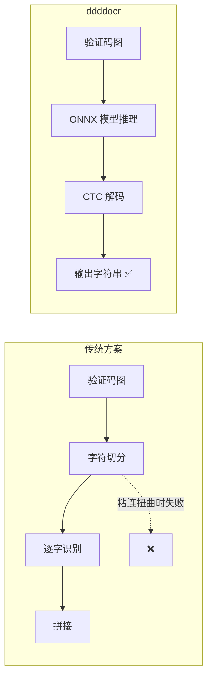

# Day 134 - 验证码识别 图解

## 1. 验证码类型难度阶梯

```
低 ◄──────────────────────────────────────────────► 高
图形字符码 → 变形字符码 → 点选码 → 滑块 → 行为验证 → 极验4/reCAPTCHA
    │           │          │        │        │            │
  ddddocr     ddddocr   detection  slide_match  全行为链    浏览器指纹
  直接识别    直接识别    +点击模拟  +人手轨迹    模拟        +环境伪装
```

## 2. ddddocr 端到端识别 vs 传统切分识别



## 3. 滑块验证流程

```
┌─────────┐  ①请求验证码   ┌─────────┐
│ 爬虫     │ ────────────► │ 服务端   │
│         │ ◄──────────── │         │
│         │  背景图+拼图块  │         │
│ 缺口检测 │               │         │
│ 轨迹生成 │               │         │
│         │  ②提交轨迹     │         │
│         │ ────────────► │ 校验:    │
│         │               │ 位置±5px │
│         │ ◄─── 结果 ─── │ 轨迹统计  │
└─────────┘               │ 环境指纹  │
                          └─────────┘
```

## 4. 人手轨迹 vs 机器轨迹

```
位移
 │       ╭──── 目标
 │     ╭─╯ ╲__╱  ← 过头后回退（人）
 │   ╭─╯
 │ ──╯
 └───────────► 时间   速度方差大 ✅

位移
 │          ╱ 目标
 │        ╱
 │      ╱          匀速直线（机器）
 │    ╱
 └───────────► 时间   速度方差=0 ❌
```
