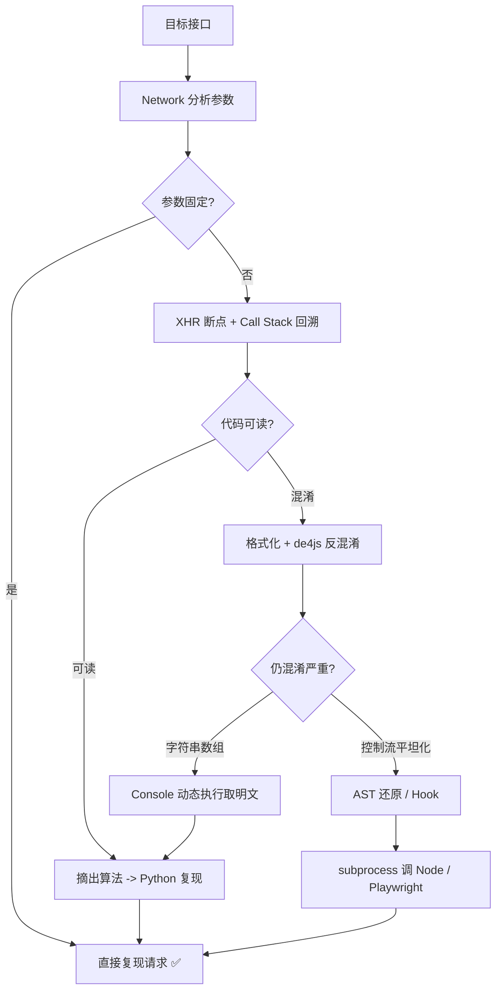

# Day 135 - JS 逆向入门

> 主题：浏览器 DevTools Network 分析、JS 混淆与反混淆基础、AST 初步、定位加密参数实战

---

## 一、概念解释

### 1.1 什么是 JS 逆向

现代网站把核心逻辑放在前端 JavaScript 里：签名算法、加密参数、动态 Cookie 生成。爬虫要获取数据，就必须理解这些 JS 在做什么，并用 Python 复现（或直接调用 JS）。这个过程就是 **JS 逆向**。

典型场景：请求带一个 `sign=xxx` 参数，不带上就被拒。`sign` 由前端 JS 根据其他参数计算得出 -> 你必须找到生成它的代码并复现。

### 1.2 为什么会有"逆向"

```
爬虫视角                          站点视角
   │  想直接请求 API                │  把签名算法藏进 10 万行混淆 JS
   │  ────────────────────────►   │
   │                              │  算法升级成本 < 全站后端改造
   │  请求被拒: 缺 sign 参数        │  风险转移到前端，攻防在浏览器里进行
```

核心矛盾：**JS 必须能在浏览器里执行，所以代码和算法必然完整地存在于客户端** —— 这就是逆向永远可行的根本原因。

### 1.3 DevTools Network 面板（战场侦察）

Chrome DevTools 的 Network 面板是逆向第一站：

- **过滤请求**：`Fetch/XHR` 只看数据接口；`js` 过滤脚本文件
- **Initiator（发起者）**：请求从哪行代码发出 —— 点进去直接跳到 Sources 面板对应位置，是定位加密代码最快的路径
- **Payload / Preview / Response**：请求参数、响应数据
- **Preserve log**：保留跨页面跳转的日志（登录跳转必开）
- **Copy as cURL**：把请求连同所有头复制出来，可以直接在 Python 里比对缺什么

### 1.4 断点家族（Sources 面板）

| 断点类型 | 作用 | 快捷用法 |
|---|---|---|
| 普通断点 | 停在某行 | 点行号 |
| 条件断点 | 满足条件才停 | 右键行号 -> Add conditional breakpoint |
| XHR/Fetch 断点 | 任何请求发出前停 | Sources -> XHR breakpoints -> 填 URL 关键词 |
| DOM 断点 | DOM 变化时停 | Elements -> 右键节点 -> Break on |
| Event Listener 断点 | 事件触发时停 | Event Listener Breakpoints |

**XHR 断点是定位加密参数的神器**：给目标接口 URL 加断点，触发请求，代码停在 `xhr.send()` 附近，此时参数已拼好，再配合 Call Stack 向上回溯，几步就能找到生成参数的函数。

### 1.5 JS 混淆是什么

混淆 = 有意把代码变得不可读但功能不变。常见手段：

```
原始:   function sign(t) { return md5(t + "key"); }
混淆后:  var _0x3f2a=['\x6d\x64\x35'];function _0xa1(_0xb2){return _0x3f2a[0](...)}
```

- **变量/函数名替换**：`_0x3f2a` 式十六进制乱名
- **字符串加密**：字符串藏进数组 + 运行时解密（`_0x` 大数组是典型特征）
- **控制流平坦化**：`switch-case` 状态机把线性逻辑打散
- **死代码注入**：插入永不执行的分支
- **eval / Function 动态执行**

### 1.6 反混淆手段

| 手段 | 工具 | 适用 |
|---|---|---|
| 在线反混淆 | [de4js](https://lelinhtinh.github.io/de4js/) | eval/obfuscator.io 简单混淆 |
| AST 工具 | Babel / escodegen | 控制流平坦化、字符串数组还原 |
| 浏览器动态执行 | Console 里直接调用解密函数 | 字符串数组：跑一次 `_0x3f2a` 拿到明文表 |
| 格式化 | DevTools Pretty print `{}` | 第一步永远先格式化 |

### 1.7 AST 初步

AST（抽象语法树）是代码的结构化表示 —— 逆向工程自动化的基石：

```js
// 代码:  var a = b + 1;
// AST（简化）:
// BinaryExpression {
//   operator: '+',
//   left:  Identifier { name: 'b' },
//   right: NumericLiteral { value: 1 }
// }
```

价值：正则替换代码很脆弱（改个空格就失效）；AST 操作是**语法层面**的，格式无关、精确可靠。用 `@babel/parser` 解析、`@babel/traverse` 遍历修改、`@babel/generator` 重新生成代码 —— 这就是专业反混淆工具的实现方式。

---

## 二、原理解析

### 2.1 定位加密参数的完整链路

```
① Network 找到目标接口（返回数据的那个 XHR）
        │
② 观察 Payload：哪个参数是动态的？（sign/token/timestamp）
        │
③ XHR 断点（URL 关键词）→ 触发请求 → 断在 send() 处
        │
④ 看 Call Stack 自下而上找 "参数刚刚成型" 的那一帧
        │  （技巧：找返回值恰好等于 sign 值的函数）
        │
⑤ 在该函数打断点，重放请求，观察输入输出
        │
⑥ 搜索法兜底：搜索参数名 'sign' / 搜索特征值（md5长度32位、base64特征）
        │
⑦ 摘出算法 → Python 复现 或 PyExecJS / Node 调用
```

### 2.2 搜索法的原理与局限

- 全局搜索 `sign`：在 Sources -> Search（Ctrl+Shift+F）
- 命中太多时改搜 `sign:` / `"sign"` / `sign =`，或搜特征常量（密钥字符串、magic number）
- 局限：混淆后参数名也变成了 `_0xa1`，字符串进了加密数组 —— 这时只能靠断点/堆栈（Day 136 的 Hook 技术）

### 2.3 字符串数组混淆的运行时原理

```js
var _0x4e2c = ['\x6d\x64\x35', '\x6b\x65\x79'];   // 加密字符串表
function _0xget(i) { return _0x4e2c[i]; }          // 取值器（常带二次解密）
function sign(t) { return _0xget(0)(t + _0xget(1)); }
```

浏览器里这些函数**必然解密后才能用**，所以最省事的破解：Console 里直接调 `_0xget(0)`，直接返回明文。**静态分析困难，动态执行一行解决** —— 这是逆向的核心哲学：能跑就不要读。

### 2.4 控制流平坦化与还原

混淆器把顺序逻辑变成 `while(true) { switch(state) { case '0': ...; state='2'; ... } }`。AST 还原思路：

1. 解析成 AST，找到 `while-switch` 节点
2. 按状态转移关系对 case 块**拓扑排序**
3. 重排语句块，去掉状态机
（入门阶段理解原理即可，工具化实现是 Day 136+ 内容）

### 2.5 Python 侧调用 JS 的三种方式

| 方式 | 工具 | 优缺点 |
|---|---|---|
| 纯 Python 复现 | hashlib 等 | 最快最稳，但复杂算法移植成本高 |
| `PyExecJS` / `execjs` | Node 引擎 | 方便但性能差、环境坑多（已停止维护） |
| `subprocess` 调 Node 脚本 | node -e / js 文件 | 稳定、可并发，推荐 |
| 浏览器直接执行 | Playwright `page.evaluate` | 万能但慢（重武器） |

---

## 三、API 速查表

### DevTools 快捷键/操作

| 操作 | 作用 |
|---|---|
| `F12` / `Ctrl+Shift+I` | 打开 DevTools |
| `Ctrl+Shift+F` | 全局搜索所有源码 |
| `Ctrl+P` | 按文件名打开源码 |
| `{}` 按钮 | Sources 面板格式化混淆代码 |
| Network -> 右键请求 -> Copy as cURL | 复制完整请求 |
| `Preserve log` 勾选 | 跨页面保留请求日志 |
| Console: `debug(functionName)` | 函数调用时断点 |

### Console 常用侦察命令

| 命令 | 作用 |
|---|---|
| `JSON.stringify(window.sign)` | 打印函数源码 |
| `sign.toString()` | 查看函数实现 |
| `copy(obj)` | 复制对象到剪贴板 |
| `Object.keys(window).filter(...)` | 找全局注入的变量 |
| `debugger;`（代码注入/Console） | 手动断点 |

### Node/Babel AST（了解）

| API | 作用 |
|---|---|
| `require('@babel/parser').parse(code)` | 代码 -> AST |
| `traverse(ast, { CallExpression(path){} })` | 遍历特定节点 |
| `generate(ast)` | AST -> 代码 |
| `path.node` / `path.replaceWith()` | 访问/替换节点 |

---

## 四、图解

### 逆向工作流全景



### Call Stack 回溯示意

```
Call Stack（自下而上 = 调用顺序）
┌────────────────────────────────┐
│ send(xhr)        ← XHR断点停这  │
│ ajax(config)                   │
│ requestWithSign(params)        │
│  └ params.sign 已存在 ✅        │
│ genSign(t, n)    ← 算法在这 ⭐ │
│  └ return md5(t + n + KEY)     │
└────────────────────────────────┘
```

---

## 五、实战代码案例

场景：接口 `GET /api/list` 需要参数 `sign = md5(page + "salt123")`。完整链路：DevTools 定位 → Python 复现 → 验证。

```python
"""
逆向结论（DevTools 中通过 XHR 断点 + 堆栈回溯得到）：

  请求 URL: https://example.com/api/list?page=1&sign=xxx
  sign 生成（在 app.js 第 1204 行 genSign 函数）:
      function genSign(page) {
          return md5(String(page) + "salt123");   // salt 是硬编码常量
      }

Python 复现：
"""
import hashlib
import requests

def gen_sign(page: int) -> str:
    return hashlib.md5(f"{page}salt123".encode()).hexdigest()

s = requests.Session()
s.headers.update({"User-Agent": "Mozilla/5.0 ..."})

for page in range(1, 4):
    sign = gen_sign(page)
    r = s.get("https://example.com/api/list",
              params={"page": page, "sign": sign})
    print(page, r.status_code, r.json().get("data", [])[:1])
```

用 Node 子进程调用原始 JS 的方式见 `code/03-call-js-from-python.py`。

---

## 六、思考题

1. 为什么"把签名算法放在前端"永远挡不住逆向？站点这样做的真实收益是什么？（提示：成本转移）
2. XHR 断点停下的位置，参数往往已经拼好了。为什么还要看 Call Stack？直接在 send 处读参数不行吗？
3. 字符串数组混淆静态分析极难，为什么在 Console 里执行一次就破解了？混淆器的这个"死穴"能堵上吗？
4. 正则替换做反混淆和 AST 做反混淆，本质区别是什么？举一个正则必然出错的例子。
5. 什么情况下应该放弃"Python 复现算法"而选择"Playwright 直接执行"？从维护成本和性能两个角度分析。

---

## 相关天数

- Day 134：验证码识别（前置防线）
- Day 136：JS 逆向进阶（Hook、堆栈回溯、补环境）
