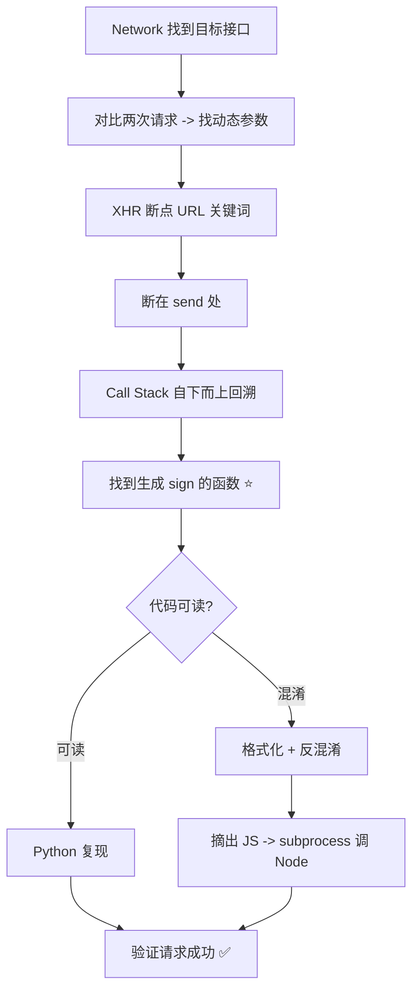

# Day 135 - JS 逆向入门 图解

## 1. 逆向工作流全景



## 2. Call Stack 回溯

```
┌──────────────────────────────────────┐
│ XMLHttpRequest.send      ← XHR断点    │
│ $.ajax                                  │
│ requestWithSign(params)  ← sign已拼好 │
│ genSign(page, ts)        ← 算法在这 ⭐ │
└──────────────────────────────────────┘
   自下而上 = 调用顺序，越往下离业务越近
```

## 3. 混淆 vs 反混淆对抗

```
混淆手段                     破解手段
─────────────────────────────────────────
变量乱名 _0x3f2a       ◄──  格式化 + IDE 重命名
字符串数组+运行时解密   ◄──  Console 直接调取值函数（死穴）
控制流平坦化           ◄──  AST 拓扑排序还原
eval 动态执行          ◄──  断点后 Console 打出明文
```

## 4. AST 是什么

```
代码字符串: "var a = b + 1;"
      │ @babel/parser
      ▼
Program
 └─ VariableDeclaration
     └─ VariableDeclarator
         ├─ id: Identifier { name: 'a' }
         └─ init: BinaryExpression { op: '+',
                 ├─ left: Identifier { name: 'b' }
                 └─ right: NumericLiteral { value: 1 } }
      │ @babel/generator
      ▼
可重新生成 / 精确修改的代码
```
