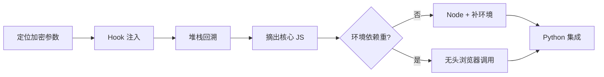

# Day 136 - JS 逆向进阶

> 主题：Hook 技术、堆栈回溯、补环境与 Selenium 自动化、逆向常见反爬参数实战

---

## 一、概念解释

### 1.1 Hook（钩子）技术

**Hook** = 在不修改原文件的前提下，把目标函数"偷梁换柱"：用自己的包装函数替换原函数，在调用前后插入日志/断点/篡改逻辑，再把结果原样返回给原调用方。

为什么 Hook 是逆向神器：

- **不碰源码**：目标 JS 往往有几十万行、带完整性校验，直接改文件会触发反篡改；Hook 在运行时替换，文件零改动
- **精准捕获**：只想知道 `JSON.parse` / `window.btoa` / `String.fromCharCode` 什么时候被谁调用？Hook 它们即可
- **参数现形**：加密函数被 Hook 后，入参（明文）和出参（密文）同时到手，加密前后的对照关系一目了然

```js
// 最简 Hook 模板：保留原函数，前后插桩
(function () {
  var _orig = window.btoa;                    // 1. 备份原函数
  window.btoa = function (s) {                // 2. 替换
    console.log("[hook] btoa 入参:", s);
    var result = _orig(s);                    // 3. 调用原逻辑
    console.log("[hook] btoa 出参:", result);
    debugger;                                 // 4. 断点，看调用栈
    return result;
  };
})();
```

### 1.2 常用 Hook 点速查

| Hook 目标 | 能抓到什么 |
|---|---|
| `JSON.parse` / `JSON.stringify` | 接口返回的解密数据、提交前的序列化参数 |
| `XMLHttpRequest.prototype.send` / `open` | 所有 XHR 的 URL 与 body（含加密参数成品） |
| `window.btoa` / `atob` | Base64 编解码的明文与密文 |
| `Function.prototype.call/apply` | 混淆代码里的动态分发调用 |
| `Object.defineProperty` | 检测代码对 `navigator.webdriver` 等属性的监控 |
| `document.cookie` 的 setter | 动态 Cookie 的生成时机 |

### 1.3 堆栈回溯（Call Stack 分析）

断点停下后，**Call Stack 面板**显示从触发点到入口的完整调用链。逆向时的典型用法：

1. XHR 断点 / Hook 断点停在"参数已生成"的位置
2. 从栈顶向下逐帧看：谁拼的参数 -> 谁调的加密函数 -> 入口在哪
3. 找到"生成参数的核心函数"后，再给它下断点重新触发，验证闭环

```
Call Stack（栈顶在下）:
  send            <- XHR 断点停在这，sign 已是成品
  buildParams     <- 参数拼接处，sign 从变量来
  getSign         <- ★ 加密核心函数（逆向目标）
  initRequest
  (anonymous)     <- 业务入口
```

**技巧**：栈里全是 `_0x1a2b` 这种混淆名时，看每帧的"作用域变量（Scope）"——变量值不会骗人，比函数名更快定位数据流向。

### 1.4 补环境

把浏览器 JS 摘到 Node 里执行时，JS 会访问 `window / document / navigator / location` 等浏览器对象——Node 里没有，直接报错。**补环境** = 用 JS 手写一套"假的浏览器对象"，让目标代码以为自己在浏览器里：

```js
// 最小补环境示例（Node 里执行前先加载）
var window = this;
var document = {
  cookie: "",
  createElement: function () { return { style: {}, getContext: function(){} }; },
  getElementById: function () { return null; },
  addEventListener: function () {},
};
var navigator = {
  userAgent: "Mozilla/5.0 (Windows NT 10.0; Win64; x64) ...",
  language: "zh-CN",
  platform: "Win32",
  webdriver: false,
};
var location = { href: "https://www.example.com/", hostname: "www.example.com" };
```

补环境的进阶手法是 **Proxy 代理**：不逐个手写属性，而是用 Proxy 兜底记录"代码访问了哪些属性、做了什么检测"，按日志精准补——比盲补效率高一个数量级。

### 1.5 无头浏览器 + 补环境自动化（Selenium/DrissionPage）

当代码强依赖浏览器环境、补环境成本过高时，方案改为：**让真实浏览器执行 JS，Python 只负责取结果**。

- Selenium / Playwright / DrissionPage 驱动浏览器
- 页面加载后，用 `driver.execute_script("return getSign(...)")` 直接调用页面里已加载的加密函数
- 或注入 Hook 脚本，把加密结果存到 `window.__sign__`，再读出来

### 1.6 常见反爬参数形态

| 参数 | 常见算法特征 |
|---|---|
| `sign` | MD5(A+B+时间戳)、HMAC-SHA256(参数排序拼接+盐) |
| `token` | 首页 JS 生成 + localStorage 持久化 |
| `x-bogus` / `a-bogus` | 多层混淆 + 环境检测 + 自定义变换 |
| `acw_sc__v2` | 简单字符运算 + 每次刷新变盐 |
| 动态 Cookie | 服务端 Set-Cookie + 前端 JS 二次计算 |

---

## 二、原理深入

### 2.1 Hook 为什么必然生效

JS 的函数是"值"：`window.btoa` 只是一个指向函数对象的引用。任何代码调用 `btoa(x)` 都等价于 `window.btoa(x)`——先查 `window` 的属性再调用。替换 `window.btoa` 就替换了所有调用方的行为。唯一例外是**代码内部先把原函数存进了闭包变量**（先于你的 Hook 执行），所以注入时机要早于目标脚本（`document_start` / Tampermonkey `@run-at document-start`）。

### 2.2 补环境与"环境检测"的对抗

反爬 JS 不只是用环境，还会**检测环境**：

```js
if (navigator.webdriver) return "bot";              // 检测自动化标记
if (!document.createElement('canvas').getContext)   // 检测 canvas 能力
  return "headless";
```

补环境的两大坑：
1. **漏补**：某个属性是 `undefined`，代码静默走了异常分支，产出错误签名（不报错但结果不对——最难查）
2. **补错**：`navigator.plugins` 补成空数组，真实浏览器有值，被一致性检测识破

对策：Proxy 日志兜底 + 与真实浏览器逐属性 diff。

### 2.3 整体工作流

```
定位参数 → Hook/断点 → 堆栈回溯 → 摘出核心 JS
   │                                        │
   │                         ┌──────────────┴──────────────┐
   │                         ▼                             ▼
   │                   代码不长/纯计算              强依赖浏览器环境
   │                         │                             │
   │                    Node + 补环境               无头浏览器直接调用
   │                         │                             │
   └──────────────► Python 复现/调用 ◄─────────────────────┘
```

---

## 三、API 速查

### 3.1 Hook 注入方式

| 方式 | 说明 |
|---|---|
| Console 手动粘贴 | 快速验证，刷新失效 |
| Tampermonkey `@run-at document-start` | 持久、时机最早 |
| Selenium `execute_cdp_cmd("Page.addScriptToEvaluateOnNewDocument")` | 每个新文档加载前自动注入 |
| 代理工具（mitmproxy）改写响应 | 在 JS 文件送达浏览器前插入 Hook |

### 3.2 Selenium 相关 API

| API | 作用 |
|---|---|
| `driver.execute_script(js, *args)` | 在当前页面执行 JS，返回值直接回到 Python |
| `driver.execute_async_script` | 执行异步 JS（有 callback） |
| `addScriptToEvaluateOnNewDocument` | 页面脚本运行前注入（Hook 注入首选） |
| `execute_cdp_cmd` | 直接调 Chrome DevTools Protocol |

### 3.3 堆栈回溯快捷键

| 操作 | 快捷键 |
|---|---|
| 单步跳入 | F11 |
| 单步跳过 | F10 |
| 跳出当前函数 | Shift+F11 |
| 查看调用栈 | Sources → Call Stack 面板 |

---

## 四、图解

```
        Hook 工作原理
┌────────────────────────────────────────────┐
│                业务 JS 代码                  │
│                                            │
│   sign = getSign(params)   ← 调用点不变     │
│        │                                   │
│        ▼                                   │
│   window.getSign  ──── 已被替换 ────►  Hook 包装函数
│                                            │   1. 打印入参 params
│                                            │   2. 调用原函数 _orig
│                                            │   3. 打印出参 sign
│                                            │   4. debugger 冻结
│                                            │        │
│                                            │        ▼
│                                            │   Call Stack 回溯
│                                            │   → 定位核心算法
└────────────────────────────────────────────┘

补环境执行流:
  Python ──► Node 子进程 ──► 补环境(preset.js) + 摘出的 JS ──► 签名结果
```



---

## 五、实战代码案例

见 `code/` 目录：

1. **01-hook-basic.py** —— 用 Python 模拟演示 Hook 的"偷梁换柱"原理与 Hook 脚本生成（可离线运行）
2. **02-stack-trace.py** —— 堆栈回溯思路的 Python 演示 + 补环境 Proxy 日志兜底模板生成
3. **03-selenium-sign-flow.py** —— "无头浏览器取签名"完整自动化流程（离线 mock 演示，含真实 Selenium 代码模板）

---

## 六、思考题

1. 为什么 Hook 脚本必须在目标 JS 之前执行？如果目标代码已经把函数引用存进闭包，还有什么补救办法？
2. 补环境时代码"不报错但签名结果不对"，你会用什么方法定位是哪个环境属性补漏了？
3. `navigator.webdriver` 检测属于环境检测。站在攻防角度，为什么"属性改回 false"在 Selenium 下可能仍然被识破？（提示：CDP 特征）
4. 什么情况下应该放弃补环境、直接上无头浏览器？各自的成本与风险如何权衡？
5. Hook `JSON.parse` 与 Hook `XMLHttpRequest.send` 分别适合什么场景？两者的捕获时机有什么本质区别？

---

## 附录：JS Hook 常用脚本片段（Console 直接粘贴）

```js
// Hook JSON.stringify（抓提交前的序列化参数）
(function () {
  var _o = JSON.stringify;
  JSON.stringify = function (v) {
    console.log("[hook] stringify:", v);
    return _o.apply(this, arguments);
  };
})();

// Hook cookie 写入（抓动态 Cookie 生成）
(function () {
  var _d = Object.getOwnPropertyDescriptor(Document.prototype, "cookie");
  Object.defineProperty(document, "cookie", {
    set: function (v) { console.log("[hook] setCookie:", v); _d.set.call(this, v); },
    get: function () { return _d.get.call(this); },
  });
})();
```
