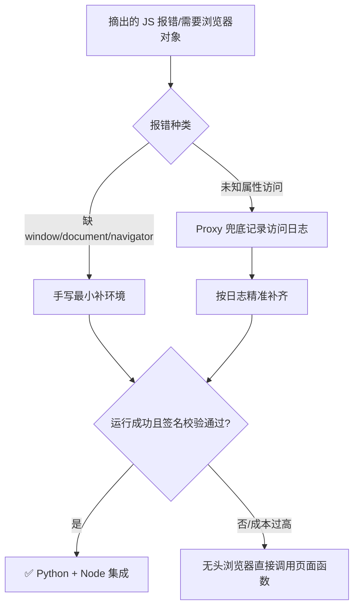

# Day 136 - JS 逆向进阶 · 图解

## 1. Hook 替换原理

```
 正常调用                          Hook 之后
─────────────────                ─────────────────
 业务代码                          业务代码
    │ getSign(p)                     │ getSign(p)
    ▼                                ▼
 window.getSign                   window.getSign (已被替换)
    │                                │ ① console.log 入参
    ▼                                ▼
 核心算法 → sign                  Hook 包装函数
                                       │ ② _orig(p) 调原算法
                                       ▼
                                    核心算法 → sign
                                       │ ③ console.log 出参
                                       │ ④ debugger 冻结现场
                                       ▼
                                   return sign (原调用方无感)
```

## 2. 堆栈回溯路径

```
栈顶 ▲  send()            ← XHR 断点：sign 已是成品
     │  buildParams()     ← 拼参数：sign 来自局部变量
     │  getSign()         ← ★ 加密核心：逆向目标
     │  initRequest()
栈底 ▼  (anonymous)       ← 业务入口
```

## 3. 补环境决策树



## 4. 无头浏览器取签名流程

```
Python(Selenium)                Chrome
     │  addScriptToEvaluateOnNewDocument(Hook)
     │ ────────────────────────────►  页面加载前注入 Hook
     │  get("https://target.com")
     │ ────────────────────────────►  目标 JS 执行, Hook 抓到 sign
     │  execute_script("return window.__sign__")
     │ ◄──────────────────────────── 返回签名
     │  requests 携带 sign 请求接口
     ▼
   拿到数据
```
