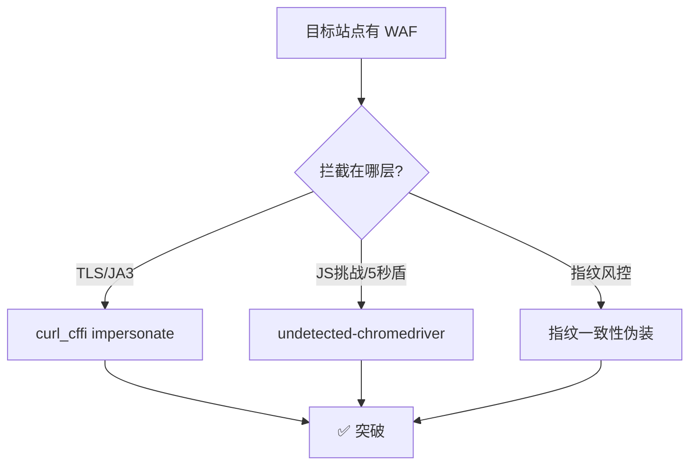

# Day 137 - 浏览器指纹规避

> 主题：Canvas/WebGL 指纹、undetected-chromedriver、过 Cloudflare 实战、突破 WAF

---

## 一、概念解释

### 1.1 什么是浏览器指纹

即使你换了 IP、清了 Cookie，网站仍能识别你--靠的是**浏览器指纹**：浏览器暴露出的上百个特征组合（UA、屏幕分辨率、字体列表、Canvas 渲染结果、WebGL 信息、时区、语言……）。每个特征单独看不唯一，组合起来的熵足以唯一标识一台设备（Panopticlick 研究表明 1/286 万的唯一性）。

```
Cookie 识别: 你删了 Cookie -> 网站不认识你了（可对抗 ✓）
指纹识别:   特征不换 -> 换 IP 删 Cookie 也一样被认出（对抗难度 ↑）
```

### 1.2 指纹采集的维度

| 维度 | 采集 API | 稳定性 |
|---|---|---|
| Canvas 指纹 | `canvas.toDataURL()` | 同设备同浏览器高度稳定 |
| WebGL 指纹 | `WebGLRenderingContext` 参数、`getSupportedExtensions()` | 稳定 |
| AudioContext 指纹 | `OfflineAudioContext` 渲染结果差异 | 稳定 |
| 字体指纹 | 测量不同字体的文字宽度 | 较稳定 |
| 硬件信息 | `navigator.hardwareConcurrency`、`deviceMemory` | 稳定 |
| 环境一致性 | UA vs `navigator.platform`、时区 vs IP 归属地 | 易出破绽 |
| 自动化痕迹 | `navigator.webdriver`、CDP 特征、`window.chrome` 缺失 | 无头浏览器重点 |

### 1.3 Canvas 指纹原理

同一串绘制指令（画文字+渐变+圆弧）在不同设备的 GPU/驱动/字体渲染下，产生的**像素级差异**不同：

```js
const canvas = document.createElement('canvas');
const ctx = canvas.getContext('2d');
ctx.textBaseline = 'top'; ctx.font = "14px 'Arial'";
ctx.fillText('\uD83D\uDE00 fingerprint', 2, 2);
const hash = md5(canvas.toDataURL());  // <- 指纹值
```

爬虫的痛点：无头浏览器与真实浏览器的 Canvas 输出可能不同；且"每次请求换指纹"若指纹库太小反而更显眼。

### 1.4 指纹对抗的三大策略

1. **伪装（Spoof）**：Hook Canvas/WebGL API，返回伪造但自洽的结果（FingerprintJS 的思路反过来用）
2. **一致性（Consistency）**：UA、时区、语言、IP 归属地必须互相匹配--"中国 IP + 美国时区 + 英语系统"是典型破绽
3. **去除自动化痕迹**：`--disable-blink-features=AutomationControlled`、patch 掉 `navigator.webdriver`、处理 CDP 检测（`Runtime.enable` 泄漏等）

### 1.5 undetected-chromedriver

Selenium 原生 chromedriver 会留下多处特征（`cdc_` 变量、`navigator.webdriver=true`、`window.chrome` 异常）。**undetected-chromedriver（uc）** 做了三件事：

- 下载/匹配 Chrome 版本的 patched chromedriver（去除 `cdc_` 等二进制特征）
- 启动参数自动加上反检测开关
- 提供 `with uc.ucontext()` 等指纹隔离上下文

同类工具：Playwright-stealth、DrissionPage、Puppeteer-extra-stealth。

### 1.6 过 Cloudflare 的层次

Cloudflare 防护分几层，逐层突破：

| 层级 | 表现 | 对策 |
|---|---|---|
| JS Challenge（5 秒盾） | 无 UA 校验的请求直接被拦 | 浏览器执行挑战 JS 后拿 `cf_clearance` Cookie |
| Managed Challenge | 交互式验证 | uc + 指纹一致性，等待挑战自动通过 |
| TLS/JA3 指纹 | requests 的 TLS 握手特征与浏览器不同 | `curl_cffi`（impersonate 浏览器 TLS） |
| Turnstile 验证码 | 独立验证组件 | 配合浏览器上下文求解 |

---

## 二、原理深入

### 2.1 为什么"只删 webdriver"不够

现代检测是**多信号交叉验证**：

```
检测点A: navigator.webdriver === false        (可以 patch)
检测点B: CDP Runtime.enable 的副作用          (headless 特有)
检测点C: console.debug 行为差异               (CDP 开启时被 Hook)
检测点D: chrome.runtime 缺失                   (自动化模式特征)
```

单点伪装容易，但 uc/stealth 插件的价值在于**成套消除 + 保持自洽**。这也是"手写 patch 打不过检测"的根本原因。

### 2.2 TLS 指纹（JA3）与 Python requests 的天然破绽

TLS ClientHello 的加密套件顺序、扩展列表构成 JA3 指纹。Python requests（urllib3/OpenSSL）的握手与 Chrome 完全不同--**不发一个请求就能被识别**。对策：`curl_cffi.requests.get(url, impersonate="chrome")` 完整模拟 Chrome 的 TLS 指纹。

### 2.3 指纹一致性检查清单

```
IP 归属地(北京) ──┬── 时区 Asia/Shanghai      ✓
                  ├── navigator.language zh-CN ✓
                  ├── UA 平台 Windows x64      ✓
                  └── WebRTC 不泄漏真实 IP     ✓
```

任何一项与 IP/UA 矛盾 = 高风险评分。

---

## 三、API / 工具速查

| 工具/API | 用途 | 要点 |
|---|---|---|
| `undetected_chromedriver.Chrome()` | 反检测浏览器 | 版本要与本机 Chrome 匹配 |
| `uc.Chrome(headless=False)` | 挑战页 | 无头模式对 Cloudflare 更易被识别，能不用就不用 |
| `curl_cffi.requests.get(url, impersonate="chrome124")` | TLS 指纹模拟 | 纯 requests 场景首选 |
| FingerprintJS（本地开源版） | 自测指纹 | 检测自己爬虫环境的指纹唯一性 |
| `Page.addScriptToEvaluateOnNewDocument` | 指纹伪装注入 | 在页面脚本前 Hook Canvas |
| Playwright + stealth 插件 | 替代方案 | API 更现代，需配 stealth |

---

## 四、图解

```
           指纹识别攻击面
┌─────────────────────────────────────────────┐
│  请求层          页面层          环境层        │
│ ──────────    ───────────    ────────────    │
│  IP信誉  →     Canvas指纹  →   webdriver标记   │
│  TLS/JA3 →     WebGL指纹   →   CDP特征        │
│  HTTP头序 →    Audio指纹   →   字体/字体度量   │
│  HTTP/2  →     字体列表    →   硬件并发/内存   │
└─────────────────────────────────────────────┘
        ▲ 三层同时过关才算"像真人" ▲

过 Cloudflare 流程:
  uc 启动(非无头) → 打开目标页 → 等待挑战通过(cf_clearance)
       → 拿到 Cookie → curl_cffi 带同一 UA + Cookie 直连接口
       → TLS/HTTP层也一致 → 突破 ✓
```



---

## 五、实战代码案例

见 `code/` 目录（全部离线可运行）：

1. **01-canvas-fingerprint.py** -- Canvas 指纹原理与检测演示（纯算法模拟 + 伪装 Hook 模板）
2. **02-fingerprint-consistency.py** -- 指纹一致性校验器：找出"中国 IP + 美国时区"这类破绽
3. **03-cloudflare-bypass-flow.py** -- 过 Cloudflare 完整流程的离线 mock 演示 + 真实 uc/curl_cffi 代码模板

---

## 六、思考题

1. 为什么删除 Cookie 无法重置指纹？如果想"换身份"，至少需要同步更换哪些维度？
2. Canvas 指纹伪装的"自洽性"指什么？如果每次请求随机返回不同 Canvas 指纹，会发生什么？
3. `navigator.webdriver` 已被 patch 成 false，站点还有哪些方式判断你在用自动化浏览器？
4. 为什么 requests 发送一个与浏览器完全相同的请求头，仍可能在"零响应"阶段被 Cloudflare 识别？
5. 无头浏览器（headless）过 Cloudflare 成功率明显更低，你认为主要原因是什么？什么时候必须放弃无头？

---

## 附录：指纹自检与工具安装

```bash
# 本地跑 FingerprintJS 开源版，先测自己爬虫环境的指纹
git clone https://github.com/fingerprintjs/fingerprintjs

# 关键工具安装
pip install undetected-chromedriver curl_cffi DrissionPage
```

**自检口诀**：先用浏览器访问 `https://browserleaks.com/` 与 `https://tls.browserleaks.com/json`，
记录自己环境的 Canvas / WebGL / JA3 三项基线，再用爬虫环境请求同一页面做 diff，
凡是不一致且非有意伪装的差异，都是破绽。
