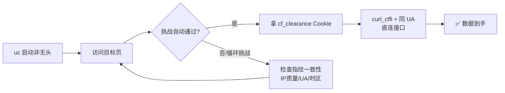

# Day 137 - 浏览器指纹规避 · 图解

## 1. 指纹熵叠加

```
 单一特征熵低，组合后唯一:
 UA(1/50) x 分辨率(1/300) x Canvas(1/10000) x 字体集(1/500)
 ≈ 1 / 750 亿  -> 几乎唯一标识一台设备

 更换 IP/删 Cookie 不改变上述任何一项 -> 仍被识别
```

## 2. 三层检测 vs 三层对策

```
 检测层            对策
────────────      ─────────────────────────────
 TLS/JA3 指纹  ->  curl_cffi impersonate="chrome"
 HTTP/2 帧序   ->  同上(完整模拟浏览器网络栈)
 JS 挑战(5s盾) ->  undetected-chromedriver 执行挑战
 Canvas/WebGL ->  addScriptToEvaluateOnNewDocument 注入伪装
 自动化标记    ->  uc patch (cdc_/webdriver/CDP 特征)
 一致性风控    ->  IP归属地/时区/语言/UA 全套自洽
```

## 3. 过 Cloudflare 完整流程



## 4. 一致性校验矩阵

```
                期望(IP=北京)      实际值           判定
 时区           Asia/Shanghai     America/NY     ✗ 破绽
 语言           zh-CN             en-US          ✗ 破绽
 UA平台         Windows           Windows        ✓
 IP WebRTC泄漏  无                192.168.x.x    ✗ 破绽
```
