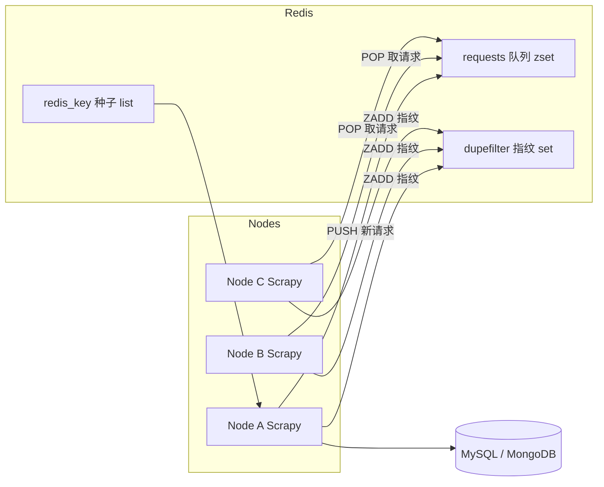

# Day 138 - Scrapy 分布式（Scrapy-Redis）

> 阶段：Phase 7 - 进阶与性能优化 | 主题：实战

---

## 一、概念解释

### 1.1 为什么需要分布式爬虫？

单机 Scrapy 的瓶颈：

| 瓶颈 | 说明 |
|------|------|
| 单机带宽 | 下载受限于单台机器的上/下行带宽 |
| 单机 CPU | 解析、渲染消耗 CPU，多进程难以突破单机核数 |
| 调度队列在内存 | Scrapy 默认调度器把请求放在内存里，进程一挂全部丢失 |
| 去重集合在内存 | `dupefilter` 基于 内存 set，重启后去重状态清零 |
| 无法横向扩展 | 两个 Scrapy 进程各自爬，互相不知道对方爬了什么 |

分布式爬虫的核心思想：**把"状态"从爬虫进程里抽出来，放到所有节点共享的地方（Redis）**。

### 1.2 什么是 Scrapy-Redis？

`scrapy-redis` 是一个替换 Scrapy 关键组件的扩展包，它做了三件事：

1. **共享调度队列**：把默认的内存调度器换成 Redis 中的有序集合（`SCHEDULER = "scrapy_redis.scheduler.Scheduler"`），所有爬虫节点从同一个队列取请求。
2. **共享去重集合**：把 `RFPDupeFilter` 换成基于 Redis 的指纹集合（`DUPEFILTER_CLASS = "scrapy_redis.dupefilter.RFPDupeFilter"`），任何节点爬过的 URL 其他节点不会再爬。
3. **持久化**：请求队列和指纹都存 Redis，进程崩溃重启后从断点继续（配合 `SCHEDULER_PERSIST = True`）。

### 1.3 主从 vs 去中心化

- **老式主从架构**：一台 Master 分发 URL 给多台 Slave 执行。Master 是单点。
- **Scrapy-Redis 去中心化架构**：所有节点对等，都从 Redis 队列竞争取任务（POP），也都把新请求推回队列（PUSH）。Redis 本身是唯一中心，可用哨兵/集群保证高可用。

---

## 二、原理深入

### 2.1 Scrapy 原生架构回顾

```
                     ┌─────────────┐
   Engine ──────────▶│  Scheduler  │  (内存队列 + 内存去重 set)
     ▲   │           └─────────────┘
     │   ▼
 Downloader ──▶ Spider ──▶ Item Pipeline
```

关键点：**Scheduler 持有所有待处理请求和指纹**——这就是不能分布式的根因。

### 2.2 Scrapy-Redis 替换后的架构

```
   Node A (Scrapy) ─┐
   Node B (Scrapy) ─┼──▶ Redis（共享队列 + 共享指纹 + pending 表）
   Node C (Scrapy) ─┘         ▲
        │  ┌───────────────────┘
        └──┤ 所有节点 PUSH 新请求 / ZADD 指纹
           ┤ 所有节点 POP 请求（竞争消费）
```

**请求指纹是怎么算的？**

`scrapy.utils.request.request_fingerprint()` 把 request 的 method、url、body 做 MD5（默认 sha1 变体），得到一个 40 位十六进制字符串。Scrapy-Redis 把它 `SADD` 到 Redis 的 set（key 通常是 `<spider>:dupefilter`）：

- `SADD` 返回 1 → 新请求，入队
- `SADD` 返回 0 → 已爬过，丢弃

这就是**分布式去重**的全部秘密：把"是否见过"这个判断交给 Redis 原子操作。

### 2.3 调度队列为什么用 zset 而不是 list？

Scrapy-Redis 的 Scheduler 维护三种队列（`SCHEDULER_QUEUE_CLASS` 可选）：

| 队列类 | Redis 结构 | 特点 |
|--------|-----------|------|
| `SpiderQueue`（默认） | zset（score=priority 取负） | 优先级调度，但 zpop 没有"阻塞弹出"，需轮询 |
| `SpiderStack` | list (lpush/lpop) | LIFO，深度优先 |
| `SpiderPriorityQueue` | zset | 同 SpiderQueue，历史命名 |

> ⚠️ 默认队列使用非阻塞 ZRANGE+ZREM 实现"弹出"，多节点竞争时存在轻微竞争开销，但 ZREM 是原子的，不会重复消费。

### 2.4 分布式爬取节奏：不要打爆目标站

节点数翻倍 ≈ 请求速率翻倍。务必配合：

- 每节点 `CONCURRENT_REQUESTS`、`DOWNLOAD_DELAY` 限速
- Redis 侧用 `scrapy-redis` 的 `RedisCrawlSpider` 时注意：起始 URL 也应通过 `redis_key` 推入，而不是 `start_urls`

### 2.5 ITEM 不落 Redis？

默认情况下 Item 直接走本机 Pipeline 落盘/落库。若想让 Item 也统一收集，可启用 `scrapy_redis.pipelines.RedisPipeline`——但更推荐各节点自己写库（减少 Redis 压力和单点风险）。

---

## 三、定义与方法（API 速查）

### 3.1 settings.py 必备配置

```python
# ===== Scrapy-Redis 核心配置 =====
# 1. 换调度器
SCHEDULER = "scrapy_redis.scheduler.Scheduler"

# 2. 换去重组件
DUPEFILTER_CLASS = "scrapy_redis.dupefilter.RFPDupeFilter"

# 3. Redis 连接
REDIS_URL = "redis://:password@192.168.1.10:6379/0"
# 或者分开写：
# REDIS_HOST = "192.168.1.10"
# REDIS_PORT = 6379

# 4. 断点续爬（重启不清空队列和指纹）
SCHEDULER_PERSIST = True

# 5. 队列类型（默认即它）
SCHEDULER_QUEUE_CLASS = "scrapy_redis.queue.SpiderQueue"

# 6.（可选）Item 也进 Redis
# ITEM_PIPELINES = {"scrapy_redis.pipelines.RedisPipeline": 300}

# 7. 调度器空闲等待秒数（爬虫不自动关闭，等新任务）
SCHEDULER_IDLE_BEFORE_CLOSE = 10
```

### 3.2 RedisSpider / RedisCrawlSpider

| 属性 | 作用 |
|------|------|
| `redis_key` | 该爬虫在 Redis 中的起始请求队列名（如 `myspider:start_urls`） |
| `start_urls` | 不再使用；改为 `lpush <redis_key> <url>` 注入种子 |
| `next_requests()` | 从 redis_key 批量取种子的钩子，可重写做鉴权/过滤 |

启动种子：

```bash
redis-cli -h 192.168.1.10 lpush myspider:start_urls "https://example.com/page/1"
```

### 3.3 常用 Redis key 一览

| Key 模式 | 内容 |
|----------|------|
| `<name>:requests` | 待处理请求队列（zset） |
| `<name>:dupefilter` | 已见指纹集合（set） |
| `<name>:items` | RedisPipeline 收集的 item（list，仅启用时） |
| `<name>`（redis_key） | 种子 URL 队列（list） |

---

## 四、图解

### 4.1 分布式整体流程（Mermaid）



### 4.2 单请求生命周期（ASCII）

```
 Spider yield Request
        │
        ▼
 Scheduler.enqueue_request()
        │
        ▼
 RFPDupeFilter.request_seen()  ──SADD fingerprint──▶ Redis dupefilter
        │ 返回 0（没见过）
        ▼
 SpiderQueue.push(request)     ──ZADD -priority────▶ Redis requests
        │
        ▼ （某个空闲节点）
 Scheduler.next_request()      ──ZRANGE + ZREM────▶ 取出 Request
        │
        ▼
 Downloader 下载 → Spider 解析 → yield 新 Request（回到顶部）/ Item
```

---

## 五、实战代码案例

完整可运行项目见 `code/` 目录：

- `01-basic-redis-spider.py` —— 最小可用的 RedisSpider，演示配置与启动
- `02-distributed-crawl.py` —— RedisCrawlSpider + 去重控制 + 优先级队列（进阶/避坑）
- `03-cluster-launcher.py` —— 多进程模拟集群 + 生产部署要点（实战）

---

## 六、思考题

1. Scrapy-Redis 用 zset 做队列、用 set 做去重。如果请求量达到 5000 万，指纹 set 会占用多少内存？有哪些省内存的替代方案（提示：Bloom Filter、RedisBloom 模块）？
2. `SCHEDULER_PERSIST = False` 时重启爬虫会怎样？什么场景应该用 False？
3. 为什么 Scrapy-Redis 的所有节点都"既是生产者又是消费者"？这种对等架构比 Master/Slave 好在哪、坏在哪？
4. 如果 Redis 宕机，整个集群会怎样？如何设计高可用（哨兵/Cluster/本地降级队列）？
5. 分布式去重基于请求指纹而不是 URL 字符串，为什么？（提示：GET 参数顺序、POST body）
