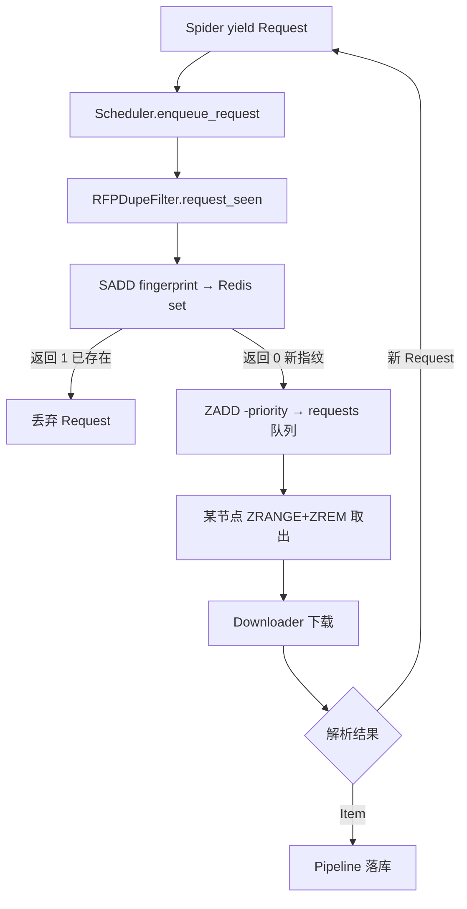

# Day 138 - Scrapy 分布式 图解

## 1. 单机 vs 分布式架构对比（ASCII）

```
【单机 Scrapy】
  ┌────────── 一个进程 ──────────┐
  │ Engine → Scheduler(内存队列) │
  │         → DupeFilter(内存set)│
  │         → Downloader → Spider│
  └──────────────────────────────┘
  状态全在内存 → 进程挂 = 全丢；无法多机协作

【Scrapy-Redis 分布式】
  Node A ─┐                ┌─────────── Redis ───────────┐
  Node B ─┼── POP 请求 ───▶│ :requests  (zset 共享队列)   │
  Node C ─┘                │ :dupefilter(set 共享指纹)    │
        │                  │ redis_key   (list 种子入口)  │
        └── PUSH 新请求 ──▶└─────────────────────────────┘
  状态在 Redis → 断点续爬；多节点天然负载均衡（竞争消费）
```

## 2. 去重决策流程（Mermaid）



## 3. Redis Key 结构图

```
redis-db
 ├── cluster_demo:start_urls   [list]  ← 种子入口（人工/调度器 lpush）
 ├── cluster_demo:requests     [zset]  ← 待处理请求, score=-priority
 ├── cluster_demo:dupefilter   [set ]  ← 全局已见指纹（SHA1）
 └── cluster_demo:items        [list]  ← 仅启用 RedisPipeline 时存在
```

## 4. 节点扩缩容示意

```
吞吐不足？
  Node A ──┐
  Node B ──┼──▶ Redis ◀── 状态不变，直接加机器！
  Node C ──┘        ▲
  Node D ───────────┘  新节点 copy 相同代码+配置即可上线，
                       无需重启其他节点（对等架构的好处）
```
