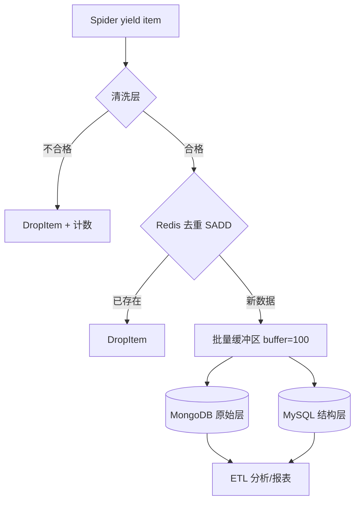

# Day 139 - 数据存储管道（Data Storage Pipelines）

> 阶段：Phase 7 - 进阶与性能优化 | 主题：实战

---

## 一、概念解释

### 1.1 为什么"管道"很重要？

爬虫的价值不在"爬到"，而在"存对"。脏数据入库 = 后续所有分析失真。数据管道要回答三个问题：

1. **清洗**：数据进库前怎么去噪、标准化？
2. **选型**：MySQL / MongoDB / Redis 各适合存什么？
3. **质量**：如何保证不重复、不丢、可追溯？

### 1.2 Scrapy Item 与 Pipeline 机制

- **Item** 是结构化数据的容器（类似 ORM 的 model），定义字段 + 校验规则。
- **Item Pipeline** 是流水线：每个 Pipeline 类实现 `process_item(item, spider)`，返回 item 传给下一级，抛 `DropItem` 则丢弃。

Pipeline 的四个常用钩子：

| 方法 | 时机 | 典型用途 |
|------|------|---------|
| `open_spider(spider)` | 爬虫启动 | 建连接、建表 |
| `close_spider(spider)` | 爬虫关闭 | 关连接、批量 flush |
| `process_item(item, spider)` | 每条数据 | 清洗、去重、入库 |
| `from_crawler(cls, crawler)` | 实例化 | 读 settings、注入依赖 |

### 1.3 存储选型速查

| 存储 | 数据模型 | 适用场景 | 不适用 |
|------|---------|---------|--------|
| MySQL | 关系表 | 结构稳定、需要 JOIN/事务/报表 | 字段经常变化的半结构化数据 |
| MongoDB | 文档(BSON) | 字段多变、嵌套深（如整页 JSON） | 强事务、复杂关联查询 |
| Redis | KV/内存 | 去重缓存、增量队列、热数据、计数 | 大容量冷数据（内存贵） |

经验法则：**爬虫原始层存 MongoDB（保留灵活性），分析层 ETL 到 MySQL（结构化报表），去重/状态用 Redis。**

---

## 二、原理深入

### 2.1 数据管道分层架构

```
 Spider yield item
      │
      ▼
 [P1 清洗层]  去空白/类型转换/默认值  -> 不合格 DropItem
      │
      ▼
 [P2 去重层]  Redis SADD 唯一键      -> 重复 DropItem
      │
      ▼
 [P3 入库层]  批量缓冲 + 事务写入 MySQL/MongoDB
      │
      ▼
 [P4 监控层]  统计计数、报警指标
```

为什么要分层？**单一职责**：清洗规则变化不影响入库逻辑，新增存储后端只需追加一层。

### 2.2 批量写入：为什么必须缓冲？

逐条 INSERT 的问题：每条一次网络往返 + 一次事务提交，吞吐约几百条/秒。改成攒 N 条（如 100）或 T 秒批量 `executemany` / `insert_many`，吞吐可提升 10~50 倍。

代价：**缓冲在内存，进程崩溃会丢最后一批**。生产上用 `close_spider` 兜底 flush + 定时器双保险。

### 2.3 幂等入库：ON DUPLICATE KEY UPDATE

爬虫重跑是常态。MySQL 侧靠唯一索引 + `INSERT ... ON DUPLICATE KEY UPDATE` 实现幂等；MongoDB 侧靠唯一索引 + `ReplaceOne(upsert=True)`；Redis 侧天然幂等（SET 覆盖）。**没有唯一键的表不允许爬虫直接写入**——这是数据质量的第一道红线。

### 2.4 数据质量控制四指标

- **完整性**：必填字段非空率（schema 校验，可用 `itemadapter` + pydantic）
- **唯一性**：业务主键去重率
- **时效性**：数据从抓取到可查询的延迟
- **可追溯性**：每条数据记录 `source_url`、`crawl_time`、`spider_name`，出问题能回溯重爬

---

## 三、定义与方法（API 速查）

### 3.1 Item 定义

```python
import scrapy

class BookItem(scrapy.Item):
    title = scrapy.Field()          # 必填
    price = scrapy.Field()          # 会被清洗成 float
    source_url = scrapy.Field()     # 溯源字段（强烈建议所有 Item 都有）
    crawled_at = scrapy.Field()
```

### 3.2 Pipeline 骨架

```python
class MySQLPipeline:
    def open_spider(self, spider):
        self.buffer, self.buf_size = [], 100

    def process_item(self, item, spider):
        self.buffer.append(dict(item))
        if len(self.buffer) >= self.buf_size:
            self._flush()
        return item          # 一定要 return，否则后续管道收不到

    def close_spider(self, spider):
        if self.buffer:
            self._flush()

    def _flush(self):
        # executemany + ON DUPLICATE KEY UPDATE
        ...
```

### 3.3 常用 API 速查表

| 操作 | MySQL | MongoDB | Redis |
|------|-------|---------|-------|
| 幂等写 | `INSERT ... ON DUPLICATE KEY UPDATE` | `replace_one(f, d, upsert=True)` | `SET` / `SADD` |
| 批量写 | `executemany` | `insert_many(ordered=False)` | pipeline 批量命令 |
| 唯一约束 | `UNIQUE KEY(url)` | `create_index(url, unique=True)` | set 天然唯一 |
| 连接库 | PyMySQL / mysqlclient | pymongo | redis-py |

---

## 四、图解



```
数据生命周期：
  抓取(parse) -> 校验 -> 去重 -> 缓冲 -> 落库 -> 可查询
  T+0s          T+0s    T+0s    T+~30s   T+~30s   T+~30s
                          ↑ 崩溃窗口：缓冲未 flush 的数据会丢（需 close_spider 兜底）
```

---

## 五、实战代码案例

见 `code/`：

- `01-cleaning-pipeline.py` -- 清洗 + 校验 + DropItem（基础）
- `02-multi-backend-pipeline.py` -- Redis 去重 + MySQL/MongoDB 双写 + 批量缓冲（进阶避坑）
- `03-full-data-pipeline.py` -- 完整管道：清洗→去重→双库→质量报表（实战）

---

## 六、思考题

1. 批量缓冲 100 条 vs 1000 条，各有什么代价？怎么选择缓冲大小的实验方法？
2. 为什么推荐"原始层 MongoDB + 分析层 MySQL"而不是直接写 MySQL？
3. 如果爬虫在凌晨 3 点崩溃，怎么保证缓冲区里没 flush 的数据不丢？（提示：本地 WAL 文件 / 缩短定时 flush / 消息队列）
4. `insert_many(ordered=False)` 和默认 True 的区别是什么？部分文档主键冲突时行为有何不同？
5. 如何设计一套"数据质量日报"，用哪些指标衡量昨天爬虫产出数据的质量？
