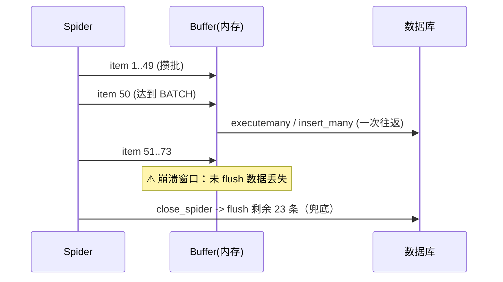

# Day 139 - 数据存储管道 图解

## 1. 四层管道流水线（ASCII）

```
 Spider ──yield item──▶ ┌────────────┐   ┌────────────┐   ┌────────────┐   ┌────────────┐
                       │ P1 清洗层  │──▶│ P2 校验层  │──▶│ P3 去重层  │──▶│ P4 入库层  │
                       │ strip/类型 │   │ 必填/范围  │   │ Redis SADD │   │ 批量缓冲   │
                       └────────────┘   └─────┬──────┘   └─────┬──────┘   └─────┬──────┘
                                               │ DropItem        │ DropItem        │ flush
                                               ▼                 ▼                 ▼
                                            丢弃+计数        丢弃+计数    MySQL/MongoDB 双写
```

## 2. 批量缓冲时间线（Mermaid）



## 3. 存储选型决策树

```
要存的是什么？
├── 去重/状态/热缓存 ──────────▶ Redis (SET/SADD/ZADD)
├── 字段多变、嵌套深、原始留档 ─▶ MongoDB (唯一索引 + upsert)
└── 结构稳定、要 JOIN/事务/报表 ▶ MySQL (唯一键 + ON DUPLICATE KEY UPDATE)
        └── 大数据量？→ 原始层 Mongo，ETL 后进 MySQL，各取所长
```
