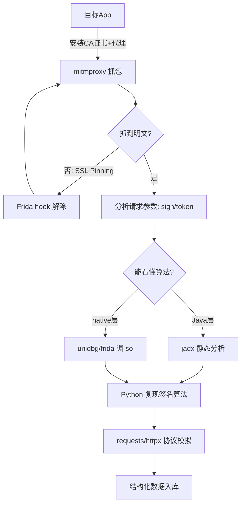

# Day 140 - App 爬虫基础

> 目标：掌握 App 爬虫的完整工作流——抓包分析、APK 反编译、协议模拟，最终实现 App 数据抓取。

---

## 一、概念解释

### 1.1 什么是 App 爬虫？

Web 爬虫抓取的是浏览器渲染的 HTML 页面，而 **App 爬虫**抓取的是手机 App 与服务器之间的通信数据。很多公司（电商、社交、短视频）把最核心的数据和功能放在 App 端，甚至 App 优先于 Web 发布功能，所以 App 爬虫是数据采集绕不开的一环。

```
Web 爬虫:  浏览器 ──HTTP──> Web 服务器        (返回 HTML/JSON)
App 爬虫:  手机App ──HTTP/HTTPS/私有协议──> API 服务器  (返回 JSON/Protobuf)
```

### 1.2 三大核心技术

| 技术 | 作用 | 对应工具 |
|------|------|----------|
| 抓包 | 观察App与服务器通信内容 | mitmproxy / Charles / Fiddler |
| 反编译 | 分析 APK 里的加密逻辑 | jadx / apktool / frida |
| 协议模拟 | 用 Python 复现 App 的请求 | requests / httpx / pycryptodome |

### 1.3 为什么 App 爬虫比 Web 爬虫更"稳定"？

- App 的 API 接口版本迭代慢，一旦逆向出参数规则，可以长期稳定使用；
- App 端的反爬主要靠**签名校验**（sign 参数），而不是 Web 端的 JS 混淆 + 风控指纹，攻防面更窄；
- 返回数据是结构化 JSON/Protobuf，无需解析 HTML。

但代价是：**逆向门槛高**，需要懂 Android、加密算法、甚至 ARM 汇编。

---

## 二、原理深入

### 2.1 抓包原理：中间人攻击（MITM）

HTTPS 抓包的本质是自己当"中间人"：

```
正常 HTTPS:
   App <───────────TLS───────────> 服务器

抓包时（中间人）:
   App <──TLS①──> mitmproxy <──TLS②──> 服务器
            ↑                ↑
      App信任mitm的证书    mitm信任服务器证书
      (需手动安装CA证书)

① App 校验 mitmproxy 的证书 → 需在手机安装 mitmproxy CA 证书
② mitmproxy 校验服务器的真证书 → 天然可信
```

**关键点**：Android 7.0+ 默认不信任用户安装的 CA 证书，所以要么：
1. 把证书装到系统目录（需要 root：`/system/etc/security/cacerts/`）；
2. 用 `apktool` 反编译 APK，修改 `AndroidManifest.xml` 加 `networkSecurityConfig` 信任用户证书后重打包；
3. 用 Android < 7.0 的模拟器。

### 2.2 抓不到包的两种情况（SSL Pinning 与 Protobuf）

**SSL Pinning（证书锁定）**：App 在代码里内置了服务器证书指纹，拒绝与 mitmproxy 握手。绕过方法：用 **Frida + objection** 一键 hook：

```bash
pip install frida-tools objection
objection -g com.example.app explore
# 进入交互式后执行：
android sslpinning disable
```

**Protobuf 二进制协议**：抓到的 body 是乱码。流程是：先从 APK 里提取 `.proto` 定义（或反编译分析），再用 `protobuf` 库解析。

### 2.3 签名参数原理（重点！）

绝大多数 App 的请求带有 `sign` 参数，典型生成逻辑：

```
sign = md5( md5(password) + timestamp + "固定盐值salt" )
```

**为什么能逆向？** 因为签名算法必须写在客户端代码里——客户端总要自己算签名，就一定会被提取出来。这是客户端加密的宿命：**加密在端上，密钥必在端上**。

逆向路径：

```
抓包发现 sign 参数
  → jadx 反编译 APK，全局搜索 "sign"
  → 定位到 Java/native 加密函数
  → 分析算法（md5/sha/aes + 拼接顺序 + 盐值）
  → Python 复现
```

### 2.4 APK 反编译基础

APK 本质是一个 ZIP 包：

```
app.apk
├── AndroidManifest.xml  # 二进制的清单文件
├── classes.dex          # Dalvik 字节码（Java/Kotlin 编译产物）
├── lib/                 # native so 库（C/C++，重点加密常在这）
├── res/                 # 资源文件
└── assets/              # 静态资源（有时藏 .proto/.js）
```

工具链分工：

| 工具 | 作用 | 产物 |
|------|------|------|
| jadx | dex → Java 源码 | 可读的 .java（首选） |
| apktool | 反编译资源 + smali | 可回编译（用于重打包） |
| frida | 运行时 hook | 动态调试（对付加固/so） |
| unidbg | 模拟执行 so | 黑盒调用 native 算法 |

**加固识别**：jadx 打开发现只有一两个类（如 `StubApp`），说明被 360/腾讯乐固/梆梆加固了，需要脱壳（frida-dexdump）后才能看到真实代码。

---

## 三、API 速查表

### 3.1 mitmproxy 常用命令

```bash
mitmproxy                    # 终端交互式界面
mitmweb                      # 浏览器界面（推荐新手）
mitmdump -w app.flow         # 抓包保存到文件
mitmdump -s addon.py         # 加载 Python 脚本实时处理流量
mitmdump --mode reverse:http://api.example.com  # 反向代理模式
```

### 3.2 mitmproxy addon 脚本 API

```python
class Addon:
    def request(self, flow): ...    # 请求阶段（可改请求）
    def response(self, flow): ...   # 响应阶段（可读/改响应）
# flow.request.url / .headers / .content
# flow.response.status_code / .content
```

### 3.3 jadx / frida 常用

```bash
jadx -d out/ app.apk               # 反编译输出到 out/
jadx-gui app.apk                   # GUI（搜索 "sign"/"encrypt"）
frida -U -f com.example.app -l hook.js   # spawn 启动并注入
frida-trace -U -i "md5" com.example.app  # 追踪函数调用
```

### 3.4 Python 协议模拟对照表

| App 请求特征 | Python 对应处理 |
|---|---|
| Content-Type: application/json | `requests.post(url, json=data)` |
| body 是二进制 Protobuf | `requests.post(url, data=pb.SerializeToString())` |
| header 带 token/sign | 构造 dict，先本地算 sign 再带上 |
| 需要维持设备指纹 | 固定 device_id/user_agent |

---

## 四、图解

### 4.1 App 爬虫完整工作流



### 4.2 抓包代理链路

```
┌─────────┐   Wi-Fi 手动代理    ┌────────────┐         ┌──────────┐
│ 手机App  │ ─────────────────> │ mitmproxy  │ ──────> │ 目标服务器 │
│ (同局域网)│  ip:8080           │ (电脑8080) │  直连    │  (HTTPS) │
└─────────┘                    └────────────┘         └──────────┘
     │                               │
     └── 已装 mitm CA 证书 <──────────┘ 首次访问 mitm.it 下载证书
```

---

## 五、实战代码案例

完整代码见 `code/` 目录：

1. `01-mitmproxy-addon.py` — mitmproxy 抓包脚本（基础用法）
2. `02-sign-crack-demo.py` — 签名参数复现与避坑（进阶）
3. `03-app-api-spider.py` — 完整 App 协议模拟爬虫（实战）

---

## 六、思考题

1. 为什么 App 把签名算法写在客户端就注定能被破解？有没有"理论上不可破解"的客户端方案？（提示：思考白盒加密/服务器下发算法的代价）
2. Android 7.0 之后默认不信任用户证书，这个安全设计保护的究竟是谁？
3. 如果接口返回的是 Protobuf 二进制，相比 JSON 抓包多了哪些步骤？为什么越来越多大厂用 Protobuf？
4. 抓包时发现请求间隔小于 100ms 就被 ban，除了放慢速度，还能从哪些维度把爬虫行为"伪装"得像真人？
5. frida hook 是动态分析，jadx 是静态分析，两者各有什么不可替代的场景？

---

## ⚖️ 合规提醒

App 爬虫技术门槛高、法律风险也高。仅对**自己拥有或获得授权**的 App 做安全研究；抓取任何数据前确认不违反《数据安全法》《个人信息保护法》及目标服务条款。逆向他人 App 用于商业数据窃取属于违法行为。
