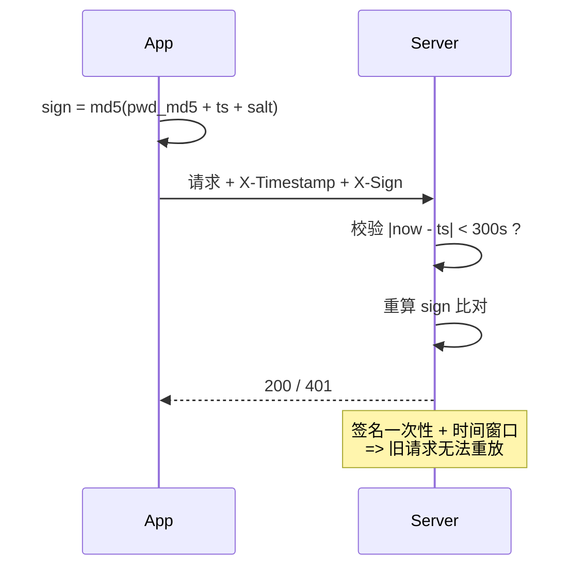

# Day 140 - App 爬虫 图解

## 1. HTTPS 抓包中间人原理

```
     App 视角                    mitmproxy                    服务器视角
┌──────────┐                 ┌──────────────┐              ┌──────────┐
│  手机App  │ ──TLS①──>      │              │ ──TLS②──>    │ 服务器    │
│ 校验: mitm│  (伪造证书)     │  拥有CA私钥    │  (真证书)    │ 校验:真CA │
│ 的CA证书  │ <───────────── │  解密→查看→   │ <────────── │          │
└──────────┘    明文数据      │  重新加密转发   │   密文数据   └──────────┘
                            └──────────────┘
① 前提: 手机已安装并信任 mitmproxy CA 证书 (Android 7+ 需装到系统区)
② mitmproxy 用真 CA 验证服务器 -> 服务器侧无感知
```

## 2. App 爬虫逆向决策树

```
抓包分析
  ├── 明文 JSON ──────────> 分析参数(sign/token) ──> Python 直接复现 ✅
  ├── SSL Pinning 报错 ───> Frida hook 跳过校验 ──> 回到抓包
  ├── 二进制 body(Protobuf) > 提取 .proto 定义 ───> protobuf 库解析
  └── sign 算法未知
        ├── jadx 搜到 Java 层算法 ──> Python 复现 ✅
        ├── 代码被加固(StubApp) ───> frida-dexdump 脱壳 ──> jadx
        └── 算法在 native so ──────> frida 主动调用 / unidbg 模拟执行
```

## 3. 签名防重放机制


