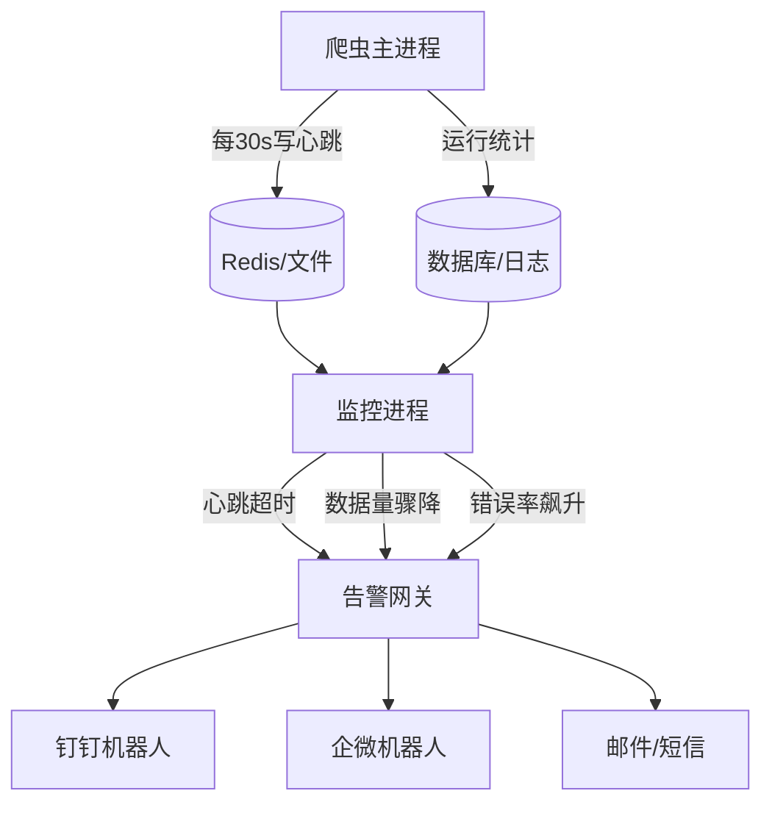

# Day 141 — 爬虫监控与告警

> 爬虫写出来只是开始，**能长期稳定跑下去才是本事**。今天解决三个核心问题：怎么知道爬虫挂了？挂了怎么自动重试？挂了怎么第一时间通知到人？

---

## 一、概念解释

### 1.1 为什么爬虫需要监控？

爬虫是运行在"别人的地盘"上的程序，天然不稳定：

- **目标网站改版**：CSS 选择器失效、接口字段变更 → 爬到的全是空数据
- **反爬升级**：昨天还能用，今天就被封 IP / 弹验证码
- **环境故障**：代理池耗尽、磁盘写满、内存泄漏、网络抖动
- **静默失败（最危险）**：程序没报错，但抓回来的数据量从 10 万条掉到 100 条

**没有监控的爬虫 = 一个你不知道什么时候已经死掉的爬虫。**

监控的核心目标，按优先级排序：

| 优先级 | 目标 | 说明 |
|---|---|---|
| 1 | 数据量监控 | 今天抓到的数据量 vs 历史均值，骤降 = 出事 |
| 2 | 异常捕获 | 所有未处理异常必须被记录并触发告警 |
| 3 | 成功率/耗时 | 请求成功率、平均响应时间、状态码分布 |
| 4 | 进程存活 | 爬虫进程是否还在跑（心跳机制） |

### 1.2 什么是"健康检查"？

健康检查 = 用一个独立的程序定期回答三个问题：

1. 爬虫进程活着吗？（进程级）
2. 爬虫还在产出数据吗？（业务级）← 最重要
3. 产出数据的质量正常吗？（质量级，如去重率、空字段率）

**关键设计原则：业务级监控 > 进程级监控。** 进程活着但数据为零，比进程崩了更隐蔽、更致命。

### 1.3 任务失败重试

网络请求失败是常态，必须内置重试。但重试不是无脑 for 循环，要考虑：

- **哪些错误该重试**：超时、连接错误、5xx —— 这些是"暂时性错误"；4xx（如 403 封号）重试只会死得更快
- **退避策略（Backoff）**：每次重试等待时间指数增长，避免把快挂的服务打死
- **抖动（Jitter）**：多个爬虫同时重试会产生"惊群效应"，加随机抖动错开
- **最大次数 + 死信处理**：超过上限要放弃并把任务记录下来，供人工排查

### 1.4 通知告警（钉钉/企微）

告警的本质是**Webhook**：往一个 URL POST 一段 JSON，IM 机器人就会在群里发消息。

- 钉钉：安全设置支持"自定义关键词"、"加签（HMAC-SHA256）"、"IP 白名单"
- 企业微信：直接 POST 明文即可，最简单
- 告警要**分级**：WARNING（数据量下降 30%）用 @ 提醒，CRITICAL（连续 3 次零产出）用电话/强提醒

---

## 二、原理解释

### 2.1 重试的指数退避算法

第 n 次重试的等待时间：

```
delay = base * (2 ** attempt) + random(0, jitter)
```

例如 base=1s：第 1 次失败等 ~1s，第 2 次等 ~2s，第 3 次等 ~4s，第 4 次等 ~8s。

**为什么要指数增长？**
- 目标服务过载时，立即重试等于火上浇油
- 指数退避给了服务恢复的"喘息时间"
- 加随机抖动（jitter）是为了避免多个客户端同步重试造成周期性流量尖峰（惊群）

### 2.2 心跳机制

```
爬虫主进程
   │  每 30s
   ├──写入──→ heartbeat 文件 / Redis key（带时间戳）
   │
监控进程（独立运行）
   │  每 60s 检查一次
   ├──读──→ 时间戳距今 > 90s ？→ 触发告警
```

心跳的存储介质选择：

- **文件**：最简单，适合单机（写 `/tmp/spider.heartbeat`）
- **Redis**：`SET spider:heartbeat <ts> EX 120`，天然带过期，适合分布式
- **数据库**：顺带记录统计信息，但耦合较重

### 2.3 异常监控的分层捕获

```
请求层    → 重试装饰器捕获（requests exceptions）
解析层    → try/except 包住每个字段提取，记入"解析失败计数"
业务层    → 数据量断言（今日数据 < 阈值 → 告警）
进程层    → 全局 sys.excepthook 捕获未知异常，崩溃前发出告警
```

**为什么要分层？** 顶层一个大 try/except 会吞掉所有细节，你只知道"挂了"，不知道"挂在哪一层"。

### 2.4 钉钉加签原理

```python
timestamp = str(round(time.time() * 1000))
secret_enc = secret.encode('utf-8')
string_to_sign = f"{timestamp}\n{secret}"
sign = base64.b64encode(
    hmac.new(secret_enc, string_to_sign.encode('utf-8'), digestmod=hashlib.sha256).digest()
)
url = f"{webhook}&timestamp={timestamp}&sign={quote_plus(sign)}"
```

钉钉服务器用同样的 secret 重新计算签名并比对，防止 webhook URL 泄露后被任意人调用。

---

## 三、API 速查表

### 3.1 requests / urllib3 重试

```python
from requests.adapters import HTTPAdapter
from urllib3.util.retry import Retry

retry = Retry(
    total=3,                    # 总重试次数
    backoff_factor=1,           # 退避基数：{backoff_factor} * (2 ** (n-1))
    status_forcelist=[500, 502, 503, 504],  # 对这些状态码重试
    allowed_methods=["GET", "HEAD"],        # 只对幂等方法重试（重要！）
)
session.mount("http://", HTTPAdapter(max_retries=retry))
session.mount("https://", HTTPAdapter(max_retries=retry))
```

### 3.2 tenacity（更强大的重试库）

```python
from tenacity import retry, wait_exponential, stop_after_attempt, retry_if_exception_type

@retry(wait=wait_exponential(multiplier=1, min=1, max=30),
       stop=stop_after_attempt(4),
       retry=retry_if_exception_type(ConnectionError),
       reraise=True)
def fetch(url):
    ...
```

### 3.3 钉钉/企微机器人 API

| 平台 | Webhook | 消息格式 | 认证 |
|---|---|---|---|
| 钉钉 | `https://oapi.dingtalk.com/robot/send?access_token=xxx` | `{"msgtype":"text","text":{"content":"..."}}` | 加签（HMAC-SHA256） |
| 企业微信 | `https://qyapi.weixin.qq.com/cgi-bin/webhook/send?key=xxx` | `{"msgtype":"text","text":{"content":"..."}}` | key 即认证 |
| 飞书 | `https://open.feishu.cn/open-apis/bot/v2/hook/xxx` | `{"msg_type":"text","content":{"text":"..."}}` | 可选签名 |

---

## 四、图解

### 4.1 监控告警整体架构



### 4.2 指数退避 + 抖动时间线

```
请求失败
  │
  ├── 等 1.0~1.5s ──→ 重试 #1 失败
  │
  ├── 等 2.0~3.0s ──→ 重试 #2 失败
  │
  ├── 等 4.0~6.0s ──→ 重试 #3 失败
  │
  └── 放弃 → 记入死信队列 → 触发 WARNING 告警

        ▁▂▄▂▁      ▁▂▄▂▁     ← 多个爬虫加抖动后错开，无惊群
```

### 4.3 异常捕获分层

```
┌─────────────────────────────┐
│ 进程层: sys.excepthook       │ ← 未知异常，崩溃告警
│ ┌─────────────────────────┐ │
│ │ 业务层: 数据量断言        │ │ ← 静默失败告警
│ │ ┌─────────────────────┐ │ │
│ │ │ 解析层: 字段级 try    │ │ │ ← 记失败计数
│ │ │ ┌─────────────────┐ │ │ │
│ │ │ │ 请求层: 重试装饰器│ │ │ │ ← 网络错误自动重试
│ │ │ └─────────────────┘ │ │ │
│ │ └─────────────────────┘ │ │
│ └─────────────────────────┘ │
└─────────────────────────────┘
```

---

## 五、实战代码案例

（完整可运行代码见 `code/` 目录）

- `01-retry-backoff.py` — 指数退避重试器：纯标准库实现 + tenacity 对照
- `02-alert-notifier.py` — 告警通知器：钉钉加签 / 企微 / 控制台降级，含告警抑制
- `03-health-monitor.py` — 爬虫健康监控系统：心跳 + 数据量断言 + 自动告警，整合前两者

---

## 六、思考题

1. 为什么 `Retry` 的 `allowed_methods` 默认只对 GET/HEAD 重试？如果对 POST 重试会有什么风险？（提示：幂等性）
2. 你的爬虫连续 7 天每天正常产出 10 万条数据，第 8 天突然变成 9.5 万条。这算异常吗？如何设计一个不误报、不漏报的阈值？
3. 告警抑制（同一故障 1 小时内只发一次）为什么重要？如果不做抑制，会发生什么连锁灾难？
4. 心跳机制中，如果监控进程自己也挂了，谁来监控监控者？这种"递归监控"问题在工业界一般怎么解决？
5. 数据库中爬虫写入成功，但字段全是空字符串——这属于哪一层的异常？应该在哪一层捕获？
