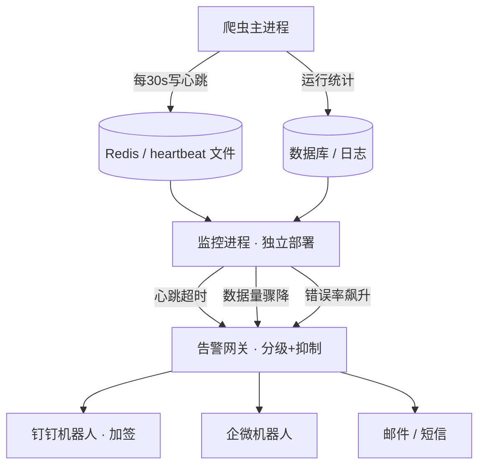

# Day 141 — 爬虫监控与告警 · 图解

## 1. 监控告警整体架构（Mermaid）



## 2. 指数退避 + 抖动（ASCII）

```
失败 ──等1~1.5s──▶ 重试#1 失败 ──等2~3s──▶ 重试#2 失败
      ──等4~6s──▶ 重试#3 失败 ──等8~12s──▶ 重试#4 ──▶ 成功 or 死信队列

单爬虫:  ▁▄▁▁▄▁▁▄▁        （间隔指数拉长，给服务喘息时间）
多爬虫:  ▂▁▃▁▂▁▄▁▃▁▂      （jitter 抖散，避免惊群）
```

## 3. 异常捕获分层（ASCII）

```
┌────────────────────────────────────┐
│ 进程层  sys.excepthook → 崩溃告警    │
│ ┌────────────────────────────────┐ │
│ │ 业务层  数据量断言 → 静默失败告警  │ │
│ │ ┌────────────────────────────┐ │ │
│ │ │ 解析层  字段级 try → 失败计数 │ │ │
│ │ │ ┌────────────────────────┐ │ │ │
│ │ │ │ 请求层  重试装饰器 → 自动重试│ │ │ │
│ │ │ └────────────────────────┘ │ │ │
│ │ └────────────────────────────┘ │ │
│ └────────────────────────────────┘ │
└────────────────────────────────────┘
```

## 4. 心跳超时判定时间线

```
爬虫:   ●────●────●────●────✕(崩溃)
        0s   30s  60s  90s  120s
监控:      ▲检查 ▲检查 ▲检查 ▲检查→ 距上次心跳30s+超阈值 → 🚨告警
```
