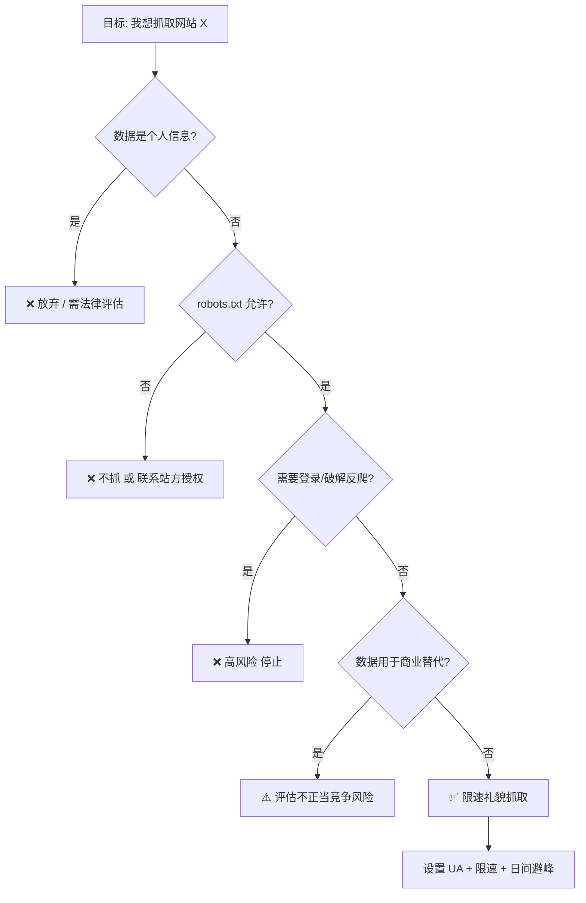

# Day 142 — 爬虫法律与规范

> 阶段：Phase 7 — 进阶与性能优化
> 主题：robots.txt 规范 / 数据合规与法律边界 / 爬虫职业道德

---

## 一、概念解释

### 1.1 robots.txt 是什么

`robots.txt` 是网站放在根目录下的一个**纯文本协议文件**（`https://example.com/robots.txt`），用来告诉爬虫："哪些路径欢迎你抓，哪些路径请你别碰"。

关键认知：

- 它叫 **Robots Exclusion Protocol（爬虫排除协议）**，是 1994 年诞生的**君子协定**
- **不具有强制法律约束力**（但在中国司法实践中，违反 robots.txt 可作为"明知不应抓取"的主观过错证据）
- 主流搜索引擎爬虫（Googlebot、Baiduspider）都会遵守它

### 1.2 robots.txt 语法速览

```text
# 注释以 # 开头
User-agent: *          # 对所有爬虫生效
Disallow: /admin/      # 禁止抓取 /admin/ 下所有内容
Disallow: /private.php # 禁止抓取特定文件
Allow: /admin/public/  # 例外：允许（优先级高于 Disallow）
Crawl-delay: 2         # 请求间隔至少 2 秒（非标准字段，部分引擎支持）
Sitemap: https://example.com/sitemap.xml

User-agent: BadBot     # 针对特定 UA 的独立规则组
Disallow: /            # 全站禁抓
```

### 1.3 数据合规相关法律（中国）

| 法律 | 与爬虫相关的核心条款 |
|---|---|
| 《网络安全法》 | 不得危害网络秩序；未经授权侵入网络属于违法行为 |
| 《数据安全法》 | 数据分类分级；窃取/非法获取数据需担责 |
| 《个人信息保护法》(PIPL) | 抓取个人信息（手机号、身份证、住址等）必须有合法基础，"合法正当必要"原则 |
| 《反不正当竞争法》 | 抓取竞对数据"不劳而获"、实质性替代对方服务，构成不正当竞争 |
| 《刑法》第 285 条 | **非法获取计算机信息系统数据罪**：违反规定侵入/采用其他技术手段获取数据，情节严重可入刑 |

### 1.4 什么情况爬虫会"踩红线"

1. **突破反爬措施**：绕过验证码、伪造登录态、破解加密接口 —— 可能被认定为"未经授权获取数据"
2. **抓取个人信息**：电话号码、住址、身份证号等，即使公开可见
3. **高频请求压垮服务**：造成对方服务器瘫痪，可能构成破坏计算机信息系统罪
4. **抓取后实质性替代原服务**：搬运内容直接变现，构成不正当竞争
5. **抓取+转售受版权保护的内容**

### 1.5 爬虫职业道德（Industry Ethics）

- **识别自己**：设置真实、可联系的 User-Agent（含邮箱）
- **限速**：单站点并发 ≤ 1~2，请求间隔 ≥ 1~3 秒
- **避开高峰**：夜间/清晨抓取对业务影响更小
- **尊重 robots.txt**：即使法律不强制
- **只抓需要的数据**：能拿列表页摘要就不要全站镜像
- **不碰隐私数据**：个人身份信息（PII）一律不碰

---

## 二、原理解析

### 2.1 robots.txt 匹配算法

匹配基于**最长前缀匹配 + Allow/Disallow 优先级**：

```text
1. 找到 User-agent 匹配当前爬虫名的规则组（* 是通配）
2. 对请求路径，收集所有匹配的 Allow / Disallow 规则
3. 规则匹配长度：Allow 和 Disallow 中"匹配路径最长的"获胜
4. 完全没有匹配规则 => 默认允许抓取
5. Disallow: (空) => 允许抓取全站
```

示例：

```text
User-agent: *
Allow: /public/
Disallow: /

请求 /public/a.html: 允许 ✅
请求 /private/x:     禁止 ❌
```

⚠️ **实测避坑**：CPython 的 `urllib.robotparser` 对规则顺序敏感——若把 `Disallow: /` 写在 `Allow: /public/` 之前，`/public/a.html` 也会被判为禁止。写 robots.txt 或离线解析时，请把更具体的 `Allow` 规则放在前面，并用真实用例回归验证。

### 2.2 Crawl-delay 与 politeness（礼貌抓取）

搜索引擎定义的"politeness"本质上是一个**公平资源共享问题**：

- 服务器带宽、CPU、数据库连接是有限资源
- 一个礼貌爬虫应保证自己占用 < 1% 的站点容量
- 实践经验：QPS ≤ (1 / 站点平均响应时间) × 安全系数 0.01~0.1

### 2.3 合规决策流程



---

## 三、API 速查：urllib.robotparser

| 方法 | 说明 |
|---|---|
| `RobotFileParser()` | 创建解析器 |
| `set_url(url)` / `parse(lines)` | 设置 robots.txt 地址 / 直接解析文本行 |
| `read()` | 发起请求读取并解析（404/网络错误时视为全允许） |
| `can_fetch(useragent, url)` | 该 UA 是否允许抓取该 URL → bool |
| `crawl_delay(useragent)` | 读取 Crawl-delay 值（无则 None） |
| `request_rate(useragent)` | 读取 Request-rate（返回 namedtuple 或 None） |
| `mtime()` / `modified()` | 上次读取时间 / 标记需要重新读取 |

---

## 四、实战代码案例

见 `code/` 目录：

1. `01-robots-parser.py` — 基础：解析并遵守 robots.txt
2. `02-compliance-checker.py` — 进阶：抓取前合规自检（避坑清单代码化）
3. `03-polite-crawler.py` — 实战：一个"礼貌爬虫"骨架，限速 + robots 检查 + 日志审计

---

## 五、思考题

1. robots.txt 写了 `Disallow: /`，但页面本身公开可访问且无登录墙。抓取它违法吗？为什么实践中仍建议遵守？
2. 为什么"绕过验证码"在中国司法实践中常被认定为"破坏技术措施/非法获取数据"？验证码在法律上代表什么信号？
3. 如果只抓取一个公开 API 的数据做个人研究、不商用、不传播，是否就绝对安全？哪些边界仍需注意？
4. 设计一个"合规中间件"：在 Scrapy 请求发出前自动检查 robots.txt 并限速，你会怎么设计缓存（robots.txt 本身不能每次请求都重新下载）？
5. 《个人信息保护法》下，"数据已公开"是否等于"可以自由抓取"？什么叫"合理的处理范围"？

---

## 六、今日总结

- robots.txt 是君子协定：无强制力，但违反它会成为"主观过错"的证据
- 中国爬虫红线：绕反爬、抓 PII、打垮服务、实质性替代
- 职业道德落地为三件事：**真实 UA、限速、只抓所需**
- `urllib.robotparser` 标准库即可实现合规检查
