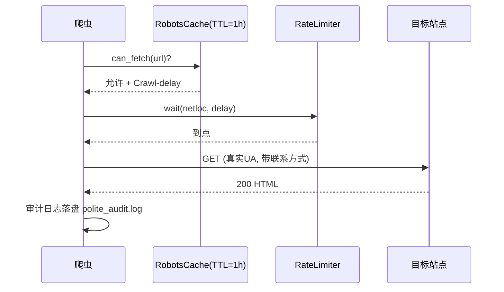

# Day 142 — 图解

## 1. robots.txt 决策流程

```text
                 ┌─────────────────┐
   请求 URL ───▶ │ 解析 netloc     │
                 └────────┬────────┘
                          ▼
              ┌───────────────────────┐
              │ robots.txt 有该 UA 组?│
              └───┬───────────────┬───┘
               是 │               │ 否 → 用 User-agent: * 组
                  ▼               ▼
        ┌────────────────────────────┐
        │ 收集所有匹配的 Allow/Disallow│
        └────────────┬───────────────┘
                     ▼
        ┌────────────────────────────┐
        │ 取"匹配路径最长"的那条规则  │
        └────────────┬───────────────┘
              Allow ▼        Disallow
             ✅ 抓取          ❌ 跳过
```

## 2. 爬虫风险分级金字塔

```text
            ▲ 刑事风险
           ╱───────────╲
          ╱  入刑区      ╲   绕反爬获取数据 / 打垮服务器 / 大量抓PII
         ╱───────────────╲
        ╱   民事/行政风险  ╲  不正当竞争 / 版权侵权 / 数据安全处罚
       ╱───────────────────╲
      ╱    合规灰区          ╲ 商业用途抓公开非PII数据、未实质替代
     ╱───────────────────────╲
    ╱     安全区               ╲ robots允许+限速+真实UA+非PII+自用
   ╱───────────────────────────╲
```

## 3. 礼貌爬虫请求生命周期


