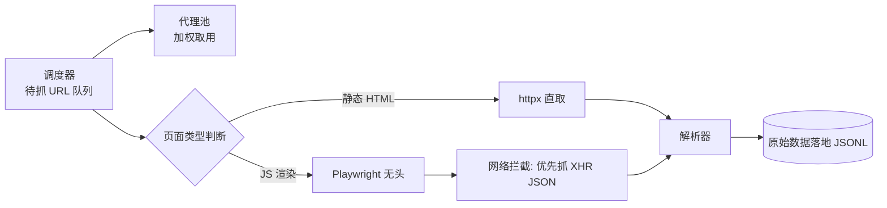

# Day 143 — 阶段项目 Part 1：代理池 + 浏览器模拟 + JS 解析

> 阶段：Phase 7 — 进阶与性能优化
> 主题：全栈反爬突破系统（上）—— 架构设计 / 代理池 / 浏览器模拟 / JS 动态内容解析

> ⚠️ **合规提醒**：本项目仅用于学习反爬技术原理与防御性测试，请只对自己拥有/授权的测试站点练习（见 Day 142）。

---

## 一、概念解释

### 1.1 项目整体架构

"全栈反爬突破系统"分三天搭建，今天负责**取数层**：

```text
Day 143: 代理池 + 浏览器模拟 + JS 解析   → 解决"请求被识别/页面是动态渲染"
Day 144: 验证码处理 + 数据清洗 + 调度告警 + 容器化 → 解决"人机验证"与"工程化运行"
```

### 1.2 代理池（Proxy Pool）

代理池是一个**自动维护可用代理列表的服务**：

- **采集**：从免费/付费代理 API 抓取代理
- **验证**：定时用目标（或通用）URL 测试代理的可用性与延迟
- **打分/淘汰**：连续失败的代理降分直至移除
- **供给**：爬虫按策略（轮询/随机/按成功率加权）取用

**为什么要代理池？** 目标站点按 IP 维度限频/封禁。单一 IP 高频请求必然触发风控；代理池把请求分散到大量出口 IP 上，使每个 IP 的请求频率降到阈值以下。

### 1.3 浏览器模拟（Headless Browser）

requests 拿到的 HTML 是"生面团"，很多站点的数据由 JS 在浏览器里执行后才"烤熟"（DOM 渲染、XHR 补数据）。浏览器模拟的思路：**不再猜接口，直接跑一个真浏览器**（Playwright/Selenium），等 JS 执行完再取 DOM。

| 方案 | 原理 | 成本 |
|---|---|---|
| requests/httpx | 直接发 HTTP | 极低，但拿不到渲染结果 |
| requests + 逆向 JS 接口 | 分析 XHR 直接调 API | 中（逆向难），效率最高 |
| Playwright(无头) | 真浏览器内核执行 JS | 高（内存/CPU），最通用 |
| Playwright + stealth | 补齐无头特征指纹 | 高，绕过基本无头检测 |

### 1.4 JS 解析的两种路线

1. **DOM 路线**：等页面 `networkidle`，用选择器取渲染后的 DOM（简单但慢）
2. **接口路线**：拦截页面的 XHR/fetch 请求，直接请求返回 JSON 的数据接口（快，且数据最干净）

---

## 二、原理解析

### 2.1 代理池评分模型

每个代理维护滑动窗口成功率，取用时按权重随机：

```text
score = 连续成功次数 / (连续成功次数 + 连续失败次数)
取用概率 ∝ score（加权随机，避免"最好用"的代理被打死）
```

### 2.2 无头浏览器为什么会被识别

无头 Chrome 与真浏览器的差异点（Day 137 的指纹知识回收利用）：

- `navigator.webdriver = true`
- UA 中含 `HeadlessChrome`
- 缺失插件/字体/WebGL 渲染特征
- 鼠标轨迹为空、事件节奏机械

Playwright 的 `playwright-stealth`（或手工注入 init script）可抹平大部分特征。

### 2.3 今日系统数据流



---

## 三、API 速查

### httpx 代理

| 用法 | 说明 |
|---|---|
| `httpx.Client(proxy="http://u:p@host:port")` | 全局走代理 |
| `httpx.get(url, proxy=...)` | 单次代理 |
| `client.get(url, timeout=10)` | 务必设超时 |

### Playwright 核心

| API | 说明 |
|---|---|
| `sync_playwright().start()` | 同步模式入口 |
| `browser.new_page(...)` | 新页面 |
| `page.goto(url, wait_until="networkidle")` | 等 JS 静默 |
| `page.content()` / `page.query_selector_all(sel)` | 取 DOM |
| `page.on("response", cb)` | 拦截网络响应 |
| `page.add_init_script(js)` | 页面加载前注入 JS（抹指纹） |

---

## 四、实战代码

见 `code/`：

1. `01-proxy-pool.py` — 基础：带评分与后台校验的代理池
2. `02-browser-render.py` — 进阶：Playwright 渲染 + XHR 接口拦截 + 无头检测规避（需 `pip install playwright && playwright install chromium`）
3. `03-fetch-pipeline.py` — 实战：静态/动态自动分流 + 代理池联动的取数管线

---

## 五、思考题

1. 加权随机取代理为什么比"永远取分数最高的"更健壮？
2. `wait_until="networkidle"` 的缺陷是什么？什么场景应改用 `domcontentloaded` + 显式等待？
3. 拦截 XHR 拿 JSON 与解析 DOM 相比，数据质量与稳定性差异在哪？什么时候反而必须走 DOM？
4. 代理池的验证 URL 如果直接用目标站点，会有什么法律与工程上的问题？
5. 如果目标站使用 WebSocket 推送数据，今天的拦截方案要怎么扩展？

---

## 六、今日总结

- 代理池 = 采集 + 验证 + 评分 + 加权供给，核心是把单 IP 频率压到阈值下
- 动态页面两条路：DOM 渲染路线（通用慢）与 XHR 接口路线（快但需分析）
- 无头检测的本质是指纹差异，可用 init script 抹平基础特征
