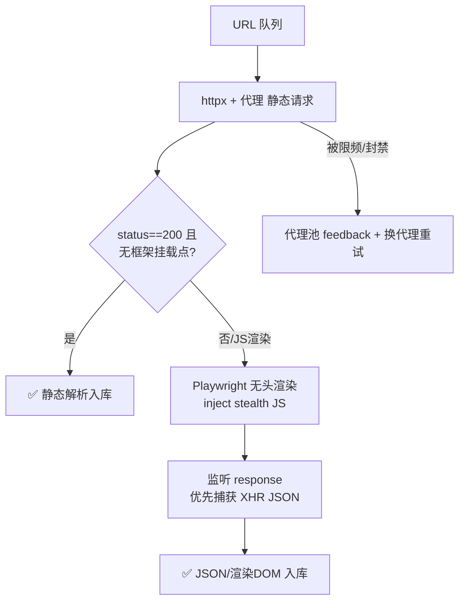

# Day 143 — 图解

## 1. 代理池生命周期

```text
  采集源A ┐
  采集源B ├──▶ [入库] ──▶ [后台校验线程] ──▶ 评分更新
  采集源C ┘                 │
                            ▼
              ok++ / fail++（连续失败>=3 → 淘汰）
                            │
                            ▼
              爬虫 acquire(): 加权随机(∝score)
                            │
                 feedback(成功/失败) 闭环
```

## 2. 静态/动态分流决策



## 3. 无头检测对抗的本质

```text
真浏览器指纹:   webdriver=false | 插件5个 | WebGL正常 | 轨迹自然
无头默认指纹:   webdriver=true  | 插件0个 | WebGL异常 | 无鼠标事件
                     │ 注入 init script 抹平 ──────────▶ 差异缩小
对抗是军备竞赛: 检测方加新探针 ←→ 模拟方补特征，没有一劳永逸
```
