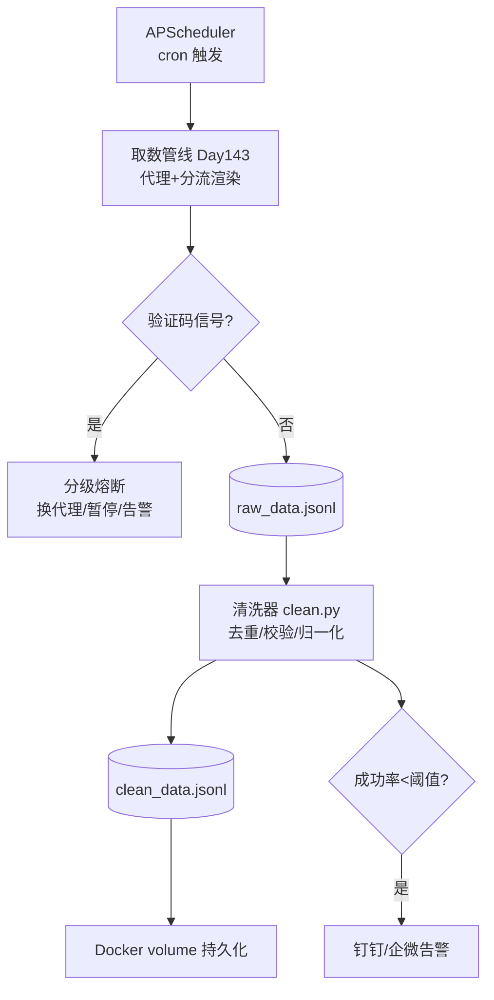

# Day 144 — 阶段项目 Part 2：验证码处理 + 数据清洗 + 调度 + 告警 + 容器化

> 阶段：Phase 7 — 进阶与性能优化
> 主题：全栈反爬突破系统（下）—— 人机验证应对 / 数据清洗入库 / APScheduler 调度 / 告警 / Docker 部署

> ⚠️ **合规提醒**：验证码的存在本身就是站方"未授权"的明确信号（见 Day 142）。本日内容用于理解机制与防御测试，绕过他人站点的验证码在中国司法实践中可能构成违法。

---

## 一、概念解释

### 1.1 验证码的类型与应对思路

| 类型 | 原理 | 合规应对 |
|---|---|---|
| 图形验证码 | 扭曲字符图片 | OCR 识别（ddddocr）；**仅限自有站点** |
| 滑块验证码 | 轨迹行为分析 | 模拟人类轨迹（贝塞尔曲线 + 抖动） |
| 点选验证码 | 语义理解 | 打码平台（法律风险高，不建议） |
| 短信/邮箱验证 | 实名通道 | 无解，只能人工授权 |
| 遇到验证码的正确姿势 | — | **降速/暂停 + 告警人工介入** |

工程上最重要的是：**把"遇到验证码"当作一种可检测的信号**（响应特征：特定状态码、页面标记、跳转 captcha 域名），触发降级策略而非硬闯。

### 1.2 数据清洗管线（ETL 中的 T）

爬下来的原始数据（JSONL）通常脏在四处：

1. **重复**：同一条数据被抓多次 → 去重（URL/内容哈希）
2. **字段缺失/类型错误**：`None`、空串、数字变字符串 → 校验 + 规范化
3. **HTML 残留**：正文里混着 `<br>`、`&amp;` → 反转义 + 去标签
4. **编码/空白问题**：`\xa0`（不间断空格）、首尾空白、全半角混杂 → 归一化

### 1.3 调度（APScheduler）

- `BackgroundScheduler`：进程内后台调度
- 触发器：`date`（一次）、`interval`（间隔）、`cron`（表达式）
- `misfire_grace_time`：错过触发的宽限期
- `max_instances`：防止上一轮还没跑完又启动一轮

### 1.4 告警与容器化

- 告警通道：钉钉/企微 Webhook（Day 141 已学，复用）
- 容器化关键点：Playwright 的浏览器依赖要打进镜像；数据目录用 volume 挂载；调度器作为容器主进程

---

## 二、原理解析

### 2.1 验证码检测信号

```text
响应侧信号:
  - HTTP 状态码 403/412/429
  - 响应体含 "captcha" / "验证" / 指定错误码 JSON 字段
  - 被重定向到 /captcha/ 路径
触发后策略（分级熔断）:
  Level 1: 换代理 + 退避重试
  Level 2: 暂停该域名抓取 30 分钟
  Level 3: 停止任务 + 推送告警等人工介入
```

### 2.2 内容指纹去重

```text
fingerprint = sha256( normalize(标题) + normalize(正文前 N 字符) )
normalize = 小写 + 去空白/标点 + 全角转半角
存储: set/dict（量小）或 Redis bitmap/布隆过滤器（量大）
```

### 2.3 今日系统全景（承接 Day 143）



---

## 三、API 速查

### APScheduler

| API | 说明 |
|---|---|
| `BackgroundScheduler()` | 后台调度器 |
| `sched.add_job(fn, "cron", hour=3, minute=0)` | 每天 3 点 |
| `sched.add_job(fn, "interval", minutes=30, max_instances=1)` | 间隔触发 |
| `sched.start()` / `sched.shutdown()` | 启停 |
| `misfire_grace_time=300` | 错过触发的宽限秒数 |

### 数据清洗常用

| 工具 | 用途 |
|---|---|
| `hashlib.sha256(s.encode()).hexdigest()` | 内容指纹 |
| `html.unescape()` | `&amp;` → `&` |
| `re.sub(r"<[^>]+>", "", s)` | 去标签 |
| `unicodedata.normalize("NFKC", s)` | 全角→半角、`\xa0`→空格 |

---

## 四、实战代码

见 `code/`：

1. `01-captcha-detector.py` — 基础：验证码信号检测 + 分级熔断
2. `02-data-cleaner.py` — 进阶：去重/校验/归一化清洗管线（含避坑）
3. `03-scheduler-alert.py` — 实战：APScheduler 调度 + Webhook 告警 + Dockerfile（见文内）

---

## 五、思考题

1. 为什么"遇到验证码就停止"在工程上是正确策略，而"打码平台硬闯"在法律上高危？
2. 布隆过滤器与 `set` 做去重的取舍是什么？误判率如何影响爬虫数据质量？
3. 调度器 `max_instances=1` 防止了什么故障？什么场景下你会故意放宽？
4. Docker 镜像里跑 Playwright 为什么体积暴涨？有哪些瘦身手段（multi-stage / 换 CDP 远程浏览器）？
5. 如果清洗阶段发现 30% 的字段缺失，这说明上游哪个环节出了问题？如何定位？

---

## 六、三日项目总结（Day 142–144）

- **Day 142**：合规地基——法律边界、robots.txt、职业道德
- **Day 143**：取数层——代理池、浏览器模拟、JS 解析、自动分流
- **Day 144**：工程层——验证码熔断、数据清洗、调度、告警、容器化
- 三层合起来即一个**可长期运行、可观测、合规可控**的数据采集系统骨架
