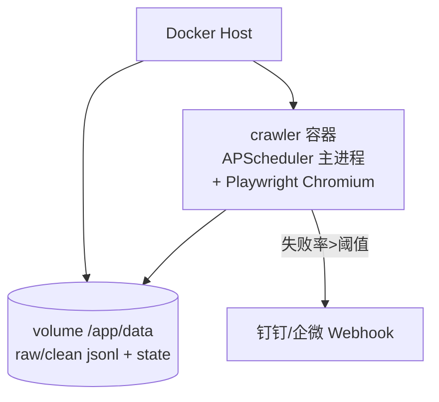

# Day 144 — 图解

## 1. 验证码分级熔断状态机

```text
                    正常抓取
                       │ 命中验证码文案
                       ▼
              ┌── Level 1 ──┐  换代理 + 退避重试
              │  恢复成功?  │──是──▶ 回到正常抓取
              └──────┬──────┘
                     │ 否 / 被重定向到验证页
                     ▼
              ┌── Level 2 ──┐  暂停该域名 30 分钟
              │  暂停到期?  │──是──▶ 降回 Level 1 重试
              └──────┬──────┘
                     │ 否 / 429 明确限频
                     ▼
              ┌── Level 3 ──┐  停止任务 + 推送告警
              │  人工介入   │──确认后──▶ 手动复位
              └─────────────┘
```

## 2. 清洗管线数据流

```text
raw_data.jsonl
   │
   ├─① 字段校验 ──── 缺字段/类型错 ──▶ 丢弃(计数 invalid)
   ├─② 文本归一化 ── NFKC → 去标签 → 反转义 → 压空白
   ├─③ 指纹去重 ──── sha256(规范标题+正文前500字)
   │                    已存在 ──▶ 丢弃(计数 duplicates)
   ▼
clean_data.jsonl + 清洗报告(成功率监控 → 触发告警)
```

## 3. 容器化部署视图


