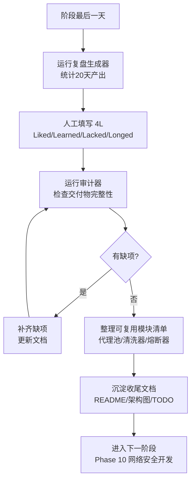

# Day 145 — 图解

## 1. Phase 9 知识全景

```text
Phase 9 · 爬虫与反爬对抗 (Day 126-145)
┌─────────────────────────────────────────────────────┐
│ 采集侧          对抗侧             合规/工程侧       │
│ ───────         ───────            ──────────       │
│ requests/httpx  代理池(评分轮换)   robots.txt       │
│ BS4/lxml解析    UA/Cookie池       频率限制          │
│ Scrapy分布式    浏览器指纹伪装     法律红线(D142)    │
│ Selenium/       JS逆向(加密参数)  监控+告警(D141)   │
│ Playwright      验证码策略         验证码熔断(D144) │
│ App抓包基础     静态/动态分流      数据清洗(ETL-T)   │
│ 存储管线        ──────────         调度(APSched)    │
└───────────────────────┬─────────────────────────────┘
                        ▼
          三日项目: 全栈反爬突破系统 (D142-144)
          合规地 · 稳定地 · 干净地把数据拿回来
                        ▼
          D145 收官: 复盘(4L) + 审计 + 收尾文档
                        ▼
          Phase 10: 网络安全开发 (D146-165)
```

## 2. 收官流程图



## 3. 螺旋上升：阶段如何衔接

```text
Phase 7(进阶/性能) ─▶ Phase 8(数据/AI) ─▶ Phase 9(爬虫/反爬) ─▶ Phase 10(网络安全)
      打地基              会分析               会采集              懂攻防
                                          ─────────────┬───────────────┘
                                                       ▼
                              爬虫遇到"对抗"自然引出安全问题:
                              HTTPS怎么加密的? 签名怎么伪造? Token怎么验证?
                              → 下一阶段全部回答
```
