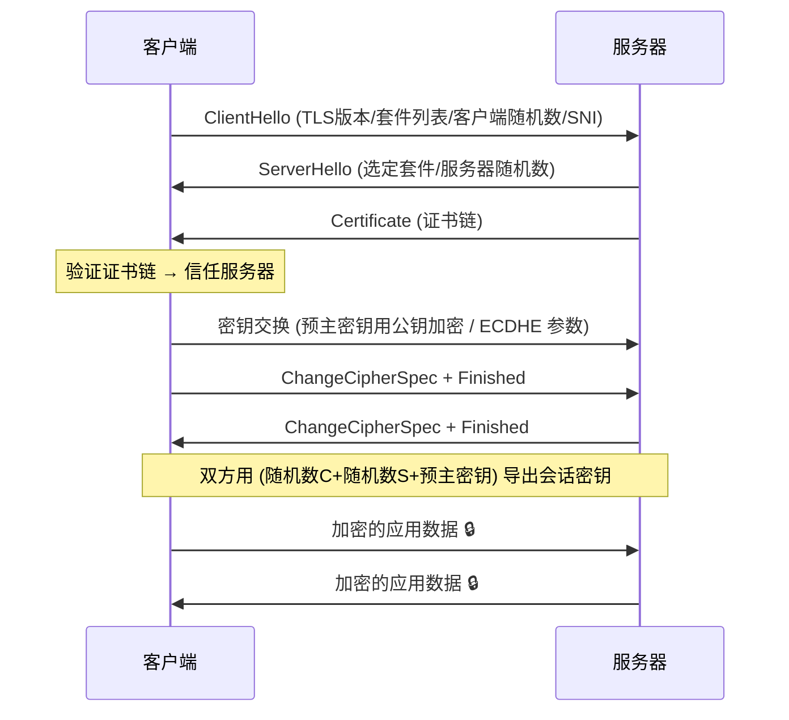

# Day 146 图解 — HTTPS/TLS 握手、证书信任链与 MITM

## 1. TLS 1.2 握手时序图（Mermaid）



## 2. TLS 1.3 对比（1-RTT）

```text
TLS 1.2:  ──Hello──▶ ◀──Hello+Cert──  ──KeyExchange──▶  (2-RTT 完成才发数据)
TLS 1.3:  ──Hello+KeyShare──▶ ◀──Hello+Cert+Finished──  ──Finished──▶ (1-RTT)
                  ↑ 客户端猜服务器会用哪个密钥交换算法, 直接带上参数
```

## 3. 证书信任链

```text
┌──────────────────────────────────────────────┐
│ Root CA (如 DigiCert Global Root)            │
│ 私钥离线锁在保险库, 公钥预装在 OS/浏览器里    │
└──────────────┬───────────────────────────────┘
               │ 签发(用根私钥签名)
               ▼
┌──────────────────────────────────────────────┐
│ 中间 CA (如 "DigiCert TLS RSA SHA256 2020")  │
│ 负责日常批量签发, 根CA泄露风险被隔离          │
└──────────────┬───────────────────────────────┘
               │ 签发
               ▼
┌──────────────────────────────────────────────┐
│ 网站证书: CN=*.baidu.com, SAN=...有效期...    │
└──────────────────────────────────────────────┘

验证路径(客户端逐级向上): 网站证书 → 验签名 → 中间CA → 验签名 → 到达信任库中的根 → ✅
任何一环失败(过期/域名不匹配/签名对不上/被吊销) → ❌ 浏览器红色警告
```

## 4. Fiddler/Charles 抓 HTTPS 的真相：MITM

```text
        客户端以为在和服务器握手          服务器以为客户端来自代理
┌─────┐   TLS①(代理自己的假证书)   ┌─────┐   TLS②(真证书)   ┌─────┐
│浏览 │◀────────────────────────▶│代理 │◀───────────────▶│服务 │
│器   │   装了Fiddler根证书才信任  │(MITM)│                 │器   │
└─────┘                          └─────┘                  └─────┘

明文只存在于代理内部:
  浏览器 ──加密①──▶ [ 解密 → 看到明文 → 重新加密② ] ──▶ 服务器
```

> 所以：不装 Fiddler 根证书它就抓不了你的 HTTPS；装了之后，这个假 CA 能冒充任何网站——用完务必卸载它的根证书。

## 5. Wireshark 视角：TLS record 结构图

```text
一个 TLS ApplicationData record(抓包看到的):
┌─────────┬─────────┬────────────────────────────┐
│ Type=23 │ Length  │   密文( AES-GCM 加密 )      │
│ (1字节) │ (2字节) │  ← 中间人只能看到这一坨乱码  │
└─────────┴─────────┴────────────────────────────┘
而握手报文(Type=22)是明文的 —— 所以 Wireshark 能展示
ClientHello/证书, 但看不到你的密码、Cookie 和请求内容。
```
