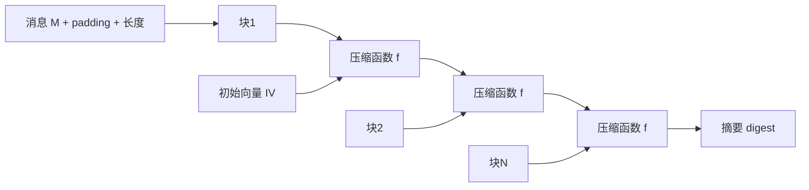
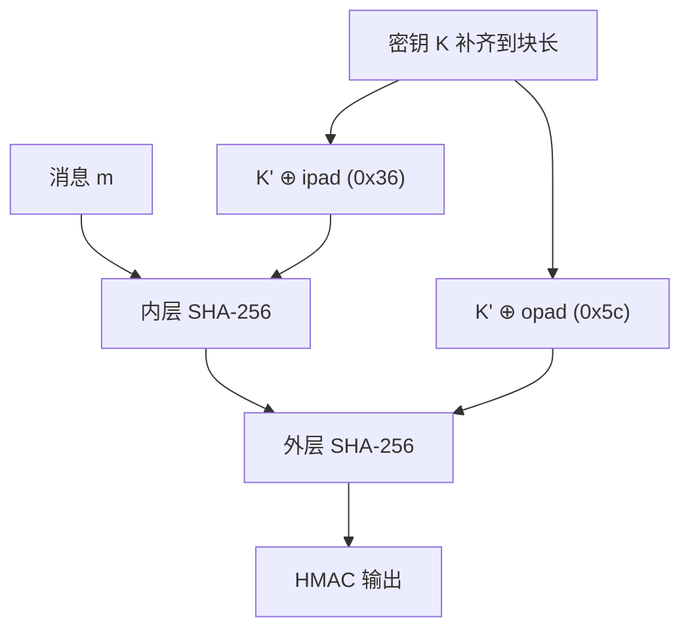

# Day 147 图解 — 密码学基础

## 1. 哈希函数定性图

```
任意长度输入                     固定长度输出
"hello world"      ┌─────────┐
10 GB 镜像文件  ──►│  SHA-256 │──► 64 个十六进制字符（256 bit）
""（空串）          └─────────┘
     ▲                  │
     │                  ▼
 单向箭头：只能正向算，无法从摘要还原输入（抗原像性）
```

## 2. Merkle–Damgård 链式压缩（MD5/SHA-1/SHA-2 通用骨架）



## 3. 彩虹表攻击 vs 加盐

```
【无盐】
  用户A 密码 "123456" ──sha256──► X9f2...
  用户B 密码 "123456" ──sha256──► X9f2...   ← 两人摘要相同！
  攻击者查预计算表: X9f2... → "123456"  💥 全军覆没

【加盐（每用户随机 16 字节）】
  用户A: sha256("123456" + salt_A) → 7d1e...
  用户B: sha256("123456" + salt_B) → 0a3c...
  攻击者的表只对应一个盐，必须为每个盐重算整张表  🛡️ 攻击成本 ×N
```

## 4. HMAC 双层结构



## 5. 文件完整性校验信任链

```
发布方: file ──sha256──► digest ──HMAC(私钥)──► 签名
          │                 │                      │
          ▼ (下载)          ▼ (下载)               ▼ (可信渠道发布)
验证方: 收到 file ──重算 sha256──► digest'
        compare_digest(digest', digest)  ✅ 文件完整
        HMAC(公钥/共享密钥, digest) 验签  ✅ 摘要来源可信
        两者都过 → 才能确认"文件没被换且来自发布方"
```
