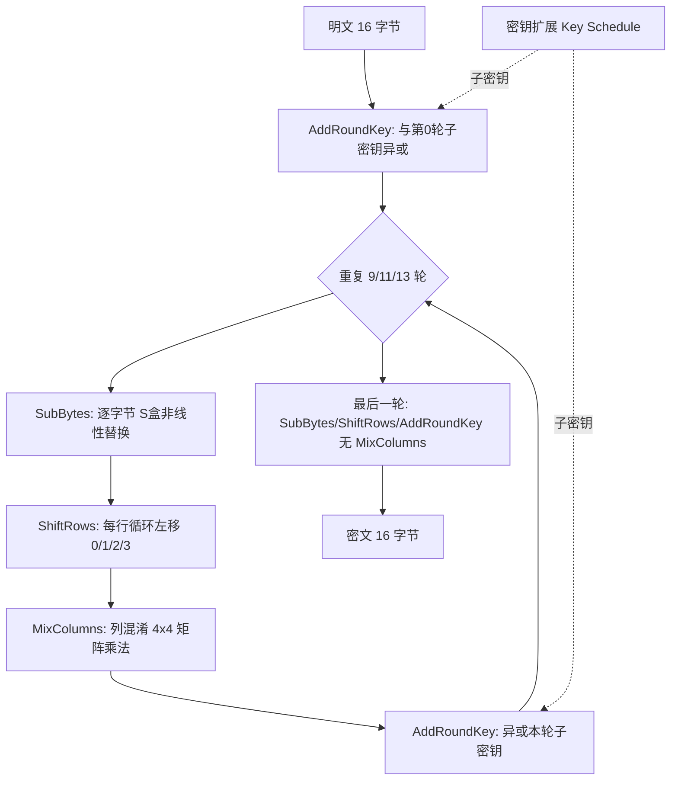
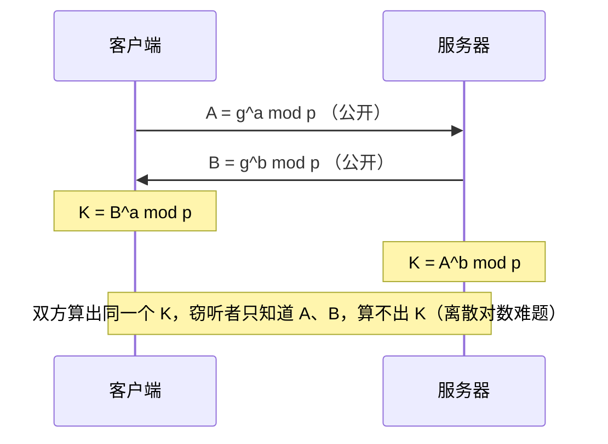

# Day 148 — 对称与非对称加密：AES、RSA 与混合加密

> 阶段：Phase 7 — 进阶与性能优化 · 主题：实战密码学
>
> 前置知识：Day 147 学了哈希与 HMAC（解决**完整性 / 不可否认**）。今天进入另一个方向——**机密性（Confidentiality）**：数据要在不可信信道上传输，怎么保证别人看不到。理解了 AES / RSA / 混合加密，你才看得懂 TLS、VPN、加密聊天软件、JWT 签名背后到底发生了什么。

---

## 一、概念解释

### 1.1 对称加密（Symmetric Encryption）

**定义**：加密和解密使用**同一把密钥**的加密方式。

```
明文 + 密钥 K ──[加密]──► 密文 ──[解密]──► 明文（同一个密钥 K）
```

代表算法：

| 算法 | 密钥长度 | 分组长度 | 状态 | 说明 |
|---|---|---|---|---|
| DES | 56 bit | 64 bit | ❌ 已淘汰 | 密钥太短，暴力可破 |
| 3DES | 112/168 bit | 64 bit | ⚠️ 逐步淘汰 | 性能差、Sweet32 攻击 |
| **AES** | 128/192/256 bit | **128 bit** | ✅ 主流 | 硬件加速，业界标准 |
| ChaCha20 | 256 bit | 流式 | ✅ 主流 | 无 AES 硬件时的首选（移动端） |
| SM4 | 128 bit | 128 bit | ✅ 国密 | 国内合规场景 |

**为什么它快？** 加密算法本身只做查表、移位、异或这类按位运算，且可以
硬件指令加速（x86 的 AES-NI）。实测 AES-GCM 在现代 CPU 上可达 **1~5 GB/s**。

**它解决不了的问题**：密钥分发。A 和 B 隔着不可信网络，怎么让两人拥有
同一把密钥？如果先能安全传密钥，那干脆用它传数据就好了——这就是死循环。
非对称加密负责打破这个死循环。

### 1.2 非对称加密（Asymmetric / Public-Key Encryption）

**定义**：使用**一对**数学关联的密钥——公开的公钥（public key）和保密的
私钥（private key）。公钥加密的数据，只有对应私钥能解；私钥签名的数据，
任何持有公钥的人都能验证。

| 算法 | 安全基础 | 典型密钥长度 | 特点 |
|---|---|---|---|
| RSA | 大整数分解难题 | 2048 / 3072 / 4096 bit | 最通用，兼容性好，慢 |
| ECC (ECDSA/ECDH) | 椭圆曲线离散对数 | 256 bit | 同等安全下密钥更短、更快 |
| Ed25519 | 爱德华兹曲线 | 256 bit | 现代签名首选，快且抗侧信道 |
| DH / ECDHE | 离散对数 | — | 用于**密钥协商**，不用于加密数据 |

**为什么它慢？** 运算对象是上千位的大整数，核心操作是模幂（`m^e mod n`），
大量大数乘法和取模，比 AES 的按位操作慢几个数量级（通常几十到上千倍）。

**两大用途必须分清**：

```
① 加密（保证机密性）:  公钥加密 ──► 私钥解密
   目标：任何人都能发消息给我，但只有我能看

② 签名（保证身份+完整性）:  私钥签名 ──► 公钥验签
   目标：证明"这条消息确实来自私钥持有者"，且未被篡改
```

> 常见误区："用私钥加密、公钥解密" 这种说法容易误导。正确表述是
> **签名 = 用私钥对消息摘要做运算，公钥可以验证**。因为公钥是公开的，
> 用"私钥加密"得到的密文谁都能解开，根本谈不上保密。

### 1.3 混合加密（Hybrid Encryption）

工业界从不单用 RSA 加密业务数据，而是**混合**：

```
① 随机生成一次性对称密钥 K（会话密钥，如 32 字节）
② 用接收方公钥加密 K            → 解决"密钥分发"（非对称的强项）
③ 用 K 加密真正的数据（AES-GCM）→ 解决"高速大批量"（对称的强项）
④ 接收方用私钥解出 K，再解密数据
```

TLS/HTTPS、PGP、Signal、VPN 全是这个套路。**记住一句话：
非对称加密只用来搬运密钥和做签名，真正的数据永远交给对称加密。**

### 1.4 三个概念别混淆：编码 / 哈希 / 加密

| 名称 | 可逆？ | 有密钥？ | 目的 |
|---|---|---|---|
| Base64 编码 | ✅ 可逆 | ❌ 无 | 把二进制塞进文本协议，**不是安全措施** |
| 哈希（SHA-256） | ❌ 不可逆 | ❌ 无 | 完整性校验、指纹 |
| HMAC | ❌ 不可逆 | ✅ 有 | 带密钥的完整性/认证（Day 147） |
| 对称加密 | ✅ 可逆 | ✅ 有 | 机密性 |
| 非对称加密 | ✅ 可逆 | ✅ 有（一对） | 机密性 + 密钥分发 |
| 数字签名 | — | ✅ 有 | 身份认证 + 完整性 + 不可否认 |

> ⚠️ 把 Base64 当加密用是新手最常见的笑话：
> `base64.b64encode(b"password")` 的结果 `cGFzc3dvcmQ=` 任何人都能解。

### 1.5 分组密码的五个关键术语

- **分组（Block）**：AES 一次处理的固定长度，恒为 128 bit（16 字节）。
- **密钥长度**：AES-128/192/256，**只影响轮数**（10/12/14 轮），不改分组大小。
- **模式（Mode）**：如何把多个分组串起来加密，决定安全性（见 2.2）。
- **IV / nonce**：初始向量 / 一次性数字，保证"同样的明文每次加密结果不同"。
- **填充（Padding）**：明文长度不是分组整数倍时补齐到整数倍（见 2.3）。

**为什么 AES 分组是 128 bit 不变？** 因为 `SubBytes/ShiftRows/MixColumns` 这一套
"状态矩阵"运算天然是 16 字节的结构（4×4 字节矩阵）；加大分组会让安全性
提升有限而性能骤降，所以设计者选择用更多轮数（更长的密钥）来提升强度。

## 二、原理深入

### 2.1 AES 内部结构（为什么它安全且可逆）

AES 把 16 字节明文排成 4×4 的"状态矩阵"，每轮做四个变换：



四个变换各自的作用（**为什么是这四个**）：

1. **SubBytes**：唯一的**非线性**步骤（S 盒）。没有它，整个密码就是线性
   方程组，能被直接解出密钥。它提供"混淆（confusion）"。
2. **ShiftRows**：把字节在列之间打散，保证一个字节的影响扩散到多列。
3. **MixColumns**：列内线性混合，提供"扩散（diffusion）"——一位变化迅速
   影响整块。
4. **AddRoundKey**：把密钥真正"掺"进去，否则算法与密钥无关。

**密钥扩展**：从 128/192/256 bit 主密钥推导出每轮一把子密钥。这也是为什么
密钥越长为轮数越多（10/12/14 轮），而不是改分组长度。

**AES 的逆运算**正是把上述步骤逆序 + 用逆 S 盒 / 逆 ShiftRows / 逆 MixColumns，
所以能解密（这是"对称"的底层保证）。

### 2.2 分组模式：ECB / CBC / CTR / GCM

分组密码只能处理固定 16 字节，现实数据远超 16 字节，于是有了"模式"。

**ECB（Electronic Codebook）— ❌ 千万不要用**

```
独立加密每个分组:  C_i = AES(P_i)
```
问题：相同明文分组 → 相同密文分组。加密一张位图后仍能看清轮廓（"ECB 企鹅"）。
**它泄露的是数据的结构，而这往往就是最敏感的信息。**

**CBC（Cipher Block Chaining）— ⚠️ 可用但需谨慎**

```
C_1 = AES(P_1 XOR IV)
C_i = AES(P_i XOR C_{i-1})
```
每个明文分组先与**前一个密文分组**异或，破坏了"相同明文→相同密文"。
要求：IV 必须随机且**不可预测**，且每次加密换新 IV。
缺点：**只保证机密性，不保证完整性**（可被 bit-flipping 篡改），且不能并行加密。

**CTR（Counter）— ✅ 流式，可并行**

```
C_i = P_i XOR AES(nonce || counter_i)
```
把分组密码当**流密码**用：加密一串计数器，再与明文异或。优点：可并行、
可随机访问、无填充。缺点：**nonce+counter 组合绝不能重复**，且同样不带完整性。

**GCM（Galois/Counter Mode）— ✅ 现代默认**

```
GCM = CTR 模式加密  +  GHASH 认证标签
```
它是 **AEAD（Authenticated Encryption with Associated Data）**：
一次运算同时给出机密性 + 完整性，还能附带 **AAD**（不加密但受保护的元数据）。
只要 tag 校验不过，解密直接失败——**不会把被篡改的数据交给你**。
这就是 TLS 1.3 里只剩 AES-GCM / ChaCha20-Poly1305 的原因。

| 模式 | 机密性 | 完整性 | 可并行 | 推荐度 |
|---|---|---|---|---|
| ECB | ❌ 泄露结构 | ❌ | ✅ | 🚫 禁止 |
| CBC | ✅ | ❌ | ❌ | ⚠️ 仅配合 HMAC（Encrypt-then-MAC） |
| CTR | ✅ | ❌ | ✅ | ⚠️ 需自行加 MAC |
| **GCM** | ✅ | ✅ | ✅ | ✅ 推荐 |
| ChaCha20-Poly1305 | ✅ | ✅ | ✅ | ✅ 无 AES 硬件时推荐 |

### 2.3 填充（Padding）与 PKCS#7

CBC 要求明文长度是 16 的整数倍。PKCS#7 规则：缺 n 字节就补 n 个值为 n
的字节；若刚好整除，则补满一整块 16 个 `0x10`。

```
"HELLO"(5字节) → 补 11 个 0x0B  → 16 字节
16 字节整块     → 补 16 个 0x10 → 32 字节（必须补！否则无法区分"已去掉填充"）
```

> **Padding Oracle 攻击**：如果服务端对"填充错误"和"内容错误"返回不同提示，
> 攻击者可以逐字节解出明文。这就是为什么 CBC 时代要格外小心，也是 GCM 这种
> AEAD 更安全的原因之一。

### 2.4 RSA 的数学原理

```
密钥生成:
  选两个大素数 p, q（2048 bit 密钥 ⇒ p、q 各约 1024 bit）
  n = p * q                       （公开的"模数"）
  φ(n) = (p-1)(q-1)
  选 e 与 φ(n) 互素（惯例 65537）
  求 d 使 e * d ≡ 1 (mod φ(n))
  公钥 = (n, e)     私钥 = (n, d)

加密: c = m^e mod n
解密: m = c^d mod n
```

**为什么安全**：攻击者知道 n 和 e，想求 d 必须先分解 n 得到 p、q。而
2048-bit 的大整数分解在现有算力下不可行。**为什么 e 常取 65537**：
它是 `2^16+1`，二进制只有两个 1，模幂运算快，且足够大以避免小指数攻击。

**为什么"教科书 RSA"不安全**：

- 确定性：相同明文 + 相同公钥 → 相同密文（可被枚举比对）。
- 小消息可开方：若 `m^e < n`，则 `c = m^e`，直接对 c 开 e 次方即得 m。
- 可乘性：`E(m1)*E(m2) = E(m1*m2)`，攻击者可构造定向密文。

**填充救场**：OAEP（加密用）在明文前掺入随机数并做 Feistel 变换，让同一明文
每次密文都不同；PSS（签名用）用随机盐保证签名不可伪造、不可复用。

### 2.5 密钥协商与前向保密（Forward Secrecy）

RSA 封装密钥有个隐患：**服务器私钥一旦泄露，攻击者录下的历史流量全被解开**。

Diffie-Hellman（DH）解决这个：



现代 TLS 用 **ECDHE**（椭圆曲线临时 DH）：每次连接生成**一次性**密钥对，
用完即弃。这样即使长期私钥泄露，也解不开历史会话——即"前向保密"。
Day 149 学的 JWT 与 Day 148 的这套密码学知识，是同一批底层工具的两种应用。

### 2.6 为什么非对称加密慢：数量级对比

| 操作 | 相对速度 | 原因 |
|---|---|---|
| AES-256-GCM 加解密 | 1× (基准) | 按位运算 + 硬件加速 |
| RSA-2048 加密（公钥运算） | ~1000× 慢 | 大数模幂，e=65537 已优化 |
| RSA-2048 解密（私钥运算） | ~3000× 慢 | d 是 2048 bit，全长度模幂 |
| ECC-256 运算 | ~100× 慢 | 椭圆曲线点乘 |

正是这个数量级差，逼出了混合加密这一必然方案。

## 三、常见陷阱与避坑指南

### 3.1 用 ECB 模式加密（结构性泄露）

```python
# ❌ 错误：ECB 会让相同明文块产生相同密文块
cipher = Cipher(algorithms.AES(key), modes.ECB())
```

**后果**：加密图片能看出轮廓，加密数据库字段能看出哪些行值相同。
**正确做法**：用 `AESGCM`（推荐）或 CBC + 随机 IV。

### 3.2 IV / nonce 重用（最致命的一类错误）

- **CBC 的 IV 可预测**：固定 IV 或"时间戳当 IV"，会让相同明文前缀产生相同
  密文前缀，泄露信息（BEAST 攻击）。
- **GCM 的 nonce 重用是毁灭性的**：同一个 (key, nonce) 加密两条消息，
  两条密文异或 = 两条明文异或（直接泄露明文关系），更严重的是可以恢复出
  **认证密钥 H**，从而伪造任意消息的 tag。

```python
# ❌ 错误：nonce 写死 / 每次用同一个
aesgcm.encrypt(b"\x00" * 12, data, None)
# ✅ 正确：每次加密都生成新 nonce
nonce = os.urandom(12)
```

**纪律**：自己管 nonce 时用随机 12 字节（碰撞概率极低）或严格单调计数器；
用 `AESGCM` 时把 nonce 与密文一起存储/传输。

### 3.3 用"教科书 RSA"（无填充）

```python
# ❌ 错误：确定性加密 + 可乘性 + 小消息可开方
c = pow(int.from_bytes(msg, "big"), e, n)
# ✅ 正确：必须带 OAEP 填充
public_key.encrypt(msg, padding.OAEP(mgf=..., algorithm=SHA256(), label=None))
```

### 3.4 拿 RSA 加密大文件 / 超长消息

2048-bit 密钥 + SHA-256 的 OAEP 上限约 **190 字节**。超了会直接报
`ValueError: Encryption failed`。正确姿势是用混合加密（见 `code/03`）。

### 3.5 用 `==` 比较密钥、tag、HMAC

字符串/字节比较会在第一个不同字节处提前返回，攻击者可据耗时逐字节猜测
（**时序攻击**）。必须用常数时间比较：

```python
import hmac
hmac.compare_digest(a, b)   # ✅
a == b                      # ❌ 用于安全比较
```

### 3.6 硬编码密钥 / 把密钥提交进 Git

```python
KEY = b"1234567890123456"   # ❌ 会被 git 永远记住
```
正确做法：密钥放环境变量、KMS、Vault 或密钥管理服务；用 `.gitignore`
排除密钥文件；一旦泄露必须**轮换密钥**（历史提交无法真正删除）。

### 3.7 自己发明加密方案 / 自造填充

"我用 AES 加密，再把结果倒序一下，再加个盐，肯定更安全" —— 这类
**自制密码学（Roll Your Own Crypto）** 是安全事故高发区。用经过审计的
库与标准组合：`AESGCM`、`ChaCha20Poly1305`、`Fernet`。

### 3.8 把编码当加密

`base64`、`hex`、`urlencode` 全部可逆且无密钥，**不能保护任何机密**。
它们只用于让二进制适配文本协议。

### 3.9 加密了却忘了认证（Encrypt-then-MAC 顺序）

CBC 加密不防篡改。若必须用 CBC，应"先加密、后对密文做 HMAC"（
Encrypt-then-MAC），并**先验 MAC 再解密**。顺序颠倒会引入 Padding Oracle。
GCM 已经内置了这个顺序，所以优先选 GCM。

### 3.10 忽略随机源质量

用 `random` 模块生成密钥/IV 是灾难（伪随机，种子可预测）。
**密钥、IV、盐一律用 `os.urandom()` 或 `secrets` 模块。**

```python
import secrets
key = secrets.token_bytes(32)   # ✅ 密码学安全
```
