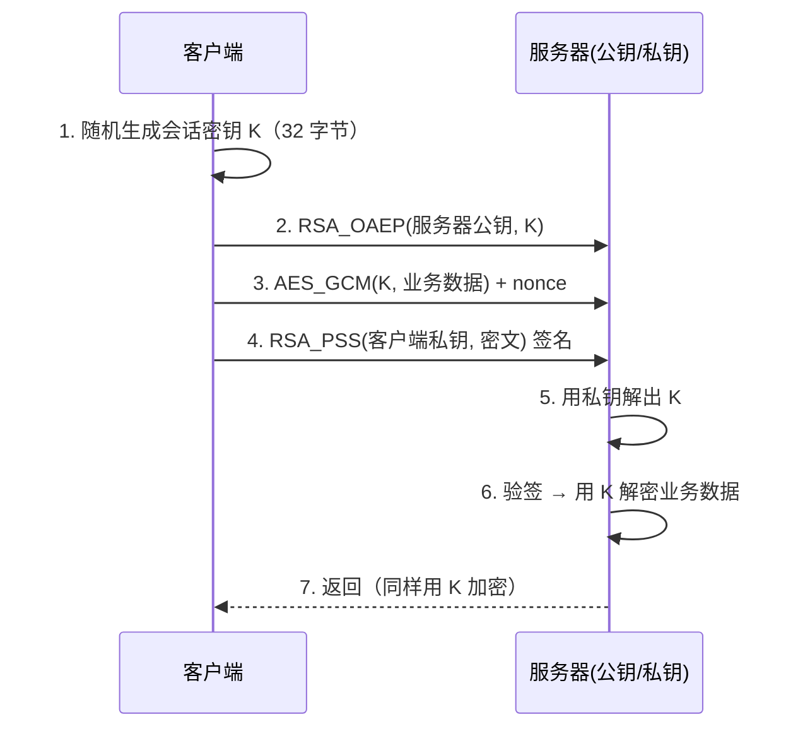

# Day 148 图解 — 对称与非对称加密

## 1. 一张图看懂两种加密

```
┌──────────────────── 对称加密（AES） ────────────────────┐
│                                                          │
│   明文 ──┐                                              │
│          ├──► [ AES 加密 ] ──► 密文 ──► [ AES 解密 ] ──► 明文 │
│   密钥 ──┘         ▲                         ▲         │
│                    └────── 同一把密钥 ────────┘         │
│                                                          │
│   优点: 快（GB/s 级）  缺点: 双方都得有同一把密钥        │
│         ⇒ 密钥怎么安全送到对方手里？(密钥分发难题)       │
└──────────────────────────────────────────────────────────┘

┌──────────────────── 非对称加密（RSA） ──────────────────┐
│                                                          │
│   接收方公钥 ──► [ 公钥加密 ] ──► 密文 ──► [ 私钥解密 ] ──► 明文 │
│                  (谁都能做)              (只有持有者能做) │
│                                                          │
│   优点: 公钥可公开，解决密钥分发  缺点: 慢、有长度上限   │
│   数学基础: 大整数分解难题 (已知 n 难求 p、q)            │
└──────────────────────────────────────────────────────────┘
```

## 2. 混合加密 = RSA 送钥匙 + AES 搬货物（TLS 简化流程）



要点：RSA 只搬运 32 字节的密钥，真正的数据（可能是 GB）永远走 AES。

## 3. 分组模式：ECB vs CBC vs GCM

```
明文（16 字节分组）: [P1][P2][P3][P4]

ECB（电子密码本）—— ❌ 相同明文块 → 相同密文块，泄露结构！
      [P1]→[C1]  [P2]→[C2]  [P3]→[C1]  [P4]→[C2]
      ECB 加密一张图片后仍能看出轮廓（经典"ECB 企鹅"图）

CBC（密码块链接）—— 需要一个随机 IV，且 IV 不可预测
      前一块密文参与下一块：Ci = E(Pi XOR C(i-1))
      IV: [C1]=E(P1 XOR IV)  [C2]=E(P2 XOR C1)  ...

CTR/GCM（流式 + 认证）—— ✅ 现代推荐
      GCM = CTR 加密 + GHASH 认证标签(AEAD)
      同时保证机密性 + 完整性，nonce 绝不重用
```

## 4. AEAD 密文结构（AES-GCM 实际传出的是什么）

```
 nonce(12B) + ciphertext(与明文等长) + tag(16B)
 ┌────────┬──────────────────────┬──────────────┐
 │ 3f0a…  │  8b2c…（加密后数据） │  认证标签     │
 └────────┴──────────────────────┴──────────────┘
      ▲              ▲                  ▲
   可公开传输    AAD 不参与加密           篡改任何一个字节
               （但参与认证）            都会导致 tag 校验失败
```

## 5. RSA 数学直觉（不做公式推导）

```
密钥生成:
  选两个大素数 p, q        （2048 bit ⇒ p、q 各约 1024 bit）
  n = p * q               （公开）
  φ(n) = (p-1)(q-1)
  选 e（通常 65537）、算 d 使 e*d ≡ 1 (mod φ(n))
  公钥 = (n, e)   私钥 = (n, d)

加密: c = m^e mod n
解密: m = c^d mod n

安全前提: 已知 n 想反推 p、q = 大整数分解难题
  2048-bit 的 n 用目前的计算机分解需要天文数字的时间
```

⚠️ 但"教科书 RSA"（直接 m^e mod n）不安全：明文 m 很小时可开方还原、
相同明文密文相同。所以工程上必须用 OAEP（加密）/ PSS（签名）填充。

## 6. 算法选型决策树

```
需要加密数据？
├─ 数据量 > 几百字节? ──► 是 ──► 混合加密（RSA/ECC 传密钥 + AES 传数据）
├─ 需要证明"是谁发的"/防抵赖? ──► 数字签名（RSA-PSS / ECDSA / Ed25519）
├─ 只需要校验完整性（不需保密）? ──► HMAC / SHA-256
└─ 存密码? ──► 慢哈希加盐（bcrypt/scrypt/Argon2，见 Day 147）
```
