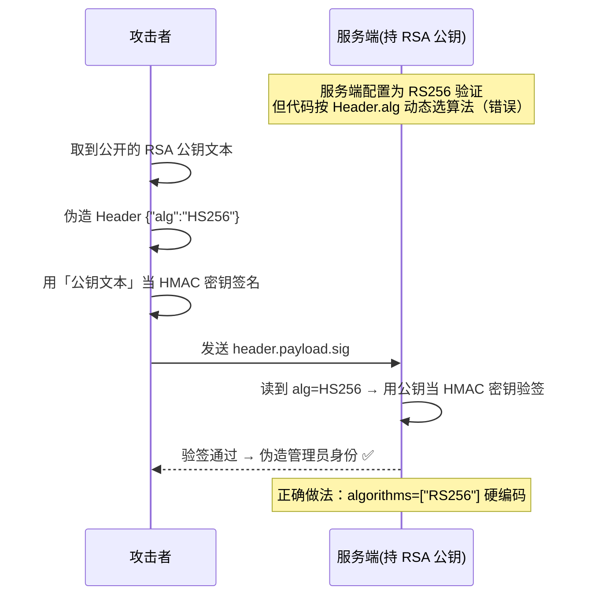

# Day 149 图解 — JWT 结构与安全验证流程

## 图 1：JWT 三段结构与编解码过程

```
┌──────────────────────────────────────────────────────────────────────┐
│                          JWT = aaa.bbb.ccc                            │
└──────────────────────────────────────────────────────────────────────┘

   签发（encode）                         验证（decode）
 ┌───────────────┐                     ┌───────────────┐
 │ Header  JSON  │                     │ 拆成 3 段      │
 │ {"alg","typ"} │                     └───────┬───────┘
 └───────┬───────┘                             │
         │ base64url                           ▼
         ▼                            ┌──────────────────┐
   ┌───────────┐                      │ 解析 Header 取 alg│
   │  header   │──┐                   └────────┬─────────┘
   └───────────┘  │                            │
 ┌───────────────┐│                            ▼
 │ Payload  JSON ││                   ┌──────────────────┐
 │ {"sub","exp"} ││                   │ alg 在白名单内?   │ 否 → 拒绝 ❌
 └───────┬───────┘│                   └────────┬─────────┘
         │ base64url                  是 │
         ▼         │                      ▼
   ┌───────────┐   │             ┌──────────────────┐
   │  payload  │───┼────────────►│ 用密钥重算签名     │
   └───────────┘   │             └────────┬─────────┘
                   │                      │
                   ▼                      ▼
      ┌─────────────────────────┐  ┌──────────────┐
      │ HMAC/RSA/ECDSA(秘密)     │  │ 签名一致?     │ 否 → 拒绝 ❌
      │ sign(header.payload)    │  └──────┬───────┘
      └───────────┬─────────────┘         │ 是
                  ▼                       ▼
            ┌───────────┐        ┌──────────────────┐
            │ signature │        │ 校验 exp/nbf/iss/aud│ 否 → 拒绝 ❌
            └───────────┘        └────────┬─────────┘
                                          │ 全部通过
                                          ▼
                                     信任 payload ✅
```

## 图 2：HMAC vs RSA 信任模型

```
── HMAC（HS256）：对称，一把密钥两个人用 ──────────────────

   Auth Server ────[同一把 secret]──── API Server
        │                                  │
     签发用 secret                     验证也用 secret
        └────────► 谁有密钥谁就能伪造 ◄────────┘
        （密钥泄露 = 全线沦陷）

── RSA / ECDSA（RS256/ES256）：非对称，单向能力 ────────────

   Auth Server                                API Server
   ┌──────────┐                              ┌──────────┐
   │ 私钥(保密)│                              │ 公钥(公开)│
   └────┬─────┘                              └────┬─────┘
        │ 只能签发                          只能验证 │
        └──────────► token ────────────────────────►│
                                                验签通过 ✅
   公钥泄露无害；只有私钥泄露才能伪造
```

## 图 3：`alg` 混淆攻击（HS/RS Confusion）

Mermaid 时序图：



## 图 4：攻击决策树（拿到一个 JWT 之后）

```
拿到 JWT
   │
   ├─ base64url 解 Header，看 alg
   │     ├─ alg=none ............→ 删签名段直接试（CVE 经典）
   │     ├─ alg=HS256 ...........→ 试弱密钥爆破 (hashcat -m 16500 / jwt_tool)
   │     ├─ alg=RS256/ES256 .....→ 试 alg 混淆、jku/x5u 注入
   │     └─ 未知 alg ............→ 查库版本 CVE
   │
   ├─ 看 kid ..................→ 路径穿越 / SQLi / 命令注入
   ├─ 看 jku / x5u ............→ 密钥注入
   ├─ 解 Payload
   │     ├─ 有无 exp？超长有效期？→ 重放窗口
   │     ├─ 有无 aud？...........→ 跨服务 token 混用
   │     └─ 有无敏感字段？.......→ 信息泄露
   └─ 改 Payload 重放 .........→ 越权 / 角色提升
```

## 图 5：正确验证的检查流水线

```
token ──►[① 格式 3 段?]──►[② alg 白名单?]──►[③ 重算签名]──►[④ exp/nbf]──►[⑤ iss]──►[⑥ aud]──► 放行
            │否                │否               │否            │否          │否        │否
            ▼                  ▼                ▼             ▼           ▼         ▼
          401                401              401           401         401       401
     （任何一步失败都必须拒绝，且不泄露"哪一步失败"）
```
