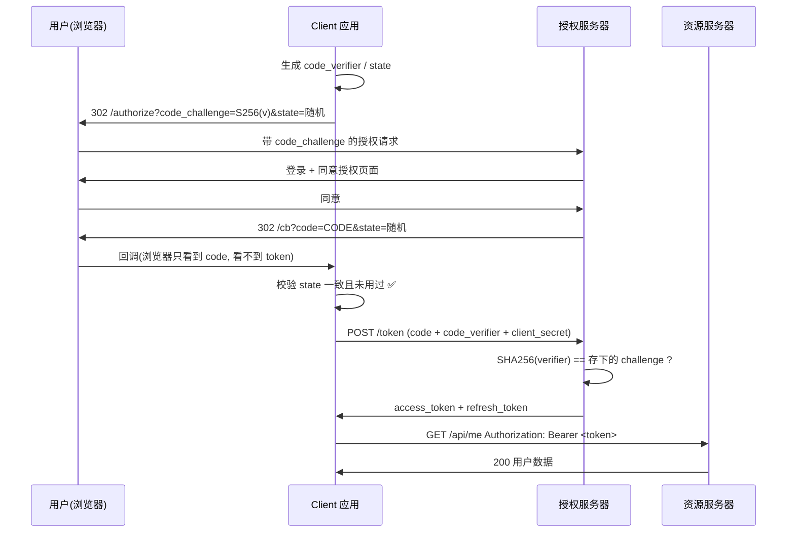

# Day 150 — OAuth2 与认证安全：授权流程、CSRF/SSRF 与安全审计

> 阶段：Phase 7 — 进阶与性能优化 · 主题：实战认证安全
>
> 前置知识：Day 146 HTTPS/TLS、Day 147 哈希与 HMAC、Day 148 对称/非对称加密、
> Day 149 JWT。今天把前面几天的密码学与令牌知识，接到 Web 世界里最普遍、也最
> 容易被做错的一套协议上：**OAuth 2.0**。同时补齐两个"不见血但很致命"的漏洞
> 类型：**CSRF**（跨站请求伪造）与 **SSRF**（服务端请求伪造），最后写一个
> **认证系统安全审计脚本**把今天所有检查点自动化。

> **本次升级**：三个脚本都新增了 `--self-test` 离线自检（不联网、不依赖第三方库、
> 不依赖 sleep 与计时，重复运行结果一致）；审计脚本新增 `--save` 把报告写进
> `tempfile` 临时目录（不污染仓库工作树）；SSRF 检测修掉了一个真实存在的
> **IPv4-mapped IPv6 漏判** bug（`http://[::ffff:127.0.0.1]/` 以前会被判成公网地址）。
> 每个脚本的"逐节说明 + 运行命令 + 预期输出"见 **第七节**。

---

## 一、概念解释

### 1.1 先分清：认证（Authentication）与授权（Authorization）

这两个词中文只差一个字，含义完全不同，混用会导致整个账号体系设计跑偏。

| 概念 | 英文 | 回答的问题 | 典型技术 |
|---|---|---|---|
| 认证 | Authentication | **你是谁？** | 密码、短信码、TOTP、WebAuthn、JWT |
| 授权 | Authorization | **你能做什么？** | OAuth2、RBAC、ABAC、scope、权限表 |

> 记忆法：**认证在前，授权在后**。你必须先证明"你是张三"，系统才能判断
> "张三能不能删这条订单"。

**为什么必须分开？** 因为现实里有两种完全不同的需求：

1. **我要登录你的系统** → 认证问题 → 用密码/验证码 → 得到"我是谁"。
2. **我要让第三方应用读取我在你系统里的数据，但我**不想把密码给它** →
   授权问题 → 用 OAuth2 → 得到"第三方能做什么"的受限凭证。

OAuth2 **只解决第 2 类问题**。它本身**不是登录协议**——用 OAuth2 做登录，
必须在它之上再套一层（OpenID Connect，简称 OIDC）才能安全地拿到"用户是谁"。
很多系统出安全事故，根源就是**把 OAuth2 当登录协议用了**。

---

### 1.2 OAuth2 是什么，不是什么

**定义**：OAuth 2.0（RFC 6749）是一个**授权框架（authorization framework）**，
它让资源所有者（用户）可以授权第三方应用（Client）**有限地、可撤销地**
访问自己在某服务上的受保护资源，而**无需把自己的密码交给第三方**。

它解决问题的方式可以一句话概括：

> **把"密码"换成"有范围、有期限、可撤销的令牌（Access Token）"。**

**它不是什么：**

- ❌ 不是认证协议（不告诉你"用户是谁"，只告诉你"这个令牌被授权做什么"）。
- ❌ 不是加密协议（它规定怎么"要令牌"，不规定令牌内容必须加密）。
- ❌ 不是身份提供商的实现（Google/微信/钉钉 是**实现了 OAuth2 的服务**）。

**为什么需要它？** 想象 2010 年以前的做法：你在某个"导入通讯录"网站里
输入 Gmail 的**账号密码**，它拿你的密码去登录 Gmail 抓联系人。后果是：

- 网站能拿到你的**明文密码**，等于把家门钥匙给了别人；
- 网站权限**无限大**，能读邮件、能发邮件、能改密码；
- 你**无法撤销**，除非改密码（改了所有设备都掉线）。

OAuth2 把这三件事全解决了：**不传密码、限定 scope、令牌可撤销且有期限**。

---

### 1.3 四个角色（必须背下来）

| 角色 | 英文 | 通俗解释 | 例子 |
|---|---|---|---|
| 资源所有者 | Resource Owner | 数据的主人 | 你 |
| 客户端 | Client | 想访问数据的应用 | "某记账 App" |
| 授权服务器 | Authorization Server | 发令牌的地方 | Google 账号中心 |
| 资源服务器 | Resource Server | 存数据、验令牌的地方 | Gmail API |

⚠️ **授权服务器和资源服务器可以是同一台，也可以是两台**（微服务里经常拆开）。
很多漏洞就出在"授权服务器验的令牌，资源服务器验得不一样"。

---

### 1.4 四个授权模式（Grant Types）

| 模式 | 适用场景 | 安全性 | 现代建议 |
|---|---|---|---|
| **授权码（Authorization Code）** | 有后端的 Web / App | ⭐⭐⭐⭐⭐ | ✅ 首选 |
| **授权码 + PKCE** | 纯前端 SPA、移动 App | ⭐⭐⭐⭐⭐ | ✅ 移动/SPA 必须 |
| 隐式（Implicit） | 老式 SPA | ⭐⭐ | ❌ 已废弃，用 `code+PKCE` |
| 密码（Password / ROPC） | 自家 App 登录自家服务 | ⭐ | ❌ 已废弃 |
| 客户端凭证（Client Credentials） | 服务端对服务端，**无用户** | ⭐⭐⭐⭐ | ✅ 机器间调用 |

**为什么隐式模式被废弃？** 因为它把 access_token 直接放在**URL 的 fragment**
（`#access_token=...`）里返回。URL 会被写进浏览器历史、被 Referer 头带出去、
被日志系统记录、被前端 JS 读到——令牌泄漏面极大，而且**没法用 refresh token**
（因为刷新需要客户端认证，前端没有"秘密"可认证）。RFC 9700（OAuth 2.0
Security Best Current Practice）已明确建议弃用。

**为什么需要 PKCE？** 授权码流程有个天生弱点：在移动 App / SPA 里，客户端
**没有能力安全保存 client_secret**（反编译 App 就能拿到）。于是攻击者可以
冒充这个 client 去换 token。PKCE 的思路是：**每次请求都生成一对临时的
"验证码 + 摘要"**，用一次就作废，从而不需要长期密钥。

---

### 1.5 CSRF（跨站请求伪造）是什么

**定义**：攻击者诱导**已登录用户的浏览器**，向目标网站发送一个**用户并不知情
的、带有用户身份凭证的请求**。

**关键前提（三个条件同时成立才会中招）：**

1. 浏览器会自动携带身份凭证（主要是 **Cookie**）；
2. 服务器**只靠 Cookie 判断"是谁"**，不校验请求来源；
3. 攻击者能构造出有效的、有副作用的请求（转账、改密码、发帖……）。

**为什么危险？** 因为服务器看到的确实是"合法用户的合法 Cookie"，从服务端
视角**完全无法区分**这是用户自己点的，还是恶意网页自动发的。它不是"偷密码"，
而是"**借你的手**"——所以中文也译作"跨站请求伪造"。

**一句话原理**：Cookie 的 `SameSite` 默认行为和"跨站请求会带 Cookie"这个
浏览器设计，是 CSRF 存在的土壤。

---

### 1.6 SSRF（服务端请求伪造）是什么

**定义**：攻击者**控制了服务端发起的网络请求的目标地址**，让服务器去请求
攻击者指定的 URL —— 从而以服务器的身份、从**内网视角**发起请求。

**为什么它比 CSRF 更凶险？**

- 服务器通常**在内网**，能访问外网访问不到的东西：数据库、Redis、
  内部管理后台、K8s API、云厂商**元数据服务**（`169.254.169.254`）。
- 很多云环境的元数据服务能直接换取**临时云凭证**（IAM Role），拿到就等于
  **接管整台云主机/整个云账号**（2019 年 Capital One 泄露 1 亿用户数据就是 SSRF）。
- 它常常只是"**跳板**"：先用 SSRF 打通内网，再配合其他漏洞扩大战果。

**典型入口**：图片抓取、网页截图、URL 预览、Webhook 回调、PDF 导出、
"从链接导入数据"等**用户可控 URL** 的功能。

### 1.7 令牌的两种形态：不透明串 vs JWT（选型必须想清楚）

| | 不透明令牌（opaque） | JWT（自包含） |
|---|---|---|
| 内容 | 一串随机字符，本身无含义 | 头部+负载+签名，允许服务端直接解码 |
| 校验方式 | 去授权服务器/会话存储查表（introspection） | 本地验签即可（无需回源） |
| 撤销 | **好用**：删掉记录就失效 | **麻烦**：签出去就无法收回，只能靠短 TTL + 黑名单 |
| 适合 | 会话、单体应用、要求强撤销的场景 | 微服务间无状态校验、一次性短期凭证 |

> 📌 一个常见误解："用了 JWT 就更安全"。**恰恰相反**：JWT 把"能不能用"判断
> 完全交给了签名和过期时间，服务端失去了"随时抽走它"的能力。
> 所以业界常见组合是：**不透明的 refresh_token + 短 TTL 的 access_token**，
> 把"可撤销"留在 refresh 这一层（本日示例 01 的 `revoke()` 就是这个思路）。

### 1.8 OIDC 与 `nonce`：为什么 OAuth2 做不了登录

OAuth2 只回答"这个令牌能访问什么"，**不回答"用户是谁"**。
OpenID Connect（OIDC）在它之上加了一层：

- 多一个 `openid` scope，换令牌时额外返回 **`id_token`**（一个 JWT）；
- `id_token` 里的 `sub` / `iss` / `aud` / `nonce` 才是"用户身份"的载体；
- **`nonce`**：客户端生成、随授权请求下发、在 `id_token` 原样返回 ——
  用于防"**ID Token 重放**"（令牌偷走了就能重放登录）。

> ⚠️ 与 `state` 的区别：`state` 保护的是"换令牌这一步的绑定"，
> `nonce` 保护的是"最终令牌/身份的绑定"。两者都必需，不能互相替代。

---

## 二、原理解释（底层机制）

### 2.1 授权码流程（Authorization Code Flow）逐步拆解

```
① 用户点"用 Google 登录"
   Client → 浏览器重定向 → Authorization Server
   GET /authorize?response_type=code
                &client_id=CLIENT_ID
                &redirect_uri=https://app.com/cb
                &scope=email+profile
                &state=RANDOM_CSRF_TOKEN
                &code_challenge=xxx&code_challenge_method=S256   ← PKCE

② 用户在授权服务器上"同意授权"（这一步能看到"应用要读你的邮箱"）

③ 授权服务器重定向回 Client
   302 https://app.com/cb?code=AUTH_CODE&state=RANDOM_CSRF_TOKEN

④ Client 后端用 code 换 token（这一步走服务器到服务器，浏览器看不到）
   POST /token
     grant_type=authorization_code
     &code=AUTH_CODE
     &redirect_uri=https://app.com/cb
     &client_id=...&client_secret=...
     &code_verifier=原始随机串    ← PKCE

⑤ 授权服务器返回
   {"access_token":"...", "refresh_token":"...", "expires_in":3600, "token_type":"Bearer"}

⑥ Client 用 access_token 访问资源
   GET /userinfo  Authorization: Bearer <access_token>
```

**为什么要把"发码"和"换令牌"分成两步？**

- 授权码是**通过浏览器前端**（URL 重定向）传回来的，可以被 URL 日志、历史记录、
  Referer 泄漏 —— 所以它**天生不安全**。
- 因此设计上给授权码加了两个保险：**① 一次性、极短有效期（通常 30~60 秒）；
  ② 换令牌时必须由客户端**后端**带着 `client_secret` 发起**。
- 攻击者就算截到授权码，只要换不了令牌（拿不到 secret），也拿不到 access_token。

这就是**授权码流程最核心的设计思想**：让"敏感的令牌"永远不经过浏览器，
浏览器只传一个"很快就作废的临时凭证"。

### 2.2 PKCE 原理（Proof Key for Code Exchange, RFC 7636）

PKCE 解决的是"**公开客户端（Public Client）没有 client_secret**"的问题。

```
Client 侧（一次性随机）:
  code_verifier  = 随机 43~128 字符的高熵字符串
  code_challenge = BASE64URL( SHA256(code_verifier) )      # method = S256

① 授权请求带上 code_challenge
② 换令牌请求带上 code_verifier
③ 授权服务器计算 SHA256(verifier)，与最初存的 challenge 比对
```

**为什么这样能防攻击？** 攻击者即使**截获了授权码**，也不知道 `code_verifier`
（它只存在于生成它的那个客户端内存里，从不经过浏览器 URL）。没有 verifier，
换不到令牌。

⚠️ **避坑**：`code_challenge_method` 必须是 `S256`，**绝不能用 `plain`**
（plain 等于明文传 verifier，PKCE 白做）。另外 verifier 必须用
**密码学安全的随机源**（Python 里是 `secrets`，不是 `random`）。

### 2.3 `state` 参数：OAuth2 里的 CSRF 防护

`state` 是一段**客户端自己生成的随机串**，在授权请求里带上，授权服务器
**原样回传**。客户端在回调里比对：对不上就拒绝。

**它防的正是 CSRF**。攻击流程如下（无 state 时）：

```
攻击者用自己的账号在 Google 走完授权，拿到一个回调 URL:
  https://victim-app.com/cb?code=ATTACKER_CODE
然后把这个 URL 发给受害者，诱导其点击（图片/链接/短链）。
受害者浏览器带着自己的会话 Cookie 访问该 URL；
应用用 ATTACKER_CODE 换了令牌，把攻击者的第三方账号
绑定到了受害者的账号上 → 攻击者以后可以用自己的第三方账号登录受害者账号。
```

加了 `state` 后：回调里的 state 和受害者浏览器会话里存的 state 不一致 → 拒绝。

**记住三件绑定关系：** `state` 必须

1. **随机且高熵**（`secrets.token_urlsafe(32)`）；
2. **存在用户会话里**（服务端 session，或加密 Cookie）；
3. **用后即焚**（一次性，回调后立刻删除，防重放）。

### 2.4 CSRF 攻击原理与四层防护

**攻击本体（一个恶意 HTML 页面就够了）：**

```html
<!-- evil.com 上的页面 -->
<form action="https://bank.com/transfer" method="POST" id="f">
  <input name="to"   value="attacker">
  <input name="amount" value="10000">
</form>
<script>document.getElementById('f').submit()</script>
```

用户只要在登录 bank.com 的状态下访问 evil.com，浏览器就会**自动带上
bank.com 的 Cookie** 去 POST —— 服务器以为是用户本人操作。

> ⚠️ 注意：**CORS 不能防 CSRF**。CORS 限制的是"JS 能不能读取响应"，
> 不是"请求能不能发出去"。简单请求（表单、img、script）根本不受 CORS 预检约束。

**四层防护，建议全上（纵深防御）：**

| 防护 | 机制 | 强度 | 备注 |
|---|---|---|---|
| `SameSite=Lax/Strict` Cookie | 浏览器跨站请求时不带该 Cookie | ⭐⭐⭐⭐ | 现代首选，默认 `Lax` |
| Synchronizer Token（CSRF Token） | 服务端生成随机 token 存 session，表单/头里必须带上并比对 | ⭐⭐⭐⭐⭐ | 传统可靠方案 |
| Double Submit Cookie | token 同时放 Cookie 和请求体，服务端比对两者 | ⭐⭐⭐ | 适合无状态服务，需签名 |
| `Origin` / `Referer` 校验 | 检查请求来源域名白名单 | ⭐⭐⭐ | 作为补充，不要单独依赖 |

⚠️ **避坑**：`SameSite=None` 必须配合 `Secure`；只对**状态改变**的请求
（POST/PUT/DELETE）做校验，GET 必须**无副作用**（否则 CSRF 防护失效）；
JSON API 若靠 `Content-Type: application/json` 做隐式防护是**不可靠的**
（攻击者可用 `text/plain` 绕过表单限制的场景要具体分析）。

### 2.5 SSRF 原理、检测与防护

**原理**：任何"服务端会去请求一个 URL"的功能，如果 URL 部分或全部
**用户可控**，就可能是 SSRF。

**常见绕过手法（做检测时必须考虑）：**

| 绕过手法 | 例子 |
|---|---|
| 十进制/八进制/十六进制 IP | `http://2130706433/` = `127.0.0.1`；`http://0x7f000001/` |
| IPv6 映射 | `http://[::ffff:127.0.0.1]/`、`http://[::1]/` |
| 短域名/重定向 | `http://attacker.com` → 302 到 `http://169.254.169.254/` |
| DNS Rebinding | 第一次解析到公网 IP（通过校验），第二次解析到内网 IP（发起请求） |
| 用户名 @ 混淆 | `http://expected.com@evil.com/` |
| 域名后缀混淆 | `http://evil.com#expected.com`、`http://expected.com.evil.com` |
| URL 解析差异 | `http://expected.com%2f@evil.com`、多余 `\` 或 `@` |

**高危目标（防护黑名单必须包含）：**

- `127.0.0.0/8`、`::1`（本机）
- `10.0.0.0/8`、`172.16.0.0/12`、`192.168.0.0/16`（内网）
- `169.254.0.0/16` 特别是 `169.254.169.254`（云元数据）
- `0.0.0.0/8`、`100.64.0.0/10`（CGNAT）、`224.0.0.0/4`（组播）
- 云厂商专用：`metadata.google.internal`、`100.100.100.200`（阿里云）

**正确防护顺序（白名单 > 黑名单）：**

1. **业务上优先白名单**：只允许固定域名/路径，用映射表（`id → URL`）而非直接收 URL；
2. **协议白名单**：只允许 `http/https`，禁止 `file://`、`gopher://`、`dict://`、
   `ftp://`（老漏洞里这些协议能打内网服务）；
3. **解析 → 校验 → 再请求，且 IP 校验后不要再二次 DNS 解析**（防 Rebinding），
   最稳的是：**解析出 IP 后直接连该 IP，并带上 Host 头**；
4. **禁止跟随重定向**（或每次跳转都重新校验）；
5. **网络层隔离**：出网走代理，代理侧做白名单；云元数据服务用 IMDSv2（需要 token）。

---

## 三、攻击方式 · 手段 · 原理

> 这一节把"别人怎么打你"讲透。**所有手法都只用来理解防护**：
> 本书里的攻击链路只在本地回环 / 内存靶场 / 临时目录里复现，
> 不对任何外部真实目标发包（未授权测试属于违法行为）。

### 3.1 授权码拦截（Authorization Code Interception）

**前提**：授权码要经过浏览器（302 跳转）回到客户端，这条链路不可信
（浏览器历史、Referer、代理日志、恶意扩展、共享设备都能看到 URL）。

**真实利用链（没有 PKCE 的移动 App / SPA）**：

```
① 受害者手机上装了恶意 App，恶意 App 注册了同样的自定义 scheme（如 myapp://cb）
② 受害者点"用 XX 登录"，恶意 App 抢到回调 → 拿到 code
③ 因为公开客户端没有 client_secret，恶意 App 直接用这个 code 换 token
   → 攻击者拿到受害者身份的 access_token
```

**为什么会被拦下**：只要客户端是公开客户端且启用 `S256` PKCE，第 ③ 步就断了 ——
授权码必须配上只在**合法客户端内存里**存在过的 `code_verifier` 才能换令牌。

**排查要点**：回调 URL 里的 `code` 是否被写入日志/Referer？是否用了 `plain` PKCE？
同一条授权码第二次使用是否被拒绝（本日示例 01 第 6 步会实测）？

### 3.2 CSRF 型账号绑定（缺 `state` 的经典后果）

**攻击条件**：① 回调不校验 `state`；② 攻击者先用自己的账号走完授权拿到 code；
③ 诱导受害者点击带这个 code 的回调链接。

```
攻击者用自己的账号在 provider 完成授权，拿到：
    https://victim-app.com/cb?code=ATTACKER_CODE
把这串发给受害者 → 受害者的浏览器带着自己的会话 Cookie 访问它
→ 应用拿 ATTACKER_CODE 换了令牌 → 把**攻击者的第三方账号**绑到了**受害者账号**上
→ 攻击者以后用自己的第三方账号登录，就进了受害者的号
```

**关键理解**：这里受害者没有输密码、没有点同意，他的身份也没被偷；
被偷的是"**绑定操作本身**"。所以这类漏洞的资产不是 token，而是**账号关联关系**。

**为什么它防不住**：服务端没有"这张请求是不是从本浏览器本轮登录流程来的"这个信息。
`state` 就是把这个信息补上（一次性随机串 + 会话绑定）。

### 3.3 `redirect_uri` 校验缺陷 → 授权码外泄 + 开放重定向

授权服务器在校验 `redirect_uri` 时如果用前缀/后缀/正则/包含匹配，就给了攻击者
把 **code 送到自己服务器**的机会。真实出现过的绕过方式：

| 恶意 `redirect_uri` | 前缀匹配的后果 | 为什么能绕 |
|---|---|---|
| `https://app.example.com/callback.evil.com` | 放行 💀 | 字符串以合法前缀开头 |
| `https://app.example.com/callback/../../steal` | 放行 💀 | 路径穿越，很多服务器会归一化 |
| `https://app.example.com/callback@evil.com` | 放行 💀 | userinfo 语法，host 其实是 evil.com |
| `https://app.example.com/callback?x=1#@evil.com` | 放行 💀 | 用 query/fragment 干扰解析 |
| `https://app.example.com.evil.com/callback` | 被拦（前缀不匹配） | 域名主体是 evil.com，但前缀不是合法值 |

> ⚠️ 第二层危害：即使 code 换不到令牌，**错误响应本身也会被重定向到攻击者页面**
> （`?error=...&state=...`），这叫 **open redirect**，常被用来做钓鱼和 token 盗窃链。
> 所以顺序必须是：**先校验 `redirect_uri`，再决定重定向**。

### 3.4 PKCE 的三种"假防护"

| 假防护 | 为什么等于没做 |
|---|---|
| `code_challenge_method=plain` | challenge 就是 verifier 本身，任何能看到授权请求的人都能伪造换令牌 |
| 用 `random` 而非 `secrets` 生成 verifier | 种子可预测（`random` 是 Mersenne Twister，不是密码学安全） |
| verifier 复用/长期不变 | 失去了"每次授权一次性"的核心价值，泄漏一次全废 |

另外还有两个与 PKCE 相关的**协议级攻击**（了解名字即可，不必自己实现）：

- **PKCE Downgrade**：攻击者让授权请求不带 `challenge`，诱导服务器退回无 PKCE 流程。
  对策：**公开客户端强制 PKCE**（本日示例 01 的 `authorize()` 就实现了这条：
  `if client["public"]: ... 必须 S256`）。
- **Mix-up Attack**：客户端同时对接多个授权服务器时，攻击者用一个 AS 的 code
  去另一个 AS 换令牌。对策：把 `iss` 与授权服务器绑定、换令牌时必须校验 `iss`。

### 3.5 令牌的泄漏面：为什么"放哪儿"比"多长"更重要

| 存放位置 | 谁能读 | XSS 能否拿走 | 备注 |
|---|---|---|---|
| `localStorage` / `sessionStorage` | 页面内任意 JS | ✅ 能，一行 `fetch` 就外传 | 演示见示例 02 坑 3 |
| 非 HttpOnly Cookie | 任意 JS | ✅ 能 | 最差组合 |
| HttpOnly + Secure + SameSite Cookie | 仅浏览器发送 | ❌ 读不到（但能发请求） | 首选 |
| 服务端 session + 不透明 Cookie | 服务端 | ❌ 拿不到真实令牌 | 最强，可随时吊销 |
| URL fragment（隐式模式） | 浏览器历史/日志/Referer/JS | ✅ 能 | 已废弃的根本原因 |
| 日志/错误上报 | 运维、日志平台、第三方 APM | 间接 | 最常见又最容易被忽略 |

> ✨ **为什么 Cookie 比 localStorage 强**？因为 `HttpOnly` 是**浏览器内核级**的
> 访问控制：JS 根本拿不到这个值。而服务端 session 更进一步 —— 就算 Cookie 被
> 拿到，拿到的也只是一串不透明的会话 ID，**服务端可以随时作废它**，
> 而 JWT 一旦签发，在过期前只能靠黑名单/短 TTL 来限制。

### 3.6 CSRF：攻击原理与"为什么 CORS 不管"

**一个恶意 HTML 页面就够了**：

```html
<!-- evil.com 上的页面，受害者无需点击任何按钮 -->
<form action="https://bank.com/transfer" method="POST" id="f">
  <input name="to" value="attacker"><input name="amount" value="10000">
</form>
<script>document.getElementById('f').submit()</script>
```

**攻击成立的三要素**：① 浏览器自动带凭据（Cookie）；② 服务端只靠 Cookie 认人；
③ 攻击者能构造出有副作用的请求。

**SameSite 语义矩阵（必须逐格记住）**：

| 场景 | `Strict` | `Lax` | `None` |
|---|---|---|---|
| 跨站 POST（恶意表单） | 不带 Cookie | **不带 Cookie** | 带上 Cookie 💀 |
| 跨站 GET 顶层导航（点链接跳过去） | 不带 Cookie | **带上 Cookie** ⚠️ | 带上 Cookie |
| 跨站 `` / `<script>` 子资源 | 不带 Cookie | 不带 Cookie | 带上 Cookie |

> ⚠️ `Lax` 那一格（跨站 GET 会带 Cookie）就是为什么**"有副作用的 GET"必须根除**：
> `GET /transfer?to=attacker&amount=10000` 在 `Lax` 下依然能被一条链接打穿。

**为什么 CORS 不能防 CSRF**：CORS 限制的是"**JS 能不能读到响应**"，
不是"请求能不能发出去"。表单/``/`<script>` 这类**简单请求**根本不做预检，
请求照样到达服务端并且带上 Cookie —— 副作用已经发生了。

### 3.7 SSRF：从"用户可控 URL"到"接管云账号"

**原理**：服务端**按攻击者指定的地址**发请求，于是攻击者借服务器的网络位置
（通常在内网）去打自己够不着的东西。

**绕过的本质是"解析器差异"** —— 校验用的解析器和真正发起连接用的解析器
如果对同一个字符串的理解不一致，校验就白做：

| 绕过手法 | 例子 | 真实解析结果 |
|---|---|---|
| 十进制 IP | `http://2130706433/` | 127.0.0.1（libc 的 inet_aton 支持） |
| 十六进制/八进制 | `http://0x7f000001/`、`http://017700000001/` | 127.0.0.1 |
| IPv4-mapped IPv6 | `http://[::ffff:127.0.0.1]/` | 127.0.0.1（**本日修掉的漏判**） |
| IPv6 回环/链路本地 | `http://[::1]/`、`http://[fe80::1]/` | 本机 / 同链路 |
| userinfo 混淆 | `http://expected.com@evil.com/` | host 是 evil.com |
| 域名后缀 | `http://expected.com.evil.com/` | host 是 evil.com 的子域 |
| URL 编码 | `http://expected.com%2f@evil.com/` | 依解析器而异 |
| 空字节 | `http://cdn.example.com/%00.png` | 依解析器而异 |

**DNS Rebinding 的攻击时序**（"校验时是公网、连接时是内网"）：

```
① 攻击者控制 evil.com，TTL 设为 0
② 第一次解析（服务端做校验时）→ 返回 1.2.3.4（公网）  ✅ 通过校验
③ 攻击者立刻把 DNS 改成 169.254.169.254
④ 服务端真正发起请求时再解析一次 → 拿到 169.254.169.254 💀
```

> 对策不是"再校验一次"，而是**校验与连接用同一个已解析 IP**：
> 自己解析 → 校验 IP → 用这个 IP 建立连接 + 手动设置 `Host` 头。
> 这样第 ④ 步不再有第二次解析，Rebinding 就没了着力点。

**高危目标清单**（防护黑名单必须覆盖）：`127.0.0.0/8`、`::1`、`10.0.0.0/8`、
`172.16.0.0/12`、`192.168.0.0/16`、`169.254.0.0/16`（含 `169.254.169.254` 云元数据）、
`0.0.0.0/8`、`100.64.0.0/10`（CGNAT）、`224.0.0.0/4`（组播）、`fc00::/7`、`fe80::/10`，
以及 `metadata.google.internal`、`100.100.100.200`（阿里云）等云厂商专用地址。

**为什么云元数据是终极目标**：`169.254.169.254` 能给主机返回**临时 IAM 凭证**。
拿到凭证就可以直接调云 API 读取对象存储 —— 2019 年 Capital One 1 亿用户数据泄漏
就是这个链条（SSRF → 元数据 → 凭证 → S3）。

### 3.8 检测信号：哪些日志/指标能看出"有人在打"

| 信号 | 对应攻击 | 阈值建议（示例） |
|---|---|---|
| 同一会话短时间内多次 `invalid_grant` | 授权码重放/爆破 | 5 次/分钟 → 告警 + 吊销该用户令牌 |
| 回调请求里 `state` 不匹配 | CSRF 型绑定 | 任意一次即告警 |
| 授权错误率 / 404 突增（回调地址被探测） | `redirect_uri` 探测 | 相对基线 3σ |
| 同一 IP 大量相似查询、P99 延迟异常 | 盲注 / 时间盲注 | 相似度聚类 + P99 突增 |
| 目标地址含内网 IP/元数据域名 | SSRF | 命中即告警（生产建议直接拒绝） |
| 数据库报错率上升 | 报错注入探测 | 任意异常峰值 |

---

## 四、防护与修复原理

> 这一节回答"**为什么这样写就安全**"。每一条都给出**原理**而不是"照做就行"。

### 4.1 授权码流程为什么安全：三道锁

| 锁 | 机制 | 拦住的攻击 |
|---|---|---|
| 一次性 + 短 TTL（30~60s） | 服务端记录 `used`，过期即废 | 授权码重放、日志长期留存后被利用 |
| 后端换令牌需 `client_secret` | 机密客户端才有的长期密钥 | 授权码被截获（攻击者换不了） |
| PKCE（公开客户端） | 一次性 verifier，与 challenge 做 SHA256 比对 | 公开客户端没有 secret 时的授权码拦截 |

> 设计思想一句话：**让敏感凭证永远不经过浏览器**，浏览器只传一个
> "很快就会作废、且单独拿到也没用"的临时凭证。

### 4.2 `state`：三个性质一个都不能少

```python
state = secrets.token_urlsafe(32)        # ① 高熵（≈256 bit），密码学随机源
session["oauth_state"] = state           # ② 绑定会话（存服务端 session / 加密 Cookie）
# 回调时：
if not secrets.compare_digest(q["state"], session.pop("oauth_state", "")):
    reject()                             # ③ 一次性：pop 掉，用后即焚
```

**为什么必须绑定会话**：如果 `state` 存在全局变量/缓存里、或所有用户共用一个，
攻击者就能先让服务器生成一个 state 并预先知道它，CSRF 防护立刻失效。
**为什么用 `compare_digest`**：常量时间比较，避免比较耗时泄漏前缀信息
（对随机串意义有限，但安全代码里比对任何凭证都该这么写）。

### 4.3 授权服务器侧必须做的三件事

1. **先校验 `redirect_uri` 再重定向**（否则错误响应就是 open redirect）；
2. **先校验 `redirect_uri` 再发 code**（否则 code 直接送到攻击者手里）；
3. **换令牌时再校验一次 `redirect_uri` 与授权时完全一致**（防"授权用一个、换令牌用另一个"）。

### 4.4 令牌设计：短命 + 轮转 + 可撤销 + 不透明优先

| 决策点 | 推荐 | 为什么 |
|---|---|---|
| access_token 形态 | 短 TTL 的不透明随机串（或 JWT） | 不透明串可随时撤销；JWT 便于跨服务校验但要处理撤销 |
| TTL | 5~60 分钟 | 泄漏窗口与用户体验的平衡点；24 小时等于"泄漏即长期沦陷" |
| refresh_token | **轮转**（用一次换一次） | 检测到重放即整条链吊销 —— 这本身就是一个入侵检测信号 |
| 撤销 | 提供 RFC 7009 端点 | 登出/改密/发现泄漏时能**立即**失效 |
| 存储 | 服务端 session / HttpOnly Cookie | 见 3.5 的泄漏面对照表 |

### 4.5 CSRF 四层纵深（为什么是四层而不是挑一个）

| 层 | 拦住什么 | 拦不住什么 |
|---|---|---|
| `SameSite=Strict/Lax` | 跨站请求自动免带 Cookie | 老浏览器、`None` 场景、跨站 GET（Lax） |
| CSRF Token（服务端比对） | 攻击者无法读取页面 ⇒ 造不出正确 token | 同源 XSS（XSS 能读到 token） |
| `Origin`/`Referer` 白名单 | 表单/JS 发起的跨站请求 | 部分老客户端不带 Origin；**绝不能做后缀匹配** |
| GET 无副作用 | 从设计上消灭"链接就能触发"的入口 | —— |

> 📌 **设计原则**：CSRF 防护必须在**服务端**成立。只在前端加 token、
> 或者只依赖 `Content-Type: application/json` 这类隐式假设，都是纸糊的。

### 4.6 SSRF 五层纵深：为什么"黑名单永远不够"

```
① 业务层：根本不给用户"任意 URL" —— 传 id，服务端查映射表
② 协议层：白名单 http/https（禁 file/gopher/dict/ftp/jar...）
③ 主机层：精确匹配白名单（禁止 startswith/endswith/正则）
④ IP 层：解析 → 校验回环/私网/链路本地/组播/元数据 → 用**同一个 IP** 连接
⑤ 网络层：出网代理 + ACL；云侧启用 IMDSv2（需要 token 头才能读元数据）
```

**为什么黑名单不够**：地址空间是无限的（十进制、十六进制、IPv6 各种写法、
重定向、DNS 回环），而你的规则集是有限的。**白名单 + 解析后直连**才是结构性的。

**顺序不能乱**：先协议 → 再主机 → 再解析 IP → 最后连接；
任何一步"跳过"（比如校验了域名却没校验解析后的 IP）都等于没做。

---

## 五、定义与使用方法（API 速查）

### 5.1 OAuth2 端点与参数速查

**授权端点 `GET /authorize`**

| 参数 | 必填 | 说明 |
|---|---|---|
| `response_type` | ✅ | `code`（推荐）；`token` 属于已废弃的隐式模式 |
| `client_id` | ✅ | 客户端标识 |
| `redirect_uri` | ✅ | 回调地址，**必须精确匹配**注册值 |
| `scope` | ❌ | 权限范围，空格分隔，如 `openid email profile` |
| `state` | ✅(实践) | 防 CSRF 的随机串，必须校验 |
| `code_challenge` | PKCE | `BASE64URL(SHA256(verifier))` |
| `code_challenge_method` | PKCE | `S256`（禁用 `plain`） |
| `nonce` | OIDC | 防 ID Token 重放（OIDC 专属） |

**令牌端点 `POST /token`**

| 参数 | grant=authorization_code | grant=refresh_token |
|---|---|---|
| `grant_type` | ✅ `authorization_code` | ✅ `refresh_token` |
| `code` | ✅ | — |
| `redirect_uri` | ✅（若授权时带了） | — |
| `client_id` / `client_secret` | 机密客户端必填 | 同左 |
| `code_verifier` | PKCE 必填 | — |
| `refresh_token` | — | ✅ |

**令牌响应**

```json
{
  "access_token": "eyJhbGciOi...",
  "token_type": "Bearer",
  "expires_in": 3600,
  "refresh_token": "8xLOxBtZp8",
  "scope": "read write",
  "id_token": "eyJ..."      // 仅 OIDC
}
```

**调用资源**

```http
GET /api/me HTTP/1.1
Authorization: Bearer <access_token>
```

### 5.2 安全基线检查表（今天的内容浓缩版）

| # | 检查项 | 合格标准 |
|---|---|---|
| 1 | 授权请求是否含 `state` | 有且高熵、服务端会话存储、一次性 |
| 2 | 公开客户端是否用 PKCE | `S256`，非 `plain` |
| 3 | `redirect_uri` 校验 | **精确字符串匹配**，禁止通配/前缀匹配 |
| 4 | 是否仍支持隐式/密码模式 | 应关闭 |
| 5 | 全链路是否 HTTPS | 授权、令牌、回调、资源全 HTTPS |
| 6 | Cookie 标志 | `HttpOnly` + `Secure` + `SameSite=Lax/Strict` |
| 7 | 令牌存储位置 | 后端 session 或 `HttpOnly` Cookie；**不要放 localStorage** |
| 8 | 令牌有效期 | access 短（5~60min），refresh 轮转（Rotation） |
| 9 | 撤销能力 | 支持 refresh 撤销 / 登出失效 |
| 10 | SSRF 入口 | 用户可控 URL 全部走白名单 + IP 校验 |
| 11 | 错误信息 | 不回显内部地址/堆栈 |
| 12 | 日志 | 不打印 token / code / secret |

---

## 六、图解

### 6.1 授权码 + PKCE 全流程（Mermaid）



### 6.2 CSRF 攻击与防护对照（ASCII）

```
                 【无防护】
 受害者浏览器 ── 已登录 bank.com (Cookie: session=abc)
        │
        │  访问 evil.com  →  页面自动提交表单
        ▼
 bank.com: 看到 Cookie(session=abc) ✅ ── 执行转账 💸
        （服务端无法区分"用户点的"和"evil.com发的"）

                 【有防护】
 evil.com 自动提交 ─→ bank.com
                       ├─ 校验 csrf_token ✗ 缺失/不匹配 → 403 拒绝
                       ├─ SameSite=Lax 跨站POST不带Cookie → 无会话 → 拒绝
                       └─ Origin: https://evil.com ✗ 不在白名单 → 拒绝
```

### 6.3 SSRF 攻击路径与纵深防御（ASCII）

```
 用户可控 URL
      │
      ▼
 ┌──────────────────────────────────────────────────────┐
 │ 第1层 协议白名单:  http/https only  ✗ file/gopher/dict │
 │ 第2层 域名白名单:  只允许 api.trusted.com 映射表        │
 │ 第3层 DNS解析→IP:  10.0.0.5 / 169.254.169.254 ✗        │
 │ 第4层 直连该IP(防 Rebinding) + 禁跟随重定向             │
 │ 第5层 出网代理 + 网络层ACL: 内网段不可达                │
 └──────────────────────────────────────────────────────┘
      │
      ▼
  公网目标 ✅        内网/元数据 ❌ (如果漏了任意一层 → 云凭证泄漏)
```

---

## 七、代码案例逐节说明 + 运行命令 + 预期输出

> 全部代码位于 `code/`，**仅依赖 Python 标准库**（无 requests / authlib，
> Python 3.10+），可直接 `python3 xx.py` 跑通。
>
> 每个脚本都有两种模式：
> * **演示模式**：`python3 code/xx.py` —— 把机制完整跑一遍给你看（含真实 sleep、真实 DNS）；
> * **自检模式**：`python3 code/xx.py --self-test` —— 离线断言，输出最后一行必须是 `SELF-TEST OK`，
>   失败时打印"实际值 vs 期望值"并以 1 退出（可直接接 CI）。

### 7.0 统一验证命令（一键跑完三个自检）

```bash
cd /root/code/Learn-Python
for f in days/day-150-oauth2-auth-security/code/*.py; do
  echo "=== $f"
  python3 -B "$f" --self-test > /tmp/st.log 2>&1
  code=$?
  tail -2 /tmp/st.log
  echo "exit=$code"
done
```

**预期输出（实测）**：

```text
=== days/day-150-oauth2-auth-security/code/01-oauth2-auth-code-flow.py
共 27 项断言全部通过
SELF-TEST OK
exit=0
=== days/day-150-oauth2-auth-security/code/02-oauth2-csrf-pitfalls.py
共 37 项断言全部通过
SELF-TEST OK
exit=0
=== days/day-150-oauth2-auth-security/code/03-auth-security-audit.py
共 47 项断言全部通过
SELF-TEST OK
exit=0
```

### 7.1 `01-oauth2-auth-code-flow.py` — 授权码 + PKCE 流程模拟

**逐节说明**

| 节 | 代码位置 | 演示什么 | 对应原理（为什么） |
|---|---|---|---|
| ① | `b64url()` / `s256()` | Base64URL 无填充 + SHA256 | PKCE 的 challenge 必须是 URL-safe 且与官方实现一致；自检用 **RFC 7636 附录 B 官方向量**交叉验证 |
| ② | `MiniAuthServer.__init__` | 注册机密/公开两类客户端 | 公开客户端没有 `client_secret`，必须靠 PKCE 补位 |
| ③ | `authorize()` | redirect_uri 精确匹配 / response_type / 公开客户端强制 PKCE(S256) | 把"三道关卡"摆在发码前，任一道不过就不发码 |
| ④ | `token()` | 授权码一次性、绑客户端、绑 redirect_uri、PKCE 校验、secret 校验 | 换令牌是**后端到后端**，浏览器永远看不到 token |
| ⑤ | `userinfo()` | Bearer 校验 + 过期 + 撤销 | 凭证必须"可控"：能过期、能刷新、能吊销 |
| ⑥ | `_token_from_refresh()` | refresh 轮转 | 旧 refresh 用后即废，重放就是入侵信号 |
| ⑦ | `OAuthClient.handle_callback()` | `state` 比对 + 用后即焚 | `state` 由**客户端**校验，PKCE 由**服务器**校验，两者不是一回事 |
| ⑧ | `run_flow()` | 完整走两遍（机密 / PKCE），含授权码重放、过期、刷新、撤销 | 把前面每个机制串成一条可观测的链路 |

**运行命令**

```bash
cd /root/code/Learn-Python
python3 -B days/day-150-oauth2-auth-security/code/01-oauth2-auth-code-flow.py
```

**预期输出（实测）**

```text
════════════════════════════════════════════════════════════════════
  流程演示：授权码（机密客户端）
════════════════════════════════════════════════════════════════════
1. 客户端生成授权 URL:
   https://auth.example.com/authorize?response_type=code&client_id=webapp&redirect_uri=https%3A%2F%2Fapp.example.com%2Fcallback...
2. 授权服务器回调（浏览器只看到 code）:
   https://app.example.com/callback?code=on1WmxTKuQblQ4cf...&state=un...
3. ✅ state 校验通过，拿到授权码: on1WmxTKuQblQ4cf...
4. ✅ 拿到令牌: access_token=2OZnLcmmmgvLT2T2... expires_in=3s
5. ✅ 调用受保护接口: {'sub': 'alice', 'email': 'alice@example.com', 'scope': 'profile email'}

6. 攻击者重放刚才那个授权码（应被拒绝）:
   → {'error': 'invalid_grant', 'detail': 'code already used'}

7. 等 4 秒让 access_token 过期……
   过期后调用接口: {'error': 'invalid_token', 'detail': 'expired'}
8. ✅ 用 refresh_token 换新令牌: access_token=...
   现在调用接口: {'sub': 'alice', 'email': 'alice@example.com', 'scope': ''}
9. 主动撤销令牌后调用接口: {'error': 'invalid_token'}

📋 服务端审计日志（真实系统里这就是安全事件溯源）:
   [21:42:36] authorize OK user=alice client=webapp
   [21:42:36] issue tokens for user=alice scope='profile email'
   [21:42:36] token REJECT: code replay detected!
```

> 🔍 **看输出要看三件事**：① 第 6 步的重放被拒（授权码一次性）；
> ② 第 7 步过期后拿到 `expired`（TTL 真的生效）；
> ③ 日志里出现了 `code replay detected!`，但**没有出现任何 token 原文**。
> 输出的 `code` / `access_token` 每次都不一样（随机生成），这是正常的；
> 需要"每次都一样"的确定性输出时，就用 `--self-test`。

**自检模式**

```bash
python3 -B days/day-150-oauth2-auth-security/code/01-oauth2-auth-code-flow.py --self-test
```

预期最后两行为 `共 27 项断言全部通过` 与 `SELF-TEST OK`，退出码 0。
自检里 **不 sleep**：把 `expires_at` 手动拨到过去来模拟过期，因此秒出且结果稳定。

### 7.2 `02-oauth2-csrf-pitfalls.py` — CSRF 攻击复现与四层防护

**逐节说明**

| 坑 | 关键代码 | 漏洞点（为什么会中招） | 修复原理 |
|---|---|---|---|
| 1 | `AppWithoutState` / `AppWithState` | 回调不校验 `state` ⇒ 攻击者用自己的 code 完成绑定 | 高熵 state + 会话绑定 + 用后即焚（`compare_digest` 比较） |
| 2 | `Bank.transfer()` | 只靠 Cookie 认人，且接口可被跨站触发 | SameSite + CSRF Token + Origin 白名单 + GET 无副作用（四层） |
| 3 | `parse_set_cookie()` + 风险对照 | 令牌放 localStorage ⇒ JS 可读 ⇒ 一次 XSS 永久失窃 | 不透明会话 Cookie，`HttpOnly; Secure; SameSite=Lax; Path=/` |
| 4 | `check_redirect_uri_vulnerable/fixed` | `startswith` 前缀匹配会被 `.evil.com` / `@evil` / 路径穿越绕过 | 精确字符串匹配（RFC 6749 §3.1.2.3） |

**运行命令与预期输出（实测）**

```bash
python3 -B days/day-150-oauth2-auth-security/code/02-oauth2-csrf-pitfalls.py
```

```text
── ❌ 漏洞版：无 state ────────────────────────────────────────────────
  绑定成功: victim ← third_party_of(ATTACKER_CODE_12345)      ← 攻击成立
── ✅ 修复版：校验 state ───────────────────────────────────────────────
  ❌ state 不匹配 → 拒绝回调（已拦截 CSRF）                    ← 拦下了

── 场景 A：SameSite=none + 无 CSRF Token（最危险） ─────────────────
  💸 转账成功: victim → attacker 10000 元 (余额 0)
── 场景 B：SameSite=Lax + 无 CSRF Token ─────────────────────────────
  跨站 POST（恶意表单）:
  ❌ 403 跨站请求未携带会话 Cookie（SameSite 拦截）
  但 SameSite=Lax 对跨站 GET 顶层导航仍会带 Cookie：
  💸 转账成功: victim → attacker 10000 元 (余额 0)              ← Lax 不是万能药
── 场景 C：SameSite=None + CSRF Token（推荐组合之一） ──────────────
  ❌ 403 CSRF token 缺失或不匹配（拦截）
  💸 转账成功: victim → attacker 10000 元 (余额 0)              ← 带正确 Token 才放行

  恶意 redirect_uri                                  前缀匹配       精确匹配
  https://app.example.com/callback.evil.com        ✅放行(危险)    拦截
  https://app.example.com/callback/../../steal     ✅放行(危险)    拦截
  https://app.example.com/callback@evil.com        ✅放行(危险)    拦截
  https://app.example.com/callback?x=1#@evil.com   ✅放行(危险)    拦截
  https://app.example.com.evil.com/callback        拦截         拦截
```

**自检模式**：`--self-test` → `共 37 项断言全部通过` / `SELF-TEST OK` / exit 0。
自检把上表里**每一格结论**都变成断言（含 SameSite 语义矩阵的 6 格、
`Set-Cookie` 属性解析、5 个恶意 `redirect_uri` 必须全被精确匹配拦下）。

### 7.3 `03-auth-security-audit.py` — 认证系统安全审计脚本（实战）

**逐节说明**

| 节 | 代码 | 检查什么 | 判级逻辑（为什么这么定） |
|---|---|---|---|
| ① | `audit_oauth2()` | OAUTH-01~09：授权模式 / state / PKCE / redirect_uri / HTTPS / TTL / 轮转 / 撤销 / 废弃 grant | 能被直接利用的 → FAIL；"指标偏弱"的 → WARN |
| ② | `audit_cookie()` | COOKIE-01~05：HttpOnly / Secure / SameSite / Domain / Max-Age | 缺 HttpOnly/Secure/SameSite=None → FAIL；Domain 过宽/超长 TTL → WARN |
| ③ | `audit_csrf()` | CSRF-01~06：Token 开关 / 服务端校验 / 复用 / GET 副作用 / Origin / Content-Type 误依赖 | "有 token 但服务端不校验"也是 FAIL —— **假防护比没有防护更危险** |
| ④ | `check_url_ssrf()` | SSRF-01~07：协议 / 凭据 / 白名单 / 元数据与 IP / 混淆特征 / 重定向 | 只做**静态判定**，不发任何网络请求 |
| ⑤ | `demo_config()` | 一份故意做错的配置 | 用它演示"审计器到底能抓出多少东西" |

**运行命令与预期输出（实测）**

```bash
python3 -B days/day-150-oauth2-auth-security/code/03-auth-security-audit.py; echo "exit=$?"
```

```text
  [1/4] OAuth2 配置
  [2/4] Cookie / 会话
  [3/4] CSRF 防护
  [4/4] SSRF 检测
    · 检测 URL: https://cdn.example.com/avatar.png
    · 检测 URL: http://169.254.169.254/latest/meta-data/
    · 检测 URL: http://2130706433:6379/
    · 检测 URL: file:///etc/passwd
    · 检测 URL: http://expected.com@evil.com/x
    · 检测 URL: http://192.168.1.1/admin
...
⚠️  [WARN] OAUTH-06 access_token 有效期偏长     · 现状: 86400s (>1h)
⚠️  [WARN] OAUTH-07 refresh_token 未轮转
⚠️  [WARN] OAUTH-08 未提供令牌撤销端点

❌ [FAIL] SSRF-04 目标是云元数据地址 `169.254.169.254`
        · 建议: 永久封禁该地址；启用 IMDSv2（需要 token 头）等云侧加固
❌ [FAIL] SSRF-06 URL 中存在混淆/绕过特征
        · 现状: 疑似十进制/十六进制/八进制编码的 127.0.0.1
❌ [FAIL] SSRF-01 危险协议 `file://`
❌ [FAIL] SSRF-02 URL 中携带凭据（user:pass@host）
❌ [FAIL] SSRF-05 IP 字面量命中受限网段: 192.168.1.1 (in 192.168.0.0/16)
──────────────────────────────────────────────────────────────────────
  合计: ✅ 25 个通过 / ⚠️  9 个警告 / ❌ 13 个失败
```

> ⚠️ **一处环境相关的差异**：演示里 `https://cdn.example.com/avatar.png`
> 那一行需要 DNS 解析。**离线环境**下它会输出
> `⚠️ [WARN] SSRF-05 域名 cdn.example.com 解析失败`（这正是"解析失败应拒绝"提醒的用处），
> 而在能上网的机器上会多一行 `✅ … 解析到 [... ]，均为公网地址`。
> 这也是 `--self-test` 一律用 `resolve_dns=False` 的原因：**自检必须离线可重复**。

**退出码**：`13` 个 FAIL ⇒ `exit=1`（可接 CI：有 FAIL 就阻断发布）。

**--json 与 --save（报告不落仓库工作树）**

```bash
python3 -B days/day-150-oauth2-auth-security/code/03-auth-security-audit.py --json | head -20
python3 -B days/day-150-oauth2-auth-security/code/03-auth-security-audit.py --save
# → 💾 报告已写入临时目录：
#    /tmp/auth-audit-xxxxxxxx/audit-report.json
#    /tmp/auth-audit-xxxxxxxx/audit-report.txt
```

**自检模式**：`--self-test` → `共 47 项断言全部通过` / `SELF-TEST OK` / exit 0。
自检覆盖：合规配置 0 FAIL（防假阳性）→ 每一项缺陷精准落到 FAIL/WARN（防漏报）→
SSRF 的 11 类恶意 URL 全部被抓。

> 🐞 **本文件在升级时抽出并修掉的一个真 bug**（值得单独记一笔）：
> `_is_blocked_ip()` 原来只比较 `ip.version == net.version`，
> 于是 `http://[::ffff:127.0.0.1]/`（IPv4-mapped IPv6）因为 version=6
> 而 `127.0.0.0/8` 是 version=4，被当成"公网地址"放行了。
> 修法是先 `ip.ipv4_mapped` 拆回 IPv4 再判，并补上 6to4（`2002::/16`）的内嵌地址。
> 现在自检里有一条专门的断言锁死这个行为。

---

## 八、思考题

1. **OAuth2 到底"授权"了什么？** 如果说 access_token 泄漏等于"别人拿到了你的
   权限"，那么"令牌该有多长的有效期"这个权衡里，安全和体验的边界在哪？
   为什么业界普遍选 5~60 分钟而不是 24 小时？

2. **`state` 和 PKCE 都在防"攻击者拿到 code"，它们防的是一回事吗？**
   请分别说出各自拦截的攻击场景，并解释为什么**两者都要有**。

3. **有 `SameSite=Lax` 就够了吗？** 找出至少两种 `SameSite=Lax` **防不住**或
   需要额外考虑的场景（提示：子域名、`GET` 有副作用、老浏览器、
   `SameSite=None` 的第三方嵌入场景）。

4. **SSRF 为什么"黑名单永远防不住"？** 请解释 DNS Rebinding 的攻击时序，
   并说明"解析出 IP 后直连该 IP、且不跟随重定向"为什么能同时缓解
   Rebinding 和 302 绕过。

5. **把这三天的知识串起来：** 假设你负责一个"用 Google 登录"的系统，
   请写出从浏览器到数据库这一条链路上，**至少 8 个**必须做的安全动作
   （从 TLS、state、PKCE、redirect_uri、token 存储、Cookie 标志、SSRF 防护，
   到审计日志），并标注每一项属于"认证"还是"授权"问题。

---

## 附：本日文件清单

```
days/day-150-oauth2-auth-security/
├── README.md                          ← 本文
├── code/                              ← 全部仅依赖标准库，Python 3.10+
│   ├── 01-oauth2-auth-code-flow.py    ← 授权码 + PKCE 全流程（--self-test：27 项）
│   ├── 02-oauth2-csrf-pitfalls.py     ← CSRF / 令牌存储 / redirect_uri 四坑（--self-test：37 项）
│   └── 03-auth-security-audit.py      ← 配置审计 + SSRF 检测（--self-test：47 项，--json/--save）
├── diagrams/
│   └── README.md                      ← 流程图 / 攻击路径 ASCII + Mermaid
└── exercises/
    └── checklist.md                   ← 完成清单 + 练习题
```

> ✅ **验收方式**（与 "可验证" 对应）：上面 3 个脚本分别跑 `--self-test`，
> 全部输出 `SELF-TEST OK` 且 `exit=0`；演示模式下的预期输出见第七节。
