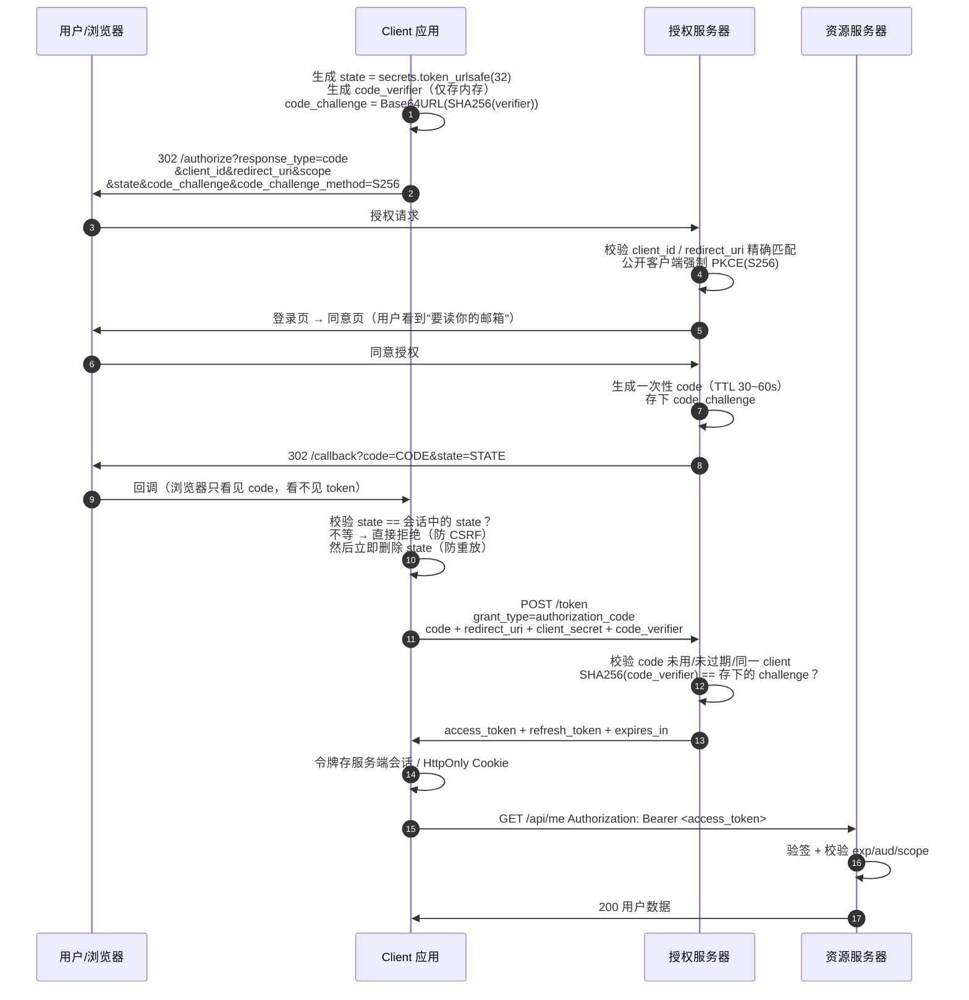
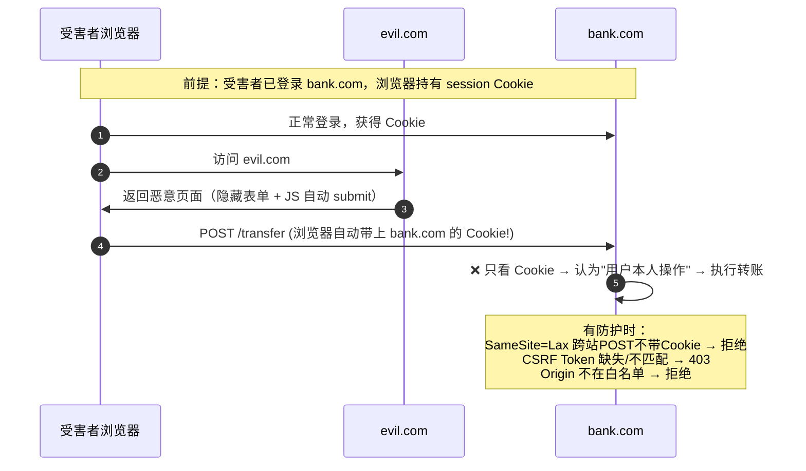

# Day 150 图解 — OAuth2 授权流程与 CSRF / SSRF 攻击路径

> 所有图使用 **Mermaid** 或 **ASCII**，可直接在 GitHub / VSCode（Markdown Preview
> Mermaid 插件）中渲染。不依赖任何图片文件。

---

## 图 1：OAuth2 四个角色与两条通道

```
                        ┌─────────────────────────────────────────┐
                        │          授权服务器 (Auth Server)         │
                        │   /authorize   /token   /revoke          │
                        └───────▲───────────────────┬─────────────┘
                                │                   │
             ②前端通道(浏览器重定向,                  ④后端通道(服务器↔服务器,
               只传 code + state)                    传 client_secret + code)
                                │                   │
        ┌───────────────┐       │                   │      ┌──────────────────┐
        │  用户 (资源所有者) │───────┘                   └─────▶│  客户端 Client    │
        │   浏览器 / App   │◀──────── ①同意授权 ──────────────│ (有后端 / 无后端)  │
        └───────┬───────┘                                  └────────┬─────────┘
                │  ⑤带上 access_token 访问                          │
                │        (Authorization: Bearer)                   │
                ▼                                                  ▼
                        ┌─────────────────────────────────────────┐
                        │        资源服务器 (Resource Server)        │
                        │      校验 access_token → 返回数据          │
                        └─────────────────────────────────────────┘
```

**核心要点**：`code` 走**前端通道**（不安全，所以短命 + 一次性）；
`access_token` 走**后端通道**（浏览器永远看不到）。

---

## 图 2：授权码 + PKCE 全流程（Mermaid sequenceDiagram）



---

## 图 3：为什么授权码流程安全？（信任边界图）

```
  ┌───────────────────────── 不可信区域 ─────────────────────────┐
  │  浏览器地址栏 / 历史记录 / Referer / 代理日志 / 扩展程序        │
  │                                                             │
  │      code=ABC（一次性, 60s）   state=RANDOM  其余全被拦截       │
  └────────────────────────────┬────────────────────────────────┘
                               │ 攻击者能拿到: code（但换不了令牌）
  ┌────────────────────────────▼────────────────────────────────┐
  │                     可信区域（服务端）                        │
  │   client_secret（只在服务器上） + code_verifier（只在客户端内存）│
  │   → POST /token → access_token / refresh_token               │
  └─────────────────────────────────────────────────────────────┘

  攻击者拿到 code 后要换令牌，必须同时满足：
    ① 有 client_secret（机密客户端）    → 拿不到
    ② 有 code_verifier（PKCE 公开客户端）→ 拿不到
    ③ code 还没用过、还没过期           → 很可能已失效
```

---

## 图 4：CSRF 攻击时序（无防护 vs 有防护）



---

## 图 5：四种 CSRF 防护的覆盖范围（ASCII 对照）

```
                        ┌──────────┬──────────┬──────────┬──────────┐
                        │SameSite= │SameSite= │ CSRF     │ Origin/  │
                        │ Strict   │ Lax      │ Token    │ Referer  │
  ┌─────────────────────┼──────────┼──────────┼──────────┼──────────┤
  │ 跨站 POST 表单       │   拦截   │   拦截   │   拦截   │   拦截   │
  │ 跨站 GET 顶层导航    │   拦截   │  放行⚠️  │   拦截   │   拦截   │
  │ 跨站 /<script>  │   拦截   │   拦截   │   拦截   │   拦截   │
  │ 同站 XSS 发起的请求  │   放行   │   放行   │  可读取❌ │   放行   │
  │ 老浏览器不支持时     │   失效   │   失效   │   有效✅ │   有效   │
  └─────────────────────┴──────────┴──────────┴──────────┴──────────┘
   ✅ 结论：SameSite=Lax + CSRF Token 是性价比最高的组合（纵深防御）
   ⚠️ 注意：CSRF Token 挡不住 XSS——XSS 是同源执行，能读到页面里的 token
```

---

## 图 6：SSRF 攻击链路（从"用户可控 URL"到"云账号沦陷"）

```
 攻击者 ──输入──▶ ┌───────────────────────┐
                 │ 用户可控 URL 参数       │  例：avatar_url=...
                 │ "从链接导入/网页截图"   │
                 └──────────┬────────────┘
                            ▼
                 ┌──────────────────────────────────────────┐
                 │      应用服务器（有内网访问权限）            │
                 │      requests.get(user_url)               │
                 └──────────┬───────────────────────────────┘
                            │
        ┌───────────────────┼────────────────────┬───────────────────┐
        ▼                   ▼                    ▼                   ▼
 127.0.0.1:6379      10.0.0.5:8080       169.254.169.254      http://内网K8s
 (Redis 未授权)      (内部管理后台)      (云元数据服务)         (API Server)
        │                   │                    │
        ▼                   ▼                    ▼
   写 SSH key /        越权操作全站        GET /latest/meta-data/
   crontab 反弹                              iam/security-credentials/
                                                   │
                                                   ▼
                                       拿到云主机临时凭证 → 接管云账号 💀
```

---

## 图 7：SSRF 五层纵深防御（每层拦不同攻击）

```
 用户输入 URL
      │
      ▼
 ┌────────────────────────────────────────────────────────────┐
 │ 第 1 层  业务设计：根本不收任意 URL                          │
 │         用 {id: 1} → 服务端映射到固定 URL（最强，且不牺牲功能）│
 └───────────────────────────┬────────────────────────────────┘
                             ▼
 ┌────────────────────────────────────────────────────────────┐
 │ 第 2 层  协议白名单：只允许 http / https                     │
 │         拒绝 file:// gopher:// dict:// ftp:// jar://        │
 └───────────────────────────┬────────────────────────────────┘
                             ▼
 ┌────────────────────────────────────────────────────────────┐
 │ 第 3 层  主机精确白名单：host == "cdn.example.com"           │
 │         禁止 endswith / 后缀匹配 / 正则（会被 .evil.com 绕过）│
 └───────────────────────────┬────────────────────────────────┘
                             ▼
 ┌────────────────────────────────────────────────────────────┐
 │ 第 4 层  解析 → 校验 IP → 用**同一个已解析 IP** 发起连接       │
 │         封禁 127/8 10/8 172.16/12 192.168/16 169.254/16 …   │
 │         禁用自动跟随重定向（若跟随，每次跳转重新校验）          │
 └───────────────────────────┬────────────────────────────────┘
                             ▼
 ┌────────────────────────────────────────────────────────────┐
 │ 第 5 层  网络层：出网代理 + ACL；云元数据启用 IMDSv2          │
 │         内网段对应用沙箱不可达（最后一道防线）                 │
 └────────────────────────────────────────────────────────────┘
```

---

## 图 8：Cookie 安全标志决策树

```
                    要设置一个 Cookie
                            │
              ┌─────────────┴─────────────┐
              │  需要 JS 读取它吗？          │
              └──────┬──────────────┬──────┘
                  需要 │              │ 不需要（会话凭证/CSRF Token）
                     ▼              ▼
        ┌────────────────┐   ┌──────────────────────────────────────┐
        │ 明确知道为什么    │   │ HttpOnly ✅（JS 读不到，XSS 拿不走）   │
        │ 否则别这么干 ❌   │   └──────────────┬───────────────────────┘
        └────────────────┘                  ▼
                             ┌─────────────────────────────────────┐
                             │ 是否只走 HTTPS？→ Secure ✅（必须）    │
                             └──────────────┬──────────────────────┘
                                            ▼
                             ┌─────────────────────────────────────┐
                             │ 需要跨站携带吗？                      │
                             │  不需要 → SameSite=Lax（推荐默认）    │
                             │  需要   → SameSite=None + Secure     │
                             │           + CSRF Token（必须补）      │
                             └─────────────────────────────────────┘
```
