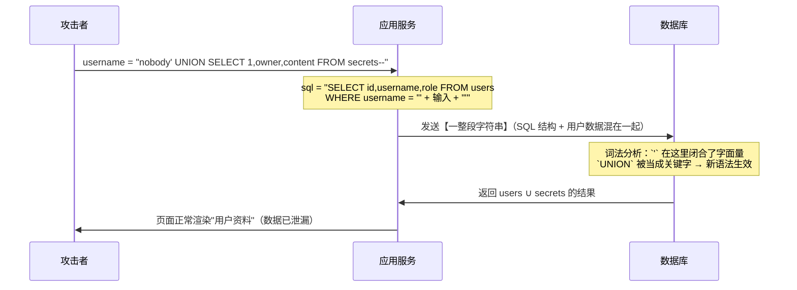

# Day 151 — SQL 注入原理：五类注入、参数化查询与 ORM 防线

> 阶段：Phase 7 — 进阶与性能优化 · 主题：实战数据安全
>
> 前置知识：Day 150 OAuth2 与认证安全（认证/授权、CSRF/SSRF 的思路）。
> 今天我们进入 Web 安全里**最经典、最老、却依然年年上榜**的漏洞：
> **SQL 注入（SQL Injection, SQLi）**。
>
> ⚠️ **本日内容定位：安全防御与教学**。所有攻击演示都只针对
> **进程内存里的 sqlite3 靶场**（`sqlite3.connect(":memory:")`），
> 随进程销毁、不连网络、不碰任何真实站点。目标是让你**看懂成因**，
> 从而写出**不需要靠运气**的代码 —— 不是给你一份攻击 payload 清单。

---

## 一、概念解释

### 1.1 什么是 SQL 注入

**定义**：SQL 注入是指**用户可控的数据**被程序当成 **SQL 代码**去执行，
从而让攻击者能够**修改原本的查询语义**，达到越权读取、篡改、删除数据，
甚至执行数据库层面的危险操作（读写文件、命令执行、探测内网）的漏洞。

一句话概括：**程序本来想"把用户输入拼进一句 SQL"，结果用户输入变成了新的一句 SQL。**

一个最小例子（本日示例 01 会完整复现）：

```python
# ❌ 反例
sql = f"SELECT id, username, role FROM users WHERE username = '{name}'"
conn.execute(sql)
```

当 `name` 是 `alice` 时，没问题。当 `name` 是下面这串时：

```
nobody' UNION SELECT 1, owner, content FROM secrets--
```

数据库收到的完整语句变成：

```sql
SELECT id, username, role FROM users WHERE username = 'nobody'
UNION SELECT 1, owner, content FROM secrets--'
```

`--` 把行尾多余的引号"注释"掉了，于是这条语句**合法且有意义**，
但它干的事是：把 `secrets` 表的内容读出来，伪装成用户资料返回。
**程序的本意被彻底改写了。**

---

### 1.2 为什么它这么危险（危害分级）

| 层级 | 后果 | 说明 |
|---|---|---|
| 数据泄漏 | 脱库 | 用户表、订单表、密钥表被 `UNION` 或盲注逐字节搬走 |
| 数据篡改 | 越权/提权 | `UPDATE users SET role='admin' WHERE id=1` 类操作 |
| 数据销毁 | 删库删表 | 堆叠注入里的 `DROP TABLE`，甚至 `DROP DATABASE` |
| 认证绕过 | 免密登录 | `' OR '1'='1'--` 让登录条件恒真 |
| 横向移动 | 打内网 | 数据库的 `xp_cmdshell`、`LOAD_FILE`、`UTL_HTTP` 等 |
| 持久化 | 写文件留后门 | `INTO OUTFILE` 写 WebShell（MySQL 经典路径） |

> 📌 **为什么它老而不死？** 因为它不是"某个库的 bug"，而是
> **人写代码时的一次偷懒**：`f"...{user_input}..."` 在语法上完全合法、
> 在测试环境完全正常（你自己输入的都是正常数据），
> 只有被恶意输入碰到时才爆。换句话说，**它靠人的疏忽存活**。

---

### 1.3 三类根因（记住这三个，90% 的场景都能对号入座）

1. **字符串拼接**：`f"..."`、`+`、`%`、`.format()`、模板引擎把变量拼进 SQL。
2. **标识符拼接**：表名、列名、`ORDER BY` 字段、`ASC/DESC` —— 这些**无法参数化**，
   只能白名单，但很多人直接拼了（示例 02 的坑 1、坑 2）。
3. **"数据出库即可信"的错觉**：第一次入库是安全的，第二次取出来又拼进 SQL
   （二次注入，示例 02 的坑 5）。

---

### 1.4 五类注入：按"攻击者能看到什么"分类

这是本日最核心的一张表。分类依据**不是攻击手法，而是信息回传信道**
（因为我们防的就是"信息泄漏"）：

| 类型 | 攻击者能看到的信号 | 典型构造 | 适合场景 |
|---|---|---|---|
| **UNION 注入** | 完整数据回显 | `' UNION SELECT ...--` | 页面直接把查询结果渲染出来 |
| **报错注入** | 数据库报错文本 | 故意构造语法/类型错误 | 页面回显异常信息（未统一错误处理） |
| **布尔盲注** | 真/假 两种状态 | `' OR substr(...)='a'--` | 页面只显示"有结果/无结果" |
| **时间盲注** | 响应耗时 | `' OR CASE WHEN (...) THEN <慢查询> END--` | 页面**毫无差异**，只能测时间 |
| **堆叠注入** | 副作用的间接证据 | `'; DROP TABLE x;--` | 驱动允许一次执行多条语句 |

> ✨ **这张表怎么用？** 反过来读就是防御清单：
> **不要回显数据、不要回显报错、不要让响应可区分、不要让查询可计时、不要让一条请求跑多条语句**，
> 再叠加**参数化**这个根治手段。

---

### 1.5 与相邻知识的边界（避免概念混淆）

| 概念 | 与 SQLi 的关系 |
|---|---|
| XSS | 都是"注入"，但 XSS 注入的是 **HTML/JS**，SQLi 注入的是 **SQL** |
| 命令注入 | 同一个思路，注入到 shell；防御思路不同（避免 shell=True、参数化数组） |
| CSRF / SSRF | 不修改 SQL 语义，而是"借身份/借网络位置"，见 Day 150 |
| 越权访问 | 不改变 SQL 语句，而是**合法语句 + 缺失鉴权**；SQLi 是**绕过鉴权** |
| 反序列化 | 注入的是"对象"，语言层面；SQLi 在数据传输层 |

---

## 二、原理解释（底层机制）

### 2.1 数据库是怎么"读懂"一条 SQL 的（五步流水线）

```
SQL 文本
   │
   ▼
① 词法分析（Lexer）   把字符切成 Token：标识符 / 关键字 / 字面量 / 运算符 / 注释
   │                  ⚠️ 关键：`'...'` 里的内容被标成"字符串字面量"，其它都是"语法"
   ▼
② 语法分析（Parser）  按语法生成抽象语法树（AST）：SELECT list / FROM / WHERE / ...
   │
   ▼
③ 语义分析（Binder）  解析表名、列名是否存在；检查类型；检查权限
   │
   ▼
④ 查询计划（Planner） 决定用哪个索引、怎么 Join（这一步定了"要做什么事"）
   │
   ▼
⑤ 执行（Executor）    真正去读页、做过滤、返回结果行
```

**这五步里，只有在第 ① 步之后，"结构"就已经定了。** 参数化查询的全部魔力，
就在于它**把第 ①~④ 步（编译）和第 ⑤ 步（填值）分开了** —— 见 2.3。

### 2.2 为什么"拼接"会改变语义（Token 层面的真相）

假设程序写的是：

```python
sql = "SELECT id FROM users WHERE username = '" + name + "'"
```

当 `name = "alice"`，数据库收到的字符流是：

```
SELECT  id  FROM  users  WHERE  username  =  'alice'
  关键字  列   关键字  表    关键字    列     运算符  字面量
```

当 `name = "x' OR '1'='1"`，收到的字符流变成：

```
SELECT  id  FROM  users  WHERE  username  =  'x'  OR  '1'  =  '1'
   关键字  列  关键字  表    关键字    列   运算符 字面量 关键字 字面量 运算符 字面量
```

**注意那条边界线消失了**：原本 `name` 的全部内容都应该落在"字面量"这个桶里，
现在它**越过了单引号这道围栏**，把 `OR '1'='1'` 变成了**新语法**。
数据库在第 ② 步就按这个新语法去构建执行计划，从此程序说什么都不算数了。

> 📌 **一句话记住：注入的本质不是"特殊字符"，而是"字符跨过了字面量边界"。**
> 所以防御的关键也不是"删掉特殊字符"（黑名单永远删不干净），
> 而是"**让数据永远跨不过那道边界**"。

### 2.3 参数化查询的底层：编译与绑定分离（prepare / bind / execute）

参数化查询（Prepared Statement）在协议层面是**两次往返**：

```
第一次：客户端 → 服务端      只发"模板"，不带值
   PREPARE stmt FROM "SELECT id, username, role FROM users WHERE username = ?"
服务端：词法/语法/语义/计划 全部做完，把执行计划缓存起来
        —— 此时语句结构已经**冻结**，`?` 就是一个"占位洞"，
           它只能是"值"，永远不会被重新词法分析

第二次：客户端 → 服务端      只发"值"（二进制协议里的 parameter 字段）
   EXECUTE stmt USING 'x'' OR ''1''=''1'
服务端：把值塞进洞里，执行，返回结果
        —— 值里哪怕包含引号、UNION、分号，也只是**一段普通字符串**
```

**为什么这能根治？** 因为值**从未参与词法分析**。它不经过 Lexer，
没有机会被识别成 `OR`（关键字）或 `'`（字符串定界符）。攻击者能控制的
只有"洞里的字节"，而洞的位置、数量、它属于哪个列，**全部由程序在编译期决定**。

> ✨ **与"转义"的本质差别**：
> - 转义（escaping）是"我猜哪些字符危险，把它们加上反斜杠"。它依赖：
>   字符集正确（GBK 宽字节绕过）、开发者没漏掉某个上下文（数字型、LIKE、注释符）、
>   库的转义函数被正确使用。**任何一个环节猜错就破防。**
> - 参数化是"我根本不让你进入语法层"。它不依赖"猜"，是**结构性**的。
>
> 这就是为什么安全界反复强调：**参数化查询不是"更安全的转义"，它是另一条路。**

### 2.4 五类注入的原理逐一拆解

#### ① UNION 注入 —— 把别人的表接到结果集

`UNION` 会**纵向合并两个结果集**，要求两侧**列数相同、类型兼容**。
攻击者只要知道列数（靠报错或试数字），就能把任意表的数据"接"进来：

```
原始：SELECT id, username, role FROM users WHERE username = 'X'
注入：SELECT id, username, role FROM users WHERE username = 'X'
      UNION SELECT 1, owner, content FROM secrets -- '
```

**为什么列数要试？** 因为类型不匹配/列数不同会直接报错。这也是为什么
"报错信息泄漏"本身就是帮凶。防御上：**查询只返回需要的列**（`SELECT *` 更危险），
并且**数据库账号最小权限**（用户查询的账号不该有 `secrets` 表的读权限）。

#### ② 报错注入 —— 报错文本就是情报

数据库的报错信息对开发者是调试工具，对攻击者是**地图**：

- 语法报错 ⇒ 暴露 SQL 片段 ⇒ 确认存在拼接；
- 列数报错（`SELECTs ... do not have the same number of result columns`）
  ⇒ 暴露 SELECT 的列数；
- `no such column: api_token` ⇒ 暴露**列名**；
- `no such table: secrets` ⇒ 暴露**表名**。

拿到表名列名之后，攻击者就能构造精确的 UNION/盲注。
**防御**：统一异常处理，对外只返回错误码；细节进服务端日志。

#### ③ 布尔盲注 —— 一个请求 1 bit

当页面只区分"有结果/无结果"时，攻击者把**条件表达式**塞进 SQL，
用真假来编码信息：

```
payload: nobody' OR substr((SELECT api_token FROM users WHERE username='admin'),1,1)='t'--
                                               ↑ 第 1 个字符          ↑ 猜它是不是 't'
```

返回"有结果" ⇒ 条件为真 ⇒ 第 1 个字符是 `t`；否则换下一个候选字符。
逐字符、逐位地"问"出整条数据。**注意这里用 `OR` 而不是 `AND`**：
`WHERE username='nobody'` 已经是假，`AND` 会让整句恒假（SQL 的短路求值），
必须用 `OR` 让真假完全由右半部分决定 —— 这是真实盲注的细节，示例 01 里演示了。

**为什么可行？** 因为信息论的铁律：**只要响应可区分，就存在信道**。
防御上无法把信道完全堵死（"有/无结果"是业务必需的），
所以真正的对策是**参数化**（让条件表达式根本进不来）+ **速率限制**（让 1 bit/请求 变得不经济）。

#### ④ 时间盲注 —— 连真假都看不见时，用耗时编码

当页面**完全不可区分**（永远返回同一个页面）时，攻击者改用**响应时间**：

```
payload: nobody' OR CASE WHEN (条件) THEN <一个很慢的表达式> ELSE 0 END--
```

条件为真 ⇒ 执行慢表达式 ⇒ 响应多花几十毫秒；条件为假 ⇒ 立刻返回。
攻击者测的是"统计上慢不慢"，仍然能读出 1 bit。

> ⚠️ **细节坑**：这里必须用 `OR`。若写成 `username='nobody' AND CASE ...`，
> 左边恒假，SQLite 会**短路跳过**右边表达式，重表达式根本不执行 —— 时间差就没了。
> 示例 01 在两处踩过这个坑并给出了正确写法，这正是"原理必须动手验证"的例子。

**防御**：参数化（根治）+ **语句超时**（让慢查询直接被 kill）+ 监控 P99 延迟。

#### ⑤ 堆叠注入 —— 从"读"升级到"写/删"

当驱动允许**一次执行多条语句**时，攻击者用 `;` 追加新语句：

```
1) INSERT INTO search_log (term) SELECT username FROM users WHERE username = 'x';
2) DROP TABLE secrets;              ← `;` 之后全是攻击者的地盘
```

- **Python 的 sqlite3 `execute()` 默认只允许一条语句**
  （会抛 `ProgrammingError: You can only execute one statement at a time.`），
  这是标准库送的免费防护；
- 但 **`executescript()` 允许多条**，一旦用它拼接用户输入，堆叠注入立刻成立；
- 其它数据库驱动（如某些 MySQL 客户端）默认允许 `multi=True`，
  此时 `execute()` 也不是防线。

> 📌 **结论：驱动层的"单语句限制"可以当纵深防御的一层，但**永远不能当主防线**。
> 主防线只有参数化。

### 2.5 盲注为什么"慢但可行"：算一笔账

| 数据 | 长度 | 单字符候选数 | 请求数上限 | 按 10 req/s 估算 |
|---|---|---|---|---|
| 用户名 | 8 | 36（小写+数字） | 288 | ≈ 29 秒 |
| 32 位 token | 32 | 36 | 1152 | ≈ 2 分钟 |
| 某列全部内容 | 10 万字符 | 36 | 360 万 | ≈ 100 小时 |

**这张表的三个启示：**

1. 盲注**永远"可行"**（信息论上），但**成本随数据量线性增长**；
2. 所以**速率限制（rate limit）会让盲注从"几分钟"变成"几年"** —— 这是最有效的缓解手段；
3. **但速率限制是缓解不是根治**：攻击者可以并发、可以分布式。
   根治仍然是参数化。

### 2.6 ORM 是怎么"自动防注入"的，以及它什么时候失效

**机制（这一点必须先说清楚）**：ORM 并没有"消毒"你的字符串。
Django ORM / SQLAlchemy 做的事，本质是**把你写的 Python 调用翻译成
"带占位符的 SQL + 参数列表"**，也就是**自动帮你写了参数化查询**。

```
user_input = "x' OR '1'='1"
User.objects.filter(username=user_input)
        │
        ▼ 翻译
SELECT ... FROM user WHERE username = ?        ← SQL 里没有用户数据
参数列表: ["x' OR '1'='1"]                     ← 用户数据在参数里
```

推而广之：**只要你能看到"SQL 字符串里有用户数据"，保护就已经消失了**。
ORM 的三种典型失效场景：

| 失效场景 | 具体写法 | 为什么破防 |
|---|---|---|
| **原生 SQL 逃生舱** | Django `extra()`/`RawSQL`、SQLAlchemy `text()` + f-string、各种 `raw()`/`whereRaw()` | 你已经离开了 ORM 的参数化链路，等同于手写拼接 |
| **标识符由用户决定** | `.order_by(request.GET['sort'])`、`.extra(order_by=[...])`、动态表名 | ORM **无法参数化表名/列名**，只能靠白名单；你不做白名单就等于拼接 |
| **参数化被"掉包"** | `cursor.execute(sql % params)`、`sql.format(**kw)`、`"... " + col` | 值在进入驱动之前就被拼进了字符串 |

> ✨ **判断标准（背下来）**：
> **凡是 SQL 变量里出现了 f-string / `+` / `%` / `.format()`，参数化就已经失效。**
> 正确写法永远是：`cursor.execute(静态SQL, 参数)` —— **是逗号，不是百分号。**

### 2.7 为什么 WAF、黑名单、`mysql_real_escape_string` 都不算根治

| 手段 | 为什么不可靠 |
|---|---|
| 黑名单过滤 `'`、`UNION`、`--` | 编码绕过（`%2527`）、大小写（`uNiOn`）、注释插入（`UN/**/ION`）、等价语法无穷无尽 |
| 转义函数 | 依赖字符集（宽字节 `%bf%27`）、依赖调用点正确（不同上下文转义规则不同） |
| WAF | 是"绕过游戏"，规则总滞后；且内网东西向流量常常不经过 WAF |
| 只隐藏报错 | 只堵住了"报错注入"，UNION/布尔/时间盲注照旧 |
| 只限速 | 只把盲注变慢，不阻止 UNION 一次取走数据 |

**它们都是"纵深防御的一层"，不是"根因修复"。** 根因只有一个：**数据与代码分离**。

---

## 三、定义与使用方法（API 速查）

### 3.1 Python 标准库 sqlite3 的四种参数风格

```python
import sqlite3

conn = sqlite3.connect(":memory:")

# ① qmark 风格（最常用，推荐）
conn.execute("SELECT * FROM users WHERE username = ? AND role = ?", ("alice", "user"))

# ② named 风格（参数多时更可读）
conn.execute(
    "SELECT * FROM users WHERE username = :name AND role = :role",
    {"name": "alice", "role": "user"},
)

# ③ 序列位置也用 named（用一个序列按顺序填）
conn.execute("SELECT * FROM users WHERE id = :id", (1,))

# ④ 批量：executemany 只对"参数"生效，SQL 模板只编译一次
conn.executemany(
    "INSERT INTO users (username, role) VALUES (?, ?)",
    [("a", "user"), ("b", "admin")],
)
```

| API | 是否允许多语句 | 是否参数化 | 备注 |
|---|---|---|---|
| `execute(sql, params)` | ❌ 只允许 1 条 | ✅ | **首选** |
| `executemany(sql, seq)` | ❌ | ✅ | 批量插入，性能好 |
| `executescript(sql)` | ✅ 允许 | ❌ 不支持参数 | ⚠️ 只用于**常量**脚本（建表等） |

### 3.2 各数据库驱动的占位符对照（换库时最容易踩的坑）

| 数据库 / 驱动 | 占位符 | 参数容器 | 备注 |
|---|---|---|---|
| sqlite3（标准库） | `?` 或 `:name` | tuple / dict | 也支持 `%s` 吗？**不支持** |
| psycopg2 / psycopg3（PostgreSQL） | `%s` / `%(name)s` | tuple / dict | `%` 需写成 `%%` |
| PyMySQL / mysqlclient | `%s` | tuple / dict | 同上 |
| SQLAlchemy Core | `:name` | dict | 自己再翻译到驱动层 |
| Django ORM | 无（用 kwargs） | `.filter(col=value)` | 底层自动参数化 |

> ⚠️ 常见事故：把 `%s` 拿到 sqlite3 上用（报错），
> 或者把 `?` 拿到 MySQL 上用（`?` 会被当字面字符，**不报错但也不生效** —— 静默错误最危险）。

### 3.3 "能/不能参数化"总速查（背下这张表就够了）

| SQL 位置 | 能参数化？ | 正确做法 |
|---|---|---|
| `WHERE` 条件值 | ✅ | `col = ?` |
| `INSERT ... VALUES` | ✅ | `VALUES (?, ?)` |
| `UPDATE ... SET` 值 | ✅ | `SET col = ?` |
| `LIMIT` / `OFFSET` 数值 | ✅（多数数据库） | `LIMIT ? OFFSET ?` |
| `IN (...)` 的值 | ✅ | 只拼 `"?,?,?"`，值走参数；并限制列表长度 |
| `LIKE` 的模式串 | ✅（SQL 语法层） | 仍需转义 `%`/`_` 并加 `ESCAPE '\\'` |
| `IN (...)` 的元素个数 | ⚠️ 半 | 生成占位符（内容不含用户数据），但要限长防 DoS |
| **表名 / 列名** | ❌ | **白名单映射**（`{"users": "users"}`） |
| **`ORDER BY` 字段 / 方向** | ❌ | **白名单映射**（字段集合 + `ASC/DESC` 集合） |
| **运算符 / 关键字（AND、OR、=）** | ❌ | 代码里写死，不由用户决定 |

### 3.4 ORM 安全写法对照（Django / SQLAlchemy，思维可迁移到任何 ORM）

| 场景 | ❌ 危险写法 | ✅ 安全写法 |
|---|---|---|
| 条件过滤 | `.filter(username=name)` 本身安全，但 `.extra(where=[f"username='{name}'"])` ❌ | 用 kwargs + `__gt`/`__in`/`__contains` 等内置 lookups |
| 排序 | `.order_by(request.GET["sort"])` ❌ | 白名单映射后再传，或 `Case/When` 常量表 |
| 原生 SQL | `raw(f"SELECT ... {x}")` ❌ | `raw("SELECT ... WHERE id = %s", (x,))`（Django `raw` 支持 params）|
| SQLAlchemy | `text(f"SELECT ... {x}")` ❌ | `text("SELECT ... WHERE id = :id").bindparams(id=x)` |
| 表名动态 | `f"SELECT * FROM {table}"` ❌ | 白名单字典 + 只拼常量 |
| 日志 | 打印拼好值的 SQL ❌ | 打印 SQL 模板 + 参数个数（敏感值脱敏） |

### 3.5 代码自查清单（可直接当 Code Review Checklist）

```
□ 全仓库搜索：SQL 关键字附近有没有 f" / + / % / .format（AST 脚本见示例 03）
□ 所有 execute/query 调用都是"常量 SQL + 第二参数"，没有 sql % params
□ executescript / multi=True / raw() / extra() / text() 的使用点逐个复核
□ 表名、列名、ORDER BY 全部来自白名单常量，不来自请求参数
□ LIKE 查询对 % 和 _ 做了转义并声明 ESCAPE
□ IN 列表：只拼占位符，且限制最大长度
□ 数据库账号是"每应用一个"，权限最小化（用户查询账号不能读 secrets 等表）
□ 统一异常处理：对外不返回数据库报错原文
□ 生产库关闭详细错误显示 / 日志不落库不落敏感值
□ 接口层有速率限制（盲注的经济学攻击面）
□ 慢查询有 statement_timeout
□ 有 CI 级别的注入回归测试（示例 03 的动态探针）
```

---

## 四、图解

### 4.1 注入是怎么发生的（Mermaid 时序）



**关键点**：数据库从始至终"不知情" —— 它只是忠实地执行了一条**合法**语句。

### 4.2 参数化 vs 拼接：协议层对比（ASCII）

```
【拼接 —— 一次往返，结构由字符串内容决定】
  应用 ──── "SELECT ... WHERE username = 'x' UNION SELECT ...--'" ────▶ 数据库
                                                                      │
                                    词法→语法→语义→计划→执行 全在收到后决定
                                    用户输入参与了"结构"的构建 ✗

【参数化 —— 两次往返，结构在编译期冻结】
  应用 ──── PREPARE: "SELECT ... WHERE username = ?" ─────────────────▶ 数据库
                                                                      │
                                          编译完成，结构冻结，`?` = 只能装值的洞
  应用 ──── EXECUTE: 参数 [ "x' UNION SELECT ...--" ] ─────────────────▶ 数据库
                                                                      │
                                    值是纯数据，不经过词法分析 ⇒ 只能当用户名 ✗
```

### 4.3 五类注入的"信息信道"对比（ASCII）

```
                 有无数据回显？
                  ├── 有 ──────────────▶ UNION 注入（直接读走）
                  └── 无
                       ├── 有报错回显？ ──▶ 报错注入（读结构，再升级）
                       └── 无
                            ├── 有真/假差异？ ──▶ 布尔盲注（1 bit / 请求）
                            └── 完全不可区分
                                 └── 测量耗时 ──▶ 时间盲注（1 bit / 请求）
                 能否执行多条语句？ ────────▶ 堆叠注入（可写/可删）
```

### 4.4 纵深防御：七层，但只有第一层是根治（ASCII）

```
        ┌──────────────────────────────────────────────────────┐
 第 1 层│ ✅ 参数化查询 / ORM 安全 API          ← 根治（必做）   │
        ├──────────────────────────────────────────────────────┤
 第 2 层│ ✅ 标识符白名单（表名/列名/ORDER BY）  ← 补上参数化的盲区│
        ├──────────────────────────────────────────────────────┤
 第 3 层│ ✅ 输入校验（长度/类型/枚举/LIKE 转义）               │
        ├──────────────────────────────────────────────────────┤
 第 4 层│ ✅ 数据库最小权限（分库分账号、禁 DROP、只读账号）     │
        ├──────────────────────────────────────────────────────┤
 第 5 层│ ✅ 统一错误处理（不对外回显 SQL/堆栈）                 │
        ├──────────────────────────────────────────────────────┤
 第 6 层│ ✅ 速率限制 + 语句超时（抬高盲注成本）                 │
        ├──────────────────────────────────────────────────────┤
 第 7 层│ ⚠️ WAF / 审计日志告警（补偿控制，不作为主防线）        │
        └──────────────────────────────────────────────────────┘
   任何一层被绕过，其余层仍在 —— 这就是"纵深防御"的意义。
```

### 4.5 二次注入的时间线（ASCII）

```
 请求①  注册用户，输入 username = x' OR '1'='1
        参数化 INSERT → 安全入库（库里就是这段**字符串**）
                 │
                 ▼  （时间过去，审计/扫描都没发现问题）
 请求②  改密码流程：先按 username 查出该用户，再拼 SQL
        存储的字符串被拼进 WHERE username = 'x' OR '1'='1'
        → 条件恒真 → 全表被 UPDATE
 ✨ 修复：跨请求的数据**出库也不可信**；定位记录只用不可变主键 id。
```

---

## 五、完整可运行实战代码

> 三个脚本都在 `code/` 下，**只依赖标准库**，`python3 xx.py` 直接跑通。
> 全部演示都跑在 `sqlite3` 内存靶场上（`--` 注释、`UNION`、递归 CTE 计时等
> 细节都经过实测）。

### 5.1 `01-sql-injection-basics.py` — 五类注入 + 参数化修复（基础）

```bash
python3 code/01-sql-injection-basics.py
```

依次演示，每一步都给出"实际执行的 SQL 长什么样"：

| 小节 | 内容 |
|---|---|
| 0 | 正常查询，建立对照基线（看清返回 3 列） |
| ① | UNION 注入：读出 `secrets` 表内容 |
| ② | 报错注入：语法报错泄漏 SQL 片段、列数报错泄漏结构、`sqlite_master` 列全部表名 |
| ③ | 布尔盲注：用 `' OR substr(...)` 逐字符问出 `admin` 的 `api_token`（实测提取到 `tk9xq2`） |
| ④ | 时间盲注：`OR CASE WHEN ... THEN <递归 CTE>`，实测恒真 95.6ms vs 恒假 0.1ms |
| ⑤ | 堆叠注入：`executescript` 里 `'; DROP TABLE secrets;--` 真的把表删了；对比 `execute()` 拒绝多语句 |
| ⑥ | **修复验证**：同样 5 个 payload 打参数化版本 → 全部返回空、无报错、无副作用 |

### 5.2 `02-parameterized-pitfalls.py` — 参数化的边界与 ORM 失效（进阶/避坑）

```bash
python3 code/02-parameterized-pitfalls.py
```

七个坑，每个都有"❌ 反例 → 现象 → ✅ 正例"：

1. **占位符不能当标识符**：`SELECT * FROM ?` 直接报错 → 白名单映射；
2. **半参数化**：`ORDER BY` 拼接导致排序结果本身成为盲注信道（实测两种条件行序不同）→ 字段+方向双白名单；
3. **LIKE 通配符注入**：参数化了，但用户传 `%` 就能拉全表 → 转义 `%`/`_` + `ESCAPE`；
4. **IN 子句**：只拼占位符不拼值（并限长防 DoS）；
5. **二次注入**：注册时安全的 `x' OR '1'='1` 在第二次请求里把整张表改成 `vip` → 只用主键定位；
6. **ORM**：用 `MiniORM` 打印出生成的 `?` 与参数列表，揭示"ORM 就是自动参数化"；再演示 `raw()`、用户可控字段名、`sql % params` 三种失效；
7. **日志与异常**：`log(f"SQL: {拼好的SQL}")` 等于自己泄漏数据 → 只记模板与参数个数。

### 5.3 `03-sqli-detector.py` — SQL 注入检测脚本（实战工具）

```bash
python3 code/03-sqli-detector.py                  # 静态检测内置样本 + 动态验证
python3 code/03-sqli-detector.py 你的文件.py        # 检测你自己的源码
python3 code/03-sqli-detector.py --no-dynamic     # 只跑静态检测（更快）
echo $?                                           # 0=干净 1=需要处理（可接 CI）
```

**（A）静态检测（AST）**：解析 Python 源码语法树，抓这些模式：

- f-string / `+` / `%` / `.format()` 拼进"看起来像 SQL"的字符串（含**嵌套加法**，实测能抓到 `"..." + user + "..." + pwd`）；
- 把**动态拼出来的变量**交给 `execute`；
- 直接把拼接表达式交给 `execute`；
- `executescript()`（多语句 = 堆叠注入风险）；
- `raw()` / `extra()` / `text()` 等 ORM 逃生舱。

在内置样本上实测输出 **7 处 HIGH**，同时**不误报**
`conn.execute("SELECT count(*) FROM users WHERE role = ?", (role,))`
（这正体现了 AST 比 grep 正则强的地方）。

**（B）动态验证（注入回归测试）**：对本地内存靶场发 4 个**语法特征探针**
（恒真 / 恒假 / UNION / 单引号，全是数字常量和通用语法，不含任何针对特定库的
攻击载荷），用**差分法**判定：

| 探针 | 拼接版实测 | 参数化版实测 |
|---|---|---|
| 布尔差分（恒真 vs 恒假结果不同） | ❗恒真 3 行 / 恒假 0 行 | ✅ 都是 0 行 |
| UNION 改写（不该有结果却返回行） | ❗返回 `[(1, 2, 3)]` | ✅ 空 |
| 报错泄漏（异常冒泡） | ❗`OperationalError` | ✅ 无异常 |
| 时间差异（中位数差 > 20ms） | ❗54.8ms vs 0.0ms | ✅ 无差异 |

**怎么用到自己的项目**：把 `target_*` 换成你真实的 DAO 函数（连**测试库**），
断言"全部无信号"，接进 CI —— 任何一次改动引入拼接，流水线立刻红。

---

## 六、思考题

1. **为什么"参数化查询"比"转义特殊字符"更可靠？**
   请从"转义需要正确猜对哪些字符危险""字符集与上下文会影响转义正确性"
   两个角度说明，并解释为什么参数化被称为**结构性防御**而不是**过滤式防御**。

2. **下面三种写法都用了参数化，请指出哪些仍然可能被注入，为什么？**
   ```python
   # A
   conn.execute("SELECT * FROM users WHERE id = ?", (uid,))
   # B
   conn.execute("SELECT * FROM users WHERE id = ? ORDER BY " + sort_col)
   # C
   conn.execute("SELECT * FROM users WHERE name LIKE ?", ("%" + kw + "%",))
   ```
   分别说出修复方式（提示：B 的 `ORDER BY`、C 的通配符语义）。

3. **盲注为什么"永远可行"？** 请用信息论的角度（响应可区分 ⇒ 存在信道）解释，
   并算出"提取一个 32 位小写字母数字 token"在 10 请求/秒的限速下大约需要多久。
   然后回答：**速率限制是根治还是缓解？** 根本修复应该做什么？

4. **ORM 到底做了什么才"自动防注入"？** 请写出 Django 里
   `.filter(username=user_input)` 最终在数据库端执行的大致语句形状
   （SQL 模板 + 参数列表），并各举一个"ORM 失效"的真实场景
   （提示：`extra()`/`RawSQL`、`order_by(request.GET[...])`、`cursor.execute(sql % params)`）。

5. **设计一个"看不出任何差异"的接口，它还能被注入吗？**
   假设你有个 API：永远返回 `{"ok": true}`，无数据、无报错、无耗时差异
   （所有查询都很快）。请说明：(a) 它还能不能有注入风险？
   (b) 堆叠注入在这里意味着什么？(c) 你会为它加哪三层防御？
   （提示：想想数据被**改写**时，攻击者虽然看不到，但业务后果已经发生。）

---

## 附：本日文件清单

```
days/day-151-sql-injection/
├── README.md                             ← 本文
├── code/
│   ├── 01-sql-injection-basics.py        ← 五类注入复现 + 参数化修复验证
│   ├── 02-parameterized-pitfalls.py      ← 参数化边界 7 个坑 + ORM 失效场景
│   └── 03-sqli-detector.py               ← 静态 AST 检测 + 动态注入回归测试
├── diagrams/
│   └── README.md                         ← 时序 / 协议 / 信道 / 防御 ASCII + Mermaid
└── exercises/
    └── checklist.md                      ← 完成清单 + 基础/进阶练习题
```

> 🔒 **再次强调**：本日所有"攻击"代码都是**教学靶场**的一部分，
> 运行在内存数据库上。请勿将其用于未授权的系统测试。
> 想练手，就把靶场做大一点：自己写一个"有漏洞的迷你 Web 应用"，
> 然后拿示例 03 的探针去测它 —— 这是完全合法且最有效的学习方式。
