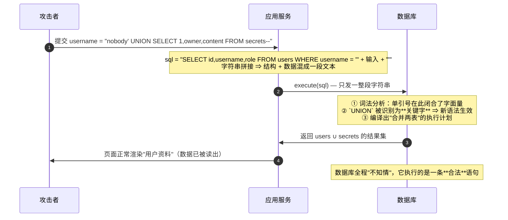

# Day 151 图解 — SQL 注入原理、参数化机制与纵深防御

> 所有图使用 **Mermaid** 或 **ASCII**，可直接在 GitHub / VSCode（Markdown Preview
> Mermaid 插件）中渲染。不依赖任何图片文件。
>
> ⚠️ 本日所有示例都运行在**本地内存 sqlite3 靶场**上，仅用于教学与防御演示。

---

## 图 1：注入是怎么发生的（Mermaid 时序）



---

## 图 2：SQL 解析五步流水线 —— 边界在哪一步被破坏

```
   SQL 文本:  SELECT id FROM users WHERE username = 'x' OR '1'='1' -- '
        │
        ▼
  ┌───────────────┐   ✅ 正常输入时：`x` 全程落在【字符串字面量】这个桶里
  │ ① 词法 Lexer  │   ❌ 攻击输入时：`'` 提前闭合字面量，
  │  切 Token     │      之后的 `OR` / `'1'` / `=` 全都变成了**语法 token**
  └───────┬───────┘
          ▼
  ┌───────────────┐
  │ ② 语法 Parser │   按新语法建 AST ⇒ 结构的**作者从程序员变成了攻击者**
  └───────┬───────┘
          ▼
  ┌───────────────┐
  │ ③ 语义 Binder │   解析表/列名（报错注入的泄漏点就在这一步）
  └───────┬───────┘
          ▼
  ┌───────────────┐
  │ ④ 计划 Planner│   "要做什么"在此定死（参数化在这里之后才填值）
  └───────┬───────┘
          ▼
  ┌───────────────┐
  │ ⑤ 执行 Exec   │   真正读数据
  └───────────────┘

 ✨ 结论：防御要卡在 ① **之前** —— 让用户数据**根本不进入词法分析**。
```

---

## 图 3：拼接 vs 参数化（协议层 ASCII 对照）

```
┌──────────────────────────── 拼接：一次往返，结构由字符串决定 ────────────────────────────┐
│  应用 ──── "SELECT * FROM users WHERE username = 'x' OR '1'='1' -- '" ────▶ 数据库      │
│                                                                                        │
│                                            收到后才开始：词法→语法→语义→计划→执行        │
│                                            用户输入参与了"结构"的构建  ✗ 可被改写        │
└────────────────────────────────────────────────────────────────────────────────────────┘

┌──────────────────────────── 参数化：两次往返，结构编译期冻结 ────────────────────────────┐
│  应用 ──── PREPARE "SELECT * FROM users WHERE username = ?" ─────────────▶ 数据库      │
│                                                              │                         │
│                          编译完成 ⇒ 结构冻结，`?` 是"只能装值"的洞（缓存执行计划）        │
│                                                              │                         │
│  应用 ──── EXECUTE 参数 = ["x' OR '1'='1 -- '"] ────────────────────────▶ 数据库        │
│                                                              │                         │
│                    值作为**纯数据**绑定进洞：不经过 Lexer ⇒ 永远是"用户名"  ✅            │
└────────────────────────────────────────────────────────────────────────────────────────┘

  ⚠️ 两者都"把用户输入传给了数据库" —— 区别只在**传的是不是一个语法参与者**。
```

---

## 图 4：五类注入的"信息信道"决策树

```
                     攻击者能收到什么信号？
                              │
        ┌─────────────────────┴─────────────────────┐
        │  有没有"数据回显"？                        │
        └───────┬───────────────────────────┬───────┘
             有 │                           │ 没有
                ▼                           ▼
      ┌──────────────────┐        ┌──────────────────────┐
      │  UNION 注入       │        │ 有没有"报错回显"？     │
      │  直接读走数据      │        └───┬──────────────┬───┘
      │  需要先探列数      │          有 │              │ 没有
      └──────────────────┘            ▼              ▼
                            ┌──────────────┐  ┌─────────────────────┐
                            │  报错注入      │  │ 响应有"真/假"差异？   │
                            │  泄漏表名/列名  │  └──┬───────────────┬──┘
                            │  再升级为 UNION│   有 │               │ 没有
                            └──────────────┘     ▼               ▼
                                          ┌────────────┐  ┌──────────────┐
                                          │ 布尔盲注    │  │ 时间盲注      │
                                          │ 1bit/请求   │  │ 测量耗时      │
                                          └────────────┘  │ 1bit/请求     │
                                                          └──────────────┘

   另一条独立轴线：能不能一次执行多条语句？
        └── 能 ──▶ 堆叠注入（`; DROP TABLE ...`）⇒ 从"读"升级到"写/删"
```

---

## 图 5：盲注的数学 —— 为什么速率限制如此关键

```
  提取 1 个字符（候选集 = 36 个小写字母 + 数字）需要的最坏请求数 = 36 次
  提取 32 位 token                                           = 1152 次

  无限制（1000 req/s）:  ▓                                       ≈ 1.2 秒
  限速 10 req/s       :  ▓▓▓▓▓▓▓▓▓▓▓▓▓▓▓▓▓▓▓▓▓▓▓▓▓▓▓            ≈ 115 秒
  限速 1 req/s        :  ▓▓▓▓▓▓▓▓▓…（1152 秒）                   ≈ 19 分钟
  限速 + 封禁异常源 IP :  ████████████████████████████████      ≈ 攻击失败

  ✨ 论点：盲注在信息论上"永远可行"，但**成本可以被人为抬高到不可接受**。
     速率限制 + 异常请求模式告警是"经济手段"，参数化才是"物理手段"。
```

---

## 图 6：ORM 自动防注入的真相（翻译层）

```
   你的代码                          ORM 翻译层                     数据库收到
┌──────────────────────┐        ┌────────────────────┐       ┌──────────────────────────┐
│ User.objects.filter( │        │ 组装 SQL 模板       │       │ PREPARE:                 │
│   username=user_in)  │───────▶│ SELECT ... WHERE   │──────▶│ SELECT ... WHERE         │
│                      │        │ username = ?       │       │ username = ?             │
└──────────────────────┘        │ 参数: [user_in]     │       │ EXECUTE: [user_in]       │
                                └────────────────────┘       └──────────────────────────┘
     user_in 是数据                     值走参数通道                    值只能当"用户名"

  ❌ 三种让这层保护失效的写法：
     ① extra() / RawSQL / text() + f-string   → 自己写拼接，绕开翻译层
     ② order_by(request.GET["sort"])         → ORM **无法参数化标识符**
     ③ cursor.execute(sql % params)          → 值在进驱动前就被拼进字符串

  ✨ 判据：**SQL 变量里出现 f-string / + / % / .format() ⇒ 保护已失效。**
```

---

## 图 7：二次注入的时间线

```
 请求 ① 注册                                              请求 ② 改密码 / 更新资料
┌────────────────────────────┐                ┌──────────────────────────────────────┐
│ username = x' OR '1'='1    │                │ 先按 username 查出该用户 →            │
│ INSERT ... VALUES (?, ...) │                │ UPDATE users SET role='vip'          │
│ ✅ 参数化 ⇒ 安全入库        │                │   WHERE username = '<存储的字符串>'   │
│                            │                │ ❌ 拼接 ⇒ 条件恒真 ⇒ **全表被改**     │
│ 库里存的：                  │                │                                      │
│  x' OR '1'='1 （纯文本）    │───时间过去───▶ │ 审计/扫描都看不见：它跨了两次请求      │
└────────────────────────────┘                └──────────────────────────────────────┘

  🛡️ 修复：① 数据出库**不代表可信**，二次使用仍要参数化；
          ② 定位记录用不可变主键 id，不要用用户可控的 name/email 拼 WHERE。
```

---

## 图 8：纵深防御七层（只有第 1 层是根治）

```
        用户输入
           │
           ▼
 ┌───────────────────────────────────────────────────────────────┐
 │ 第 1 层  参数化查询 / ORM 安全 API           ★★★ 根治（必做）  │
 │          静态 SQL 模板 + 参数绑定                              │
 └──────────────────────────┬────────────────────────────────────┘
                            ▼
 ┌───────────────────────────────────────────────────────────────┐
 │ 第 2 层  标识符白名单：表名 / 列名 / ORDER BY 字段与方向         │
 │          （参数化覆盖不到的盲区，只能"白名单映射"）               │
 └──────────────────────────┬────────────────────────────────────┘
                            ▼
 ┌───────────────────────────────────────────────────────────────┐
 │ 第 3 层  输入校验：类型 / 长度 / 枚举 / LIKE 的 % _ 转义+ESCAPE  │
 └──────────────────────────┬────────────────────────────────────┘
                            ▼
 ┌───────────────────────────────────────────────────────────────┐
 │ 第 4 层  数据库最小权限：每应用独立账号、只读账号、禁 DROP/文件   │
 │          （"万一漏了"时把损失封顶）                              │
 └──────────────────────────┬────────────────────────────────────┘
                            ▼
 ┌───────────────────────────────────────────────────────────────┐
 │ 第 5 层  统一错误处理：对外只给错误码，SQL/堆栈只进服务端日志      │
 └──────────────────────────┬────────────────────────────────────┘
                            ▼
 ┌───────────────────────────────────────────────────────────────┐
 │ 第 6 层  速率限制 + 语句超时（抬高盲注成本、杀掉慢查询）          │
 └──────────────────────────┬────────────────────────────────────┘
                            ▼
 ┌───────────────────────────────────────────────────────────────┐
 │ 第 7 层  WAF / 审计日志告警   ⚠️ 补偿控制，**不作为主防线**      │
 └───────────────────────────────────────────────────────────────┘

   ✨ 纵深防御的意义：任何一层被绕过，其余层仍在。
      但如果只有 3~7 层而没有第 1 层，那叫"靠运气"。
```

---

## 图 9：检测器的两条腿（静态 + 动态）

```
                  ┌──────────────────────────────┐
                  │   03-sqli-detector.py        │
                  └──────────────┬───────────────┘
                                 │
          ┌──────────────────────┴──────────────────────┐
          ▼                                             ▼
 ┌──────────────────────────┐              ┌──────────────────────────────┐
 │ 静态：AST 解析源码        │              │ 动态：对本地靶场做"差分探针"    │
 │ ─ 找 f-string / + / % /   │              │ ─ 恒真 vs 恒假（结果差异）     │
 │   .format 拼进 SQL        │              │ ─ UNION 改写（不该有结果却返回）│
 │ ─ 找把拼接变量交给 execute │              │ ─ 报错泄漏（异常是否冒泡）      │
 │ ─ 找 executescript/raw()  │              │ ─ 时间差异（中位数 > 阈值）     │
 └───────────┬──────────────┘              └──────────────┬───────────────┘
             │                                            │
             └───────────────┬────────────────────────────┘
                             ▼
              ┌────────────────────────────────┐
              │ 报告：行号 + 严重级 + 原因 + 修复 │
              │ 退出码 0/1 ⇒ 可直接接进 CI       │
              └────────────────────────────────┘

 ✨ 静态检测负责"面"（全仓库扫描，可能假阳性，交给人复核），
    动态验证负责"点"（真实可执行路径，几乎无假阳性，可当断言）。
    两者结合 = 一套可落地的**注入回归测试**。
```
