# Day 152 — XSS 与 Web 漏洞：反射/存储/DOM 型、防护原理与本地检测实战

> 阶段：Phase 7 — 进阶与性能优化 · 主题：Web 安全与漏洞检测
>
> 前置知识：Day 146 HTTPS/TLS、Day 148 对称/非对称加密、Day 149 JWT、
> Day 150 OAuth2 与认证安全（CSRF / SSRF）。
> 今天把"**用户输入变成了浏览器执行的代码**"这一整类问题讲透：**XSS**
> （跨站脚本）的三种形态、它的防护原理（输出编码 / CSP / HttpOnly / 富文本净化），
> 把 Day 150 里的 **CSRF** 再往下补一层现代防护，最后写一个
> **本地靶场 XSS 检测与安全头扫描脚本**。
>
> ⚠️ **本日内容定位是"安全防御与教学"。** 文中的所有代码只针对
> **本地启动的演示服务**（`127.0.0.1`）与 `html.escape` 对比演示，
> 用来**理解漏洞成因、验证防护是否生效**。请勿将任何技术用于未授权的真实目标；
> 对真实系统做测试前，必须拿到**书面授权**（授权渗透测试 / SRC 项目）。

---

## 一、概念解释

### 1.1 XSS 是什么

**定义**：XSS（Cross-Site Scripting，跨站脚本）是指**攻击者把可执行的脚本
注入到网页中，使它在受害者的浏览器里、在目标站点的源（origin）下执行**。

**为什么危险？** 因为脚本在**目标站点的源**下运行，它天然拥有：

- 读取该站点的 **DOM**（页面里显示的隐私数据、CSRF Token）；
- 读写该站点的 **Cookie / localStorage**（若没有 `HttpOnly`）；
- 用受害者的身份**发起任意请求**（带 Cookie 的 fetch）；
- 篡改页面（伪造登录框、伪装转账成功）；
- 读取用户在该页面填写的任何内容。

一句话：**XSS = 攻击者获得了在你网站里执行 JS 的能力**。
这是它比"数据库被拖库"更隐蔽的地方——**受害的是每一个访问页面的用户**。

### 1.2 三种类型的核心区别

很多资料把 XSS 讲成"三种攻击手法"，其实更准确的视角是：
**按"恶意数据存在哪里、在哪一步进入页面"来分类**。

| 维度 | 反射型（Reflected） | 存储型（Stored） | DOM 型（DOM-based） |
|---|---|---|---|
| 恶意数据存在哪 | **URL 参数**里，不落库 | **数据库 / 文件**里，持久保存 | **不存在服务端**，就在浏览器 URL/本地 |
| 谁"回显"了它 | 服务端模板 | 服务端模板 | **前端 JavaScript** |
| 触发方式 | 诱导点击特制链接 | 受害者**打开正常页面**就中招 | 诱导点击带 `#` 的链接 |
| 影响面 | 一次一个用户 | **一次影响所有访问者** | 一次一个用户 |
| 请求是否到服务端 | ✅ 会（服务端看到了 payload） | ✅ 会（payload 存进库） | ❌ **payload 可能永远不会发给服务器** |
| 典型入口 | 搜索框、错误页回显 | 评论、昵称、留言板、消息 | `location.hash`、`innerHTML`、`document.write` |
| 服务端日志能否发现 | 能（URL 里有） | 能（入库时） | **不能**（fragment 不上传） |
| 危害 | ⭐⭐⭐ | ⭐⭐⭐⭐⭐ | ⭐⭐⭐ |

> **一句话记忆**：
> 反射型 = "**服务器把我的话原样念回来**"；
> 存储型 = "**服务器把我的话写进公告栏，所有人来了都念**"；
> DOM 型 = "**页面上的 JS 自己把我的话当代码执行了，服务器根本不知情**"。

### 1.3 反射型 XSS（Reflected XSS）

**成因**：服务端把**本次请求的参数**直接拼进 HTML 返回，没有做**对应上下文的
输出编码**。

**极简例子**（本题材的本地演示服务就有这个端点）：

```python
# ❌ 危险写法：直接拼接
body = f"<h1>你搜索了：{q}</h1>"
```

请求 `GET /search?q=<script>...</script>`，服务端返回的 HTML 里就真的出现了
一段 `<script>`，浏览器解析时**把它当成代码执行**。

**为什么它叫"反射"？** 因为 payload 像镜子一样："进去 → 立刻弹回来"。
它**不落库**，所以修复一处代码就彻底修好。

**特点**：

- 攻击者必须**诱导受害者点击特制链接**（邮件、短链、论坛发帖）；
- 因此常被社工配合使用（"这是我刚发现的图片，你看看"）；
- 现代浏览器对 URL 中 `<` 的自动编码**只是部分缓解**，不能依赖。

### 1.4 存储型 XSS（Stored XSS）

**成因**：恶意内容被**保存**到服务端（数据库、缓存、日志、文件名……），
之后在**别人访问页面时**才被输出到 HTML 里。

**典型场景**：评论区、昵称/签名、私信、工单系统、后台日志查看页
（"管理员打开日志页就中招"这一类叫 **XSS to RCE / 打后台**）。

**为什么它最严重？**

1. **不需要社工**：受害者只是正常访问一个页面；
2. **可批量**：一个 payload 可以打到所有访问者；
3. **可持久**：清理前一直有效（甚至被 CDN 缓存后清都清不掉）；
4. **可以打高权限的人**：比如管理员后台会渲染用户提交的内容。

### 1.5 DOM 型 XSS（DOM-based XSS）

**成因**：**服务端完全无辜**。前端 JS 把**来自"可被攻击者控制的源"**
（`location`、`document.referrer`、`postMessage`、`localStorage`）的数据，
写进了**危险的信宿（sink）**。

**经典危险信宿（sink）清单：**

| Sink | 说明 |
|---|---|
| `innerHTML` / `outerHTML` | 会把字符串当 HTML 解析 |
| `document.write()` / `writeln()` | 直接把 HTML 注入文档流 |
| `eval()` / `setTimeout("str")` / `Function()` | 把字符串当 JS 执行 |
| `element.src` / `href` = 用户输入 | `javascript:` 伪协议可执行 |
| `jQuery` 的 `$(...)` / `.html()` | 内部走 innerHTML |
| `insertAdjacentHTML` | 同 innerHTML |

**关键区别：payload 不经过服务端。** 比如：

```text
https://site.com/#
```

`#` 后面的 **fragment 不会发送给服务器**，所以：

- 服务端日志里看不到；
- WAF 拦不到；
- 服务端的输出编码**救不了你**（它压根没碰过这段数据）；
- **必须在客户端修**（用 `textContent`、`createElement`、DOMPurify 等）。

> **重要认知**：DOM 型 XSS 意味着"**光做好服务端编码是不够的**"。
> 一个有 XSS 的页面，可能是"服务端输出编码 + 前端安全 DOM 操作"两件事都做对才安全。

### 1.6 根本原因：数据与代码的边界被打破

所有注入类漏洞（SQL 注入、命令注入、XSS、模板注入）共享**同一个根因**：

> **程序把"数据"和"代码"放在了同一个字符串通道里，且没有做转义。**

```
正常情况：  用户输入 ──[数据通道]──► 只当文本显示
漏洞情况：  用户输入 ──[数据通道]──► 被解析器当成指令执行
```

- SQL 注入：数据通道是 SQL 语句 → 数据被当 SQL 执行；
- XSS：数据通道是 **HTML/JS 文本** → 数据被当 **HTML/JS** 执行。

**因此 XSS 的修复原则只有一条**：**在把数据放进 HTML 之前，按它所在的位置
做正确的编码（escaping），让解析器只把它当"字符"而不是"标签/代码"。**

### 1.7 XSS、CSRF、CSP 三者关系

刚学安全的人常混淆，这里一次说清：

| 名字 | 攻击者利用的是什么 | 防御核心 |
|---|---|---|
| **XSS** | 站点对**输入**信任过度，让攻击者的代码在站点里执行 | **输出编码** + CSP + 净化 |
| **CSRF** | 浏览器对**Cookie**的信任，自动携带凭证 | **SameSite** + CSRF Token + Origin 校验 |
| **CSP** | 不是漏洞，是**浏览器提供的最后一道防线** | 限制页面能加载/执行什么 |

它们的**联动关系**非常重要：

- 如果站点有 XSS，**CSRF Token 可以被脚本读走** → 传统 CSRF 防护**失效**；
- 如果 Cookie 有 `HttpOnly`，XSS 读不到 Cookie（但**仍可发请求**，因为浏览器会自动带）；
- 如果 CSP 够严格（`script-src 'nonce-...'`），XSS 的注入脚本**可能根本执行不了**。

这就是为什么安全是**纵深防御（defense in depth）**，而不是"一招制敌"。

### 1.8 CSRF 复习与进阶（承接 Day 150）

**CSRF**：诱导已登录用户的浏览器，向目标站点发一个**用户不知情的、带凭证的请求**。

**成立的三个前提**（缺一不可）：

1. 浏览器会**自动携带凭证**（Cookie）；
2. 服务端**只看 Cookie 判断身份**，不校验请求来源；
3. 攻击者能构造出**有副作用**的请求（转账、改密码、发帖）。

**四层现代防护**：

| 防护层 | 机制 | 强度 | 注意 |
|---|---|---|---|
| `SameSite=Lax` / `Strict` | 跨站请求时不带该 Cookie | ⭐⭐⭐⭐ | 现代浏览器默认 `Lax`，但不能当唯一防线 |
| **Synchronizer Token** | 服务端生成随机 token 存 session，请求必须带上并比对 | ⭐⭐⭐⭐⭐ | 最可靠；需防 XSS 偷 token |
| **Double Submit Cookie** | token 同时放 Cookie 和请求体/头，服务端比对两者 | ⭐⭐⭐ | 无状态服务适用；Cookie 需签名或绑定 |
| `Origin` / `Referer` 校验 | 检查来源域名白名单 | ⭐⭐⭐ | 只作补充；部分场景 Origin 缺失 |

⚠️ **易错点**：

- `SameSite=Lax` **不能防**"同站不同子域"的攻击（`evil.example.com` 与
  `app.example.com` 是 same-site），也不能防 `GET` 就产生副作用的接口；
- `SameSite=None` 必须同时 `Secure`；
- **CORS 不是 CSRF 防护**：CORS 管的是"JS 能不能读响应"，不管"请求能不能发出去"；
- 表单 `POST` 之外，`GET` 必须保证**无副作用**（幂等）。

---

## 二、原理解释（底层机制）

### 2.1 浏览器是怎么把一段文本变成"代码"的

理解 XSS 必须理解 HTML 解析器的**上下文（context）**概念。

浏览器拿到 HTML **不是**"一次性当成一棵树"来解析的，而是**流式、带状态机**的：

```
原始字节
   │  ① 字符编码判定（<meta charset> / HTTP 头 / BOM）
   ▼
字符流
   │  ② 词法分析：遇到 '<' 进入"标签开始状态"，遇到 '&' 进入"字符引用状态"
   ▼
Token（标签 / 文本 / 注释）
   │  ③ 树构建：按标签语义建 DOM，<script> 里的文本送给 JS 引擎
   ▼
DOM 树 + 可执行脚本
```

**关键点**：解析器**对"同样的字符"在不同位置有不同解释**。

```html
<div title="X">这里</div>
<!-- X 处在"属性值"上下文 -->
<a href="X">链接</a>
<!-- X 处在"URL"上下文 -->
<script>var a = 'X';</script>
<!-- X 处在"JS 字符串"上下文 -->
```

你只做一种编码（比如把 `<` 变 `&lt;`），**在属性上下文里是无效的**——
因为攻击者要的不是 `<`，而是**闭合现有引号**：

```html
<input value="USER_INPUT">
<!-- 输入： " onfocus="alert(1)" autofocus=" -->
<!-- 结果： <input value="" onfocus="alert(1)" autofocus="">
        → 引号被闭合，凭空多了一个事件处理器！ -->
```

**结论**：**不存在"一种通用的 XSS 过滤"**。必须按上下文编码。

### 2.2 五种输出上下文与对应编码

| # | 上下文 | 例子 | 正确做法 |
|---|---|---|---|
| 1 | HTML 文本 | `<p>HERE</p>` | `& < > " '` → 实体（`html.escape`） |
| 2 | HTML 属性值 | `<input value="HERE">` | 同上，**且属性值必须加引号** |
| 3 | URL 参数 | `<a href="/s?q=HERE">` | `urllib.parse.quote` + 校验协议白名单 |
| 4 | JS 字符串 | `var x = 'HERE'` | **不要拼**；改用 `json.dumps` 或 `data-*` 属性传值 |
| 5 | CSS | `style="color: HERE"` | 只允许白名单值（如颜色正则），否则不要动态化 |

**黄金规则**：**在"数据进入输出位置"的那一刻编码，而不是在"输入进来"时"清洗"。**

为什么？因为**同一条数据可能会去往多个输出位置**：

```
用户昵称 "A&B"
 ├─ 存进数据库        → 应该原样存（保留用户原意）
 ├─ 输出到 HTML 页面  → 编码成 A&amp;B
 ├─ 输出到 JSON API   → json.dumps 转义
 └─ 输出到邮件主题    → 又是一种编码
```

如果**在输入时就把 `&` 洗掉**，数据库里的数据就**永久损坏**了（用户改不回来、
搜索也搜不到），而且换个输出场景还是不安全。**输入校验（validation）用于
"合法性"，输出编码（encoding）用于"安全性"**，两者职责不同，都要做。

### 2.3 为什么"黑名单过滤"必然失败

初学者最常见的错误写法：

```python
# ❌ 反面教材：黑名单，永远不够
def bad_filter(s: str) -> str:
    return s.replace("<script>", "").replace("onerror", "")
```

它必然被绕过，原因有三个层次：

1. **大小写/变形**：`<ScRiPt>`、`<script\t>`、`<scr<script>ipt>`（过滤一次后
   重新拼接又出现）；
2. **上下文不同**：`" onmouseover=` 里根本没有 `<script>` 这个词；
3. **编码层次**：`&#x3c;script&#x3e;`、`%3Cscript%3E`、UTF-7 等，
   过滤发生在**解码前还是解码后**决定生死。

**正确姿势**：

- ✅ **输出编码**（白名单式：只把必须转义的字符转义）；
- ✅ **结构化数据**（不要拼字符串，用 DOM API / 模板引擎的自动转义）；
- ✅ **如果一定要接受 HTML**（富文本），用**解析 + 白名单净化**（见 2.6）。

### 2.4 CSP（Content Security Policy）原理

CSP 是**浏览器提供的、独立于你代码的最后一道防线**。它是一个 HTTP 响应头：

```http
Content-Security-Policy: default-src 'self'; script-src 'nonce-r4nd0m' 'strict-dynamic'; object-src 'none'; base-uri 'none'
```

**它怎么工作？**

```
页面响应头声明策略
        │
        ▼
浏览器解析页面，遇到每个"资源加载/脚本执行"动作
        │
        ├─ 内联 <script>…</script>         → 检查 script-src 是否允许
        ├─ <script src="https://...">      → 检查该来源是否在白名单
        ├─ 内联 onclick="…"                → 被 script-src 拦（除非 unsafe-inline）
        └─                  → 检查 img-src
        │
        ▼
不符合 → 拒绝执行/加载，并在控制台报 CSP 违规
```

**关键指令速查：**

| 指令 | 作用 | 建议 |
|---|---|---|
| `default-src` | 兜底，未指定指令都继承它 | `'self'` |
| `script-src` | 谁能执行 JS | **`'nonce-xxx'` + `'strict-dynamic'`** |
| `style-src` | 谁提供样式 | `'self'`（避免 `unsafe-inline`） |
| `object-src` | Flash/插件（已死但仍有风险） | `'none'` |
| `base-uri` | 谁能改 `<base>` | `'none'`（防相对路径劫持） |
| `frame-ancestors` | 谁能用 iframe 嵌我 | `'none'`（防点击劫持） |
| `form-action` | 表单能提交到哪 | `'self'` |
| `upgrade-insecure-requests` | 自动把 http 升 https | 加上 |

**为什么 `'nonce-xxx'` 比 `'unsafe-inline'` 安全？**

`nonce` 是**每次响应随机生成**的字符串，同时出现在：

1. 响应头 `script-src 'nonce-abc123'`；
2. 页面里 `<script nonce="abc123">`。

CSP 规定：**只有带着正确 nonce 的 `<script>` 才会执行**。
攻击者注入的 `<script>` 猜不到 nonce（它每次请求都变，且无法从页面外读取），
于是**注入的脚本直接被浏览器拒绝执行**。

⚠️ **CSP 三大坑**：

1. 写了 `script-src 'unsafe-inline'` = **基本等于没写**；
2. 白名单里放 CDN（如 `https://cdn.jsdelivr.net`）= 攻击者可在该 CDN 上传
   文件后引用（**JSONP / 开放重定向**是经典 CSP 绕过）；
3. 只靠 `Content-Security-Policy` **不加** `report-uri` / `report-to`，
   违规时你**无从得知**。

### 2.5 HttpOnly、Secure、SameSite 三件套

| 属性 | 防的是什么 | 机制 |
|---|---|---|
| `HttpOnly` | **JS 读取 Cookie**（XSS 偷 session） | `document.cookie` 看不到该 Cookie |
| `Secure` | **明文传输窃取** | 只在 HTTPS 下发送 |
| `SameSite` | **跨站请求携带**（CSRF） | `Lax`/`Strict` 跨站不带；`None` 需 `Secure` |
| `Path` / `Domain` | **减少作用域** | 越窄越好，别乱设 `Domain` |

⚠️ **必须理解的两点**：

1. **`HttpOnly` 不能阻止 XSS 发请求**。脚本仍然可以 `fetch('/transfer',
   {method:'POST'})`，浏览器照样自动带 Cookie。
   `HttpOnly` 保护的是"**读**"，不是"**用**"。
2. **`HttpOnly` 保护不了 CSRF Token**（它一般放在 HTML 里），
   所以有 XSS 时 CSRF Token 依然会被偷——这就是 1.7 说的联动。

### 2.6 富文本净化（HTML Sanitization）原理

有时业务**必须**允许用户提交 HTML（富文本编辑器、Markdown 渲染）。
这时不能简单转义（会把 `<b>` 也变成文本），只能**净化**。

**正确做法 = 解析成树 → 白名单过滤**，而不是正则替换字符串：

```
原始 HTML 字符串
      │ 解析（HTMLParser / lxml / 浏览器）
      ▼
   DOM 树
      │ 遍历每个节点：
      │   ① 标签不在白名单 → 丢弃节点，保留其文本子节点
      │   ② 属性不在白名单 → 删除该属性
      │   ③ 属性值协议不在白名单（href/src）→ 删除或改写
      ▼
  安全的 DOM 树 → 序列化回 HTML
```

**为什么必须"解析成树"？** 因为浏览器的容错解析规则极其复杂
（`<div><p></div></p>` 会自动修补），正则永远无法预测浏览器最终会构建出
什么树。**必须在"树"这个层面做判断，才能和浏览器看到的一致。**

⚠️ **不要自己写富文本净化器上生产**：用成熟库（Python:
`bleach`（已归档）/ `nh3` / `lxml.html.clean`；前端: DOMPurify）。
本文的 `02` 示例只是**教学用最小实现**，用来理解机制。

### 2.7 CSRF 的三种 Token 方案细节

| 方案 | 流程 | 优点 | 缺点 |
|---|---|---|---|
| Synchronizer Token | 服务端 session 存 token，表单隐藏域/请求头带回来比对 | 最安全 | 需要服务端状态 |
| Double Submit Cookie | token 写入 Cookie，JS 读出后放请求头，服务端比对 Cookie vs Header | 无状态 | 需要签名/防子域写入；依赖 JS |
| Signed Double Submit | 上一种 + HMAC 签名绑定用户 | 无状态且安全 | 实现稍复杂 |

⚠️ **Double Submit 的两个坑**：

1. 攻击者若能**给目标域写 Cookie**（子域接管、`Cookie` 注入），可伪造两端一致；
2. 因此**必须用 HMAC 把 token 和用户会话绑定**，或用 `__Host-` 前缀
   （`__Host-csrf=x; Secure; Path=/; 无 Domain`）防止子域覆盖。

### 2.8 深度机制：HTML5 词法分析器的"状态机"与各自的可逃逸点

2.1 讲了"上下文不同、编码就不同"。这一节把它落到**规范层面**：浏览器不是"看字符串里有没有 `<`"，
而是用一个**带状态的词法分析器（tokenizer）**逐字符推进。**同一个字符在不同状态下含义完全不同**，
这就是"不存在通用过滤"最硬的理由。

HTML5 规范（WHATWG HTML Standard §13.2.5 Tokenization）定义的状态里，与我们相关的有这些：

| # | 状态（tokenizer state） | 什么情况下进入 | 结束/转义的字符 | 对 XSS 的含义 |
|---|---|---|---|---|
| 1 | **Data** | 普通文本处 | `&` → 字符引用；`<` → 标签开始 | 编码 `& < >` 即可 |
| 2 | **Tag open / Tag name** | 遇到 `<` 后 | 空白、`/`、`>` | 造标签名，`<` 被转义就进不来 |
| 3 | **Attribute value (double-quoted)** | `attr="` 后 | `"` 结束属性值；`&` → 字符引用 | **只转 `<>` 无效**：`"` 能闭合属性 |
| 4 | **Attribute value (single-quoted)** | `attr='` 后 | `'` 结束属性值 | 同上，用 `'` 逃逸 |
| 5 | **Attribute value (unquoted)** | `attr=` 后 | 空白或 `>` 结束 | 空格就能造出新属性（**所以属性值必须加引号**） |
| 6 | **RCDATA**（`<title>`、`<textarea>`） | 进入这些标签后 | `&` 实体；`</textarea` 结束 | 只认实体，**标签不解析**（这里反而"安全"） |
| 7 | **Script data** | `<script>` 内容里 | `</script` 结束整块（**词法器不懂 JS！**） | 见下一节：JS 字符串里的 `</script>` 仍会关掉脚本块 |
| 8 | **Script data escaped / double escaped** | 脚本里出现 `<!--` / `<script` | `-->` 等 | 又一个"字符串里有 HTML 语法就变状态"的坑 |
| 9 | **Foreign content（SVG/MathML）** | `<svg>` / `<math>` 内 | 规则与 HTML 不同（大小写敏感、CDATA） | 净化器只按 HTML 规则处理就会漏（mXSS 的温床） |

**把这张表读成一句话**：

> **你的输出编码必须"恰好覆盖目标状态的结束符集合"。**
> 漏掉任何一个结束符，攻击者就多一个"从数据回到代码"的出口。

一个最能说明问题的例子（对应第 3、5 行）：

```html
<!-- 模板：<input value="{HERE}"> -->
输入 A:  " onfocus="x152()" autofocus="     ← 闭合双引号（状态 3）
输入 B:  x onfocus=x152() autofocus=        ← 直接用空格造属性（状态 5）
输入 C:  <textarea></textarea><x152probe>   ← 先闭合 RCDATA 再注入（状态 6）
```

结论：**"把 `<` 转义掉"只能挡住第 1、2 行的状态**，对 3/4/5/6/7 都不够。
这解释了为什么正确的做法只有两条路：
① **按上下文编码**（第 3 行场景用 `html.escape(quote=True)`）；
② **根本不让数据走进这些状态**（用 DOM API 赋值、用 `data-*` 传值、用模板引擎的自动转义）。

### 2.9 深度机制：`</script>` 为什么能"越狱"，以及往 JS 里塞数据的三个坑

这是 2.8 第 7 行状态的展开。**词法分析器在 `<script>` 内部只找 `</script`，它完全不理解 JS 的字符串、
引号、注释。** 所以下面这个"看起来很安全"的写法仍然是错的：

```python
# ❌ 在 Python 里先做"JS 字符串转义"，再塞进 <script>
payload = '";x152();//'          # 无害化描述：闭合 JS 字符串
html = f"<script>var q = '{payload}';</script>"
```

问题不在 JS 层面，而在 **HTML 层面**：只要 payload 里出现 `</script>`（大小写不敏感、`</scRIpt>` 也行、
甚至 `</script` 后面跟空白/`/`/`>` 都算），**HTML 词法器会立刻结束脚本数据状态**，
后面剩下的内容就变成了 HTML 文本 —— 攻击者于是可以接着写自己的 `<script>` 或事件处理器。

于是"往 `<script>` 里嵌不可信数据"其实有**三个**独立的坑：

| # | 坑 | 触发条件 | 正确处理 |
|---|---|---|---|
| 1 | 提前闭合脚本块 | payload 含 `</script` | 把 `<` 变成 `\u003c`（JS 语义不变，HTML 词法器看不到 `<`） |
| 2 | 进入/退出"脚本转义状态" | payload 含 `<!--` 或 `<script` | 同上，把 `<` `>` 都做 Unicode 转义 |
| 3 | 行分隔符被当换行 | payload 含 U+2028 / U+2029 | 显式转成 `\u2028` / `\u2029` |

本日的 `02-xss-defense-pitfalls.py` 里 `enc_js_string()` 就是这三条的**完整实现**，
它的顺序很重要（先 `json.dumps` 保证 JS 语义合法，再做 Unicode 转义保证 HTML 词法器看不到标签）：

```python
out = json.dumps(s, ensure_ascii=False)                    # ① 变成合法 JS/JSON 字面量
out = out.replace("\u2028", "\\u2028").replace("\u2029", "\\u2029")   # ② 处理行分隔符
for ch, repl in (("<", "\\u003c"), (">", "\\u003e"), ("&", "\\u0026")):  # ③ 处理 HTML 词法器
    out = out.replace(ch, repl)
```

而且这个实现**不损失数据**：`json.loads(enc_js_string(s)) == s` 恒成立（`--self-test` 里有这条断言）。
这跟"把 `<` 删掉"是本质区别 —— **编码要可逆，过滤不可逆**。

> ✅ 更好的做法依旧是**别拼 JS**：把值放在 `data-*` 属性里（走 HTML 属性上下文），
> 让 JS 用 `el.dataset.xxx` 读走。这样"HTML 词法器"和"JS 解析器"各自只需要处理自己那一层。

### 2.10 深入攻击面：注入位置清单与两类高级绕过

先把"攻击者能往哪儿塞"列全，再讲两类让老手翻车的高级绕过。

#### 2.10.1 注入位置清单（同一份数据，出去的每条路都要单独编码）

| 注入位置 | 需要的编码/校验 | 无害化示例形态 | 常见误区 |
|---|---|---|---|
| HTML 文本节点 | `html.escape(quote=True)` | `<x152probe>` | 只转 `<` 忘了 `&`（实体注入） |
| HTML 属性值（带引号） | 同上 + **引号必须转义** | `" onfocus="x152()"` | 用 `quote=False` |
| HTML 属性值（不带引号） | **先加引号**，再编码 | `x onfocus=x152()` | 以为"没引号更安全"（恰好相反） |
| URL 查询参数 | `quote(s, safe="")` | `%3Cx152probe%3E` | 用 `urlencode` 拼整个 URL 却不编码单值 |
| URL 协议位置 | 协议**白名单**（http/https/mailto） | `javascript:x152()` | 只做 HTML 编码（`javascript:` 无需转义字符） |
| JS 字符串/字面量 | `json.dumps` + Unicode 转义 | `</script><x152probe>` | 手写 `\\` 转义（必漏 U+2028） |
| CSS 值 | 白名单（如颜色正则），否则丢弃 | `red; } body{` | 用 `html.escape`（CSS 不认 HTML 实体） |
| 富文本正文 | 解析成树 + 白名单净化 | `<svg><script>` | 用正则替换标签 |
| 模板上下文 | 让模板引擎自动转义 | `{{ user \| safe }}` | 为了"好看"随手加 `\|safe` |
| 文件名/响应头 | RFC 5987 `filename*=`、`\r\n` 剥离 | `x\r\nSet-Cookie:` | 直接拼进 `Content-Disposition` |

> **记忆口诀**：数据每换一个"出口"，就要问一次"这个出口的解析器把什么当语法"。

#### 2.10.2 绕过一：mXSS（mutation XSS）—— 净化器的"时间差"攻击

净化器做的是：**字符串 → 解析成树 → 白名单过滤 → 序列化成字符串**。
但浏览器在 `innerHTML = 那段字符串` 时，会把已经"净化过"的字符串**再解析一遍**。
**如果"两次解析得到的树不一样"，净化器判定的安全就在第二次解析时失效了。** 这就是 mXSS。

```
攻击者输入 ──► [净化器解析] ──► 树 A（看起来安全）──► [序列化] ──► 字符串 S
                                                                  │
                                                      innerHTML = S
                                                                  ▼
                                            [浏览器再次解析] ──► 树 B（出现可执行节点！）
```

树 A ≠ 树 B 的经典载体：

| 载体 | 机制 | 为什么要小心 |
|---|---|---|
| `<noscript>` | 脚本启用/禁用时，内容按 **raw text** 还是 **HTML** 解析完全不同 | 净化器与服务端"没有 JS"的上下文结论相反 |
| `<svg>` / `<math>` 内的 `<style>`、`<title>`、`<desc>` | 外来内容（foreign content）里它们的解析规则与 HTML 不同 | HTML 解析器与 XML 解析器结论不同 |
| 嵌套 `<form>`、`<p>`、`<table>` | 浏览器**容错修补**会移动/丢弃标签，重新序列化后结构变了 | 树 A 的结构与树 B 不一致 |
| 注释与 `<template>` | 注释里的 `-->`、模板内容不参与渲染但参与解析 | 正则/朴素解析会错判 |
| 属性名与 DOM Clobbering | ``、`<a name=x>` 能**覆盖全局变量** `window.x` | 不产生脚本，但能劫持 JS 逻辑（如 `if (window.cfg)`） |

**结论**：mXSS 是"净化器 + 浏览器"之间**解析差异**的产物，靠"多写几条正则"永远堵不完。
工程上的正确做法是：

1. **别自己写净化器**（本文的 `MiniSanitizer` 是教学用最小实现，注释里已明确写了这一点）；
2. 用经过对抗验证的库：服务端 `nh3`（Rust，快且持续维护）/ `lxml.html.clean`；前端 `DOMPurify`；
3. 在**插入点**用现代浏览器能力兜底：`Trusted Types`（`require-trusted-types-for 'script'`）
   把所有 `innerHTML` 赋值强制变成"必须返回可信策略产物"，让"字符串直塞"这条路直接编译期/运行期报错；
4. 能不插 HTML 就不插：`textContent` / `createElement` / `setAttribute`。

#### 2.10.3 绕过二：CSP 不是"开了就完事"——五类常见绕过

| 绕过 | 前提配置 | 原理 | 修法 |
|---|---|---|---|
| JSONP 回调 | `script-src` 白名单里有带 JSONP 的域 | 攻击者用回调参数让该域返回 `x152()` 这样的 JS | 白名单只放**不提供 JSONP** 的静态域；用 nonce + `strict-dynamic` |
| 开放重定向 | 白名单域上有跳转点 | 借"可信域"跳到自己的脚本 | 修重定向白名单 |
| 缺 `base-uri` | 未声明 `base-uri` | 注入 `<base href="//evil/">` 让相对路径脚本指向攻击者 | `base-uri 'none'` |
| `unsafe-inline` | script-src 里有它 | 内联脚本随便执行，等于没 CSP | 移除，改 nonce/strict-dynamic |
| nonce 可预测 / 被缓存 | 固定 nonce、或对带 nonce 的页面做了 CDN 缓存 | nonce 一旦能被"读到或猜到"，注入脚本就能带上它 | 每次响应随机 nonce；**绝不缓存含 nonce 的响应** |

`strict-dynamic` 的语义很关键，值得单独记：**支持 `strict-dynamic` 的浏览器会忽略主机白名单**，
只允许"带正确 nonce 的脚本"以及"由这些脚本**动态创建**的脚本"。于是：

- 攻击者的注入 `<script src="https://cdn.可信域/x.js">` → **不会执行**（它不在可信脚本创建的链条上）；
- 你的打包器 `import()` 出来的 chunk → **可以执行**（由可信脚本创建的）。

这正是"用 nonce + strict-dynamic 替代长长的 CDN 白名单"的原因 —— 白名单越长，能借力的 gadget 越多。

#### 2.10.4 CSP 违规报告：让第二道防线"会说话"

只写 `Content-Security-Policy` 但不接报告，违规时你**永远不知道**。两种接法：

```http
Content-Security-Policy: default-src 'self'; script-src 'nonce-<RANDOM>' 'strict-dynamic';
   object-src 'none'; base-uri 'none'; report-uri /csp-report
Content-Security-Policy-Report-Only: script-src 'self'; report-to csp-endpoint
```

- `report-uri`：老接口，POST 一段 JSON（含 `blocked-uri`、`document-uri`、`violated-directive`）；
- `report-to` + `Reporting-Endpoints`：新接口（`Report-To` 已废弃）；
- ⚠️ 报告里**会带上被拦截的 payload**（`script-sample`），所以你的报告收集端点必须
  **按不可信数据对待它**（存库/展示都要编码，别把 XSS 从页面赶到了日志后台）；
- 上线策略：先用 `Content-Security-Policy-Report-Only` 观察一段时间，确认没有误杀再切强制模式。

### 2.11 深度机制：Cookie 的边界到底在哪

CSP 之外，Cookie 是最常被"以为懂了其实没懂"的一块。逐条钉死：

| 属性/前缀 | 真实语义 | 常见误解 |
|---|---|---|
| `HttpOnly` | **JS 读不到**（`document.cookie` 里不出现） | ❌"加了它就防住 XSS 了" → 脚本照样能 `fetch('/x',{method:'POST'})`，浏览器会自动带 Cookie |
| `Secure` | **只在 HTTPS 连接上发送** | ❌"它加密了 Cookie" → 它**不加密**，只是限制传输通道 |
| `SameSite=Lax` | 跨站**子请求**（img/script/fetch）不带；跨站**顶层导航的 GET** 带 | ❌"能防所有 CSRF" → 对"同站不同子域"无效；对 `GET` 有副作用的接口无效 |
| `SameSite=Strict` | 任何跨站来源都不带 | 影响体验：从外站点回站内会显示未登录 |
| `SameSite=None` | 跨站也带 | 必须同时 `Secure`，否则浏览器**直接拒绝**该 Cookie |
| `Domain=example.com` | **所有子域**都能收到/写入 | ❌"写 Domain 更保险" → 作用域越大风险越大；不写 = 只当前域 |
| `__Host-` 前缀 | 强制 `Secure` + `Path=/` + **不许写 Domain** | 这是防"子域往父域写 Cookie"（Cookie Tossing）最便宜的一招 |
| `__Secure-` 前缀 | 强制 `Secure` | 只在 HTTPS 下可设置 |

> **历史坑（务必自己实测）**：Chrome 早期为了防止破坏既有站点，对**新设置的** `SameSite` 缺省 Cookie
> 引入过"创建后两分钟内允许跨站 POST 携带"的兼容窗口（俗称 Lax+POST / Lax-allowing-unsafe）。
> 各浏览器、各版本行为不同，**所以"依赖 SameSite 默认值"本身就是不专业的做法**：
> 显式写 `SameSite=Lax`，再加 CSRF Token，才是可移植的写法。

**Cookie Tossing（子域投毒）**值得单独说明，因为它常常是"Double Submit Cookie"方案的死穴：

```
你:   app.example.com 用 Double Submit：cookie csrf=abc，请求头 X-CSRF: abc
攻击者: 控制了 sub.example.com（或者有个 XSS 落在子域上）
        → 向 .example.com 写入 csrf=evil（Domain 覆盖父域）
        → 受害者的 Cookie 被覆盖成攻击者可控的值
        → 攻击者用 evil 同值发请求，服务端比对"Cookie == Header"竟然通过
修法:  ① 用 __Host- 前缀（禁止 Domain 覆盖）；
       ② 或对 token 做 HMAC 签名并绑定会话（攻击者改不了签名）。
```

### 2.12 检测原理：为什么"无害探测标记"就能判定 XSS

回到本日的实战脚本 `03-xss-scanner.py`。它不弹窗、不执行脚本，只做一件事：
**送进一个唯一的字符串，看它原样回来还是被改写回来** —— 这叫**差分检测（differential testing）**。

```
注入: <x152probe7f3a9c>        （唯一后缀，避免与页面原有内容撞车）
                │
    ┌───────────┴────────────┬──────────────────┬─────────────────┐
    ▼                        ▼                  ▼                 ▼
原样出现                 变成 &lt;x152probe…   变成 &lt; 但引号裸   完全没出现
→ FAIL（未编码）          → PASS（已编码）      → WARN（不完整）    → INFO（无从判断）
```

三条**必须**遵守的检测纪律（脚本里都实现了）：

1. **标记必须唯一**（`secrets.token_hex(3)` 后缀）：固定标记可能和页面里已有字符串撞车，
   把"其实没回显"误判成"回显了"；这是扫描器最经典的假阳性来源。
2. **标记必须无害**：不含 `script`/`on*`/`alert` 等任何会执行或会触发 WAF 的内容。
   这样候选结果既可解释，也不会把一次"体检"变成一次"事故"。
3. **必须分上下文**：同一个标记，在"标签"位置被转义、在"属性"位置没被转义，
   结论完全不同。脚本因此对每种上下文各发一次探测（见 `PROBE_TEMPLATES`）。

**同时明确它的局限**（写成表格，避免读者高估工具）：

| 扫得到 | 扫不到 | 原因 |
|---|---|---|
| 服务端回显的编码情况 | **DOM 型 XSS** | 不执行 JS，看不到 `location.hash → innerHTML` 这条链 |
| 是否只转义了尖括号 | 前端运行时被写入 sink 的数据 | 需要浏览器（DevTools / DOM Invader / DOMLogger++） |
| 安全响应头是否缺失/含 `unsafe-*` | CSP 是否**真的**拦住了注入 | 需要看浏览器控制台的 CSP 违规报告 |
| 明显的危险 sink 字样 | 数据流是否真的可控 | 静态特征 ≠ 可达性证明 |

> **结论**：扫描器是"体检初筛"，不是"诊断书"。它的价值在于**稳定地把明显缺失的编码与安全头揪出来**，
> 以及在 CI 里当门禁；真正的结论仍然要人（配合浏览器）去下。

---

## 三、定义与使用方法（API 速查）

### 3.1 `html` 模块速查（标准库）

```python
import html

html.escape(s, quote=True)
# 转义 & < > " '  →  &amp; &lt; &gt; &quot; &#x27;
# ⚠️ quote 默认 True，会把引号也转义；属性上下文里**必须**保持 True

html.unescape(s)
# 反向：把实体还原成字符（用于"比较前标准化"，不要用于"安全输出"）

html.escape("<a href='x'>")   # '&lt;a href=&#x27;x&#x27;&gt;'
```

> ⚠️ **`html.escape` 只适用于 HTML 文本 / HTML 属性值这两种上下文。**
> 放进 `<script>`、URL、CSS 里**都不安全**，要换对应工具。

### 3.2 其他上下文编码速查

| 上下文 | 工具 | 示例 |
|---|---|---|
| URL 查询参数 | `urllib.parse.quote(s, safe='')` | `quote("<script>")` → `%3Cscript%3E` |
| URL 整体拼接 | `urllib.parse.urlencode(dict)` | 自动处理 `&` `=` |
| JSON（可安全嵌 HTML） | `json.dumps(obj)` | 转义 `"` `\` 及控制字符 |
| JS 字面量 | 别拼字符串；用 `json.dumps` 或 `data-*` 属性 | — |
| CSS 值 | 白名单正则，如 `re.fullmatch(r"#[0-9a-fA-F]{6}", v)` | — |

### 3.3 安全响应头速查

```http
Content-Security-Policy: default-src 'self'; script-src 'nonce-<RANDOM>' 'strict-dynamic'; object-src 'none'; base-uri 'none'; frame-ancestors 'none'; form-action 'self'
X-Content-Type-Options: nosniff
X-Frame-Options: DENY
Referrer-Policy: strict-origin-when-cross-origin
Permissions-Policy: geolocation=(), microphone=(), camera=()
Strict-Transport-Security: max-age=63072000; includeSubDomains; preload
Set-Cookie: session=<VALUE>; HttpOnly; Secure; SameSite=Lax; Path=/
```

### 3.4 Cookie 属性组合决策表

| 场景 | 推荐设置 |
|---|---|
| 普通会话 Cookie | `HttpOnly; Secure; SameSite=Lax; Path=/` |
| 只给本域、不许子域覆盖 | 前缀 `__Host-`：`__Host-sid=...; Secure; Path=/`（不可带 Domain） |
| 需要跨站携带（第三方嵌入/支付回调） | `SameSite=None; Secure`（**必须** Secure，且业务要清楚风险） |
| 纯前端可读的非敏感偏好 | 不带 `HttpOnly`，但**绝不放凭证** |

### 3.5 `http.server` 快速起本地靶场（标准库）

```python
import http.server, threading

class Handler(http.server.BaseHTTPRequestHandler):
    def do_GET(self):
        self.send_response(200)
        self.send_header("Content-Type", "text/html; charset=utf-8")
        self.end_headers()
        self.wfile.write(b"<h1>hi</h1>")

httpd = http.server.ThreadingHTTPServer(("127.0.0.1", 0), Handler)
port = httpd.server_address[1]                 # 0 = 让系统分配空闲端口
threading.Thread(target=httpd.serve_forever, daemon=True).start()
# …… 测试 ……
httpd.shutdown()
```

> ⚠️ **只绑定 `127.0.0.1`**。绑 `0.0.0.0` 就等于把你的演示漏洞暴露到局域网。

### 3.6 安全基线检查表（今日浓缩版）

| # | 检查项 | 合格标准 |
|---|---|---|
| 1 | 输出编码 | 所有用户数据按上下文编码（HTML/属性/URL/JS/CSS） |
| 2 | 属性引号 | 属性值**必须**用引号包裹 |
| 3 | 富文本 | 解析 + 白名单净化，禁止 `script/style/on*` |
| 4 | CSP | 存在且不含 `unsafe-inline` / `unsafe-eval` |
| 5 | Cookie | `HttpOnly` + `Secure` + `SameSite` |
| 6 | 响应头 | `nosniff` / `X-Frame-Options` / `Referrer-Policy` |
| 7 | 框架 | `X-Frame-Options` 或 CSP `frame-ancestors`（防点击劫持） |
| 8 | DOM 操作 | 不用 `innerHTML` 处理不可信数据；用 `textContent` |
| 9 | 错误页 | 不回显完整输入、不泄漏堆栈 |
| 10 | CSRF | Token / SameSite / Origin 至少两层 |
| 11 | 重定向 | `redirect` 目标走白名单（防开放重定向） |
| 12 | 日志 | 记录 XSS 拦截事件；不记录原始 payload 到可执行位置 |

---

## 四、图解

### 4.1 三种 XSS 的数据流（Mermaid）

```mermaid
flowchart TD
    subgraph R["① 反射型 Reflected"]
        A1[攻击者构造恶意 URL] --> A2[诱导受害者点击]
        A2 --> A3[服务器拼接参数进 HTML]
        A3 --> A4[浏览器执行脚本]
    end
    subgraph S["② 存储型 Stored"]
        B1[攻击者提交评论] --> B2[服务器存入数据库]
        B2 --> B3[受害者访问正常页面]
        B3 --> B4[服务器从库读出拼接]
        B4 --> B5[浏览器对所有访客执行脚本]
    end
    subgraph D["③ DOM 型"]
        C1[攻击者构造带 #fragment 的 URL] --> C2[浏览器本地 JS 读取 location.hash]
        C2 --> C3[写入 innerHTML 等危险 sink]
        C3 --> C4[脚本执行, 服务器全程不知情]
    end
```



### 4.2 上下文与编码对象（ASCII）

```
            同一条输入:  "  onmouseover=alert(1)  "
                              │
        ┌─────────────────────┼──────────────────────┐
        ▼                     ▼                      ▼
  <div>HERE</div>      <input value="HERE">    <a href="/x?q=HERE">
        │                     │                      │
   需要转义 & < >        需要转义 " ' &          需要 quote() 编码
        │                     │                      │
        ▼                     ▼                      ▼
  &quot; onmouseover...   &#34; onmouseover...    %22+onmouseover%3D...

  ❌ 用错编码 = 攻击者闭合了引号/标签，凭空造出可执行位置
```

### 4.3 CSP 拦截时序（ASCII）

```
 请求 → 响应头: Content-Security-Policy: script-src 'nonce-9f2a'
        │
        ▼
 浏览器解析 HTML
        │
        ├── <script nonce="9f2a">  ✅ nonce 匹配 → 允许执行
        │
        ├── <script>注入的</script> ❌ 无 nonce → 拒绝 + 控制台报违规
        │
        ├──      ❌ 内联事件处理器被 script-src 拦
        │
        └── <script src="https://cdn.evil.com/a.js"> ❌ 不在白名单 → 拒绝

 结果：即使输出编码出了疏漏，注入脚本也执行不了（第二道防线）
```

### 4.4 CSRF 攻击与 SameSite 拦截（ASCII）

```
 受害者已登录 bank.com (Cookie: sid=abc; SameSite=Lax)
        │
        │  打开 evil.com
        ▼
 evil.com 自动提交:  POST https://bank.com/transfer  (表单)
        │
        ▼
 浏览器决定是否带 Cookie:
   ├─ SameSite=Lax  + 跨站 POST → ❌ 不带 Cookie → 服务端视为未登录 → 拒绝
   ├─ SameSite=None + Secure    → ✅ 带 Cookie  → 必须靠 CSRF Token 挡住
   └─ 同站子域 (evil.example.com) → ✅ 带 Cookie → SameSite 挡不住！靠 Token
```

### 4.5 本地检测流程（本日实战脚本）

```
  ┌──────────────────────┐
  │ 本地演示服务 127.0.0.1 │   ← 只在本机，仅用于教学
  └──────────┬───────────┘
             │ 1. 发探测标记 <x152probe>
             ▼
  ┌──────────────────────┐
  │ 反射检测：响应中原样出现？│ → FAIL 未编码
  └──────────┬───────────┘
             │ 2. 检查 &lt; 形式
             ▼
  ┌──────────────────────┐
  │ 编码检测：出现 &lt;x152…  │ → PASS 已编码
  └──────────┬───────────┘
             │ 3. 检查响应头
             ▼
  ┌──────────────────────┐
  │ 安全头 / Cookie 标志  │ → CSP 缺失 = FAIL / WARN
  └──────────┬───────────┘
             ▼
       分级报告 + 退出码（可接 CI）
```

---

## 五、实战代码案例

> 全部代码位于 `code/`，**只依赖标准库**，可直接 `python3 xx.py` 运行。
> 所有演示服务**只绑定 `127.0.0.1`**，用于本地教学与防护验证。

### 5.1 `01-xss-types-basics.py` — 三种 XSS 的最小复现（基础用法）

在本地起一个 HTTP 演示服务，真实地演示：

- `/reflect?q=...` —— **反射型**：同一个参数，分别用"危险拼接"与
  `html.escape` 输出，直观对比响应 HTML 的差异；
- `/guestbook` —— **存储型**：内存留言板，POST 写入后所有访问者都会看到；
- `/dom` —— **DOM 型**：返回一个含危险 `innerHTML` sink 的页面，
  并用一个"DOM sink 语义模拟器"打印 `innerHTML` 与 `textContent` 的差别
  （因为是模拟，不会真的执行脚本）。

同时用 `urllib.request` 真实地请求这些端点，把**原始响应体**打印出来，
让你亲眼看到"数据变成代码"的那一刻。

```bash
python3 code/01-xss-types-basics.py
```


#### 5.1.1 本次加深点（相对旧版）

| 改动 | 为什么 |
|---|---|
| 抽出 `render_reflect()` / `render_guestbook()` / `render_dom_page()` 三个**纯函数** | 把"HTML 渲染"从 `do_GET` 里分离出来：渲染逻辑可以脱离 socket 被断言，危险/安全两版的分岔点从 3 处缩成每函数 1 处 |
| 新增 `--self-test`（28 条断言，**零网络**） | 让"编码是否真的生效"变成可回归的检查，而不是靠肉眼看输出 |
| `__main__` 改为 `sys.exit(main(argv))` | 退出码可被 CI 消费：自测失败 = 1 |

#### 5.1.2 代码逐节说明

| 源码分区 | 内容 | 关键点（为什么这么写） |
|---|---|---|
| ① 存储层 | 内存留言板 `GUESTBOOK` | **原样存原文、绝不在输入处清洗**。清洗会永久损坏数据（用户改不回来、搜索搜不到），而且换一个出口仍然不安全 |
| ①-b 渲染层（本次新增） | `render_reflect` / `render_guestbook` / `render_dom_page` | 每个函数里只有**一处** `if safe`；HTML 骨架两版完全一致，差别只在"数据有没有编码" |
| ② `DemoHandler` | `/reflect` `/guestbook` `/dom` 三个端点 + GET/POST 路由 | `safe=0/1` 是教学开关；真实系统当然没有，所以这脚本只用来**理解机制** |
| ③ `ElementCollector` + `simulate_dom_sinks()` | 用 `html.parser` 收集"这段字符串会被解析成什么节点" | 这就是 `innerHTML` 的语义：`<x152probe>` 会**真的创建出一个元素**；而 `textContent` 什么都不创建 |
| ④ 客户端工具 | `start_server()`（绑 `127.0.0.1:0`）/ `get()` / `post_form()` | 端口写 `0` = 让系统分配空闲端口，永不撞端口；**只绑回环**，绝不暴露到局域网 |
| ⑤ 自测（本次新增） | `_SelfTest` 断言收集器 + `self_test()` | 不用 `assert`（会被 `python3 -O` 优化掉，且在第一个失败点就中断），失败时打印「期望 vs 实际」 |

#### 5.1.3 运行命令

```bash
# ① 默认：起本地演示服务（只绑 127.0.0.1），真实跑三种 XSS 并打印原始响应体
cd /root/code/Learn-Python
python3 days/day-152-xss-web-vuln/code/01-xss-types-basics.py

# ② 自测：完全离线（不建 socket、不联网、无第三方依赖），秒级返回
python3 days/day-152-xss-web-vuln/code/01-xss-types-basics.py --self-test
echo $?        # 0 = 通过（打印 SELF-TEST OK）；1 = 有断言失败（会打印期望 vs 实际）
```

#### 5.1.4 预期输出（真实运行截取）

反射型：**同一个端点、同一份数据**，只差"输出前有没有编码"：

```text
--- 危险版响应体（safe=0）：标记原样出现 = 浏览器会把它当标签解析 ---
<h1>搜索结果</h1>
<p>❌ safe=0 —— 原始拼接，未做任何编码</p>
<div class="search">你搜索了：苹果 <x152probe></div>
<input type="text" name="q" value="苹果 <x152probe>">

--- 安全版响应体（safe=1）：标记被编码为实体 = 浏览器只显示字符 ---
<h1>搜索结果</h1>
<p>✅ safe=1 —— 已做 HTML 输出编码（html.escape）</p>
<div class="search">你搜索了：苹果 &lt;x152probe&gt;</div>
<input type="text" name="q" value="苹果 &lt;x152probe&gt;">
```

> 🔍 注意两处细节：**危险版在属性里也注入了**（`value="苹果 <x152probe>"`）；
> 安全版连引号一起处理，两个上下文同时被堵住 —— 这就是"`quote=True` 不能省"的现场证据。

存储型：payload 只在**提交**时出现过一次，之后每个访客都会看到它：

```text
--- 访客 A 的原始响应片段 ---                --- 访客 B 的原始响应片段 ---
<h1>留言板（❌ safe=0 输出未编码）</h1>         <h1>留言板（✅ safe=1 输出已编码）</h1>
<ul>                                        <ul>
<li>#1: 第一条留言 <x152probe></li>           <li>#1: 第一条留言 &lt;x152probe&gt;</li>
<li>#2: 大家好，我是正常用户</li>             <li>#2: 大家好，我是正常用户</li>
</ul>                                       </ul>
```

DOM 型：服务器全程不知情，**fragment 根本不会发给服务器**：

```text
输入字符串（来自 location.hash，永远不会发给服务器）:
  '<x152probe>'

  ▶ innerHTML 语义（把字符串当 HTML 解析）:
     创建元素 <x152probe>
  ▶ textContent 语义（把字符串当纯文本）:
     页面上原样显示文本: <x152probe>
     ✅ 不创建任何元素、不解释任何属性 → DOM 型 XSS 消失
```

自测输出（节选）：

```text
[D] DOM 型页面：脚本块必须用 textContent，不能有 innerHTML 赋值
  ✅ 脚本从 location.hash 取数据（DOM 型的污点源）
  ✅ 脚本用 textContent 写入（安全信宿）
  ✅ 脚本里没有 innerHTML 赋值 —— 危险写法只允许出现在注释里
[E] ElementCollector：同一个字符串在两套 sink 下的命运
  ✅ 编码之后再进 innerHTML：解析不出任何元素（数据不再被当成代码）

✅ SELF-TEST OK（28 项断言全部通过；无网络、无 sudo、无第三方依赖）
```

#### 5.1.5 常见疑问

- **为什么不直接用 Flask？** 因为框架的自动转义会把 XSS 的成因藏起来。手写一次原始拼接，
  你才会真正理解"为什么生产环境绝不能手拼 HTML 字符串"。本脚本只依赖标准库，任何环境都能跑。
- **`safe=1` 是不是"修复"？** 是"修复的原理"，不是"修复的方案"。真实修复应该是
  **用带自动转义的模板引擎 / DOM API**，而不是在每个拼接点手写 `html.escape`（漏一处就全盘皆输）。
- **为什么 `--self-test` 不起服务？** 因为"渲染逻辑"是纯函数，能在内存里断言就没必要联网；
  端到端链路由默认运行验证。**一个会因端口占用/沙箱禁网而随机失败的自测，等于没有自测。**

### 5.2 `02-xss-defense-pitfalls.py` — 防护原理与常见坑（进阶用法）

用一组**纯函数 + 自测断言**演示"正确的防护长什么样"：

- ✅ **上下文编码器**：HTML 文本 / 属性 / URL / JS 字符串 四种，各自正确；
- ❌ **常见坑对照**：黑名单过滤、只转义 `<`、`quote=False`、
  先解码再输出（双次编码/二次解码）、模板 `|safe`、`javascript:` 协议、
  `innerHTML` 直用；
- ✅ **最小 HTML 净化器**：基于 `html.parser.HTMLParser` 的白名单实现
  （教学用，注释里明确写"生产请用成熟库"）；
- ✅ **本地安全服务器**：真实返回 CSP（含 `nonce`）、`HttpOnly; Secure;
  SameSite=Lax` Cookie、`nosniff` 等头，并验证头确实生效。

```bash
python3 code/02-xss-defense-pitfalls.py
```


#### 5.2.1 本次加深点（相对旧版）

| 改动 | 为什么 |
|---|---|
| `self_test()` 重写为**收集式断言**（34 条），失败时打印「期望 vs 实际」 | 旧版只打印 ✅/❌，失败时看不出差在哪；收集式能一次给出全貌，且不依赖会被 `-O` 优化掉的 `assert` |
| 新增 `--self-test` 模式（纯离线，不起服务） | 完整演示里 `demo_headers()` 需要回环服务；把自测从演示里独立出来，才能"离线确定性" |
| 新增净化器**属性级**回归：非白名单标签、越权属性、危险协议、幂等性 | 从"看起来没问题"升级为"证明输出可安全插入页面"：把净化结果**再解析一遍**找可执行结构 |
| 新增 JS 上下文无损性断言：`json.loads(enc_js_string(s)) == s` | 证明这是"编码"（可逆）而不是"过滤"（损坏数据） |

#### 5.2.2 代码逐节说明

| 源码分区 | 内容 | 关键点（为什么这么写） |
|---|---|---|
| ① 上下文编码器 | `enc_html_text` / `enc_html_attr` / `enc_url_param` / `enc_js_string` / `enc_css_value` | 五种上下文五套写法。`enc_js_string` 是**唯一"复杂"的那个**：`json.dumps` → U+2028/2029 → `<` `>` `&` 的 Unicode 转义，三步缺一不可（见 2.9） |
| ② 七个经典坑 | 黑名单过滤、只转 `<`、`quote=False`、输入处编码、`\|safe`、`javascript:`、`innerHTML` | 每个坑都是"错误写法 → **为什么没用** → 正确写法"三段式；自测里对同一批样例做正反断言 |
| ③ `MiniSanitizer` | 基于 `html.parser.HTMLParser` 的白名单净化器 | 核心思想是"**解析成树再判断**"：浏览器的容错修补让正则永远无法预测最终 DOM；`DROP_WITH_CONTENT` 让 `script/style/iframe/svg/math` 连内容一起消失 |
| ④ `SecureHandler` + `demo_headers()` | 真实下发 CSP(nonce)/nosniff/XFO/Referrer-Policy/Permissions-Policy/Cookie 三件套并**逐项验证** | 演示"配置写了 ≠ 浏览器收到了"；nonce 每次响应都不一样（可对照输出里的 `nonce-5vUQ…`） |
| ⑤ 自测 | `_SelfTest` + `_SanitizedOutputChecker` + `self_test()` | 用"再解析一遍"验证净化输出，而不是字符串匹配（文本里出现 `onmouseover=` ≠ 属性） |

#### 5.2.3 运行命令

```bash
cd /root/code/Learn-Python

# ① 完整演示：讲坑 → 自测断言 → 真实响应头验证 → 防护清单（需要回环服务）
python3 days/day-152-xss-web-vuln/code/02-xss-defense-pitfalls.py

# ② 纯离线自测（不起服务、不联网）
python3 days/day-152-xss-web-vuln/code/02-xss-defense-pitfalls.py --self-test
echo $?        # 0 = SELF-TEST OK；1 = 有断言失败（打印期望 vs 实际）
```

#### 5.2.4 预期输出（真实运行截取）

坑 6 —— **HTML 编码救不了 `javascript:`**（因为它压根不需要转义字符）：

```text
  输入: 'javascript:x152()'
     ❌ 只做 HTML 编码: <a href="javascript:x152()">点我</a>
        （HTML 编码救不了它 —— 'javascript:' 里没有需要转义的字符）
     ✅ 协议白名单:      <a href="#">点我</a>
```

坑 4 —— 在"输入处"编码会造成**两种损失**（数据损坏 + 输出仍然错）：

```text
  用户输入:  "A & B <3"
  ❌ 输入时编码后入库: 'A &amp; B &lt;3'
     问题 1：库里存的是**损坏的数据**，导出 Excel / 发邮件时都是 &amp;
     问题 2：再经过一次输出编码会变成 &amp;amp; → 页面显示 &amp;
     问题 3：搜索 'A & B' 永远搜不到，因为存的是别的字符串
  ✅ 原样入库: 'A & B <3'，输出到 HTML 时再编码 → A &amp; B &lt;3
```

真实响应头验证（**这是"配置"落到"链路"上的证据**）：

```text
   Content-Security-Policy: default-src 'self'; script-src 'nonce-5vUQ8UOpMma9dbsvD0Y-mw' 'strict-dynamic'; object-src 'none'; base-uri 'none'; frame-ancestors 'none'; form-action 'self'
   X-Content-Type-Options: nosniff
   X-Frame-Options: DENY
   Referrer-Policy: strict-origin-when-cross-origin
   Set-Cookie: session=x152-demo-value; HttpOnly; Secure; SameSite=Lax; Path=/

   ✅ CSP 存在        ✅ CSP 不含 unsafe-inline    ✅ CSP 含 nonce
   ✅ CSP 限制 object-src   ✅ CSP 限制 base-uri   ✅ CSP 限制 frame-ancestors
   ✅ nosniff         ✅ X-Frame-Options           ✅ Referrer-Policy 存在
   ✅ Cookie HttpOnly ✅ Cookie Secure             ✅ Cookie SameSite
   ✅ 页面里存在 <script nonce=...>（与响应头一致才能执行）
```

自测输出（节选，注意最后两条"属性级"断言）：

```text
── 测试 B：HTML 净化器（白名单）行为 ─────────────────────────────
   ✅ 净化 svg/math 等外来命名空间整体丢弃（mXSS 常见入口）: '<svg><script>x152()</script></svg>ok'
   ✅ 净化 协议解析前先剥掉控制字符（java\tscript: 是经典绕过）
   ✅ 所有攻击样本净化后：再解析也不含可执行结构（事件属性/非白名单标签/危险协议）
   ✅ 净化是幂等的（净化输出再净化不变 → 可以直接标记为可信 HTML）

✅ SELF-TEST OK（全部断言通过；离线运行，无 sudo、无第三方依赖）
```

#### 5.2.5 常见疑问

- **`MiniSanitizer` 能上生产吗？** 不能，注释和 README 2.10.2 都写明了：生产请用 `nh3` / `DOMPurify`。
  它的价值是**把机制讲清楚**（解析成树 → 白名单 → 序列化），以及证明"正则替换为什么不可行"。
- **为什么净化测试要"再解析一遍"而不是找关键字？** 因为字符串里出现 `onerror=` **未必是属性**
  （可能只是文本）。判据必须是"解析后是否存在事件处理器属性 / 非白名单标签 / 危险协议"。
- **幂等性为什么要测？** 因为"净化输出"通常会被标记为可信 HTML 直接插入。如果它自己还能被第二次净化
  改变，说明里面还有"第二遍才现形"的结构，那就不能信任它。

### 5.3 `03-xss-scanner.py` — XSS 检测与安全头扫描（实战）

自带一个**本地漏洞靶场**（`127.0.0.1`），自动完成：

- **反射点发现**：枚举常见参数名，注入**无害探测标记**
  （`<x152probe>` 之类，不含任何真实攻击代码），
  判断响应中是"原样出现"（未编码 → 风险）还是"实体化出现"（已编码 → 安全）；
- **上下文判定**：区分是否落在 HTML 文本 / 属性 / 引号内（看标记周围的字节）；
- **安全头审计**：CSP / `nosniff` / `X-Frame-Options` / `Referrer-Policy` /
  Cookie 标志；
- **报告**：`PASS / WARN / FAIL` 分级 + 修复建议，支持 `--json` 与退出码。

```bash
python3 code/03-xss-scanner.py                  # 扫描内置本地靶场
python3 code/03-xss-scanner.py --json           # 输出 JSON 报告
python3 code/03-xss-scanner.py --url http://127.0.0.1:8080/   # 扫自建授权靶场
```

> ⚠️ `--url` **仅限你自己拥有或已获得书面授权的目标**。
> 不要对公网站点运行。


#### 5.3.1 本次加深点（相对旧版）

| 改动 | 为什么 |
|---|---|
| `scan_headers()` 拆成 `scan_headers()`（取响应）+ `audit_headers()`（**纯函数**审计） | 审计逻辑不再和网络耦合，可用"人造响应对象"精确断言"缺 CSP 报什么、Cookie 少 Secure 报什么" |
| 新增 `--self-test`（62 条断言，**零请求**） | 扫描器的判定逻辑必须能被回归测试；否则"扫描器说 PASS"这件事本身没有可信度 |
| 自测覆盖授权守卫（`is_loopback` / `guard_target`） | 护栏也要有测试 —— 一个失效的护栏比没有护栏更危险（给人虚假的安全感） |

#### 5.3.2 代码逐节说明

| 源码分区 | 内容 | 关键点（为什么这么写） |
|---|---|---|
| 数据结构 | `Finding` / `Report`（`add` 时打印进度、`counts()` 供退出码使用） | 级别 `PASS/WARN/FAIL/INFO` 决定是否让退出码变 1；`--json` 时必须关掉进度打印，否则 `--json \| jq` 直接解析失败 |
| 探测标记 | `PROBE_TEMPLATES` + `make_probe()`（`secrets.token_hex(3)` 唯一后缀） | **唯一性**防假阳性（撞车误判）；**无害性**防"体检变事故"；三种模板对应三种上下文 |
| `classify()` | 原样出现→FAIL／完整实体化→PASS／只转尖括号→WARN／只剩 token→WARN／没回显→INFO | 判定**顺序**很重要：body 里同时存在裸标记和转义形式时，必须先报 FAIL |
| `context_snippet()` | 截取命中位置前后约 70 字符作为证据 | 报告里给证据，人工复核时能直接定位上下文；把换行压平，保证"一条结论一行" |
| HTTP 客户端 | `http_get()`（含 `HTTPError` / `URLError` / `TimeoutError` 处理） | 扫描器必须"异常不崩"：任何单个请求失败都只影响一条结论 |
| 本地靶场 | `LabHandler`：`/search`(未编码) `/attr`(只转尖括号) `/safe`(正确编码) `/secure`(+安全头) `/dom`(危险 sink 字样) | 靶场故意覆盖四种安全水准，**能区分它们才说明检测逻辑可信**（脚本最后会点明这一点） |
| 扫描逻辑 | `scan_reflection()` / `scan_sinks()` / `audit_headers()` | 反射检测每种上下文各发一次；sink 扫描只看"字样"并明确提示需人工确认可达性 |
| 授权守卫 | `is_loopback()`（含 IPv4/IPv6 判定）+ `guard_target()` | 非回环地址必须显式 `--authorized`；**默认拒绝**，且拒绝信息里给出补救路径（不是单纯报错） |
| 报告 | `print_report()` 按类别分组 + `to_dict()` 供 `--json` | 退出码契约：有 FAIL → 1，否则 0（可直接接 CI 门禁） |

#### 5.3.3 运行命令

```bash
cd /root/code/Learn-Python

# ① 扫描内置本地靶场（脚本自己启动 127.0.0.1 靶场，用完即关）
python3 days/day-152-xss-web-vuln/code/03-xss-scanner.py

# ② 机器可读报告（注意：--json 会关闭进度输出，保证 stdout 是纯 JSON）
python3 days/day-152-xss-web-vuln/code/03-xss-scanner.py --json | python3 -m json.tool | head -20

# ③ 扫你**自己拥有或已获书面授权**的靶场（非回环地址必须显式声明授权）
python3 days/day-152-xss-web-vuln/code/03-xss-scanner.py \
    --url http://127.0.0.1:8080/ --param q

# ④ 纯离线自测：验证判定逻辑（不发起任何请求）
python3 days/day-152-xss-web-vuln/code/03-xss-scanner.py --self-test
echo $?        # 0 = SELF-TEST OK；1 = 断言失败
```

⚠️ `--url` **仅限你自己拥有或已获得书面授权的目标**。脚本对非回环地址会直接拒绝执行，
除非你加 `--authorized` 明确声明授权。

#### 5.3.4 预期输出（真实运行截取）

四个端点被正确区分开（这才是"检测逻辑可信"的证据）：

```text
【反射检测】
  ❌ [FAIL] .../search [q] — HTML 文本上下文（标签注入） → 探测标记**原样出现**，说明未做输出编码
  ❌ [FAIL] .../search [q] — 双引号属性上下文（属性逃逸） → 探测标记**原样出现**，说明未做输出编码
  ✅ [PASS] .../attr [name] — HTML 文本上下文（标签注入） → 探测标记被完整转义为 HTML 实体，输出编码生效
  ⚠️  [WARN] .../attr [name] — 双引号属性上下文（属性逃逸） → 只转义了尖括号，**引号仍是裸的**：属性上下文可被闭合逃逸
  ✅ [PASS] .../safe [q] — 单引号属性上下文（属性逃逸） → 探测标记被完整转义为 HTML 实体，输出编码生效
  ✅ [PASS] .../secure [q] — 双引号属性上下文（属性逃逸） → 探测标记被完整转义为 HTML 实体，输出编码生效

【安全头】
  ❌ [FAIL] .../search — 缺少 Content-Security-Policy（XSS 的第二道防线不存在）
  ✅ [PASS] .../secure — CSP 配置良好（无 unsafe-*，关键指令齐全）
  ✅ [PASS] .../secure — Cookie 具备 HttpOnly / Secure / SameSite

【信息泄漏】
  ℹ️  [INFO] .../search — 暴露了 server: X152Lab/1.0 Python/3.12.3

  汇总:  PASS=17  WARN=14  FAIL=6  INFO=7
📤 退出码: 1（存在 FAIL 时为 1，无条件为 0）
```

> ⚠️ **`/attr` 那两行 WARN 是整份报告里最有教学价值的地方**：它把"只转义尖括号"
> 这种"看起来做了防护"的写法准确地标成**半吊子**。如果你自己写的扫描器区分不出
> `/search`(FAIL) `/attr`(WARN) `/safe`(PASS) `/secure`(PASS)，说明它还没入门。

自测输出（节选，注意用**人造响应对象**验证分级）：

```text
[D] audit_headers()：用假响应对象验证分级是否正确
   ✅ 缺 CSP → FAIL
   ✅ 缺 X-Frame-Options → WARN
   ✅ 本次未下发 Cookie → INFO 跳过（不误报）
   ✅ CSP 含 'unsafe-inline' → FAIL（形同虚设）
   ✅ Cookie 缺 Secure → FAIL
   ✅ 只有 INFO 不产生 FAIL → 退出码 0（CI 不会被版本号拌倒）

✅ SELF-TEST OK（检测逻辑断言全部通过；未发起任何网络请求）
```

#### 5.3.5 常见疑问

- **为什么扫出 FAIL、退出码是 1，但脚本不是"报错"？** 这是**设计行为**：靶场本来就是故意有漏洞的，
  退出码 1 让你能直接把它接进 CI 当门禁（"页面必须没有 FAIL 才算通过"）。
- **为什么扫描器不直接把 XSS 打出来（弹窗）？** 因为检测 XSS **不需要**执行脚本。
  只要看"送进去的标记是原样回来还是被编码回来"，就能判定编码是否生效 ——
  这既安全，又不依赖浏览器，还能稳定复现。
- **为什么扫不到 DOM 型 XSS？** 见 2.12 的局限表：DOM 型发生在浏览器本地，
  `location.hash` 根本不会发给服务器。要测它必须上浏览器（DevTools / DOM Invader）。

## 六、自测（`--self-test`）与可复现性

### 6.1 为什么要把「自测」和「演示」拆开

本日的三个脚本都有**两种运行模式**，职责完全不同：

| 模式 | 命令 | 干什么 | 依赖 |
|---|---|---|---|
| **演示**（默认） | `python3 <脚本>.py` | 起本地回环靶场、真实发请求、打印**原始响应体**，让你看到"数据变成代码" | 回环 socket（`127.0.0.1`） |
| **自测** | `python3 <脚本>.py --self-test` | 对**纯函数**逐条断言，打印 `SELF-TEST OK` 并 `exit 0` | 无（不建 socket、不联网、无第三方库） |

**为什么不把自测塞进演示里？** 因为"会随机失败的自测等于没有自测"。演示需要端口、需要网络栈、
可能被沙箱或防火墙影响；而把一个安全相关的检查建立在这上面，最后的结果一定是"没人看、没人跑"。
所以本日的原则是：

> **自测证明「逻辑正确」，演示证明「链路打通」。两者不可互相替代。**

### 6.2 自测的四条硬约束（可复现性的前提）

1. **完全离线**：不发起任何连接（连回环都不连）。所以它在断网的 CI、受限容器里都能跑。
2. **结果确定**：不依赖时间、随机端口、外部文件、系统服务。唯一用到随机数的地方是
   `secrets.token_hex(3)` 生成的探测标记，而断言只检查"标记唯一性/格式"，不检查具体值。
3. **零第三方依赖**：只用标准库（`html` / `http.server` / `json` / `urllib` / `re` / `secrets` /
   `html.parser`）。`python3 -B` 直接可跑，不需要 `pip install`。
4. **失败可诊断**：断言失败时打印 **期望值 vs 实际值**，而不是只丢一个 ❌。

### 6.3 为什么不用 `assert`

```python
# ❌ 不要这样写自测
assert enc_html_attr('" onfocus="') == "&quot; onfocus=&quot;"
```

两个致命问题：

- `python3 -O`（以及很多生产镜像默认的优化模式）会**把 assert 整条语句删掉** ——
  安全检查直接消失，而且没有任何提示；
- `assert` 在**第一个**失败点抛异常就中断，你看到的是一个孤立的错误，
  而不是"一共 11 处不对，分别在哪儿"。

所以三个脚本都用了同一个模式：一个 `_SelfTest` 收集器，`check()` 累计总数与失败列表，
最后统一汇报，`self_test()` 返回失败数量。

```python
def self_test() -> int:
    t = _SelfTest()
    t.eq("...", actual, expected)          # 失败时打印 期望/实际
    ...
    return len(t.failures)                 # 0 = 全部通过
```

### 6.4 退出码契约（可直接接 CI）

```bash
cd /root/code/Learn-Python
for f in days/day-152-xss-web-vuln/code/*.py; do
  python3 -B "$f" --self-test >/dev/null || { echo "FAILED: $f"; exit 1; }
done
echo "all self-tests passed"
```

| 情形 | 输出 | 退出码 |
|---|---|---|
| 全部断言通过 | `✅ SELF-TEST OK（… 项断言全部通过）` | `0` |
| 有任何断言失败 | `❌ SELF-TEST FAILED：N 项…` + 逐条「期望 vs 实际」 | `1` |

> ⚠️ 注意区分：**`03-xss-scanner.py` 默认运行的退出码 1 是"扫出了 FAIL"（设计行为）**，
> 而 `--self-test` 的退出码 1 是"自测失败"。两者语义不同，别在 CI 里混用。

### 6.5 三个脚本各自的自测覆盖点

| 脚本 | 断言数 | 覆盖内容（都是纯函数） |
|---|---|---|
| `01-xss-types-basics.py` | 28 | `esc()` 编码正确性；`render_reflect` 危险/安全两版的**同一性对比**；`render_guestbook` 编码与占位；`render_dom_page` 的脚本块**不含** `innerHTML` 赋值；`ElementCollector` 的 innerHTML/textContent 语义差（含"编码后再进 innerHTML 解析不出元素"） |
| `02-xss-defense-pitfalls.py` | 34 | 五种上下文编码器逐样本无危险字符残留；URL 编码的 `&`/`=`/空格；JS 编码的 `</script>` 防护 + **`json.loads` 无损还原** + U+2028；CSS 白名单；净化器 13 个用例（含 `svg`/控制字符协议/实体"复活"/未闭合补全）；**净化输出再解析无可执行结构** + **幂等性** |
| `03-xss-scanner.py` | 62 | `classify()` 五种判定 + 判定顺序；`context_snippet()` 证据截取；`is_loopback()` 七种地址 + `guard_target()` 授权守卫（含拒绝信息）；`audit_headers()` 用**人造 HttpResponse** 验证六个分级场景；`Report.counts()` 与 JSON 序列化；探测模板的**无害性**（不含 `script`/`on*`/`alert`） |

### 6.6 自测**不**覆盖什么（诚实声明）

写清楚边界，比声称"全覆盖"更有价值：

| 不在自测范围内 | 为什么 | 用什么验证 |
|---|---|---|
| HTTP 往返是否真的正常 | 需要 socket（会引入不确定性） | 默认运行（内置回环靶场） |
| 浏览器是否真的执行/拦截了脚本 | 需要真实浏览器 | 手工用 DevTools / CSP 违规报告验证 |
| 扫描器能否发现**真实**的 DOM 型 XSS | 需要 JS 引擎与运行时数据流 | 浏览器扩展（DOM Invader / DOMLogger++） |
| `MiniSanitizer` 的安全性 | 它是**教学用最小实现**，不追求对抗性 | 生产用 `nh3` / `DOMPurify`（见 2.10.2） |

### 6.7 本地自证记录（本次升级实测）

```bash
$ cd /root/code/Learn-Python
$ python3 -B days/day-152-xss-web-vuln/code/01-xss-types-basics.py --self-test | tail -1
✅ SELF-TEST OK（28 项断言全部通过；无网络、无 sudo、无第三方依赖）        # exit 0
$ python3 -B days/day-152-xss-web-vuln/code/02-xss-defense-pitfalls.py --self-test | tail -1
✅ SELF-TEST OK（全部断言通过；离线运行，无 sudo、无第三方依赖）           # exit 0
$ python3 -B days/day-152-xss-web-vuln/code/03-xss-scanner.py --self-test | tail -1
✅ SELF-TEST OK（检测逻辑断言全部通过；未发起任何网络请求）                # exit 0
```

同时**默认运行也回归通过**（起回环靶场、真实请求、打印原始响应体）：

```bash
$ python3 -B days/day-152-xss-web-vuln/code/01-xss-types-basics.py   # 三种 XSS 演示完整跑通
$ python3 -B days/day-152-xss-web-vuln/code/02-xss-defense-pitfalls.py  # 自测失败项合计: 0
$ python3 -B days/day-152-xss-web-vuln/code/03-xss-scanner.py        # PASS=17 WARN=14 FAIL=6
```

### 6.8 演示产物不落地（工作树干净）

本日三个脚本**不写任何文件**：演示服务的数据全在内存（`GUESTBOOK` 列表），
响应体只打印到 stdout。因此 `git status` 永远干净，也不会出现"把演示数据误提交"的事故。

> 📌 对照：Day 153 的扫描器**会**导出报告，那里的做法是**默认写入系统临时目录**
> （`tempfile.mkdtemp()`），只有显式 `--out-dir` 才落到指定位置。

---

## 七、思考题

1. **为什么"输出编码"比"输入过滤"更正确？**
   请用"同一个昵称要同时显示在 HTML 页面、JSON API、邮件标题、Excel 导出"
   这个场景，说明为什么在输入处统一过滤会同时造成**数据损坏**和
   **安全遗漏**。

2. **DOM 型 XSS 为什么"服务端修不了"？**
   结合"fragment 不会发送给服务器"这一点，说明为什么一个已经做了完美
   服务端输出编码的站点，仍然可能有 DOM 型 XSS，以及应该在哪一层修复。

3. **`HttpOnly` 到底保护了什么、没保护什么？**
   请分别说明有 `HttpOnly` 时：① 攻击者能否读取会话 Cookie；
   ② 攻击者能否以受害者身份发起请求；③ 攻击者能否读取页面里的 CSRF Token。
   并据此说明为什么 `HttpOnly` **不能**当作 XSS 的解决方案。

4. **CSP 为什么可能"看起来有、其实没用"？**
   请找出至少三种让 CSP 形同虚设的写法或场景
   （提示：`unsafe-inline`、CDN 白名单 + JSONP、只靠 `<meta>` 注入、
   缺少 `base-uri` / `object-src`、`strict-dynamic` 与旧浏览器降级）。

5. **把 XSS 和 CSRF 串起来设计一次防御方案：**
   假设你负责一个"网银转账页"，请列出从**输出编码 → Cookie 属性 →
   CSP → CSRF Token → Origin 校验 → 日志告警**这条链路上，
   每一层分别挡住了什么攻击、以及"如果某一层被绕过，下一层如何兜底"。
   用一张表呈现，并说明为什么这个顺序体现了**纵深防御**。

6. **mXSS 为什么"多写几条正则"堵不住？**
   请用"净化器解析出的树 A"与"浏览器再次解析出的树 B"这两个概念，
   解释 `<noscript>` / `<svg>` 内嵌标签 / 浏览器容错修补为什么会让净化结果失效，
   并说明 `Trusted Types` 是在链路的哪一环上解决问题的。

7. **CSP 的 nonce 生命周期里，哪一步做错会让整套机制归零？**
   请分别说明：① nonce 固定不变；② 带 nonce 的页面被 CDN 缓存后复用；
   ③ `script-src` 里同时写了 `unsafe-inline` 和 nonce；④ 白名单里放了提供
   JSONP 的域名。分别指出**攻击者如何利用**，以及正确的配置是什么。

8. **一个"只做了服务端输出编码"的站点，为什么仍然不安全？**
   请结合本日脚本的检测能力，列出至少两类它**测不出来**的风险
   （提示：DOM 型 / 前端运行时数据流 / CSP 是否真的生效），
   并说明要补上哪一层验证（浏览器 DevTools、CSP 违规报告、DOMPurify 等）。

---

## 附：本日文件清单

```
days/day-152-xss-web-vuln/
├── README.md                        ← 本文
├── code/                            每个脚本都有两种模式：
│   ├── 01-xss-types-basics.py       ← 三种 XSS 最小复现（本地回环靶场）
│   ├── 02-xss-defense-pitfalls.py   ← 防护原理 + 避坑 + 最小净化器
│   └── 03-xss-scanner.py            ← XSS 反射检测 + 安全头审计
│                                     · 默认运行 = 起 127.0.0.1 靶场做端到端演示
│                                     · --self-test = 纯离线断言（28 / 34 / 62 条）
│                                       通过打印 SELF-TEST OK 且 exit 0
├── diagrams/
│   └── README.md                    ← 数据流 / 上下文 / CSP ASCII + Mermaid
└── exercises/
    └── checklist.md                 ← 完成清单 + 练习题（基础+进阶）
```
