# Day 152 — XSS 与 Web 漏洞：反射/存储/DOM 型、防护原理与本地检测实战

> 阶段：Phase 7 — 进阶与性能优化 · 主题：Web 安全与漏洞检测
>
> 前置知识：Day 146 HTTPS/TLS、Day 148 对称/非对称加密、Day 149 JWT、
> Day 150 OAuth2 与认证安全（CSRF / SSRF）。
> 今天把"**用户输入变成了浏览器执行的代码**"这一整类问题讲透：**XSS**
> （跨站脚本）的三种形态、它的防护原理（输出编码 / CSP / HttpOnly / 富文本净化），
> 把 Day 150 里的 **CSRF** 再往下补一层现代防护，最后写一个
> **本地靶场 XSS 检测与安全头扫描脚本**。
>
> ⚠️ **本日内容定位是"安全防御与教学"。** 文中的所有代码只针对
> **本地启动的演示服务**（`127.0.0.1`）与 `html.escape` 对比演示，
> 用来**理解漏洞成因、验证防护是否生效**。请勿将任何技术用于未授权的真实目标；
> 对真实系统做测试前，必须拿到**书面授权**（授权渗透测试 / SRC 项目）。

---

## 一、概念解释

### 1.1 XSS 是什么

**定义**：XSS（Cross-Site Scripting，跨站脚本）是指**攻击者把可执行的脚本
注入到网页中，使它在受害者的浏览器里、在目标站点的源（origin）下执行**。

**为什么危险？** 因为脚本在**目标站点的源**下运行，它天然拥有：

- 读取该站点的 **DOM**（页面里显示的隐私数据、CSRF Token）；
- 读写该站点的 **Cookie / localStorage**（若没有 `HttpOnly`）；
- 用受害者的身份**发起任意请求**（带 Cookie 的 fetch）；
- 篡改页面（伪造登录框、伪装转账成功）；
- 读取用户在该页面填写的任何内容。

一句话：**XSS = 攻击者获得了在你网站里执行 JS 的能力**。
这是它比"数据库被拖库"更隐蔽的地方——**受害的是每一个访问页面的用户**。

### 1.2 三种类型的核心区别

很多资料把 XSS 讲成"三种攻击手法"，其实更准确的视角是：
**按"恶意数据存在哪里、在哪一步进入页面"来分类**。

| 维度 | 反射型（Reflected） | 存储型（Stored） | DOM 型（DOM-based） |
|---|---|---|---|
| 恶意数据存在哪 | **URL 参数**里，不落库 | **数据库 / 文件**里，持久保存 | **不存在服务端**，就在浏览器 URL/本地 |
| 谁"回显"了它 | 服务端模板 | 服务端模板 | **前端 JavaScript** |
| 触发方式 | 诱导点击特制链接 | 受害者**打开正常页面**就中招 | 诱导点击带 `#` 的链接 |
| 影响面 | 一次一个用户 | **一次影响所有访问者** | 一次一个用户 |
| 请求是否到服务端 | ✅ 会（服务端看到了 payload） | ✅ 会（payload 存进库） | ❌ **payload 可能永远不会发给服务器** |
| 典型入口 | 搜索框、错误页回显 | 评论、昵称、留言板、消息 | `location.hash`、`innerHTML`、`document.write` |
| 服务端日志能否发现 | 能（URL 里有） | 能（入库时） | **不能**（fragment 不上传） |
| 危害 | ⭐⭐⭐ | ⭐⭐⭐⭐⭐ | ⭐⭐⭐ |

> **一句话记忆**：
> 反射型 = "**服务器把我的话原样念回来**"；
> 存储型 = "**服务器把我的话写进公告栏，所有人来了都念**"；
> DOM 型 = "**页面上的 JS 自己把我的话当代码执行了，服务器根本不知情**"。

### 1.3 反射型 XSS（Reflected XSS）

**成因**：服务端把**本次请求的参数**直接拼进 HTML 返回，没有做**对应上下文的
输出编码**。

**极简例子**（本题材的本地演示服务就有这个端点）：

```python
# ❌ 危险写法：直接拼接
body = f"<h1>你搜索了：{q}</h1>"
```

请求 `GET /search?q=<script>...</script>`，服务端返回的 HTML 里就真的出现了
一段 `<script>`，浏览器解析时**把它当成代码执行**。

**为什么它叫"反射"？** 因为 payload 像镜子一样："进去 → 立刻弹回来"。
它**不落库**，所以修复一处代码就彻底修好。

**特点**：

- 攻击者必须**诱导受害者点击特制链接**（邮件、短链、论坛发帖）；
- 因此常被社工配合使用（"这是我刚发现的图片，你看看"）；
- 现代浏览器对 URL 中 `<` 的自动编码**只是部分缓解**，不能依赖。

### 1.4 存储型 XSS（Stored XSS）

**成因**：恶意内容被**保存**到服务端（数据库、缓存、日志、文件名……），
之后在**别人访问页面时**才被输出到 HTML 里。

**典型场景**：评论区、昵称/签名、私信、工单系统、后台日志查看页
（"管理员打开日志页就中招"这一类叫 **XSS to RCE / 打后台**）。

**为什么它最严重？**

1. **不需要社工**：受害者只是正常访问一个页面；
2. **可批量**：一个 payload 可以打到所有访问者；
3. **可持久**：清理前一直有效（甚至被 CDN 缓存后清都清不掉）；
4. **可以打高权限的人**：比如管理员后台会渲染用户提交的内容。

### 1.5 DOM 型 XSS（DOM-based XSS）

**成因**：**服务端完全无辜**。前端 JS 把**来自"可被攻击者控制的源"**
（`location`、`document.referrer`、`postMessage`、`localStorage`）的数据，
写进了**危险的信宿（sink）**。

**经典危险信宿（sink）清单：**

| Sink | 说明 |
|---|---|
| `innerHTML` / `outerHTML` | 会把字符串当 HTML 解析 |
| `document.write()` / `writeln()` | 直接把 HTML 注入文档流 |
| `eval()` / `setTimeout("str")` / `Function()` | 把字符串当 JS 执行 |
| `element.src` / `href` = 用户输入 | `javascript:` 伪协议可执行 |
| `jQuery` 的 `$(...)` / `.html()` | 内部走 innerHTML |
| `insertAdjacentHTML` | 同 innerHTML |

**关键区别：payload 不经过服务端。** 比如：

```text
https://site.com/#
```

`#` 后面的 **fragment 不会发送给服务器**，所以：

- 服务端日志里看不到；
- WAF 拦不到；
- 服务端的输出编码**救不了你**（它压根没碰过这段数据）；
- **必须在客户端修**（用 `textContent`、`createElement`、DOMPurify 等）。

> **重要认知**：DOM 型 XSS 意味着"**光做好服务端编码是不够的**"。
> 一个有 XSS 的页面，可能是"服务端输出编码 + 前端安全 DOM 操作"两件事都做对才安全。

### 1.6 根本原因：数据与代码的边界被打破

所有注入类漏洞（SQL 注入、命令注入、XSS、模板注入）共享**同一个根因**：

> **程序把"数据"和"代码"放在了同一个字符串通道里，且没有做转义。**

```
正常情况：  用户输入 ──[数据通道]──► 只当文本显示
漏洞情况：  用户输入 ──[数据通道]──► 被解析器当成指令执行
```

- SQL 注入：数据通道是 SQL 语句 → 数据被当 SQL 执行；
- XSS：数据通道是 **HTML/JS 文本** → 数据被当 **HTML/JS** 执行。

**因此 XSS 的修复原则只有一条**：**在把数据放进 HTML 之前，按它所在的位置
做正确的编码（escaping），让解析器只把它当"字符"而不是"标签/代码"。**

### 1.7 XSS、CSRF、CSP 三者关系

刚学安全的人常混淆，这里一次说清：

| 名字 | 攻击者利用的是什么 | 防御核心 |
|---|---|---|
| **XSS** | 站点对**输入**信任过度，让攻击者的代码在站点里执行 | **输出编码** + CSP + 净化 |
| **CSRF** | 浏览器对**Cookie**的信任，自动携带凭证 | **SameSite** + CSRF Token + Origin 校验 |
| **CSP** | 不是漏洞，是**浏览器提供的最后一道防线** | 限制页面能加载/执行什么 |

它们的**联动关系**非常重要：

- 如果站点有 XSS，**CSRF Token 可以被脚本读走** → 传统 CSRF 防护**失效**；
- 如果 Cookie 有 `HttpOnly`，XSS 读不到 Cookie（但**仍可发请求**，因为浏览器会自动带）；
- 如果 CSP 够严格（`script-src 'nonce-...'`），XSS 的注入脚本**可能根本执行不了**。

这就是为什么安全是**纵深防御（defense in depth）**，而不是"一招制敌"。

### 1.8 CSRF 复习与进阶（承接 Day 150）

**CSRF**：诱导已登录用户的浏览器，向目标站点发一个**用户不知情的、带凭证的请求**。

**成立的三个前提**（缺一不可）：

1. 浏览器会**自动携带凭证**（Cookie）；
2. 服务端**只看 Cookie 判断身份**，不校验请求来源；
3. 攻击者能构造出**有副作用**的请求（转账、改密码、发帖）。

**四层现代防护**：

| 防护层 | 机制 | 强度 | 注意 |
|---|---|---|---|
| `SameSite=Lax` / `Strict` | 跨站请求时不带该 Cookie | ⭐⭐⭐⭐ | 现代浏览器默认 `Lax`，但不能当唯一防线 |
| **Synchronizer Token** | 服务端生成随机 token 存 session，请求必须带上并比对 | ⭐⭐⭐⭐⭐ | 最可靠；需防 XSS 偷 token |
| **Double Submit Cookie** | token 同时放 Cookie 和请求体/头，服务端比对两者 | ⭐⭐⭐ | 无状态服务适用；Cookie 需签名或绑定 |
| `Origin` / `Referer` 校验 | 检查来源域名白名单 | ⭐⭐⭐ | 只作补充；部分场景 Origin 缺失 |

⚠️ **易错点**：

- `SameSite=Lax` **不能防**"同站不同子域"的攻击（`evil.example.com` 与
  `app.example.com` 是 same-site），也不能防 `GET` 就产生副作用的接口；
- `SameSite=None` 必须同时 `Secure`；
- **CORS 不是 CSRF 防护**：CORS 管的是"JS 能不能读响应"，不管"请求能不能发出去"；
- 表单 `POST` 之外，`GET` 必须保证**无副作用**（幂等）。

---

## 二、原理解释（底层机制）

### 2.1 浏览器是怎么把一段文本变成"代码"的

理解 XSS 必须理解 HTML 解析器的**上下文（context）**概念。

浏览器拿到 HTML **不是**"一次性当成一棵树"来解析的，而是**流式、带状态机**的：

```
原始字节
   │  ① 字符编码判定（<meta charset> / HTTP 头 / BOM）
   ▼
字符流
   │  ② 词法分析：遇到 '<' 进入"标签开始状态"，遇到 '&' 进入"字符引用状态"
   ▼
Token（标签 / 文本 / 注释）
   │  ③ 树构建：按标签语义建 DOM，<script> 里的文本送给 JS 引擎
   ▼
DOM 树 + 可执行脚本
```

**关键点**：解析器**对"同样的字符"在不同位置有不同解释**。

```html
<div title="X">这里</div>
<!-- X 处在"属性值"上下文 -->
<a href="X">链接</a>
<!-- X 处在"URL"上下文 -->
<script>var a = 'X';</script>
<!-- X 处在"JS 字符串"上下文 -->
```

你只做一种编码（比如把 `<` 变 `&lt;`），**在属性上下文里是无效的**——
因为攻击者要的不是 `<`，而是**闭合现有引号**：

```html
<input value="USER_INPUT">
<!-- 输入： " onfocus="alert(1)" autofocus=" -->
<!-- 结果： <input value="" onfocus="alert(1)" autofocus="">
        → 引号被闭合，凭空多了一个事件处理器！ -->
```

**结论**：**不存在"一种通用的 XSS 过滤"**。必须按上下文编码。

### 2.2 五种输出上下文与对应编码

| # | 上下文 | 例子 | 正确做法 |
|---|---|---|---|
| 1 | HTML 文本 | `<p>HERE</p>` | `& < > " '` → 实体（`html.escape`） |
| 2 | HTML 属性值 | `<input value="HERE">` | 同上，**且属性值必须加引号** |
| 3 | URL 参数 | `<a href="/s?q=HERE">` | `urllib.parse.quote` + 校验协议白名单 |
| 4 | JS 字符串 | `var x = 'HERE'` | **不要拼**；改用 `json.dumps` 或 `data-*` 属性传值 |
| 5 | CSS | `style="color: HERE"` | 只允许白名单值（如颜色正则），否则不要动态化 |

**黄金规则**：**在"数据进入输出位置"的那一刻编码，而不是在"输入进来"时"清洗"。**

为什么？因为**同一条数据可能会去往多个输出位置**：

```
用户昵称 "A&B"
 ├─ 存进数据库        → 应该原样存（保留用户原意）
 ├─ 输出到 HTML 页面  → 编码成 A&amp;B
 ├─ 输出到 JSON API   → json.dumps 转义
 └─ 输出到邮件主题    → 又是一种编码
```

如果**在输入时就把 `&` 洗掉**，数据库里的数据就**永久损坏**了（用户改不回来、
搜索也搜不到），而且换个输出场景还是不安全。**输入校验（validation）用于
"合法性"，输出编码（encoding）用于"安全性"**，两者职责不同，都要做。

### 2.3 为什么"黑名单过滤"必然失败

初学者最常见的错误写法：

```python
# ❌ 反面教材：黑名单，永远不够
def bad_filter(s: str) -> str:
    return s.replace("<script>", "").replace("onerror", "")
```

它必然被绕过，原因有三个层次：

1. **大小写/变形**：`<ScRiPt>`、`<script\t>`、`<scr<script>ipt>`（过滤一次后
   重新拼接又出现）；
2. **上下文不同**：`" onmouseover=` 里根本没有 `<script>` 这个词；
3. **编码层次**：`&#x3c;script&#x3e;`、`%3Cscript%3E`、UTF-7 等，
   过滤发生在**解码前还是解码后**决定生死。

**正确姿势**：

- ✅ **输出编码**（白名单式：只把必须转义的字符转义）；
- ✅ **结构化数据**（不要拼字符串，用 DOM API / 模板引擎的自动转义）；
- ✅ **如果一定要接受 HTML**（富文本），用**解析 + 白名单净化**（见 2.6）。

### 2.4 CSP（Content Security Policy）原理

CSP 是**浏览器提供的、独立于你代码的最后一道防线**。它是一个 HTTP 响应头：

```http
Content-Security-Policy: default-src 'self'; script-src 'nonce-r4nd0m' 'strict-dynamic'; object-src 'none'; base-uri 'none'
```

**它怎么工作？**

```
页面响应头声明策略
        │
        ▼
浏览器解析页面，遇到每个"资源加载/脚本执行"动作
        │
        ├─ 内联 <script>…</script>         → 检查 script-src 是否允许
        ├─ <script src="https://...">      → 检查该来源是否在白名单
        ├─ 内联 onclick="…"                → 被 script-src 拦（除非 unsafe-inline）
        └─                  → 检查 img-src
        │
        ▼
不符合 → 拒绝执行/加载，并在控制台报 CSP 违规
```

**关键指令速查：**

| 指令 | 作用 | 建议 |
|---|---|---|
| `default-src` | 兜底，未指定指令都继承它 | `'self'` |
| `script-src` | 谁能执行 JS | **`'nonce-xxx'` + `'strict-dynamic'`** |
| `style-src` | 谁提供样式 | `'self'`（避免 `unsafe-inline`） |
| `object-src` | Flash/插件（已死但仍有风险） | `'none'` |
| `base-uri` | 谁能改 `<base>` | `'none'`（防相对路径劫持） |
| `frame-ancestors` | 谁能用 iframe 嵌我 | `'none'`（防点击劫持） |
| `form-action` | 表单能提交到哪 | `'self'` |
| `upgrade-insecure-requests` | 自动把 http 升 https | 加上 |

**为什么 `'nonce-xxx'` 比 `'unsafe-inline'` 安全？**

`nonce` 是**每次响应随机生成**的字符串，同时出现在：

1. 响应头 `script-src 'nonce-abc123'`；
2. 页面里 `<script nonce="abc123">`。

CSP 规定：**只有带着正确 nonce 的 `<script>` 才会执行**。
攻击者注入的 `<script>` 猜不到 nonce（它每次请求都变，且无法从页面外读取），
于是**注入的脚本直接被浏览器拒绝执行**。

⚠️ **CSP 三大坑**：

1. 写了 `script-src 'unsafe-inline'` = **基本等于没写**；
2. 白名单里放 CDN（如 `https://cdn.jsdelivr.net`）= 攻击者可在该 CDN 上传
   文件后引用（**JSONP / 开放重定向**是经典 CSP 绕过）；
3. 只靠 `Content-Security-Policy` **不加** `report-uri` / `report-to`，
   违规时你**无从得知**。

### 2.5 HttpOnly、Secure、SameSite 三件套

| 属性 | 防的是什么 | 机制 |
|---|---|---|
| `HttpOnly` | **JS 读取 Cookie**（XSS 偷 session） | `document.cookie` 看不到该 Cookie |
| `Secure` | **明文传输窃取** | 只在 HTTPS 下发送 |
| `SameSite` | **跨站请求携带**（CSRF） | `Lax`/`Strict` 跨站不带；`None` 需 `Secure` |
| `Path` / `Domain` | **减少作用域** | 越窄越好，别乱设 `Domain` |

⚠️ **必须理解的两点**：

1. **`HttpOnly` 不能阻止 XSS 发请求**。脚本仍然可以 `fetch('/transfer',
   {method:'POST'})`，浏览器照样自动带 Cookie。
   `HttpOnly` 保护的是"**读**"，不是"**用**"。
2. **`HttpOnly` 保护不了 CSRF Token**（它一般放在 HTML 里），
   所以有 XSS 时 CSRF Token 依然会被偷——这就是 1.7 说的联动。

### 2.6 富文本净化（HTML Sanitization）原理

有时业务**必须**允许用户提交 HTML（富文本编辑器、Markdown 渲染）。
这时不能简单转义（会把 `<b>` 也变成文本），只能**净化**。

**正确做法 = 解析成树 → 白名单过滤**，而不是正则替换字符串：

```
原始 HTML 字符串
      │ 解析（HTMLParser / lxml / 浏览器）
      ▼
   DOM 树
      │ 遍历每个节点：
      │   ① 标签不在白名单 → 丢弃节点，保留其文本子节点
      │   ② 属性不在白名单 → 删除该属性
      │   ③ 属性值协议不在白名单（href/src）→ 删除或改写
      ▼
  安全的 DOM 树 → 序列化回 HTML
```

**为什么必须"解析成树"？** 因为浏览器的容错解析规则极其复杂
（`<div><p></div></p>` 会自动修补），正则永远无法预测浏览器最终会构建出
什么树。**必须在"树"这个层面做判断，才能和浏览器看到的一致。**

⚠️ **不要自己写富文本净化器上生产**：用成熟库（Python:
`bleach`（已归档）/ `nh3` / `lxml.html.clean`；前端: DOMPurify）。
本文的 `02` 示例只是**教学用最小实现**，用来理解机制。

### 2.7 CSRF 的三种 Token 方案细节

| 方案 | 流程 | 优点 | 缺点 |
|---|---|---|---|
| Synchronizer Token | 服务端 session 存 token，表单隐藏域/请求头带回来比对 | 最安全 | 需要服务端状态 |
| Double Submit Cookie | token 写入 Cookie，JS 读出后放请求头，服务端比对 Cookie vs Header | 无状态 | 需要签名/防子域写入；依赖 JS |
| Signed Double Submit | 上一种 + HMAC 签名绑定用户 | 无状态且安全 | 实现稍复杂 |

⚠️ **Double Submit 的两个坑**：

1. 攻击者若能**给目标域写 Cookie**（子域接管、`Cookie` 注入），可伪造两端一致；
2. 因此**必须用 HMAC 把 token 和用户会话绑定**，或用 `__Host-` 前缀
   （`__Host-csrf=x; Secure; Path=/; 无 Domain`）防止子域覆盖。

---

## 三、定义与使用方法（API 速查）

### 3.1 `html` 模块速查（标准库）

```python
import html

html.escape(s, quote=True)
# 转义 & < > " '  →  &amp; &lt; &gt; &quot; &#x27;
# ⚠️ quote 默认 True，会把引号也转义；属性上下文里**必须**保持 True

html.unescape(s)
# 反向：把实体还原成字符（用于"比较前标准化"，不要用于"安全输出"）

html.escape("<a href='x'>")   # '&lt;a href=&#x27;x&#x27;&gt;'
```

> ⚠️ **`html.escape` 只适用于 HTML 文本 / HTML 属性值这两种上下文。**
> 放进 `<script>`、URL、CSS 里**都不安全**，要换对应工具。

### 3.2 其他上下文编码速查

| 上下文 | 工具 | 示例 |
|---|---|---|
| URL 查询参数 | `urllib.parse.quote(s, safe='')` | `quote("<script>")` → `%3Cscript%3E` |
| URL 整体拼接 | `urllib.parse.urlencode(dict)` | 自动处理 `&` `=` |
| JSON（可安全嵌 HTML） | `json.dumps(obj)` | 转义 `"` `\` 及控制字符 |
| JS 字面量 | 别拼字符串；用 `json.dumps` 或 `data-*` 属性 | — |
| CSS 值 | 白名单正则，如 `re.fullmatch(r"#[0-9a-fA-F]{6}", v)` | — |

### 3.3 安全响应头速查

```http
Content-Security-Policy: default-src 'self'; script-src 'nonce-<RANDOM>' 'strict-dynamic'; object-src 'none'; base-uri 'none'; frame-ancestors 'none'; form-action 'self'
X-Content-Type-Options: nosniff
X-Frame-Options: DENY
Referrer-Policy: strict-origin-when-cross-origin
Permissions-Policy: geolocation=(), microphone=(), camera=()
Strict-Transport-Security: max-age=63072000; includeSubDomains; preload
Set-Cookie: session=<VALUE>; HttpOnly; Secure; SameSite=Lax; Path=/
```

### 3.4 Cookie 属性组合决策表

| 场景 | 推荐设置 |
|---|---|
| 普通会话 Cookie | `HttpOnly; Secure; SameSite=Lax; Path=/` |
| 只给本域、不许子域覆盖 | 前缀 `__Host-`：`__Host-sid=...; Secure; Path=/`（不可带 Domain） |
| 需要跨站携带（第三方嵌入/支付回调） | `SameSite=None; Secure`（**必须** Secure，且业务要清楚风险） |
| 纯前端可读的非敏感偏好 | 不带 `HttpOnly`，但**绝不放凭证** |

### 3.5 `http.server` 快速起本地靶场（标准库）

```python
import http.server, threading

class Handler(http.server.BaseHTTPRequestHandler):
    def do_GET(self):
        self.send_response(200)
        self.send_header("Content-Type", "text/html; charset=utf-8")
        self.end_headers()
        self.wfile.write(b"<h1>hi</h1>")

httpd = http.server.ThreadingHTTPServer(("127.0.0.1", 0), Handler)
port = httpd.server_address[1]                 # 0 = 让系统分配空闲端口
threading.Thread(target=httpd.serve_forever, daemon=True).start()
# …… 测试 ……
httpd.shutdown()
```

> ⚠️ **只绑定 `127.0.0.1`**。绑 `0.0.0.0` 就等于把你的演示漏洞暴露到局域网。

### 3.6 安全基线检查表（今日浓缩版）

| # | 检查项 | 合格标准 |
|---|---|---|
| 1 | 输出编码 | 所有用户数据按上下文编码（HTML/属性/URL/JS/CSS） |
| 2 | 属性引号 | 属性值**必须**用引号包裹 |
| 3 | 富文本 | 解析 + 白名单净化，禁止 `script/style/on*` |
| 4 | CSP | 存在且不含 `unsafe-inline` / `unsafe-eval` |
| 5 | Cookie | `HttpOnly` + `Secure` + `SameSite` |
| 6 | 响应头 | `nosniff` / `X-Frame-Options` / `Referrer-Policy` |
| 7 | 框架 | `X-Frame-Options` 或 CSP `frame-ancestors`（防点击劫持） |
| 8 | DOM 操作 | 不用 `innerHTML` 处理不可信数据；用 `textContent` |
| 9 | 错误页 | 不回显完整输入、不泄漏堆栈 |
| 10 | CSRF | Token / SameSite / Origin 至少两层 |
| 11 | 重定向 | `redirect` 目标走白名单（防开放重定向） |
| 12 | 日志 | 记录 XSS 拦截事件；不记录原始 payload 到可执行位置 |

---

## 四、图解

### 4.1 三种 XSS 的数据流（Mermaid）

```mermaid
flowchart TD
    subgraph R["① 反射型 Reflected"]
        A1[攻击者构造恶意 URL] --> A2[诱导受害者点击]
        A2 --> A3[服务器拼接参数进 HTML]
        A3 --> A4[浏览器执行脚本]
    end
    subgraph S["② 存储型 Stored"]
        B1[攻击者提交评论] --> B2[服务器存入数据库]
        B2 --> B3[受害者访问正常页面]
        B3 --> B4[服务器从库读出拼接]
        B4 --> B5[浏览器对所有访客执行脚本]
    end
    subgraph D["③ DOM 型"]
        C1[攻击者构造带 #fragment 的 URL] --> C2[浏览器本地 JS 读取 location.hash]
        C2 --> C3[写入 innerHTML 等危险 sink]
        C3 --> C4[脚本执行, 服务器全程不知情]
    end
```



### 4.2 上下文与编码对象（ASCII）

```
            同一条输入:  "  onmouseover=alert(1)  "
                              │
        ┌─────────────────────┼──────────────────────┐
        ▼                     ▼                      ▼
  <div>HERE</div>      <input value="HERE">    <a href="/x?q=HERE">
        │                     │                      │
   需要转义 & < >        需要转义 " ' &          需要 quote() 编码
        │                     │                      │
        ▼                     ▼                      ▼
  &quot; onmouseover...   &#34; onmouseover...    %22+onmouseover%3D...

  ❌ 用错编码 = 攻击者闭合了引号/标签，凭空造出可执行位置
```

### 4.3 CSP 拦截时序（ASCII）

```
 请求 → 响应头: Content-Security-Policy: script-src 'nonce-9f2a'
        │
        ▼
 浏览器解析 HTML
        │
        ├── <script nonce="9f2a">  ✅ nonce 匹配 → 允许执行
        │
        ├── <script>注入的</script> ❌ 无 nonce → 拒绝 + 控制台报违规
        │
        ├──      ❌ 内联事件处理器被 script-src 拦
        │
        └── <script src="https://cdn.evil.com/a.js"> ❌ 不在白名单 → 拒绝

 结果：即使输出编码出了疏漏，注入脚本也执行不了（第二道防线）
```

### 4.4 CSRF 攻击与 SameSite 拦截（ASCII）

```
 受害者已登录 bank.com (Cookie: sid=abc; SameSite=Lax)
        │
        │  打开 evil.com
        ▼
 evil.com 自动提交:  POST https://bank.com/transfer  (表单)
        │
        ▼
 浏览器决定是否带 Cookie:
   ├─ SameSite=Lax  + 跨站 POST → ❌ 不带 Cookie → 服务端视为未登录 → 拒绝
   ├─ SameSite=None + Secure    → ✅ 带 Cookie  → 必须靠 CSRF Token 挡住
   └─ 同站子域 (evil.example.com) → ✅ 带 Cookie → SameSite 挡不住！靠 Token
```

### 4.5 本地检测流程（本日实战脚本）

```
  ┌──────────────────────┐
  │ 本地演示服务 127.0.0.1 │   ← 只在本机，仅用于教学
  └──────────┬───────────┘
             │ 1. 发探测标记 <x152probe>
             ▼
  ┌──────────────────────┐
  │ 反射检测：响应中原样出现？│ → FAIL 未编码
  └──────────┬───────────┘
             │ 2. 检查 &lt; 形式
             ▼
  ┌──────────────────────┐
  │ 编码检测：出现 &lt;x152…  │ → PASS 已编码
  └──────────┬───────────┘
             │ 3. 检查响应头
             ▼
  ┌──────────────────────┐
  │ 安全头 / Cookie 标志  │ → CSP 缺失 = FAIL / WARN
  └──────────┬───────────┘
             ▼
       分级报告 + 退出码（可接 CI）
```

---

## 五、实战代码案例

> 全部代码位于 `code/`，**只依赖标准库**，可直接 `python3 xx.py` 运行。
> 所有演示服务**只绑定 `127.0.0.1`**，用于本地教学与防护验证。

### 5.1 `01-xss-types-basics.py` — 三种 XSS 的最小复现（基础用法）

在本地起一个 HTTP 演示服务，真实地演示：

- `/reflect?q=...` —— **反射型**：同一个参数，分别用"危险拼接"与
  `html.escape` 输出，直观对比响应 HTML 的差异；
- `/guestbook` —— **存储型**：内存留言板，POST 写入后所有访问者都会看到；
- `/dom` —— **DOM 型**：返回一个含危险 `innerHTML` sink 的页面，
  并用一个"DOM sink 语义模拟器"打印 `innerHTML` 与 `textContent` 的差别
  （因为是模拟，不会真的执行脚本）。

同时用 `urllib.request` 真实地请求这些端点，把**原始响应体**打印出来，
让你亲眼看到"数据变成代码"的那一刻。

```bash
python3 code/01-xss-types-basics.py
```

### 5.2 `02-xss-defense-pitfalls.py` — 防护原理与常见坑（进阶用法）

用一组**纯函数 + 自测断言**演示"正确的防护长什么样"：

- ✅ **上下文编码器**：HTML 文本 / 属性 / URL / JS 字符串 四种，各自正确；
- ❌ **常见坑对照**：黑名单过滤、只转义 `<`、`quote=False`、
  先解码再输出（双次编码/二次解码）、模板 `|safe`、`javascript:` 协议、
  `innerHTML` 直用；
- ✅ **最小 HTML 净化器**：基于 `html.parser.HTMLParser` 的白名单实现
  （教学用，注释里明确写"生产请用成熟库"）；
- ✅ **本地安全服务器**：真实返回 CSP（含 `nonce`）、`HttpOnly; Secure;
  SameSite=Lax` Cookie、`nosniff` 等头，并验证头确实生效。

```bash
python3 code/02-xss-defense-pitfalls.py
```

### 5.3 `03-xss-scanner.py` — XSS 检测与安全头扫描（实战）

自带一个**本地漏洞靶场**（`127.0.0.1`），自动完成：

- **反射点发现**：枚举常见参数名，注入**无害探测标记**
  （`<x152probe>` 之类，不含任何真实攻击代码），
  判断响应中是"原样出现"（未编码 → 风险）还是"实体化出现"（已编码 → 安全）；
- **上下文判定**：区分是否落在 HTML 文本 / 属性 / 引号内（看标记周围的字节）；
- **安全头审计**：CSP / `nosniff` / `X-Frame-Options` / `Referrer-Policy` /
  Cookie 标志；
- **报告**：`PASS / WARN / FAIL` 分级 + 修复建议，支持 `--json` 与退出码。

```bash
python3 code/03-xss-scanner.py                  # 扫描内置本地靶场
python3 code/03-xss-scanner.py --json           # 输出 JSON 报告
python3 code/03-xss-scanner.py --url http://127.0.0.1:8080/   # 扫自建授权靶场
```

> ⚠️ `--url` **仅限你自己拥有或已获得书面授权的目标**。
> 不要对公网站点运行。

---

## 六、思考题

1. **为什么"输出编码"比"输入过滤"更正确？**
   请用"同一个昵称要同时显示在 HTML 页面、JSON API、邮件标题、Excel 导出"
   这个场景，说明为什么在输入处统一过滤会同时造成**数据损坏**和
   **安全遗漏**。

2. **DOM 型 XSS 为什么"服务端修不了"？**
   结合"fragment 不会发送给服务器"这一点，说明为什么一个已经做了完美
   服务端输出编码的站点，仍然可能有 DOM 型 XSS，以及应该在哪一层修复。

3. **`HttpOnly` 到底保护了什么、没保护什么？**
   请分别说明有 `HttpOnly` 时：① 攻击者能否读取会话 Cookie；
   ② 攻击者能否以受害者身份发起请求；③ 攻击者能否读取页面里的 CSRF Token。
   并据此说明为什么 `HttpOnly` **不能**当作 XSS 的解决方案。

4. **CSP 为什么可能"看起来有、其实没用"？**
   请找出至少三种让 CSP 形同虚设的写法或场景
   （提示：`unsafe-inline`、CDN 白名单 + JSONP、只靠 `<meta>` 注入、
   缺少 `base-uri` / `object-src`、`strict-dynamic` 与旧浏览器降级）。

5. **把 XSS 和 CSRF 串起来设计一次防御方案：**
   假设你负责一个"网银转账页"，请列出从**输出编码 → Cookie 属性 →
   CSP → CSRF Token → Origin 校验 → 日志告警**这条链路上，
   每一层分别挡住了什么攻击、以及"如果某一层被绕过，下一层如何兜底"。
   用一张表呈现，并说明为什么这个顺序体现了**纵深防御**。

---

## 附：本日文件清单

```
days/day-152-xss-web-vuln/
├── README.md                        ← 本文
├── code/
│   ├── 01-xss-types-basics.py       ← 三种 XSS 最小复现（本地靶场）
│   ├── 02-xss-defense-pitfalls.py   ← 防护原理 + 避坑 + 净化器
│   └── 03-xss-scanner.py            ← XSS 检测与安全头扫描脚本
├── diagrams/
│   └── README.md                    ← 数据流 / 上下文 / CSP ASCII + Mermaid
└── exercises/
    └── checklist.md                 ← 完成清单 + 练习题（基础+进阶）
```
