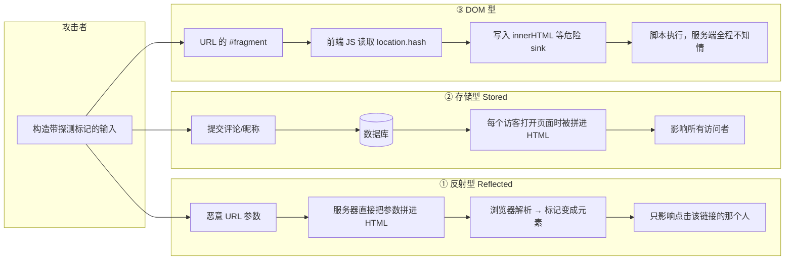
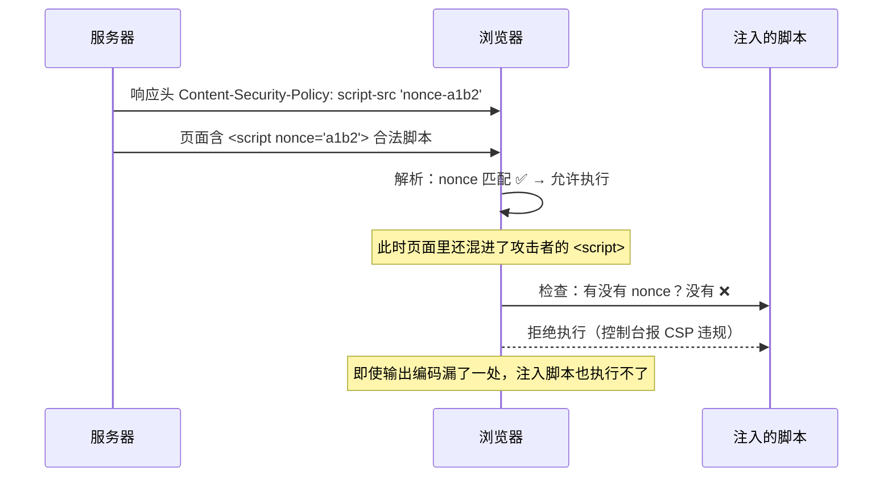

# Day 152 — XSS 与 Web 漏洞 · 图解

> 本文件用 **Mermaid 代码块 + ASCII 图** 把今天的概念画出来。
> 所有图都可以直接复制到支持 Mermaid 的编辑器（Typora / VS Code / GitHub）里渲染。
> 建议阅读顺序：先看图 1（三种 XSS 的差别），再看图 3（上下文与编码），
> 最后看图 7（检测流程）——它对应 `code/03-xss-scanner.py` 的实际执行步骤。

---

## 图 1：三种 XSS 的数据流全景



**一句话对比**

| | 数据从哪来 | 谁把它变回 HTML | 影响范围 |
|---|---|---|---|
| 反射型 | 本次请求参数 | 服务端模板 | 单人 |
| 存储型 | 数据库 | 服务端模板 | 所有人 |
| DOM 型 | 浏览器本地 | 前端 JS | 单人 |

---

## 图 2：存储型 vs 反射型的"修复位置"差异

```
【反射型】数据只在一次请求内活着

  用户 ──q=<mark>──► 服务器 ──拼进HTML──► 浏览器
                        ▲
                        └── 只需要改**这一处**输出代码，漏洞彻底消失


【存储型】数据被"留住"了，输出点可能有 N 个

  用户 ──评论──► 服务器 ──► 数据库 ─┬─► 前台评论页     ← 输出点 1（要编码）
                                     ├─► 后台审核页     ← 输出点 2（要编码）
                                     ├─► 邮件通知       ← 输出点 3（要转义）
                                     ├─► RSS / API      ← 输出点 4（要转义）
                                     └─► 搜索引擎快照   ← 输出点 5（已抓走的内容清不掉）

  ⚠️ 结论：存储型的修复是"逐输出点"的，漏一个就还在。
     所以更稳的思路是 —— 输出统一走同一个"安全渲染"函数，别让每处各写一遍。
```

---

## 图 3：上下文与编码对象（最容易踩的坑）

```
                     用户输入（同一条数据）
                             │
        ┌────────────────────┼────────────────────┐
        ▼                    ▼                    ▼
  <div>HERE</div>      <input value="HERE">   <a href="/s?q=HERE">
        │                    │                    │
   HTML 文本上下文      属性值上下文          URL 参数上下文
        │                    │                    │
   转义 & < > " '        转义 & < > " '          percent-encode
        │                    │                    │
        ▼                    ▼                    ▼
  &lt;x152probe&gt;    &quot;&gt;&lt;x…    %3Cx152probe%3E

  ❌ 只做"一种"转义 → 换个上下文就失效
  ❌ 属性值不加引号 → 空格就能"劈"出一个新属性
  ❌ 用黑名单过滤   → 永远有没想到的写法
```

---

## 图 4：属性上下文为什么必须转义引号

```
  HTML 源码:  <input type="text" value="HERE">

  ── 情况 A：HERE 只转义了尖括号（引号裸奔）────────────────
     输入:  " onmouseover="x152()
     结果:  <input type="text" value="" onmouseover="x152()">
                                     ▲
                                     └── 属性在这里被"闭合"了，
                                         后面的内容被解析成**新的属性**！

  ── 情况 B：HERE 做了完整转义（quote=True）──────────────
     输入:  " onmouseover="x152()
     结果:  <input type="text" value="&#34; onmouseover=&#34;x152()">
                                     ▲
                                     └── 引号变成实体，解析器看到的是"字符"，
                                         属性没有闭合，攻击面消失。

  ✅ 规则：属性值 = 必须加引号 + 必须转义引号。两条缺一不可。
```

---

## 图 5：CSP 的拦截时序（第二道防线）



**ASCII 版：**

```
  响应头: script-src 'nonce-a1b2' 'strict-dynamic'; object-src 'none'; base-uri 'none'
       │
       ▼
  浏览器逐项检查页面里的可执行内容
       │
       ├─ <script nonce="a1b2">        ✅ 允许
       ├─ <script>（攻击者注入）        ❌ 无 nonce → 拒绝
       ├─            ❌ 内联事件被 script-src 拦
       ├─ <script src="//evil.com/x.js">❌ 非白名单来源 → 拒绝
       └─ <object data="...">           ❌ object-src 'none' → 拒绝

  ⚠️ 三个"白写"的 CSP：
     1. 加了 'unsafe-inline'        → 内联脚本随便跑，等于没配
     2. 白名单里放了公共 CDN + JSONP → 攻击者能在该 CDN 上传文件
     3. nonce 每次响应不变          → 攻击者读一次页面就知道值了
```

---

## 图 6：CSRF 与 SameSite 的判定树

```
  浏览器要发一个请求去 bank.com，此时手里有 bank.com 的 Cookie
                        │
                        ▼
            这个请求是"跨站"发起的吗？
              （由目标站 + 发起者 origin 决定）
                    │             │
                  是 │             │ 否（同站：含子域）
                    ▼             ▼
        Cookie 带 SameSite 吗？    ✅ 一定会带 Cookie
             │        │              └── 必须靠 CSRF Token / Origin 校验
        Lax/Strict    None
             │          │
             ▼          ▼
    ┌─────────────┐  ✅ 会带 Cookie（且必须 Secure）
    │ 是"顶层导航"  │      └── 靠 CSRF Token / Origin 校验兜底
    │ 且是 GET 吗？│
    └──────┬──────┘
      是   │   否
      │    │
      ▼    ▼
   ⚠️带 Cookie  ❌ 不带 Cookie
   （GET 有副作用 → 必须改成 POST！）

  ⚠️ 关键陷阱：SameSite 判断的是"站点(site)"不是"源(origin)"，
     evil.example.com → app.example.com 属于**同站**，
     SameSite 完全挡不住 → 必须有 CSRF Token。
```

---

## 图 7：本地检测流程（对应 `code/03-xss-scanner.py`）

```
  ┌─────────────────────────────────────────────────────────┐
  │ 启动本地靶场 127.0.0.1:随机端口（只监听本机）             │
  │   /search  未编码        期望 FAIL                        │
  │   /attr    只转义尖括号  期望 WARN                        │
  │   /safe    完整编码      期望 PASS                        │
  │   /secure  编码 + 安全头 期望 PASS                        │
  └────────────────────────┬────────────────────────────────┘
                           │
                           ▼
  ┌─────────────────────────────────────────────────────────┐
  │ ① 生成唯一探测标记（不含任何可执行代码）                  │
  │    HTML 文本:  <x152probeXXXXXX>                          │
  │    双引号属性: "><x152probeXXXXXX>                        │
  │    单引号属性: '><x152probeXXXXXX>                        │
  └────────────────────────┬────────────────────────────────┘
                           │
                           ▼
  ┌─────────────────────────────────────────────────────────┐
  │ ② 发请求，在响应体里找三种形态                             │
  │    原样出现          → FAIL（标签/属性注入能力存在）       │
  │    只转义了尖括号    → WARN（引号裸奔，属性可逃逸）        │
  │    完整转义成实体    → PASS（输出编码生效）                │
  │    完全没出现        → INFO（参数未回显，不能推论）        │
  └────────────────────────┬────────────────────────────────┘
                           │
                           ▼
  ┌─────────────────────────────────────────────────────────┐
  │ ③ 页面 JS sink 扫描：innerHTML / document.write / eval    │
  │    → 发现即 WARN，提示"确认输入是否用户可控"（DOM 型线索） │
  └────────────────────────┬────────────────────────────────┘
                           │
                           ▼
  ┌─────────────────────────────────────────────────────────┐
  │ ④ 安全头审计：CSP / nosniff / X-Frame-Options /           │
  │    Referrer-Policy / Cookie(HttpOnly+Secure+SameSite)     │
  └────────────────────────┬────────────────────────────────┘
                           │
                           ▼
        分级报告 PASS/WARN/FAIL + 退出码（FAIL>0 → exit 1）
```

**为什么"区分得出四者"本身就是对扫描器的检验：**

```
  一个只会说"有/没有"的扫描器是不可信的。
  只有当它能把"未编码 / 半编码 / 已编码 / 有安全头"分辨清楚时，
  它给出的结论才有参考价值。
  → 这就是自建靶场的意义：**先验证工具，再相信工具。**
```

---

## 图 8：纵深防御分层（出了事谁来兜底）

```
  ┌───────────────────────────────────────────────────────────┐
  │ 第 1 层  输出编码（根治）                                   │
  │          按上下文编码，属性值加引号且转义引号                │
  │          被绕过？ → 看第 2 层                                │
  ├───────────────────────────────────────────────────────────┤
  │ 第 2 层  不要拼 HTML                                        │
  │          DOM API / 模板自动转义 / 禁用 |safe                │
  │          被绕过？ → 看第 3 层                                │
  ├───────────────────────────────────────────────────────────┤
  │ 第 3 层  富文本净化（白名单解析树）                          │
  │          被绕过？ → 看第 4 层                                │
  ├───────────────────────────────────────────────────────────┤
  │ 第 4 层  CSP（nonce + strict-dynamic）                       │
  │          注入的脚本执行不了                                  │
  │          被绕过？ → 看第 5 层                                │
  ├───────────────────────────────────────────────────────────┤
  │ 第 5 层  Cookie 标志（HttpOnly 防读 / SameSite 防跨站）       │
  │          就算脚本跑了，也读不到会话 Cookie                    │
  ├───────────────────────────────────────────────────────────┤
  │ 第 6 层  CSRF Token / Origin 校验                            │
  │          挡住"借用身份"的跨站请求                             │
  ├───────────────────────────────────────────────────────────┤
  │ 第 7 层  监控告警 + 日志（CSP report / 异常请求检测）         │
  │          出了事能第一时间知道并定位                           │
  └───────────────────────────────────────────────────────────┘

  ⚠️ 只有第 1 层是"根治"，2~7 层是"降低后果"。
     现实里必须全部配置 —— 因为任何一层都可能因为历史代码而失效。
```

---

## 图 9：XSS 与 CSRF 的关系（为什么两者要一起防）

```
  有 XSS 时，CSRF 防护会怎样？

  攻击者的脚本在受害者浏览器里执行
        │
        ├─ 读 document.cookie
        │     ├─ Cookie 有 HttpOnly  → ❌ 读不到（安全）
        │     └─ Cookie 无 HttpOnly  → ✅ 会话被偷走
        │
        ├─ 读页面里的 CSRF Token（藏在 <input hidden> 或 <meta>）
        │     └─ ✅ 一般读得到 → 传统 CSRF Token 防护**失效**
        │
        └─ 直接 fetch('/transfer', {method:'POST', credentials:'include'})
              └─ ✅ 浏览器自动带 Cookie → 根本不需要"偷"CSRF Token

  ✅ 结论：
     * HttpOnly 保护"读"，保护不了"用"
     * 真正的兜底是 CSP（让脚本压根跑不起来）
     * 所以顺序永远是：先防 XSS，再谈 CSRF —— 纵深防御，不互相替代
```

---

## 附：今日图解速查表

| 图 | 内容 | 对应正文 |
|---|---|---|
| 图 1 | 三种 XSS 数据流 | README 1.2 ~ 1.5 |
| 图 2 | 存储型多输出点 | README 1.4 |
| 图 3 | 上下文与编码对象 | README 2.1 ~ 2.2 |
| 图 4 | 属性引号为什么必须转义 | README 2.2 |
| 图 5 | CSP 拦截时序 | README 2.4 |
| 图 6 | CSRF / SameSite 判定树 | README 1.8 / 2.7 |
| 图 7 | 本地检测流程 | `code/03-xss-scanner.py` |
| 图 8 | 纵深防御分层 | README 六、思考题 5 |
| 图 9 | XSS 与 CSRF 联动 | README 1.7 |
