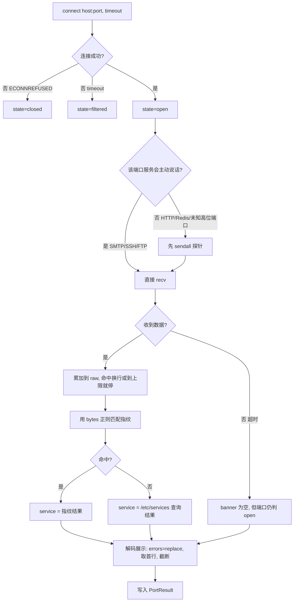

# Day 153 — 端口扫描进阶：Nmap、banner 抓取与自动化扫描器

> 阶段：Phase 8 — 网络安全实战 · 主题：端口扫描进阶
>
> 前置知识：Day 115 socket 编程、Day 116 TCP/UDP 协议、Day 146 HTTPS/TLS 分析、
> Day 151 网络嗅探（如有）、Day 152 中间人攻击与防御（如有）。
> 今天把"网络协议"从课本概念变成**手上能跑的工具**：先理解 Nmap 的四种扫描
> 类型为什么这么设计，再亲手实现 banner 抓取，最后写一个多线程的自动化
> 端口扫描器，把结果导出成 JSON / CSV / Markdown 报告。

---

## ⚠️ 使用前必读：法律边界

端口扫描在几乎所有司法管辖区都被视为**对计算机系统的探测行为**。
未经授权扫描他人资产，**哪怕只发一个 SYN 包**，也可能触犯：

| 法域 | 相关法条 |
|---|---|
| 中国大陆 | 《刑法》第 285 条（非法侵入 / 非法获取计算机信息系统数据）、第 286 条（破坏计算机信息系统）；《网络安全法》第 27 条 |
| 美国 | CFAA, 18 U.S.C. § 1030 |
| 英国 | Computer Misuse Act 1990, s.1 |
| 欧盟 | 各国转化实施的《网络犯罪公约》条款 |

**允许使用本日内容的场景（白名单）：**

1. 你自己的机器（`127.0.0.1`）、你自己的云主机；
2. 你所在组织的资产，且**持有书面授权**——授权书需写明 IP 段、时间窗、
   允许的技术手段（是否允许版本探测 / UDP 扫描）、应急联系人；
3. 专门的授权靶场（自建 DVWA、VulnHub、HackTheBox、CTF 环境）。

**本日所有代码的目标都被硬编码为 `127.0.0.1`**，并且示例 03 内置了
"非本机目标必须显式声明授权"的护栏。这不是形式主义：把安全边界写进代码，
是安全工程师和"脚本小子"的分水岭。

> 本系列定位是**安全防御与教学**。学端口扫描的目的不是"去扫别人"，
> 而是搞清楚**自己的机器上有哪些门开着**，然后去关掉它们。

---

## 一、概念解释

### 1.1 端口到底是什么

一个 IP 地址标识"一台主机"，一个端口号标识"这台主机上的一个服务入口"。
端口号是 16 位无符号整数，范围 `0~65535`，按 IANA 约定分三段：

| 区间 | 名称 | 含义 |
|---|---|---|
| 0 ~ 1023 | 系统端口（Well-known） | 需要 root/管理员权限才能绑定；如 22/SSH、80/HTTP、443/HTTPS |
| 1024 ~ 49151 | 注册端口（Registered） | 普通用户可绑定；如 3306/MySQL、6379/Redis、8080/HTTP-Alt |
| 49152 ~ 65535 | 动态/临时端口（Ephemeral） | 操作系统给客户端连接随机分配；任何普通程序都能绑 |

**为什么需要"端口"这一层？** 因为同一台机器上要跑很多服务（Web、SSH、数据库），
TCP/IP 协议栈需要用端口号做**多路复用（multiplexing）**：内核收到一个 TCP
报文，靠四元组 `(源IP, 源端口, 目标IP, 目标端口)` 决定把它交给哪个进程的 socket。

**关键推论（后面反复用到）：** TCP 端口是"按需监听"的。**没有进程在某个端口上
调用 `listen()`，内核就会拒绝到该端口的连接请求**（回一个 RST）。这正是端口扫描
能判断"端口是否开放"的底层依据。

### 1.2 端口扫描在问什么

| 扫描要回答的问题 | 依赖的机制 |
|---|---|
| 这台主机活着吗？ | ICMP echo / TCP 响应 / ARP |
| 哪些 TCP 端口开放？ | 完成三次握手，或收到 SYN/ACK |
| 哪些 UDP 端口开放？ | 收到响应，或反推"没有 ICMP 不可达" |
| 端口后面是什么服务/版本？ | banner 抓取 + 探针 + 指纹匹配 |
| 有没有防火墙？它什么策略？ | 对比"回 RST"与"直接丢包" |

**注意第 5 条**。这是初学者最容易漏掉、也是防御方最该关心的：如果某个端口
**超时**而不是**被拒绝**，通常说明链路中间有一台设备**主动丢弃**了你的包——
也就是说，**有防火墙，而且它可能记录了你的行为**。

### 1.3 四种常用扫描类型

| 类型 | Nmap 参数 | 原理 | 需要 root | 速度 | 隐蔽性 |
|---|---|---|---|---|---|
| TCP connect | `-sT` | 调用 `connect()`，完成完整三次握手 | ❌ | 慢 | 差（应用层日志能看见） |
| TCP SYN | `-sS` | 只发 SYN，收到 SYN/ACK 后发 RST 掐断 | ✅ | 快 | 好（半开，不进应用层） |
| UDP | `-sU` | 发空 UDP 包，看是否回 ICMP 不可达 | 多数 ✅ | 极慢 | 中 |
| 版本探测 | `-sV` | 抓 banner + 发协议探针做指纹匹配 | ❌ | 慢 | 差（会触发应用逻辑） |
| 空闲扫描 | `-sI` | 借"僵尸主机"的 IP ID 做跳板 | ✅ | 极慢 | 极好（不暴露自己） |

**为什么 SYN 扫描需要 root？** 因为它要自己构造 TCP 报文（原始套接字，
`AF_INET + SOCK_RAW`），而不是让内核的 TCP 协议栈代劳。普通用户无法创建
原始套接字，这是操作系统的安全设计（防止用户态伪造任意报文）。

**为什么 SYN 扫描更隐蔽？** 看内核侧发生了什么：

```
connect 扫描（-sT）：
  客户端内核 ──SYN──▶ 目标内核 ──▶ 目标进程 accept() 返回！
              ◀─SYN/ACK─
              ──ACK──▶            ← 连接进入 ESTABLISHED
  目标**应用层**（nginx/sshd）看到了一条真实连接 → 写访问日志、计入连接数

SYN 扫描（-sS）：
  扫描器 ──SYN──▶ 目标内核 ──▶ 内核回 SYN/ACK，但 accept() 队列**未被消费**
           ◀─SYN/ACK─
           ──RST──▶            ← 连接被立刻销毁，从未 ESTABLISHED
  目标**应用层**什么也没看到（内核压根没把它交出去）→ 日志里通常无痕
```

⚠️ **避坑**：现代防火墙（状态检测）和 IDS 对"大量半开连接"非常敏感，
SYN 扫描"隐蔽"只是相对 connect 扫描而言。真正的隐蔽要靠**慢速扫描**
（`-T0/-T1`）+ 分布式源 + 正常业务流量掩护。

### 1.4 时序模板 `-T0 ~ -T5`

| 模板 | 名称 | 并发/超时 | 适用场景 |
|---|---|---|---|
| `-T0` | paranoid | 每 5 分钟 1 个包 | 躲避 IDS，实战基本不用（太慢） |
| `-T1` | sneaky | 每 15 秒 1 个包 | 同上 |
| `-T2` | polite | 大幅降速 | **脆弱的生产设备**（老交换机、工控 PLC） |
| `-T3` | normal | **默认** | 绝大多数情况，从它开始 |
| `-T4` | aggressive | 提高并发、缩短超时 | 局域网、自己的机器、网络状况良好时 |
| `-T5` | insane | 极限并发、超时 0.3s | 仅限本机/同机房，会牺牲准确率 |

**为什么默认是 T3 而不是 T5？** 因为 T5 会带来三个真实后果：

1. **丢包 → 漏报**：超时被压到 0.3 秒，网络稍有抖动，真正开放的端口会被
   判成"关闭"——**扫描结果错了，比扫得慢更糟**；
2. **触发防御 → 自我封禁**：目标防火墙的 SYN Flood 防护会直接把你的源 IP
   拉黑，后续所有扫描全是错的；
3. **打崩目标 → 事故**：在授权的生产环境里，扫描器把业务链路打满属于
   **生产事故**，可能违反授权条款。

### 1.5 端口选择 `-p`

| 写法 | 含义 | 备注 |
|---|---|---|
| `-p 22,80,443` | 指定若干端口 | 最常用 |
| `-p 1-1024` | 范围 | 覆盖所有系统端口 |
| `-p-` | 全部 65535 个端口 | 耗时可能是 `-p 1-1024` 的 60 倍 |
| `-p http,https` | 按服务名 | nmap 会查 `/etc/services` 翻译 |
| `--top-ports 100` | 最常见的 100 个端口 | 基于 nmap 的 `nmap-services` 频率表 |
| `-F` | Fast，常见 100 端口 | 等价 `--top-ports 100` |
| `--exclude-ports 80` | 排除 | 避免打扰生产 Web |

**为什么要"先小后大"？** 扫描耗时的近似公式：

```
总耗时 ≈ (端口数 × 单端口探测时间) / 并发度
```

`-sV` 会把单端口探测时间从 ~1ms 放大到几百毫秒，`-p-` 会把端口数从 1000
放大到 65535。**一次 `-sV -p- -T4` 的扫描，可能比 `-p 1-1024 -T3` 慢 1000 倍。**

### 1.6 banner 抓取与服务识别

**定义**：banner 是服务在连接建立后（或收到特定请求后）返回的**标识性文本**，
通常包含软件名和版本，例如：

```
SSH-2.0-OpenSSH_9.6p1 Ubuntu-3ubuntu13.19        ← SSH
220 mail.example.com ESMTP Postfix                ← SMTP
HTTP/1.1 200 OK  /  Server: nginx/1.24.0          ← HTTP
+OK Dovecot ready.                                ← POP3
$6379 ... -NOAUTH Authentication required         ← Redis
```

**为什么 banner 这么重要？** 因为"端口 22 开放"只能告诉你有 SSH，而
"SSH-2.0-OpenSSH_7.4"能告诉你**这是一台 2016 年的老 OpenSSH，可能存在
CVE-2018-15473 用户名枚举**。服务识别的粒度，直接决定漏洞评估的准确度。

**难点：服务的"性格"不止一种。**

| 性格 | 代表服务 | 抓取方式 |
|---|---|---|
| 话痨型：连上就说 | SMTP、FTP、SSH、POP3、MySQL（服务端先发握手包） | connect 后直接 `recv` |
| 沉默型：你先开口 | HTTP、HTTPS、Redis、Memcached、多数自研协议 | 先发**探针**再 `recv` |
| 冰柜型：连上也不说话 | 无响应服务、被限速的服务、部分负载均衡后端的黑洞 | 只能靠超时结束 |
| 反侦测型：故意撒谎/不发 | 改过 banner 的 SSH、返回假 Server 头的 Web | 需要**多条探针 + 行为特征**联合判断 |

### 1.7 三个必须分清的状态

扫描结果里，一个端口有**三种**状态，混淆它们会导致错误的安全结论：

| 状态 | 现象 | 真实含义 | 防御建议 |
|---|---|---|---|
| `open` | connect 成功 / 收到 SYN-ACK | 有进程在监听，服务可达 | 确认是否**必须**对外 |
| `closed` | 收到 RST（`ECONNREFUSED`） | 主机在，但该端口无监听 | 正常；但说明**主机可达** |
| `filtered` | 超时 / 无响应（`ETIMEDOUT`） | 报文被**丢弃**，多半有防火墙 | 检查防火墙策略是否过宽 |

> **一条容易搞错的推论**：`closed` 不代表"安全"。攻击者知道**主机在线**，
> 并且知道你的防火墙**允许** ICMP/RST 回包——这些信息本身就是情报。
> 最安全的姿态是 `filtered`（静默丢弃），而不是 `closed`。

---

## 二、原理解释（底层机制与设计动机）

### 2.1 TCP 三次握手与扫描类型的关系

```
        扫描器（客户端）                    目标（服务端）
              │                                 │
   ① SYN      │ ───────────────────────────────▶│  CLOSED → 回 RST
              │ ◀─────────────────────────────── │  LISTEN → 回 SYN/ACK
              │                                 │
   ② SYN/ACK  │ ◀─────────────────────────────── │
              │                                 │
   ③ ACK      │ ───────────────────────────────▶│  ESTABLISHED（双方）

   ── connect 扫描（-sT）：走完 ①②③，由内核完成，应用层可见
   ── SYN 扫描（-sS）：只做 ①②，然后**自己发 RST** 取代 ③，应用层不可见
   ── 防火墙 REJECT：在第 ① 步就回 RST → 扫描器看到"closed"
   ── 防火墙 DROP：第 ① 步的 SYN 被丢弃，没有回应 → 扫描器看到"filtered"
```

**为什么"收到 RST"是 `closed`，而不是"未知"？** 因为 RST 是**来自目标主机
的内核**的明确答复："我这里没有进程监听这个端口"。而超时只是"我没收到任何
答复"，可能因为：目标主机不存在、防火墙丢包、路由黑洞。两者的**证据强度
完全不同**。

### 2.2 为什么 UDP 扫描这么不可靠

UDP 是无连接协议，没有握手可以判断，只能靠**排除法**：

```
发送 UDP 包到目标端口:
  ├── 收到应用层响应          → open（最确定）
  ├── 收到 ICMP port unreachable → closed（确定）
  └── 什么都没收到             → ？？？（可能是 open，也可能是被丢包）
```

**三个导致不可靠的现实因素：**

1. **合法沉默**：很多 UDP 服务（如某些 DNS 服务器对非法查询、SNMP 对错误的
   community）设计上就不回应。**"不回应"是合法行为**，你无法区分它与丢包。
2. **ICMP 限速**：Linux 默认 `net.ipv4.icmp_ratelimit = 1000`（每秒最多 1000 个
   ICMP 相关报文），且很多云厂商直接限速或过滤 ICMP。ICMP 不可达报文会被
   内核丢弃 → 你看到的全是"超时"。
3. **重传与超时**：UDP 没有重传机制，单包丢失就永久丢失。要降低误判只能
   **多次重试 + 加长超时**，这使得 UDP 扫描的时间成本是 TCP 的 10~100 倍。

**实践建议**：`-sU` 只扫你确实关心的少数端口（53/161/123/500），并且接受
"结果仅供参考"。

### 2.3 为什么"扫描到开放"不等于"服务可用"

有四种常见情况会让扫描结论与事实不符：

| 情况 | 现象 | 原因 |
|---|---|---|
| 反向代理 / 端口转发 | 8080 显示开放，但直连后端失败 | 中间有 nginx/haproxy 转发 |
| SYN 代理 / 负载均衡 | 所有端口都"开放" | 中间的 LB 代替后端回 SYN/ACK |
| 云安全组白名单 | 你自己的 IP 扫不到，别人却能连 | 安全组按源 IP 放行 |
| 本地回环 vs 外部网卡 | `127.0.0.1:3306` 开放，`公网IP:3306` 关闭 | 服务只绑了 `127.0.0.1` |

**最后一条是最常见、也最容易被忽略的**，也是本日所有演示都在
`127.0.0.1` 上做的原因：**你扫本机开放，不代表对外开放；你扫本机关闭，
也不代表没有被 `0.0.0.0` 监听的进程——要看你从哪个地址发起的连接。**

### 2.4 `python-nmap` 的原理：它其实是个"命令行包装器"

`python-nmap` 并没有重新实现 TCP/IP 扫描逻辑，它的工作方式是：

```
你的 Python 代码
    │  nm.scan(hosts=..., ports=..., arguments='-sS -sV -T4')
    ▼
python-nmap 拼接命令行: nmap -sS -sV -T4 -p <ports> <hosts> -oX -
    │  subprocess.Popen(...)
    ▼
系统里的 nmap 可执行文件（真正干活的）
    │  把结果以 XML 写到 stdout
    ▼
python-nmap 用 ElementTree 解析 XML，包装成 PortScanner 对象
    ▼
你拿到 nm['127.0.0.1']['tcp'][80] 这样的字典
```

**三个重要推论：**

1. **系统里必须装了 nmap**，否则 `python-nmap` 会报 `nmap program was not found in path`。
   **库的缺失和可执行文件的缺失是两回事**，检测要分开做。
2. **它继承了 nmap 的全部能力，也继承了 nmap 的全部限制**（需要 root 才能 `-sS`）。
3. 你**完全可以不用这个库**，自己用 `subprocess + xml.etree` 做同样的事——
   示例 01 就把这两条路都写了出来，方便对比。

### 2.5 并发模型：为什么用线程池而不是协程

扫描是**I/O 密集型（I/O-bound）**任务：绝大部分时间花在"等待网络响应"上，
CPU 几乎不动。Python 的 GIL 限制的是**CPU 并行**，而 `socket.connect/recv`
在阻塞期间会**释放 GIL**，所以多线程在这个场景下能真正并行等待。

| 方案 | 优点 | 缺点 | 本日选用 |
|---|---|---|---|
| 串行 | 简单、结果有序 | 慢（N 个端口 × 超时） | ❌ |
| 线程池 `ThreadPoolExecutor` | 实现简单、易限流、易收结果 | 线程数上千时内存吃紧 | ✅ 示例 03 |
| `asyncio` | 单线程可支持数万并发 | 需要异步版 socket API，代码复杂 | ⏭ 进阶 |
| 多进程 | 绕过 GIL | 进程开销大、共享数据麻烦 | ❌ 不适用 |

**并发能把耗时压到多少？** 理想情况下：

```
串行耗时  ≈ Σ(单端口耗时)
并发耗时  ≈ max(单端口耗时) + 调度开销     （当 并发度 ≥ 端口数）
```

对"大部分端口都超时"的场景，串行 1000 个端口 × 0.6 秒 = **10 分钟**；
64 并发则约 **10 秒**——这就是为什么真实扫描器必须并发。

### 2.6 为什么扫描器必须限流（防御视角）

**对目标而言**：500 并发 × 65535 端口 ≈ 每秒数万个 SYN，效果等同于一次
小型 SYN Flood。这会：

- 打满目标的连接跟踪表（`conntrack` 满 → **正常用户也连不进来**，这是
  真实的生产事故）；
- 触发 IPS/云 WAF 的封禁规则 → 测试中断；
- 违反授权条款（多数授权书会写明"不得影响业务可用性"）。

**对自己而言**：每个并发连接占一个文件描述符。Linux 默认 `ulimit -n` 是
1024（部分发行版 65535）。开 5000 个线程池任务，会以
`OSError: [Errno 24] Too many open files` 崩掉。

**本日的默认值**：`max_workers=64`、`timeout=0.6s`。这是一组"自己的机器上
跑得舒服、对目标也礼貌"的参数。

---

## 三、定义与使用方法（API 速查表）

### 3.1 Nmap 命令行速查

```bash
# ── 扫描类型（互斥，默认 -sS 若有 root，否则 -sT）──
nmap -sT   <target>     # TCP connect
nmap -sS   <target>     # TCP SYN（需 root）
nmap -sU   <target>     # UDP（慢，建议配合 -p 限定范围）
nmap -sn   <target>     # Ping 扫描，只探主机存活，不扫端口

# ── 服务与系统识别 ──
nmap -sV   <target>     # 服务版本探测
nmap -O    <target>     # 操作系统识别（需 root）
nmap -A    <target>     # 激进模式 = -sV -O -sC --traceroute
nmap -sC   <target>     # 用默认脚本集（等价 --script=default）
nmap --script=http-title <target>          # 指定 NSE 脚本
nmap --script=vuln <target>                # 漏洞脚本集（慎用，会真发攻击流量）

# ── 端口与主机范围 ──
nmap -p 22,80,443 <target>
nmap -p 1-1024 <target>
nmap -p- <target>                          # 全端口
nmap --top-ports 100 <target>
nmap -Pn <target>                          # 跳过主机存活检测（对防火墙后主机必用）
nmap 192.168.1.0/24                        # 整个 C 段
nmap -iL targets.txt                       # 从文件读目标
nmap --exclude 192.168.1.1 <target>

# ── 性能与时序 ──
nmap -T0..-T5 <target>                     # 时序模板
nmap --max-retries 2 <target>              # 最大重传次数
nmap --min-rate 100 <target>               # 每秒最少发包数
nmap --max-rate 50 <target>                # 限速（对目标礼貌）

# ── 输出格式（重要：机器可解析的出口）──
nmap -oN normal.txt <target>               # 人类可读文本
nmap -oX result.xml <target>               # XML（**最推荐**）
nmap -oG greppable.txt <target>            # greppable，一行一主机
nmap -oA scan <target>                     # 同时生成上面三种（文件名前缀 scan）
nmap -oX - <target>                        # XML 到 stdout（给程序用）
```

### 3.2 `python-nmap` API 速查

```python
import nmap                                  # pip install python-nmap

nm = nmap.PortScanner()                      # 构造（会检查 nmap 可执行文件）

# scan() —— 三个参数与命令行的对应关系
nm.scan(hosts='127.0.0.1',                   #   → 位置参数 target
        ports='22,80,443',                   #   → -p
        arguments='-sT -sV -T3')             #   → 其余所有参数
nm.command_line()                            # 看它实际拼出的命令行（调试神器）
nm.scaninfo()                                # {'tcp': {'method': 'connect', 'services': '22,80,443'}}

# 遍历结果
nm.all_hosts()                               # ['127.0.0.1']
nm['127.0.0.1'].state()                      # 'up' / 'down'
nm['127.0.0.1'].hostname()                   # 反向解析的主机名
nm['127.0.0.1'].all_protocols()              # ['tcp']
nm['127.0.0.1']['tcp'].keys()                # dict_keys([22, 80, 443])
info = nm['127.0.0.1']['tcp'][80]
#   info = {'state': 'open', 'reason': 'syn-ack', 'name': 'http',
#           'product': 'nginx', 'version': '1.24.0', 'extrainfo': '',
#           'cpe': 'cpe:/a:igor_sysoev:nginx:1.24.0', 'conf': '10'}
info.get('script', {})                       # NSE 脚本输出（用 -sC 时有）

# 常用异常
#   nmap.PortScannerError: 'nmap program was not found in path.'
#   nmap.PortScannerError: 'Insufficient privileges to perform this scan.'
```

| python-nmap 成员 | 类型 | 说明 |
|---|---|---|
| `PortScanner()` | 构造 | 内部 `subprocess.Popen` 调 nmap |
| `.scan(hosts, ports, arguments, ...)` | 方法 | 执行扫描（阻塞） |
| `.command_line()` | 方法 | 返回实际执行的命令行字符串 |
| `.all_hosts()` | 方法 | 扫描到的主机列表 |
| `.[host].state()` | 方法 | `up` / `down` |
| `.[host].all_protocols()` | 方法 | 通常是 `['tcp']` 或 `['tcp','udp']` |
| `.scaninfo()` | 方法 | 本次扫描的方法/端口/协议信息 |

### 3.3 标准库 `socket` 速查（扫描必需部分）

```python
import socket

# ── 创建与超时 ──
s = socket.socket(socket.AF_INET, socket.SOCK_STREAM)   # TCP/IPv4
s = socket.socket(socket.AF_INET6, socket.SOCK_STREAM)  # TCP/IPv6
s = socket.socket(socket.AF_INET, socket.SOCK_DGRAM)    # UDP
s.settimeout(0.6)                                       # **读写**超时（秒，float 可用）
s.setsockopt(socket.SOL_SOCKET, socket.SO_REUSEADDR, 1) # 服务端：端口可立即重用

# ── 连接：两种语义 ──
s.connect((host, port))          # 失败抛异常（ConnectionRefusedError / socket.timeout）
code = s.connect_ex((host, port))  # 失败**返回 errno**，不抛异常 → 扫描循环首选
#   0 → open   |   111 ECONNREFUSED → closed   |   110 ETIMEDOUT → filtered
#   113 EHOSTUNREACH → 路由不可达             |   101 ENETUNREACH → 网络不可达

socket.create_connection((host, port), timeout=1.0)  # 一次性搞定连接 + 超时（推荐）

# ── 收发 ──
s.sendall(b"GET / HTTP/1.0\r\nHost: x\r\n\r\n")     # 保证全部字节发出去
data = s.recv(1024)                                  # 最多读 1024 字节；b"" 表示对端关闭
s.shutdown(socket.SHUT_WR)                           # 半关闭：只关写方向（发 FIN）

# ── 关闭 ──
with socket.create_connection(...) as s:  # 上下文管理器，异常也会关
    ...
s.close()

# ── 名字与端口互查 ──
socket.getservbyport(80, "tcp")      # 'http'（查 /etc/services）
socket.getservbyname("https", "tcp") # 443
socket.gethostbyname("localhost")    # '127.0.0.1'
socket.getaddrinfo("localhost", 80)  # 解析 → [(family, type, proto, canonname, sockaddr), ...]
```

### 3.4 `concurrent.futures` 速查（并发扫描骨架）

```python
from concurrent.futures import ThreadPoolExecutor, as_completed

with ThreadPoolExecutor(max_workers=64) as pool:      # 上下文退出会 join 所有线程
    futures = {pool.submit(scan_one_port, host, p, 0.6): p for p in ports}
    for fut in as_completed(futures):                 # 按**完成顺序**收结果
        port = futures[fut]                           # 反查这个 future 是哪个端口
        result = fut.result()                         # 取返回值（异常会在这里抛）
```

| 成员 | 说明 |
|---|---|
| `ThreadPoolExecutor(max_workers=N)` | 最多 N 个线程同时工作 |
| `pool.submit(fn, *args)` | 提交任务，立即返回 `Future` |
| `as_completed(futures)` | 迭代器，谁先完成谁先出（**不要用 `map`，它按提交顺序阻塞**） |
| `fut.result()` | 取结果；任务抛异常时在此重新抛出 |
| `pool.map(fn, iterable)` | 简化版，但结果是**有序**的，要等前面完成 |
| `with` 语句 | 退出时 `shutdown(wait=True)`，保证所有任务收尾 |

### 3.5 常见端口—服务对照（防御自查用）

| 端口 | 服务 | 风险提示 |
|---|---|---|
| 21 / 20 | FTP | 明文传输，凭据可被嗅探；应换 SFTP/FTPS |
| 22 | SSH | 爆破重灾区；建议改端口 + 密钥登录 + 禁 root |
| 23 | Telnet | 明文，**绝对不应对外开放** |
| 25 / 587 | SMTP | 开放中继会造成垃圾邮件泛滥 |
| 53 | DNS | 开放递归解析会被用于 DNS 放大攻击 |
| 80 / 443 | HTTP/S | 注意管理后台是否暴露 |
| 445 | SMB | 永恒之蓝（MS17-010）；**绝不可暴露公网** |
| 1433 / 3306 / 5432 | MSSQL/MySQL/PG | 数据库绝不应公网可达 |
| 3389 | RDP | 爆破 + 勒索软件主要入口；建议加 VPN/网关 |
| 5900 | VNC | 大量实例无密码 |
| 6379 | Redis | 未授权访问 → 可写 SSH key / crontab → 直接拿 shell |
| 9200 / 9300 | Elasticsearch | 未授权可读全量数据 / RCE |
| 11211 | Memcached | 未授权 + UDP 放大攻击 |
| 27017 | MongoDB | 未授权访问经典目标 |
| 2375 | Docker API | 未授权 = 主机 root |
| 8888 | Jupyter | 未授权 = 任意代码执行 |

**共同规律**：**"中间件/数据库 + 默认无认证 + 默认监听 0.0.0.0"** 是导致
数据泄露的第一大原因。自检时优先查这几个端口。

### 3.6 `connect_ex` 返回码速查

| errno | 常量 | 判定 | 含义 |
|---|---|---|---|
| 0 | — | `open` | 连接成功 |
| 111 | `ECONNREFUSED` | `closed` | 目标回应了 RST，端口无监听 |
| 110 | `ETIMEDOUT` | `filtered` | 无任何响应，被 DROP |
| 113 | `EHOSTUNREACH` | `filtered` | 主机/路由不可达 |
| 101 | `ENETUNREACH` | `filtered` | 网络不可达（本地无路由） |
| 104 | `ECONNRESET` | 视情况 | 连接被重置（可能触发过 WAF） |

---

## 四、图解

### 4.1 扫描类型对比（Mermaid 时序图）


### 4.2 banner 抓取决策流程（Mermaid 流程图）



### 4.3 并发扫描的时间线（ASCII）

```
串行（1 个 worker）—— 总耗时 = 各端口耗时之和
 端口 t=0ms                600ms               1200ms              1800ms
  22  ████████ open（11ms）
  80  ........................████████ closed （等 600ms 超时）
  443 ........................................████████ filtered
 3306 ........................................................████████
 总耗时 ≈ 1800ms

并发（8 个 worker）—— 总耗时 ≈ 最慢那个端口
 端口 t=0ms                600ms
  22  ████ open
  80  ████████████████████████ closed
 443  ████████████████████████ filtered
 3306 ████████████████████████ filtered
 总耗时 ≈ 620ms   →  提升约 2.9 倍（端口越多提升越明显）

 ⚠️ 但并发度不是越高越好：
   500 并发 → 目标 conntrack 表被打满 → 正常用户连不进来（事故！）
```

### 4.4 自动化扫描器架构（ASCII）

```
                    ┌──────────────────────────────┐
                    │          命令行参数            │
                    │  --target  --ports  --workers │
                    └──────────────┬───────────────┘
                                   ▼
                    ┌──────────────────────────────┐
                    │  授权护栏 enforce_scope()      │
                    │  非本机目标 → 必须显式声明      │
                    └──────────────┬───────────────┘
                                   ▼
                    ┌──────────────────────────────┐
                    │  parse_ports("22,8000-8100")  │
                    │  → 去重、排序、校验范围         │
                    └──────────────┬───────────────┘
                                   ▼
        ┌──────────────────────────────────────────────────┐
        │        ThreadPoolExecutor(max_workers=64)         │
        │  ┌────────┐ ┌────────┐ ┌────────┐      ┌────────┐ │
        │  │worker 1│ │worker 2│ │worker 3│ ...  │worker N│ │
        │  └───┬────┘ └───┬────┘ └───┬────┘      └───┬────┘ │
        │      │ scan_one_port(host, port, timeout)  │      │
        │      ▼          ▼          ▼                ▼      │
        │  connect_ex → 判三态 → 发探针 → recv → 指纹匹配     │
        └──────────────────────┬───────────────────────────┘
                               ▼ as_completed（完成即收）
                    ┌──────────────────────────────┐
                    │   List[PortResult] 按端口排序  │
                    └──────────────┬───────────────┘
                    ┌──────────────┼───────────────┐
                    ▼              ▼               ▼
              scan-result.json  .csv        scan-report.md
              （给程序/CI）    （给表格）    （给人看）
```

### 4.5 端口三态与防火墙策略（ASCII）

```
                    扫描器发出 SYN
                          │
        ┌─────────────────┼──────────────────┐
        │                 │                  │
   收到 SYN/ACK       收到 RST           无任何响应
        │                 │                  │
      open             closed            filtered
        │                 │                  │
   "有服务在听"      "主机活着，          "有设备在丢包"
        │              端口没开"              │
        ▼                 ▼                  ▼
   去查是什么服务     风险较低，但        检查防火墙规则；
   + 版本漏洞         暴露了主机存活        这也是 IDS 会
                                          记录你行为的信号
```

---

## 五、完整可运行实战代码

三个脚本都在 `code/` 下，**只依赖标准库**，`python3 xx.py` 直接跑通。
全部目标硬编码为 `127.0.0.1`。

### 5.1 `code/01-nmap-basics.py`（569 行）— Nmap 基础与三种调用方式

- 打印四种扫描类型 / 时序模板 / 端口选择的**知识矩阵**与等价命令行；
- **方式 A**：`subprocess` 调 `nmap -oX -`，用 `xml.etree` 解析 XML
  （推荐的生产做法，机器可读、版本稳定）；
- **方式 B**：`python-nmap` 的 `PortScanner` / `scan()` / 结果结构，
  并演示**未安装时如何优雅降级**（打印安装提示 + 走兜底路径）；
- **方式 C**：纯 `socket.connect_ex` 的 connect 扫描兜底（无依赖、无需 root）；
- 脚本自己在本机随机端口起一个 HTTP 服务，保证扫描**一定有结果**可看。

```bash
python3 code/01-nmap-basics.py
```

### 5.2 `code/02-banner-grab-pitfalls.py`（607 行）— banner 抓取的 8 个坑

先在本机起三个"性格不同"的服务（话痨型 / 冰柜型 / 请求-响应型），
然后逐个踩坑、逐个修复：

| # | 坑 | 后果 | 修复 |
|---|---|---|---|
| 1 | 不设超时 | 脚本永久卡死（内核 keepalive 要 2 小时 11 分） | `create_connection(timeout=)` + `settimeout()` |
| 2 | 端口开着就干等 → 抓不到 banner | HTTP 等协议要你先开口 | 按协议选探针 |
| 3 | 只 `recv` 一次 | banner 被 TCP 分段切碎 → 指纹匹配失败 | 循环读到超时/分隔符/上限 |
| 4 | 直接 `decode("utf-8")` | 二进制 banner 抛异常炸掉线程 | `errors="replace"` 或 `latin-1` |
| 5 | 忘记关 socket | fd 泄漏 → `Too many open files` | `with socket...` |
| 6 | 并发不限流 | 打爆自己 + 打爆目标（DoS 风险） | `max_workers` + 超时预算 |
| 7 | 不发 FIN | 部分老服务等你示"说完了" | `shutdown(SHUT_WR)` |
| 8 | 把超时当关闭 | 混淆 filtered / closed，漏掉暴露面 | 按 errno 分状态 |

```bash
python3 code/02-banner-grab-pitfalls.py
```

### 5.3 `code/03-auto-port-scanner.py`（656 行）— 自动化扫描器（实战）

一个**可以直接拿去用的防御性自检工具**：

- 多线程扫描（`ThreadPoolExecutor`，默认 64 并发，可 `--workers` 调）
- 端口表达式解析：`top` / `1-1024` / `22,80,443` / 混合 `22,8000-8100`
- banner 抓取 + 服务指纹识别（HTTP/SSH/SMTP/FTP/Redis/VNC/MongoDB…）
- 三态判定（open / closed / filtered）+ 每端口耗时
- **结果导出三种格式**：`scan-result.json`（程序）/ `.csv`（表格）/ `scan-report.md`（人读）
- 授权护栏：非本机目标必须显式加 `--i-own-this-target` 并二次确认
- 退出码：存在 filtered 端口返回 1（便于接 CI 做配置漂移告警）

```bash
python3 code/03-auto-port-scanner.py
python3 code/03-auto-port-scanner.py --ports 1-1024 --workers 128 --timeout 0.5
python3 code/03-auto-port-scanner.py --ports 22,80,443,8000-8100 --show-closed
```

**实测输出（本机，54 个端口，0.61 秒）**：

```
  [   11/54] ✅    22/tcp open   ssh  |  SSH-2.0-OpenSSH_9.6p1 Ubuntu-3ubuntu13.19
  [   52/54] ✅ 38493/tcp open   smtp |  220 day153-demo ESMTP LearnPython ready
  [   53/54] ✅ 37083/tcp open   http |  HTTP/1.0 200 OK
  [   54/54] ✅   631/tcp open   ipp
扫描完成：54 个端口，耗时 0.61s （平均 11.3 ms/端口）
  open=4  filtered=0  closed=50
```

---

## 六、思考题

1. **为什么"端口开放"和"端口关闭"的证据强度不一样？**
   请从"收到 RST"和"超时"两种情况分别说明：扫描器到底拿到了什么信息？
   如果一台主机对所有端口都超时，你能得出"它没有任何服务"这个结论吗？
   为什么？（提示：想想 `DROP` 策略和 `filtered` 状态。）

2. **SYN 扫描（`-sS`）比 connect 扫描（`-sT`）"隐蔽"，但隐蔽的本质是什么？**
   请从"内核 vs 应用层"的角度解释，应用层的 `accept()` 为什么看不到半开连接。
   再想一想：如果目标开着 **SYN cookie + 连接数监控**，SYN 扫描还隐蔽吗？

3. **banner 抓取为什么要区分"话痨型"和"沉默型"服务？**
   请分别举出两个例子，并说明如果你对一个 HTTP 服务只 `recv` 不发请求，
   会发生什么、耗时多少、得出的结论会不会错。

4. **并发度该设多大？** 请从三个约束（自己的文件描述符上限、目标的承受能力、
   授权条款）分别推导一个上限，并说明为什么本日脚本选 64。
   如果把 `max_workers` 设成 5000，最可能先出什么问题？

5. **防御视角的反向思考**：假设你是运维，你从日志里发现有人在对你的服务器
   做端口扫描。你能观察到哪些**可区分**的信号（连接的 RST 比例、半开连接数、
   源 IP 的时序特征）？你会采取什么措施，又为什么**不建议**简单粗暴地
   永久封禁源 IP？（提示：源 IP 可能是被入侵的第三方主机。）

---

## 附：本日文件清单

```
days/day-153-port-scan-advanced/
├── README.md                          ← 本文
├── code/
│   ├── 01-nmap-basics.py              ← Nmap 基础 + 三种调用方式（含优雅降级）
│   ├── 02-banner-grab-pitfalls.py     ← banner 抓取的 8 个坑与修复
│   └── 03-auto-port-scanner.py        ← 实战：多线程扫描器 + 三种格式导出
├── diagrams/
│   └── README.md                      ← 扫描类型 / banner 流程 / 并发时间线图解
└── exercises/
    └── checklist.md                   ← 今日完成清单 + 5 道练习题
```

**明日预告**：Day 154 会把端口扫描的结果接到"漏洞评估"上——
如何把服务指纹映射到 CVE，如何做不触发告警的资产清点。
