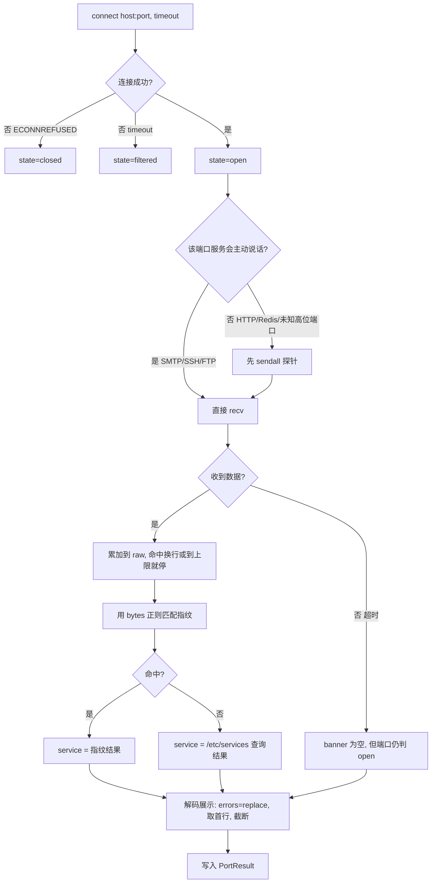

# Day 153 — 端口扫描进阶：Nmap、banner 抓取与自动化扫描器

> 阶段：Phase 8 — 网络安全实战 · 主题：端口扫描进阶
>
> 前置知识：Day 115 socket 编程、Day 116 TCP/UDP 协议、Day 146 HTTPS/TLS 分析、
> Day 151 网络嗅探（如有）、Day 152 中间人攻击与防御（如有）。
> 今天把"网络协议"从课本概念变成**手上能跑的工具**：先理解 Nmap 的四种扫描
> 类型为什么这么设计，再亲手实现 banner 抓取，最后写一个多线程的自动化
> 端口扫描器，把结果导出成 JSON / CSV / Markdown 报告。

---

## ⚠️ 使用前必读：法律边界

端口扫描在几乎所有司法管辖区都被视为**对计算机系统的探测行为**。
未经授权扫描他人资产，**哪怕只发一个 SYN 包**，也可能触犯：

| 法域 | 相关法条 |
|---|---|
| 中国大陆 | 《刑法》第 285 条（非法侵入 / 非法获取计算机信息系统数据）、第 286 条（破坏计算机信息系统）；《网络安全法》第 27 条 |
| 美国 | CFAA, 18 U.S.C. § 1030 |
| 英国 | Computer Misuse Act 1990, s.1 |
| 欧盟 | 各国转化实施的《网络犯罪公约》条款 |

**允许使用本日内容的场景（白名单）：**

1. 你自己的机器（`127.0.0.1`）、你自己的云主机；
2. 你所在组织的资产，且**持有书面授权**——授权书需写明 IP 段、时间窗、
   允许的技术手段（是否允许版本探测 / UDP 扫描）、应急联系人；
3. 专门的授权靶场（自建 DVWA、VulnHub、HackTheBox、CTF 环境）。

**本日所有代码的目标都被硬编码为 `127.0.0.1`**，并且示例 03 内置了
"非本机目标必须显式声明授权"的护栏。这不是形式主义：把安全边界写进代码，
是安全工程师和"脚本小子"的分水岭。

> 本系列定位是**安全防御与教学**。学端口扫描的目的不是"去扫别人"，
> 而是搞清楚**自己的机器上有哪些门开着**，然后去关掉它们。

---

## 一、概念解释

### 1.1 端口到底是什么

一个 IP 地址标识"一台主机"，一个端口号标识"这台主机上的一个服务入口"。
端口号是 16 位无符号整数，范围 `0~65535`，按 IANA 约定分三段：

| 区间 | 名称 | 含义 |
|---|---|---|
| 0 ~ 1023 | 系统端口（Well-known） | 需要 root/管理员权限才能绑定；如 22/SSH、80/HTTP、443/HTTPS |
| 1024 ~ 49151 | 注册端口（Registered） | 普通用户可绑定；如 3306/MySQL、6379/Redis、8080/HTTP-Alt |
| 49152 ~ 65535 | 动态/临时端口（Ephemeral） | 操作系统给客户端连接随机分配；任何普通程序都能绑 |

**为什么需要"端口"这一层？** 因为同一台机器上要跑很多服务（Web、SSH、数据库），
TCP/IP 协议栈需要用端口号做**多路复用（multiplexing）**：内核收到一个 TCP
报文，靠四元组 `(源IP, 源端口, 目标IP, 目标端口)` 决定把它交给哪个进程的 socket。

**关键推论（后面反复用到）：** TCP 端口是"按需监听"的。**没有进程在某个端口上
调用 `listen()`，内核就会拒绝到该端口的连接请求**（回一个 RST）。这正是端口扫描
能判断"端口是否开放"的底层依据。

### 1.2 端口扫描在问什么

| 扫描要回答的问题 | 依赖的机制 |
|---|---|
| 这台主机活着吗？ | ICMP echo / TCP 响应 / ARP |
| 哪些 TCP 端口开放？ | 完成三次握手，或收到 SYN/ACK |
| 哪些 UDP 端口开放？ | 收到响应，或反推"没有 ICMP 不可达" |
| 端口后面是什么服务/版本？ | banner 抓取 + 探针 + 指纹匹配 |
| 有没有防火墙？它什么策略？ | 对比"回 RST"与"直接丢包" |

**注意第 5 条**。这是初学者最容易漏掉、也是防御方最该关心的：如果某个端口
**超时**而不是**被拒绝**，通常说明链路中间有一台设备**主动丢弃**了你的包——
也就是说，**有防火墙，而且它可能记录了你的行为**。

### 1.3 四种常用扫描类型

| 类型 | Nmap 参数 | 原理 | 需要 root | 速度 | 隐蔽性 |
|---|---|---|---|---|---|
| TCP connect | `-sT` | 调用 `connect()`，完成完整三次握手 | ❌ | 慢 | 差（应用层日志能看见） |
| TCP SYN | `-sS` | 只发 SYN，收到 SYN/ACK 后发 RST 掐断 | ✅ | 快 | 好（半开，不进应用层） |
| UDP | `-sU` | 发空 UDP 包，看是否回 ICMP 不可达 | 多数 ✅ | 极慢 | 中 |
| 版本探测 | `-sV` | 抓 banner + 发协议探针做指纹匹配 | ❌ | 慢 | 差（会触发应用逻辑） |
| 空闲扫描 | `-sI` | 借"僵尸主机"的 IP ID 做跳板 | ✅ | 极慢 | 极好（不暴露自己） |

**为什么 SYN 扫描需要 root？** 因为它要自己构造 TCP 报文（原始套接字，
`AF_INET + SOCK_RAW`），而不是让内核的 TCP 协议栈代劳。普通用户无法创建
原始套接字，这是操作系统的安全设计（防止用户态伪造任意报文）。

**为什么 SYN 扫描更隐蔽？** 看内核侧发生了什么：

```
connect 扫描（-sT）：
  客户端内核 ──SYN──▶ 目标内核 ──▶ 目标进程 accept() 返回！
              ◀─SYN/ACK─
              ──ACK──▶            ← 连接进入 ESTABLISHED
  目标**应用层**（nginx/sshd）看到了一条真实连接 → 写访问日志、计入连接数

SYN 扫描（-sS）：
  扫描器 ──SYN──▶ 目标内核 ──▶ 内核回 SYN/ACK，但 accept() 队列**未被消费**
           ◀─SYN/ACK─
           ──RST──▶            ← 连接被立刻销毁，从未 ESTABLISHED
  目标**应用层**什么也没看到（内核压根没把它交出去）→ 日志里通常无痕
```

⚠️ **避坑**：现代防火墙（状态检测）和 IDS 对"大量半开连接"非常敏感，
SYN 扫描"隐蔽"只是相对 connect 扫描而言。真正的隐蔽要靠**慢速扫描**
（`-T0/-T1`）+ 分布式源 + 正常业务流量掩护。

### 1.4 时序模板 `-T0 ~ -T5`

| 模板 | 名称 | 并发/超时 | 适用场景 |
|---|---|---|---|
| `-T0` | paranoid | 每 5 分钟 1 个包 | 躲避 IDS，实战基本不用（太慢） |
| `-T1` | sneaky | 每 15 秒 1 个包 | 同上 |
| `-T2` | polite | 大幅降速 | **脆弱的生产设备**（老交换机、工控 PLC） |
| `-T3` | normal | **默认** | 绝大多数情况，从它开始 |
| `-T4` | aggressive | 提高并发、缩短超时 | 局域网、自己的机器、网络状况良好时 |
| `-T5` | insane | 极限并发、超时 0.3s | 仅限本机/同机房，会牺牲准确率 |

**为什么默认是 T3 而不是 T5？** 因为 T5 会带来三个真实后果：

1. **丢包 → 漏报**：超时被压到 0.3 秒，网络稍有抖动，真正开放的端口会被
   判成"关闭"——**扫描结果错了，比扫得慢更糟**；
2. **触发防御 → 自我封禁**：目标防火墙的 SYN Flood 防护会直接把你的源 IP
   拉黑，后续所有扫描全是错的；
3. **打崩目标 → 事故**：在授权的生产环境里，扫描器把业务链路打满属于
   **生产事故**，可能违反授权条款。

### 1.5 端口选择 `-p`

| 写法 | 含义 | 备注 |
|---|---|---|
| `-p 22,80,443` | 指定若干端口 | 最常用 |
| `-p 1-1024` | 范围 | 覆盖所有系统端口 |
| `-p-` | 全部 65535 个端口 | 耗时可能是 `-p 1-1024` 的 60 倍 |
| `-p http,https` | 按服务名 | nmap 会查 `/etc/services` 翻译 |
| `--top-ports 100` | 最常见的 100 个端口 | 基于 nmap 的 `nmap-services` 频率表 |
| `-F` | Fast，常见 100 端口 | 等价 `--top-ports 100` |
| `--exclude-ports 80` | 排除 | 避免打扰生产 Web |

**为什么要"先小后大"？** 扫描耗时的近似公式：

```
总耗时 ≈ (端口数 × 单端口探测时间) / 并发度
```

`-sV` 会把单端口探测时间从 ~1ms 放大到几百毫秒，`-p-` 会把端口数从 1000
放大到 65535。**一次 `-sV -p- -T4` 的扫描，可能比 `-p 1-1024 -T3` 慢 1000 倍。**

### 1.6 banner 抓取与服务识别

**定义**：banner 是服务在连接建立后（或收到特定请求后）返回的**标识性文本**，
通常包含软件名和版本，例如：

```
SSH-2.0-OpenSSH_9.6p1 Ubuntu-3ubuntu13.19        ← SSH
220 mail.example.com ESMTP Postfix                ← SMTP
HTTP/1.1 200 OK  /  Server: nginx/1.24.0          ← HTTP
+OK Dovecot ready.                                ← POP3
$6379 ... -NOAUTH Authentication required         ← Redis
```

**为什么 banner 这么重要？** 因为"端口 22 开放"只能告诉你有 SSH，而
"SSH-2.0-OpenSSH_7.4"能告诉你**这是一台 2016 年的老 OpenSSH，可能存在
CVE-2018-15473 用户名枚举**。服务识别的粒度，直接决定漏洞评估的准确度。

**难点：服务的"性格"不止一种。**

| 性格 | 代表服务 | 抓取方式 |
|---|---|---|
| 话痨型：连上就说 | SMTP、FTP、SSH、POP3、MySQL（服务端先发握手包） | connect 后直接 `recv` |
| 沉默型：你先开口 | HTTP、HTTPS、Redis、Memcached、多数自研协议 | 先发**探针**再 `recv` |
| 冰柜型：连上也不说话 | 无响应服务、被限速的服务、部分负载均衡后端的黑洞 | 只能靠超时结束 |
| 反侦测型：故意撒谎/不发 | 改过 banner 的 SSH、返回假 Server 头的 Web | 需要**多条探针 + 行为特征**联合判断 |

### 1.7 三个必须分清的状态

扫描结果里，一个端口有**三种**状态，混淆它们会导致错误的安全结论：

| 状态 | 现象 | 真实含义 | 防御建议 |
|---|---|---|---|
| `open` | connect 成功 / 收到 SYN-ACK | 有进程在监听，服务可达 | 确认是否**必须**对外 |
| `closed` | 收到 RST（`ECONNREFUSED`） | 主机在，但该端口无监听 | 正常；但说明**主机可达** |
| `filtered` | 超时 / 无响应（`ETIMEDOUT`） | 报文被**丢弃**，多半有防火墙 | 检查防火墙策略是否过宽 |

> **一条容易搞错的推论**：`closed` 不代表"安全"。攻击者知道**主机在线**，
> 并且知道你的防火墙**允许** ICMP/RST 回包——这些信息本身就是情报。
> 最安全的姿态是 `filtered`（静默丢弃），而不是 `closed`。

---

## 二、原理解释（底层机制与设计动机）

### 2.1 TCP 三次握手与扫描类型的关系

```
        扫描器（客户端）                    目标（服务端）
              │                                 │
   ① SYN      │ ───────────────────────────────▶│  CLOSED → 回 RST
              │ ◀─────────────────────────────── │  LISTEN → 回 SYN/ACK
              │                                 │
   ② SYN/ACK  │ ◀─────────────────────────────── │
              │                                 │
   ③ ACK      │ ───────────────────────────────▶│  ESTABLISHED（双方）

   ── connect 扫描（-sT）：走完 ①②③，由内核完成，应用层可见
   ── SYN 扫描（-sS）：只做 ①②，然后**自己发 RST** 取代 ③，应用层不可见
   ── 防火墙 REJECT：在第 ① 步就回 RST → 扫描器看到"closed"
   ── 防火墙 DROP：第 ① 步的 SYN 被丢弃，没有回应 → 扫描器看到"filtered"
```

**为什么"收到 RST"是 `closed`，而不是"未知"？** 因为 RST 是**来自目标主机
的内核**的明确答复："我这里没有进程监听这个端口"。而超时只是"我没收到任何
答复"，可能因为：目标主机不存在、防火墙丢包、路由黑洞。两者的**证据强度
完全不同**。

### 2.2 为什么 UDP 扫描这么不可靠

UDP 是无连接协议，没有握手可以判断，只能靠**排除法**：

```
发送 UDP 包到目标端口:
  ├── 收到应用层响应          → open（最确定）
  ├── 收到 ICMP port unreachable → closed（确定）
  └── 什么都没收到             → ？？？（可能是 open，也可能是被丢包）
```

**三个导致不可靠的现实因素：**

1. **合法沉默**：很多 UDP 服务（如某些 DNS 服务器对非法查询、SNMP 对错误的
   community）设计上就不回应。**"不回应"是合法行为**，你无法区分它与丢包。
2. **ICMP 限速**：Linux 默认 `net.ipv4.icmp_ratelimit = 1000`（每秒最多 1000 个
   ICMP 相关报文），且很多云厂商直接限速或过滤 ICMP。ICMP 不可达报文会被
   内核丢弃 → 你看到的全是"超时"。
3. **重传与超时**：UDP 没有重传机制，单包丢失就永久丢失。要降低误判只能
   **多次重试 + 加长超时**，这使得 UDP 扫描的时间成本是 TCP 的 10~100 倍。

**实践建议**：`-sU` 只扫你确实关心的少数端口（53/161/123/500），并且接受
"结果仅供参考"。

### 2.3 为什么"扫描到开放"不等于"服务可用"

有四种常见情况会让扫描结论与事实不符：

| 情况 | 现象 | 原因 |
|---|---|---|
| 反向代理 / 端口转发 | 8080 显示开放，但直连后端失败 | 中间有 nginx/haproxy 转发 |
| SYN 代理 / 负载均衡 | 所有端口都"开放" | 中间的 LB 代替后端回 SYN/ACK |
| 云安全组白名单 | 你自己的 IP 扫不到，别人却能连 | 安全组按源 IP 放行 |
| 本地回环 vs 外部网卡 | `127.0.0.1:3306` 开放，`公网IP:3306` 关闭 | 服务只绑了 `127.0.0.1` |

**最后一条是最常见、也最容易被忽略的**，也是本日所有演示都在
`127.0.0.1` 上做的原因：**你扫本机开放，不代表对外开放；你扫本机关闭，
也不代表没有被 `0.0.0.0` 监听的进程——要看你从哪个地址发起的连接。**

### 2.4 `python-nmap` 的原理：它其实是个"命令行包装器"

`python-nmap` 并没有重新实现 TCP/IP 扫描逻辑，它的工作方式是：

```
你的 Python 代码
    │  nm.scan(hosts=..., ports=..., arguments='-sS -sV -T4')
    ▼
python-nmap 拼接命令行: nmap -sS -sV -T4 -p <ports> <hosts> -oX -
    │  subprocess.Popen(...)
    ▼
系统里的 nmap 可执行文件（真正干活的）
    │  把结果以 XML 写到 stdout
    ▼
python-nmap 用 ElementTree 解析 XML，包装成 PortScanner 对象
    ▼
你拿到 nm['127.0.0.1']['tcp'][80] 这样的字典
```

**三个重要推论：**

1. **系统里必须装了 nmap**，否则 `python-nmap` 会报 `nmap program was not found in path`。
   **库的缺失和可执行文件的缺失是两回事**，检测要分开做。
2. **它继承了 nmap 的全部能力，也继承了 nmap 的全部限制**（需要 root 才能 `-sS`）。
3. 你**完全可以不用这个库**，自己用 `subprocess + xml.etree` 做同样的事——
   示例 01 就把这两条路都写了出来，方便对比。

### 2.5 并发模型：为什么用线程池而不是协程

扫描是**I/O 密集型（I/O-bound）**任务：绝大部分时间花在"等待网络响应"上，
CPU 几乎不动。Python 的 GIL 限制的是**CPU 并行**，而 `socket.connect/recv`
在阻塞期间会**释放 GIL**，所以多线程在这个场景下能真正并行等待。

| 方案 | 优点 | 缺点 | 本日选用 |
|---|---|---|---|
| 串行 | 简单、结果有序 | 慢（N 个端口 × 超时） | ❌ |
| 线程池 `ThreadPoolExecutor` | 实现简单、易限流、易收结果 | 线程数上千时内存吃紧 | ✅ 示例 03 |
| `asyncio` | 单线程可支持数万并发 | 需要异步版 socket API，代码复杂 | ⏭ 进阶 |
| 多进程 | 绕过 GIL | 进程开销大、共享数据麻烦 | ❌ 不适用 |

**并发能把耗时压到多少？** 理想情况下：

```
串行耗时  ≈ Σ(单端口耗时)
并发耗时  ≈ max(单端口耗时) + 调度开销     （当 并发度 ≥ 端口数）
```

对"大部分端口都超时"的场景，串行 1000 个端口 × 0.6 秒 = **10 分钟**；
64 并发则约 **10 秒**——这就是为什么真实扫描器必须并发。

### 2.6 为什么扫描器必须限流（防御视角）

**对目标而言**：500 并发 × 65535 端口 ≈ 每秒数万个 SYN，效果等同于一次
小型 SYN Flood。这会：

- 打满目标的连接跟踪表（`conntrack` 满 → **正常用户也连不进来**，这是
  真实的生产事故）；
- 触发 IPS/云 WAF 的封禁规则 → 测试中断；
- 违反授权条款（多数授权书会写明"不得影响业务可用性"）。

**对自己而言**：每个并发连接占一个文件描述符。Linux 默认 `ulimit -n` 是
1024（部分发行版 65535）。开 5000 个线程池任务，会以
`OSError: [Errno 24] Too many open files` 崩掉。

**本日的默认值**：`max_workers=64`、`timeout=0.6s`。这是一组"自己的机器上
跑得舒服、对目标也礼貌"的参数。

### 2.7 深度机制：closed 端口为什么回 RST，而「被丢弃」连回都不回

1.7 给了三态的定义，这一节讲**协议层面到底发生了什么** —— 这才是"closed 与 filtered
为什么必须分开"的硬道理。关键在一段**内核**的行为，而不是应用的：

```
① 端口没监听（closed）
   扫描方 ──── SYN ────────────►  目标内核
                                     │ 查监听表：没有进程监听该端口
                                         ↓
   扫描方 ◄── RST,ACK ──────────  内核**直接回 RST**
   → connect 立刻失败，errno = ECONNREFUSED(111)
   → 结论：主机活着、这个端口没有服务 —— 这是一个**确定的结论**

② 中间有防火墙 DROP（filtered）
   扫描方 ──── SYN ────────────►  防火墙（-j DROP）
                                     │ 悄悄丢掉，什么都不回
                                         ↓
   扫描方 ◄── （沉默）──────────  没有任何回应
   → connect 一直等到超时，errno = ETIMEDOUT(110)
   → 结论：**不确定**。可能被丢弃、可能网络断了、可能主机不在
   → 但"不确定"恰恰是有价值的情报：说明这里有一道会**静默丢弃**的策略

③ 中间有防火墙 REJECT（也是 filtered/closed 之间的模糊地带）
   iptables -j REJECT --reject-with tcp-reset  → 回 RST ⇒ 扫描方看到 ECONNREFUSED
   iptables -j REJECT（默认 icmp-port-unreachable） → 回 ICMP ⇒ 扫描方看到 EHOSTUNREACH
   → ⚠️ 这就是为什么"看到 ECONNREFUSED"**不能**直接断言"对方没防火墙"：
     一个配了 `--reject-with tcp-reset` 的防火墙会伪装成"端口关闭"
```

对应的 iptables 写法（**只在你自己的机器上试**，改防火墙可能把自己锁在外面）：

```bash
# 丢弃（DROP）：扫描器只能等到超时 —— 最"硬"的姿态，但也会拖慢正常用户
sudo iptables -A INPUT -p tcp --dport 9999 -j DROP
# 拒绝（REJECT）：明确回 RST / ICMP —— 体验更好，但会向扫描者暴露"这里有策略"
sudo iptables -A INPUT -p tcp --dport 9999 -j REJECT --reject-with tcp-reset
sudo iptables -A INPUT -p tcp --dport 9999 -j REJECT --reject-with icmp-port-unreachable
```

**三种扫描类型在握手层面的差别**（对应 1.3）：

| 类型 | 发出的包 | 握手是否完成 | 需要 root | 日志可见性 |
|---|---|---|---|---|
| `connect`（`-sT`） | `SYN` → `SYN/ACK` → `ACK`，**完整握手后再 `RST` 拆掉** | ✅ 完成 | ❌ 不需要（普通 `connect()` 调用内核） | **显眼**：目标的应用层/服务日志里会留下"连接"记录 |
| `SYN`（`-sS`，半开） | `SYN` → `SYN/ACK` → **回 `RST`**，从不完成握手 | ❌ 不完成 | ✅ 需要（要自己构造并收发原始包） | 隐蔽：**应用层完全不知情**，只有内核/IDS 可能看到 |
| UDP（`-sU`） | 一个 UDP 包 | 无握手概念 | 通常需要 | 取决于服务是否回 ICMP |

> **为什么 `SYN` 扫描"快"？** 因为它不用等三次握手完成，也不占用目标的并发连接额度；
> 每端口的判定只依赖"收到 SYN/ACK（open）还是 RST（closed）还是没响应（filtered|open|filtered）"。
> 代价是 UDP 那行说的：**结果有歧义**（UDP 没响应既可能开着也可能被丢），
> 以及需要特权 —— 这两点正是本日脚本选择 `-sT`（connect）作为教学默认值的原因。

**扫描器自己也要付代价**：connect 扫描会在本机留下大量 `TIME_WAIT` 状态的连接
（主动关闭的一方要等 2×MSL）。扫全 65535 个端口时，本地临时端口（Linux 默认
`net.ipv4.ip_local_port_range = 32768~60999`，约 2.8 万个）可能被耗尽：

```bash
ss -tan state time-wait | wc -l         # 看看现在有多少连接在 TIME_WAIT
cat /proc/sys/net/ipv4/ip_local_port_range
```

这就是"并发不是越高越好"的另一面 —— 见 2.10。

### 2.8 深度机制：TCP 是**字节流**，不是**消息流**（banner 抓取的根本难点）

这是本日示例 02 里 8 个坑的**共同根源**，值得单独讲。

写 `sock.sendall(b"PING\r\n")` 或 `sock.recv(1024)` 时，你会不自觉地以为
"一次发 = 一条消息、一次收 = 一条消息"。**TCP 不提供这种保证**：

```
发送方:  sendall(b"220 hello\r\n")     ← 应用看到的是"一条消息"
                    │
             ┌──────┴──────┐   内核可能会拆成两个 TCP 段（受 MSS 限制）
             ▼             ▼
        [220 hel]      [lo\r\n]           ← 接收方的 recv() 可能只拿到前半截
                    │
接收方:  recv(1024) → b"220 hel"        ← 一次 recv ≠ 一条完整 banner
         recv(1024) → b"lo\r\n"          ← 也可能两次 recv 拿到两条消息（"粘包"）
```

影响因素（都需要知道，否则会归错因）：

| 因素 | 作用 | 对抓 banner 的影响 |
|---|---|---|
| MSS（最大段长度） | 受 MTU 限制，回环 ~65495、以太网 1460 | 长 banner 会被拆成多段 |
| Nagle 算法 | 小包攒够才发（减少小包） | 服务端可能"慢半拍"，第一次 `recv` 拿到更多或更少 |
| 延迟确认（delayed ACK） | 收方最多等 40ms 再回 ACK | 与服务端的 Nagle 组合可能出现短暂"卡顿" |
| `TCP_NODELAY` | 关掉 Nagle | 交互式协议（SSH/Telnet）必须开，否则体验差 |
| `SO_RCVBUF` | 接收缓冲 | 影响单次 `recv` 最多能取回多少 |

因此**正确的读取循环**必然长这样（本日 `grab_banner()` 的实现）：

```
while 还没到上限:
    try:  chunk = sock.recv(1024)
    except timeout:        break      # 超时 = "暂时没有更多了"，不是错误
    except ConnectionReset: break      # 被 RST：对方掐断，已有数据仍可用
    if not chunk:          break       # FIN：对方正常关闭
    累积 chunk
    if 看到换行:           break       # 启发式：一行标识已到手
```

三个"停止条件"缺一不可：**上限**（防内存放大）、**超时**（防永久卡死）、
**分隔符**（防白等一个完整 timeout）。这也是示例 02 里坑 1、坑 3 修好的样子。

> ⚠️ 反过来：**别把"没读到 banner"当成"端口关闭"**。
> `connect` 成功 = 端口一定开放；banner 为空只是"这个服务不说话，或我们的探针不对"。
> 把这两件事分开写进报告，是专业扫描器的标志（示例 03 的 `PortResult` 里
> `state` 和 `banner` 是两个独立字段，正是这个道理）。

### 2.9 深度机制：Nmap 内部在做什么（`-Pn`、`-T`、`-sV` 的真实含义）

命令行参数不是"咒语"，每个都对应 Nmap 内部的一个阶段。理解它们才能解释
"为什么同一个目标，加了某个参数结果就变了"。

#### 2.9.1 阶段一：主机发现（Host Discovery）—— 为什么必须有 `-Pn`

Nmap 默认会**先判断主机是否存活**，再对"存活"的主机做端口扫描：

```
① ARP 请求（同网段，最可靠）
② 否则 ICMP Echo → ICMP Timestamp → ICMP Address Mask
③ 再否则 TCP SYN to 443 / TCP ACK to 80 / UDP to 40125…
④ 全都没回应 → 判定 host down → **跳过所有端口的扫描**
```

**坑在这里**：很多加固过的主机/云安全组会丢弃 ICMP，于是 Nmap 认为主机"down"，
报告里写 `Host is down`，**一个端口都不扫** —— 你就会误以为"目标没开任何端口"。

`-Pn` 的含义就是：**跳过主机发现，把目标当成一定存活**。所以：

- 扫"明确还活着的内网资产/IP 白名单"时加 `-Pn` 是常态；
- 但如果目标真的下线，`-Pn` 会让每个端口都白等超时（扫描变慢），这是代价。

#### 2.9.2 阶段二：时序模板（`-T0 ~ -T5`）到底改了哪些值

1.4 给的是"快慢"的直觉，这里给出它真正调节的参数。
⚠️ 下表是**典型取值**（依据 Nmap 官方手册；不同版本略有差异，且 `max-rtt-timeout` 在实际扫描中
会**动态调整**）。要看你这台机器上的真实行为，请用 `nmap --help` 与本机实测对照：

| 模板 | `--max-rtt-timeout`（初始） | `--max-retries` | `--min-parallelism`/`--max-parallelism` | 用途 |
|---|---|---|---|---|
| `-T0` paranoid | 5 分钟 | 10 | 1 / 1 | 躲避 IDS，慢到不可接受 |
| `-T1` sneaky | 15 秒 | 10 | 1 / 1 | 同上，略快 |
| `-T2` polite | 10 秒 | 10 | 1 / 1 | 降低对脆弱生产设备的压力 |
| `-T3` normal | 1 秒（动态调整） | 10 | 动态 | **默认值**，通用 |
| `-T4` aggressive | 1.25 秒 | 6 | 动态（更高） | 局域网/自有主机，响应快 |
| `-T5` insane | 0.3 秒 | 2 | 很高 | 只适合极快网络，**会牺牲准确率** |

> **为什么 `-T5` 会"扫不准"？** 因为 `--max-retries` 降到 2、超时压到 0.3 秒后，
> 稍慢的开放端口会被判成 `filtered`。**在任何真实网络里，"更快"和"更准"是互相拉扯的**，
> 这也是为什么默认 `-T3` 而不是 `-T4/-T5`：默认值要为普适性负责。
>
> ⚠️ 顺带一个纪律问题：`-T4/-T5` 打在生产设备上可能被当成拒绝服务。
> **时序选择既是技术问题，也是伦理/合规问题** —— 授权书里通常写着"不得使用可能
> 造成服务影响的高强度扫描"。

#### 2.9.3 阶段三：服务/版本探测（`-sV`）—— 为什么它比"按端口号猜服务"强得多

1.6 讲了 banner 抓取，`-sV` 是它的工业化版本：

```
对每个开放端口：
   ① 从探针库（nmap-service-probes，含上千条）中选出**可能匹配**的探针
      例如 HTTP 端点 → 发 `GET / HTTP/1.0`；SSL 端点 → 先做 TLS 握手
   ② 发送探针 → 收集响应
   ③ 用"响应匹配规则"（正则会话表达式）比对 → 命中 softmatch/hardmatch
   ④ 输出 name / product / version / extrainfo / cpe（可对接 CVE 库）
```

对比我们自己在示例 03 里写的指纹表（12 条 bytes 正则）：

| 维度 | Nmap `-sV` | 示例 03 的 `FINGERPRINTS` |
|---|---|---|
| 规则数量 | 上千条（还有 `-sV --version-all` 全量） | 12 条（够教学） |
| 探针策略 | 按端口/协议**分类选探针**，多轮交互 | 三级启发式（Web/Redis/只读） |
| 输出 | 服务名 + 产品 + 版本 + CPE | 服务名（粗） |
| 代价 | 慢（每端口可能多轮往返） | 快（1~4 次读） |
| 结论强度 | "很可能是 nginx 1.18.0" | "看着像 HTTP" |

**为什么本文不直接抄 Nmap 的探针库？** 因为它有上千条规则、依赖大量协议细节，
把它塞进一个教学脚本会让"原理"被淹没。本文的选择是：**用一个能讲清楚的子集，
把"探针选择 + 响应匹配"这两个核心动作演示出来**，并明确标注它的精度上限。

#### 2.9.4 一个常被忽略的事实：`-p-` 不是"更彻底"，而是"更久"

`-p-` 是 65535 个端口。以 `-T3` 对同一台主机为例，端口数从 1000 涨到 65535，
**扫描时间的量级是线性增长的**（还要叠加慢速服务的超时）。所以正确顺序永远是：

```bash
# 1) 先快扫小范围，拿到"哪些端口在活着"
nmap -sT -Pn -T4 --top-ports 100 -oX - 127.0.0.1
# 2) 再对**发现的开放端口**做深度版本探测（这才是耗时的部分）
nmap -sT -Pn -sV -p 22,80,443 -oX - 127.0.0.1
# 3) 只有确实需要（合规基线核查 / 漏洞面盘点）才 -p- 全端口
```

### 2.10 深度机制：并发的**代价**，与"限流"为什么是硬要求

2.5 讲了"为什么用线程池"，2.6 讲了"为什么必须限流"。这里补上**量化**与**踩坑**。

#### 2.10.1 三种并发模型在扫描场景下的取舍

| 模型 | 实现 | 优点 | 缺点 | 适用规模 |
|---|---|---|---|---|
| 串行 | 一个 `for` 循环 | 最简单、最不打扰目标 | `端口数 × timeout` 的线性增长 | 几十个端口 |
| **线程池**（本日用法） | `ThreadPoolExecutor(max_workers=64)` | 代码直观、阻塞 I/O 天然适配、易于限流 | 线程栈内存（默认 8MB 虚拟内存/线程）、GIL 影响小但存在 | 几千~几万端口 |
| 协程 | `asyncio` + `loop.sock_connect` | 单线程扛极多并发、内存占用低 | 阻塞 I/O 需要专门的 asyncio socket API；错误处理更绕 | 数万端口以上 |
| 原始套接字 | `AF_PACKET` + 自己造 SYN | 精确的 SYN 扫描、可控到每个字段 | 需要 root、要自己实现重传/超时/ICMP 解析 | 专业工具（Nmap `-sS`） |

#### 2.10.2 你可能遇到的三个真实报错

```text
OSError: [Errno 24] Too many open files
→ 触发：并发数 × 每连接 fd 超过 ulimit -n（常见默认 1024）
→ 排查：ulimit -n ；ls /proc/self/fd | wc -l
→ 修法：把 connections 控制在 (ulimit -n) / 3 以内；或临时 ulimit -n 4096
        （注意：不要把并发开到几百上千去"压测"目标）

OSError: [Errno 99] Cannot assign requested address
→ 触发：本机临时端口耗尽（大量 TIME_WAIT），内核找不到可用源端口
→ 排查：ss -tan state time-wait | wc -l
→ 修法：降低并发、缩短扫描范围、等 TIME_WAIT 回收；不要用改 sysctl 去"硬扛"

socket.gaierror: [Errno -2] Name or service not known
→ 触发：目标写成了域名且解析失败
→ 修法：解析错误应当**单独归类**（本日脚本把它记成 filtered + 错误原因），
        而不是混进"端口关闭"里 —— 否则你会去查一个根本没被扫描的端口
```

#### 2.10.3 限流的"两条底线"

1. **不伤害目标**：并发 × 每端口负载 ≈ 你对目标施加的压力。授权测试里
   扫描强度通常有明确约定（例如"不得高于每秒 N 个连接"），
   `--workers` 与 `--timeout` 是你要向客户交代的两个数字。
2. **不暴露自己**：高频扫描会在**双方**日志里留痕（边界设备、IDS、云厂商的
   流量告警）。真实评估里"被发现了"有时比"扫到端口"后果更严重 ——
   因为对方可能直接封掉你的源 IP，让后续工作无法进行。

> 📌 本文脚本的默认值（`--workers 64`、`--timeout 0.6`、只扫回环）
> 就是按这两条底线定的：**它在你自己的机器上跑，永远不会对别人造成压力**。

### 2.11 深度机制：服务识别的两个层次，与"证据强度"的概念

```
层次 1：端口号 → 服务名       （/etc/services，或本文的 FALLBACK_SERVICES）
   6379 → "redis"？            纯属**惯例**，没有任何证据
   ⚠️ 你可以把 MySQL 跑在 6379 上，也可以把 Redis 跑在 8080 上

层次 2：主动探测 → 服务指纹    （banner / 探针响应 / 版本字符串）
   connect 6379 发 PING → 收到 "-NOAUTH Authentication required." → **有证据**
```

**为什么一定要强调"证据强度"？** 因为在安全报告里，"6379 端口开放"与
"Redis 未授权可访问"是两个**完全不同**的结论：前者只是"门在"，后者是"门没锁，
而且房间里有什么"。报告里混用这两句话，会让读报告的人做出错误决策。

本文脚本的做法（可以在 `identify_service()` 与 `scan_one_port()` 里看到）：

```python
result.service = service_name(port)      # 先用"惯例"填一个（弱证据）
...
if raw:
    guess = identify_service(raw)        # 再用指纹覆盖（强证据）
    if guess:
        result.service = guess
```

**证据强度对照表**（写报告时按这个排序陈述）：

| 证据 | 强度 | 例子 |
|---|---|---|
| 端口号 + `/etc/services` | ⭐ | "6379/tcp 通常是 Redis" |
| 收到协议特征响应 | ⭐⭐⭐ | "发送 PING 后收到 `-NOAUTH`，确认是 Redis 协议" |
| 版本字符串 | ⭐⭐⭐⭐ | "`SSH-2.0-OpenSSH_9.6p1`，可据此比对 CVE" |
| 版本 + 行为验证 | ⭐⭐⭐⭐⭐ | "Redis 无密码且可执行 `INFO`，可读写数据" |

> ⚠️ 还有一个现实：**TLS 端口抓不到明文 banner**。
> 443/8443 上的服务要**先完成 TLS 握手**才会说 HTTP，我们的 `choose_probe()`
> 只发明文 HTTP 请求，所以通常会拿到空 banner。这不是 bug，是"探针与协议不匹配"。
> Nmap 的 `-sV` 会先握手再探（这也是它慢的另一半原因）。

### 2.12 把扫描器用成"配置漂移监控"（防御视角的正确用法）

扫描器最有价值的用法**不是**"扫一次看看有什么"，而是**周期性地扫同一批资产并比对**：

```
T0（基线）  127.0.0.1: 22(ssh) open, 80 closed, 3306 closed
T1（一周后）127.0.0.1: 22(ssh) open, **3306(mysql) open**  ← 有人把数据库暴露出来了
                            ↑ 新增开放端口 = 配置漂移 = 要立刻查证
```

这正是示例 03 设计 `--out-dir` 导出 JSON/CSV（内含 `scanned_at` 等 `meta` 字段）
以及退出码的原因：

```bash
# 定时任务：把每次结果落到带时间戳的目录，异常时让 CI/监控告警
python3 03-auto-port-scanner.py --ports top --out-dir /var/log/portscan/$(date +%F)
if [ $? -ne 0 ]; then echo "存在 filtered 端口，检查防火墙策略漂移"; fi
```

**对比两份报告的步骤（不用装任何库）**：

```bash
python3 - <<'PY'
import json
a = json.load(open("/var/log/portscan/2026-09-01/scan-result.json"))
b = json.load(open("/var/log/portscan/2026-09-08/scan-result.json"))
def opens(d): return {r["port"]: r["service"] for r in d["results"] if r["state"] == "open"}
A, B = opens(a), opens(b)
print("新增开放端口:", {p: B[p] for p in set(B) - set(A)})
print("消失的开放端口:", {p: A[p] for p in set(A) - set(B)})
PY
```

为什么 `filtered` 也必须单独记录？因为**"被防火墙丢弃"本身是一份策略证据**：
如果某天某个端口从 `filtered` 变成 `closed`，说明防火墙规则被改过 ——
这可能是运维变更，也可能是有人动了规则。**差异里藏着故事，单次快照里没有。**

---

## 三、定义与使用方法（API 速查表）

### 3.1 Nmap 命令行速查

```bash
# ── 扫描类型（互斥，默认 -sS 若有 root，否则 -sT）──
nmap -sT   <target>     # TCP connect
nmap -sS   <target>     # TCP SYN（需 root）
nmap -sU   <target>     # UDP（慢，建议配合 -p 限定范围）
nmap -sn   <target>     # Ping 扫描，只探主机存活，不扫端口

# ── 服务与系统识别 ──
nmap -sV   <target>     # 服务版本探测
nmap -O    <target>     # 操作系统识别（需 root）
nmap -A    <target>     # 激进模式 = -sV -O -sC --traceroute
nmap -sC   <target>     # 用默认脚本集（等价 --script=default）
nmap --script=http-title <target>          # 指定 NSE 脚本
nmap --script=vuln <target>                # 漏洞脚本集（慎用，会真发攻击流量）

# ── 端口与主机范围 ──
nmap -p 22,80,443 <target>
nmap -p 1-1024 <target>
nmap -p- <target>                          # 全端口
nmap --top-ports 100 <target>
nmap -Pn <target>                          # 跳过主机存活检测（对防火墙后主机必用）
nmap 192.168.1.0/24                        # 整个 C 段
nmap -iL targets.txt                       # 从文件读目标
nmap --exclude 192.168.1.1 <target>

# ── 性能与时序 ──
nmap -T0..-T5 <target>                     # 时序模板
nmap --max-retries 2 <target>              # 最大重传次数
nmap --min-rate 100 <target>               # 每秒最少发包数
nmap --max-rate 50 <target>                # 限速（对目标礼貌）

# ── 输出格式（重要：机器可解析的出口）──
nmap -oN normal.txt <target>               # 人类可读文本
nmap -oX result.xml <target>               # XML（**最推荐**）
nmap -oG greppable.txt <target>            # greppable，一行一主机
nmap -oA scan <target>                     # 同时生成上面三种（文件名前缀 scan）
nmap -oX - <target>                        # XML 到 stdout（给程序用）
```

### 3.2 `python-nmap` API 速查

```python
import nmap                                  # pip install python-nmap

nm = nmap.PortScanner()                      # 构造（会检查 nmap 可执行文件）

# scan() —— 三个参数与命令行的对应关系
nm.scan(hosts='127.0.0.1',                   #   → 位置参数 target
        ports='22,80,443',                   #   → -p
        arguments='-sT -sV -T3')             #   → 其余所有参数
nm.command_line()                            # 看它实际拼出的命令行（调试神器）
nm.scaninfo()                                # {'tcp': {'method': 'connect', 'services': '22,80,443'}}

# 遍历结果
nm.all_hosts()                               # ['127.0.0.1']
nm['127.0.0.1'].state()                      # 'up' / 'down'
nm['127.0.0.1'].hostname()                   # 反向解析的主机名
nm['127.0.0.1'].all_protocols()              # ['tcp']
nm['127.0.0.1']['tcp'].keys()                # dict_keys([22, 80, 443])
info = nm['127.0.0.1']['tcp'][80]
#   info = {'state': 'open', 'reason': 'syn-ack', 'name': 'http',
#           'product': 'nginx', 'version': '1.24.0', 'extrainfo': '',
#           'cpe': 'cpe:/a:igor_sysoev:nginx:1.24.0', 'conf': '10'}
info.get('script', {})                       # NSE 脚本输出（用 -sC 时有）

# 常用异常
#   nmap.PortScannerError: 'nmap program was not found in path.'
#   nmap.PortScannerError: 'Insufficient privileges to perform this scan.'
```

| python-nmap 成员 | 类型 | 说明 |
|---|---|---|
| `PortScanner()` | 构造 | 内部 `subprocess.Popen` 调 nmap |
| `.scan(hosts, ports, arguments, ...)` | 方法 | 执行扫描（阻塞） |
| `.command_line()` | 方法 | 返回实际执行的命令行字符串 |
| `.all_hosts()` | 方法 | 扫描到的主机列表 |
| `.[host].state()` | 方法 | `up` / `down` |
| `.[host].all_protocols()` | 方法 | 通常是 `['tcp']` 或 `['tcp','udp']` |
| `.scaninfo()` | 方法 | 本次扫描的方法/端口/协议信息 |

### 3.3 标准库 `socket` 速查（扫描必需部分）

```python
import socket

# ── 创建与超时 ──
s = socket.socket(socket.AF_INET, socket.SOCK_STREAM)   # TCP/IPv4
s = socket.socket(socket.AF_INET6, socket.SOCK_STREAM)  # TCP/IPv6
s = socket.socket(socket.AF_INET, socket.SOCK_DGRAM)    # UDP
s.settimeout(0.6)                                       # **读写**超时（秒，float 可用）
s.setsockopt(socket.SOL_SOCKET, socket.SO_REUSEADDR, 1) # 服务端：端口可立即重用

# ── 连接：两种语义 ──
s.connect((host, port))          # 失败抛异常（ConnectionRefusedError / socket.timeout）
code = s.connect_ex((host, port))  # 失败**返回 errno**，不抛异常 → 扫描循环首选
#   0 → open   |   111 ECONNREFUSED → closed   |   110 ETIMEDOUT → filtered
#   113 EHOSTUNREACH → 路由不可达             |   101 ENETUNREACH → 网络不可达

socket.create_connection((host, port), timeout=1.0)  # 一次性搞定连接 + 超时（推荐）

# ── 收发 ──
s.sendall(b"GET / HTTP/1.0\r\nHost: x\r\n\r\n")     # 保证全部字节发出去
data = s.recv(1024)                                  # 最多读 1024 字节；b"" 表示对端关闭
s.shutdown(socket.SHUT_WR)                           # 半关闭：只关写方向（发 FIN）

# ── 关闭 ──
with socket.create_connection(...) as s:  # 上下文管理器，异常也会关
    ...
s.close()

# ── 名字与端口互查 ──
socket.getservbyport(80, "tcp")      # 'http'（查 /etc/services）
socket.getservbyname("https", "tcp") # 443
socket.gethostbyname("localhost")    # '127.0.0.1'
socket.getaddrinfo("localhost", 80)  # 解析 → [(family, type, proto, canonname, sockaddr), ...]
```

### 3.4 `concurrent.futures` 速查（并发扫描骨架）

```python
from concurrent.futures import ThreadPoolExecutor, as_completed

with ThreadPoolExecutor(max_workers=64) as pool:      # 上下文退出会 join 所有线程
    futures = {pool.submit(scan_one_port, host, p, 0.6): p for p in ports}
    for fut in as_completed(futures):                 # 按**完成顺序**收结果
        port = futures[fut]                           # 反查这个 future 是哪个端口
        result = fut.result()                         # 取返回值（异常会在这里抛）
```

| 成员 | 说明 |
|---|---|
| `ThreadPoolExecutor(max_workers=N)` | 最多 N 个线程同时工作 |
| `pool.submit(fn, *args)` | 提交任务，立即返回 `Future` |
| `as_completed(futures)` | 迭代器，谁先完成谁先出（**不要用 `map`，它按提交顺序阻塞**） |
| `fut.result()` | 取结果；任务抛异常时在此重新抛出 |
| `pool.map(fn, iterable)` | 简化版，但结果是**有序**的，要等前面完成 |
| `with` 语句 | 退出时 `shutdown(wait=True)`，保证所有任务收尾 |

### 3.5 常见端口—服务对照（防御自查用）

| 端口 | 服务 | 风险提示 |
|---|---|---|
| 21 / 20 | FTP | 明文传输，凭据可被嗅探；应换 SFTP/FTPS |
| 22 | SSH | 爆破重灾区；建议改端口 + 密钥登录 + 禁 root |
| 23 | Telnet | 明文，**绝对不应对外开放** |
| 25 / 587 | SMTP | 开放中继会造成垃圾邮件泛滥 |
| 53 | DNS | 开放递归解析会被用于 DNS 放大攻击 |
| 80 / 443 | HTTP/S | 注意管理后台是否暴露 |
| 445 | SMB | 永恒之蓝（MS17-010）；**绝不可暴露公网** |
| 1433 / 3306 / 5432 | MSSQL/MySQL/PG | 数据库绝不应公网可达 |
| 3389 | RDP | 爆破 + 勒索软件主要入口；建议加 VPN/网关 |
| 5900 | VNC | 大量实例无密码 |
| 6379 | Redis | 未授权访问 → 可写 SSH key / crontab → 直接拿 shell |
| 9200 / 9300 | Elasticsearch | 未授权可读全量数据 / RCE |
| 11211 | Memcached | 未授权 + UDP 放大攻击 |
| 27017 | MongoDB | 未授权访问经典目标 |
| 2375 | Docker API | 未授权 = 主机 root |
| 8888 | Jupyter | 未授权 = 任意代码执行 |

**共同规律**：**"中间件/数据库 + 默认无认证 + 默认监听 0.0.0.0"** 是导致
数据泄露的第一大原因。自检时优先查这几个端口。

### 3.6 `connect_ex` 返回码速查

| errno | 常量 | 判定 | 含义 |
|---|---|---|---|
| 0 | — | `open` | 连接成功 |
| 111 | `ECONNREFUSED` | `closed` | 目标回应了 RST，端口无监听 |
| 110 | `ETIMEDOUT` | `filtered` | 无任何响应，被 DROP |
| 113 | `EHOSTUNREACH` | `filtered` | 主机/路由不可达 |
| 101 | `ENETUNREACH` | `filtered` | 网络不可达（本地无路由） |
| 104 | `ECONNRESET` | 视情况 | 连接被重置（可能触发过 WAF） |

---

## 四、图解

### 4.1 扫描类型对比（Mermaid 时序图）


### 4.2 banner 抓取决策流程（Mermaid 流程图）



### 4.3 并发扫描的时间线（ASCII）

```
串行（1 个 worker）—— 总耗时 = 各端口耗时之和
 端口 t=0ms                600ms               1200ms              1800ms
  22  ████████ open（11ms）
  80  ........................████████ closed （等 600ms 超时）
  443 ........................................████████ filtered
 3306 ........................................................████████
 总耗时 ≈ 1800ms

并发（8 个 worker）—— 总耗时 ≈ 最慢那个端口
 端口 t=0ms                600ms
  22  ████ open
  80  ████████████████████████ closed
 443  ████████████████████████ filtered
 3306 ████████████████████████ filtered
 总耗时 ≈ 620ms   →  提升约 2.9 倍（端口越多提升越明显）

 ⚠️ 但并发度不是越高越好：
   500 并发 → 目标 conntrack 表被打满 → 正常用户连不进来（事故！）
```

### 4.4 自动化扫描器架构（ASCII）

```
                    ┌──────────────────────────────┐
                    │          命令行参数            │
                    │  --target  --ports  --workers │
                    └──────────────┬───────────────┘
                                   ▼
                    ┌──────────────────────────────┐
                    │  授权护栏 enforce_scope()      │
                    │  非本机目标 → 必须显式声明      │
                    └──────────────┬───────────────┘
                                   ▼
                    ┌──────────────────────────────┐
                    │  parse_ports("22,8000-8100")  │
                    │  → 去重、排序、校验范围         │
                    └──────────────┬───────────────┘
                                   ▼
        ┌──────────────────────────────────────────────────┐
        │        ThreadPoolExecutor(max_workers=64)         │
        │  ┌────────┐ ┌────────┐ ┌────────┐      ┌────────┐ │
        │  │worker 1│ │worker 2│ │worker 3│ ...  │worker N│ │
        │  └───┬────┘ └───┬────┘ └───┬────┘      └───┬────┘ │
        │      │ scan_one_port(host, port, timeout)  │      │
        │      ▼          ▼          ▼                ▼      │
        │  connect_ex → 判三态 → 发探针 → recv → 指纹匹配     │
        └──────────────────────┬───────────────────────────┘
                               ▼ as_completed（完成即收）
                    ┌──────────────────────────────┐
                    │   List[PortResult] 按端口排序  │
                    └──────────────┬───────────────┘
                    ┌──────────────┼───────────────┐
                    ▼              ▼               ▼
              scan-result.json  .csv        scan-report.md
              （给程序/CI）    （给表格）    （给人看）
```

### 4.5 端口三态与防火墙策略（ASCII）

```
                    扫描器发出 SYN
                          │
        ┌─────────────────┼──────────────────┐
        │                 │                  │
   收到 SYN/ACK       收到 RST           无任何响应
        │                 │                  │
      open             closed            filtered
        │                 │                  │
   "有服务在听"      "主机活着，          "有设备在丢包"
        │              端口没开"              │
        ▼                 ▼                  ▼
   去查是什么服务     风险较低，但        检查防火墙规则；
   + 版本漏洞         暴露了主机存活        这也是 IDS 会
                                          记录你行为的信号
```

---

## 五、完整可运行实战代码

三个脚本都在 `code/` 下，**只依赖标准库**，`python3 xx.py` 直接跑通。
全部目标硬编码为 `127.0.0.1`。

### 5.1 `code/01-nmap-basics.py`（807 行）— Nmap 基础与三种调用方式

- 打印四种扫描类型 / 时序模板 / 端口选择的**知识矩阵**与等价命令行；
- **方式 A**：`subprocess` 调 `nmap -oX -`，用 `xml.etree` 解析 XML
  （推荐的生产做法，机器可读、版本稳定）；
- **方式 B**：`python-nmap` 的 `PortScanner` / `scan()` / 结果结构，
  并演示**未安装时如何优雅降级**（打印安装提示 + 走兜底路径）；
- **方式 C**：纯 `socket.connect_ex` 的 connect 扫描兜底（无依赖、无需 root）；
- 脚本自己在本机随机端口起一个 HTTP 服务，保证扫描**一定有结果**可看。

```bash
python3 code/01-nmap-basics.py
```


#### 5.1.1 本次加深点（相对旧版）

| 改动 | 为什么 |
|---|---|
| 抽出纯函数 `build_nmap_args()` | 命令行是**最容易静默出错**的地方（少了 `-oX -` 就永远解析不到结果）；抽出来才能在离线自测里逐字断言参数顺序与开关 |
| 新增 `--self-test`（33 条断言） | 覆盖"目标白名单（默认拒绝）"+"命令构造"+"XML 解析"+"数据表自洽性"；**不需要系统装 nmap** |
| `main()` 拆成 `main(argv)`（命令行入口）+ `demo()`（演示） | 自测模式不再需要启动演示服务、也不再跑 nmap |

> ⚠️ 为什么要强调"**自测不依赖 nmap**"？因为很多 CI 容器里没有 nmap。
> 如果自测依赖它，就会变成"本地过、CI 挂"的假阴性测试，最后没人再信它。

#### 5.1.2 代码逐节说明

| 源码分区 | 内容 | 关键点（为什么这么写） |
|---|---|---|
| ① 常量与安全检查 | `TARGET = "127.0.0.1"`（**硬编码**）、`ALLOWED_LOCAL_TARGETS`、`assert_target_is_allowed()` | 目标写成常量而不是命令行参数：**从设计上**杜绝"把教学脚本当攻击工具"。白名单外的地址直接 `sys.exit(2)`，不做交互式确认（交互式能被 `yes \|` 绕过） |
| ② 本机演示服务 | `_QuietHTTPServer` + `_QuietHandler` + `start_local_demo_server()` | 服务绑 `127.0.0.1:0`（随机端口，永不撞端口）；重写 `handle_error()` 把扫描造成的 `ConnectionResetError` 噪声吞掉，否则正常扫描会刷满一屏 traceback |
| ③ 扫描类型知识矩阵 | `TIMING_TEMPLATES` + `demo_scan_types()` | 先讲"四种扫描类型的取舍"和"等价命令行"，再真跑一遍；**知识在前、命令在后** |
| ④ 方式 A：`build_nmap_args()` + `nmap_via_subprocess()` + `parse_nmap_xml()` | `subprocess` 调 `nmap -oX -`，`xml.etree` 解析 | ① 参数用 **list 不用字符串**（不经 shell ⇒ 无命令注入面）；② 解析 XML 前**剥掉 xmlns**（否则标签变成 `{http://nmap.org/nmap}port`，`find()` 全落空）；③ 缺字段回落成空串而不是 `None`（下游拼字符串不会炸） |
| ⑤ 方式 B：`demo_python_nmap()` | `try: import nmap` + `HAS_PYTHON_NMAP` 优雅降级 | 第三方依赖的正确姿势：**装了就用，没装就打印安装方法并走标准库兜底**，绝不崩溃 |
| ⑥ 方式 C：`connect_scan()` | `socket.connect_ex()` 串行扫描，返回开放端口列表 | 用 `connect_ex` 而不是 `connect`：失败**返回错误码**而不是抛异常（扫描 100 个端口不用写 100 个 try/except）。小超时（0.35s）把串行代价压下来，回环地址延迟 < 0.1ms |
| ⑦ `demo()` | 起服务 → 知识矩阵 → 方式 A/B/C → 单独验证演示端口 → 小结 | 最后单独验证演示端口，保证"演示结果永远非空"，读者不会以为脚本坏了 |
| ⑧ 自测（本次新增） | `_SelfTest` + `SAMPLE_NMAP_XML` + `self_test()` | 用**人造 XML 样本**（故意带 `xmlns`）验证解析，覆盖缺字段/畸形输入/无 `<port>` 等边界 |

#### 5.1.3 运行命令

```bash
cd /root/code/Learn-Python

# ① 完整演示（会真跑 nmap；没装 nmap 会自动降级到 socket 兜底，照样跑完）
python3 days/day-153-port-scan-advanced/code/01-nmap-basics.py

# ② 纯离线自测：不启动 nmap、不发任何包
python3 days/day-153-port-scan-advanced/code/01-nmap-basics.py --self-test
echo $?        # 0 = SELF-TEST OK；1 = 断言失败
```

#### 5.1.4 预期输出（真实运行截取）

方式 A（本机实测，nmap 7.94）：注意 **80/443/3306/6379 是 `closed` 而不是"没扫到"** ——
这就是三态的价值：

```text
检测到 nmap: Nmap version 7.94SVN ( https://nmap.org )
    $ nmap -sT -Pn -T3 -p 22,80,443,3306,6379,8080,42405 -sV -oX - 127.0.0.1
    解析结果：
      open     22    /tcp  ssh OpenSSH 9.6p1 Ubuntu 3ubuntu13.19
      closed   80    /tcp  http
      closed   443   /tcp  https
      closed   3306  /tcp  mysql
      closed   6379  /tcp  redis
      closed   8080  /tcp  http-proxy
      open     42405 /tcp  unknown
```

> 🔍 两处值得注意：① `closed` 的端口也带服务名（`http`/`https`/`mysql`）——
> 那是 `/etc/services` 的**惯例猜测**，不是"检测到了服务"（见 2.11 证据强度）；
> ② 演示端口是 `unknown`，因为我们那个假 HTTP 服务不会在 `-sV` 的探针下
> 暴露可识别的版本字符串。

方式 C（socket 兜底，无 nmap 也能跑）：

```text
    扫描了 33 个常用端口，开放的有 1 个：
      22/tcp  open
    验证演示端口 42405: open ✅
```

自测输出（节选）：

```text
[B] 命令构造：参数顺序与开关（拼错一个字就解析不到结果）
   ✅ -oX - 让 XML 输出到标准输出（而不是写文件）
   ✅ 完整命令（供人工核对）
   ✅ 命令是 list[str] 而不是字符串（不经 shell → 没有命令注入面）
[C] XML 解析：把 nmap 的机器可读输出变成结构化数据
   ✅ 解析出 3 条端口记录
   ✅ 状态字段（open / closed / filtered 三种都保留）
   ✅ 缺失的 product/version 回落为空串（不是 None，避免下游拼字符串炸掉）
   ✅ 非 XML 文本 → 返回空列表（不抛异常）
   ✅ 缺 portid 属性时回落成 0（而不是抛 KeyError）

✅ SELF-TEST OK（命令构造与 XML 解析断言全部通过；未启动 nmap、未发起任何网络连接）
```

#### 5.1.5 常见疑问

- **没装 nmap 怎么办？** 直接跑，脚本会打印安装提示并自动降级到方式 C（socket 兜底）。
  自测模式则完全不需要 nmap。
- **为什么最后要单独 `connect_scan([demo_port])` 再验证一次？** 因为演示服务监听在**随机端口**上，
  它不在 `COMMON_PORTS` 里。单独验证一次，能保证"脚本确实扫到了自己起的服务"，
  读者不会因为"输出里没看到它"而怀疑脚本坏了。
- **`parse_nmap_xml` 为什么要自己剥 xmlns？** 因为 nmap 的 XML 带默认命名空间，
  ElementTree 会把标签读成 `{http://nmap.org/nmap}port`。剥掉声明是最省事的做法
  （前提：确认文档里没有多命名空间混用）。

### 5.2 `code/02-banner-grab-pitfalls.py`（838 行）— banner 抓取的 8 个坑

先在本机起三个"性格不同"的服务（话痨型 / 冰柜型 / 请求-响应型），
然后逐个踩坑、逐个修复：

| # | 坑 | 后果 | 修复 |
|---|---|---|---|
| 1 | 不设超时 | 脚本永久卡死（内核 keepalive 要 2 小时 11 分） | `create_connection(timeout=)` + `settimeout()` |
| 2 | 端口开着就干等 → 抓不到 banner | HTTP 等协议要你先开口 | 按协议选探针 |
| 3 | 只 `recv` 一次 | banner 被 TCP 分段切碎 → 指纹匹配失败 | 循环读到超时/分隔符/上限 |
| 4 | 直接 `decode("utf-8")` | 二进制 banner 抛异常炸掉线程 | `errors="replace"` 或 `latin-1` |
| 5 | 忘记关 socket | fd 泄漏 → `Too many open files` | `with socket...` |
| 6 | 并发不限流 | 打爆自己 + 打爆目标（DoS 风险） | `max_workers` + 超时预算 |
| 7 | 不发 FIN | 部分老服务等你示"说完了" | `shutdown(SHUT_WR)` |
| 8 | 把超时当关闭 | 混淆 filtered / closed，漏掉暴露面 | 按 errno 分状态 |

```bash
python3 code/02-banner-grab-pitfalls.py
```


#### 5.2.1 本次加深点（相对旧版）

| 改动 | 为什么 |
|---|---|
| 抽出三个纯函数：`decode_banner()` / `banner_is_complete()` / `describe_connect_code()` | 抓 banner 里**最容易写错的不是 socket 调用，而是判读**：二进制怎么解码、什么时候停止读、errno 各自代表什么。抽出来才能离线钉死 |
| 新增 `--self-test`（24 条断言） | 覆盖解码容错、停止判据、errno 三态翻译、演示服务的协议特征、三种探针策略 |
| 坑 8 增加"本机为什么看不到 DROP"的说明 | 回环地址没有中间防火墙，**必须说明"这里测不到 110"**，否则读者会以为文档写错了 |

#### 5.2.2 代码逐节说明

| 源码分区 | 内容 | 关键点（为什么这么写） |
|---|---|---|
| ① 三个"性格不同"的演示服务 | `ChatterboxServer`（主动打招呼，模拟 SMTP/FTP/SSH）、`MuteServer`（accept 后一言不发）、`_ProbeHTTPHandler`（要先开口才回应） | 三种性格覆盖了服务识别的全部难点；都绑 `127.0.0.1`，都用 `port=0` 随机端口，都开 `SO_REUSEADDR`（避免 TIME_WAIT 期间端口不可用） |
| ②-a 判读层（本次新增） | `decode_banner` / `banner_is_complete` / `CONNECT_CODE_MEANING` + `describe_connect_code` | 把"拿到字节之后怎么判"从"怎么发包"里剥离：`errors="replace"` 保证二进制 banner 不炸线程；`b"\n" in chunk` 作为"够了"的启发式；errno 三态翻译表统一出口 |
| ② `grab_banner()` | 正确的抓取实现（被后面所有坑当作对照） | 每个参数都对应一个坑：`timeout`→坑1、`probe`→坑2、循环 `recv`→坑3、`errors="replace"`→坑4、`with`→坑5、`shutdown(SHUT_WR)`→坑7 |
| ③ 八个坑 | `pitfall_1` … `pitfall_8` | 结构统一：**错误写法 → 为什么错（含实测数据）→ 正确写法**。每个坑都真在本机跑一遍，不是"讲道理" |
| ④ `combined_demo()` | 用 `ThreadPoolExecutor` 同时识别三个服务 | 顺带演示"并发把等待时间重叠起来"：3 个端口总耗时 ≈ max(各端口) 而不是求和 |
| ⑤ `demo()` + `main(argv)` | 命令行入口 | 自测模式不启动任何服务 |

#### 5.2.3 运行命令

```bash
cd /root/code/Learn-Python

# ① 完整演示：起三个演示服务，逐个踩坑 + 综合识别（秒级返回）
python3 days/day-153-port-scan-advanced/code/02-banner-grab-pitfalls.py

# ② 纯离线自测：不建立任何连接
python3 days/day-153-port-scan-advanced/code/02-banner-grab-pitfalls.py --self-test
echo $?        # 0 = SELF-TEST OK；1 = 断言失败
```

#### 5.2.4 预期输出（真实运行截取）

坑 1（不设超时）—— **扫描器卡死 99% 是这一条**：

```text
  ✅ 正确写法：连接和读写都要设超时。
        socket.create_connection(..., timeout=0.8)
        实测：等待 0.80 秒后返回，banner=None（超时按「无 banner」处理）

  【为什么 create_connection 也要传 timeout？】
  因为默认的 connect 超时是**操作系统给的**（Linux 上 SYN 重试约 2 分钟），
  一个被防火墙 DROP 的端口（不回 RST，只丢包）会让 connect 卡两分钟。
```

坑 2（端口开着但抓不到 banner）—— **HTTP 要你先开口**：

```text
  先看「只读不写」会发生什么：
    ❌ 不发请求直接读：banner=None，等了 0.80 秒
    ✅ 发 GET 探针后再读：拿到 153 字节，耗时 0.00 秒

  响应头（前 8 行）：
    | HTTP/1.0 200 OK
    | Server: day153-probe-http/2.1
```

坑 3（只 `recv` 一次）—— **一次 recv ≠ 一条完整 banner**：

```text
  ✅ 正确写法：循环 recv，直到超时 / 对方关闭 / 达到上限。
```

坑 6（并发不限流）—— **并发把等待时间重叠起来**：

```text
  串行耗时（以哑巴端口 0.8s 超时为例，总耗时 = 各端口耗时之和）：
    串行 3 个端口: 1.70s
  ✅ 正确写法：ThreadPoolExecutor(max_workers=N) + 每个任务内部仍有超时预算
    并发（max_workers=8）3 个端口: 0.80s
      44407/tcp → 220 day153-demo ESMTP LearnPython Demo Server ready
```

坑 8（把超时当关闭）—— **本机看不到 DROP，必须说明**：

```text
    实测 127.0.0.1:9 → connect_ex 返回 111（closed/rejected）
    【注意】本机没有中间防火墙，所以这里几乎只会看到 111/0 这两种；
    要观察 110（DROP）请在有安全组的云主机或本机 iptables DROP 规则下实测。
```

综合演示（三个性格的服务被正确区分）：

```text
    http          43855/tcp  第一行: HTTP/1.0 200 OK
    chatterbox    44407/tcp  第一行: 220 day153-demo ESMTP LearnPython Demo Server ready
    mute          36021/tcp  第一行: (无响应)
```

> 🔍 `mute` 的 `(无响应)` 是**故意**的：它证明"没有 banner"≠"端口关闭"。
> 判断依据要回到 connect 阶段 —— connect 成功 + 无 banner = 端口开放但服务不说话。

#### 5.2.5 常见疑问

- **为什么本机测不出 `filtered`？** 回环地址没有中间设备，端口没监听就直接回 RST（111）。
  要看 DROP 的效果，需要云安全组或在**自己的**机器上加 `iptables -j DROP` 规则。
- **`shutdown(SHUT_WR)` 会不会把 HTTP 连接弄坏？** 对 HTTP/1.0 通常没问题（服务端发完响应就关），
  但 HTTP/1.1 keep-alive 场景下对方可能直接关闭连接。所以本日脚本对 HTTP **不用** SHUT_WR
  （示例 03 里也是），只在"只读+需要促使对方说话"的场景用它。
- **`banner_is_complete()` 用"有没有换行"当判据可靠吗？** 对文本协议（SMTP/SSH/HTTP）可靠，
  对二进制协议可能提前收手。但抓 banner 的目的是**识别服务**而不是读完整会话，
  提前收手是可以接受的取舍 —— 重要的是**别把"读得少"误判成"端口关闭"**。

### 5.3 `code/03-auto-port-scanner.py`（949 行）— 自动化扫描器（实战）

一个**可以直接拿去用的防御性自检工具**：

- 多线程扫描（`ThreadPoolExecutor`，默认 64 并发，可 `--workers` 调）
- 端口表达式解析：`top` / `1-1024` / `22,80,443` / 混合 `22,8000-8100`
- banner 抓取 + 服务指纹识别（HTTP/SSH/SMTP/FTP/Redis/VNC/MongoDB…）
- 三态判定（open / closed / filtered）+ 每端口耗时
- **结果导出三种格式**：`scan-result.json`（程序）/ `.csv`（表格）/ `scan-report.md`（人读）
- 授权护栏：非本机目标必须显式加 `--i-own-this-target` 并二次确认
- 退出码：存在 filtered 端口返回 1（便于接 CI 做配置漂移告警）

```bash
python3 code/03-auto-port-scanner.py
python3 code/03-auto-port-scanner.py --ports 1-1024 --workers 128 --timeout 0.5
python3 code/03-auto-port-scanner.py --ports 22,80,443,8000-8100 --show-closed
```

**实测输出（本机，54 个端口，0.61 秒）**：

```
  [   11/54] ✅    22/tcp open   ssh  |  SSH-2.0-OpenSSH_9.6p1 Ubuntu-3ubuntu13.19
  [   52/54] ✅ 38493/tcp open   smtp |  220 day153-demo ESMTP LearnPython ready
  [   53/54] ✅ 37083/tcp open   http |  HTTP/1.0 200 OK
  [   54/54] ✅   631/tcp open   ipp
扫描完成：54 个端口，耗时 0.61s （平均 11.3 ms/端口）
  open=4  filtered=0  closed=50
```


#### 5.3.1 本次加深点（相对旧版）

| 改动 | 为什么 |
|---|---|
| 抽出 `state_for_errno()` 并让 `OSError` 分支也用它 | 修正一处潜在误判：某些平台把 `ECONNREFUSED` 以裸 `OSError` 抛出时，旧代码会把它记成 `filtered`。**把 filtered 误报成 closed（或反之）是扫描器最常见的错误** |
| 新增 `--self-test`（75 条断言） | 覆盖端口解析（含 6 种非法输入）、12 条指纹、探针策略、三态映射、**三种导出格式的回读校验**、数据表自洽性 |
| `--out-dir` 默认改为**系统临时目录**（`tempfile.mkdtemp()`） | 旧默认 `./scan-output` 会污染代码仓库工作树；扫描报告含内网端口/服务信息，**误提交等于把资产清单推到远端** |
| `--self-test` 在 `enforce_scope()` **之前**处理 | 离线自测不扫任何目标，不该被授权护栏拦下（否则自测会莫名要求 `--i-own-this-target`） |

#### 5.3.2 代码逐节说明

| 源码分区 | 内容 | 关键点（为什么这么写） |
|---|---|---|
| 配置常量 | `LOCAL_TARGETS` / `TOP_PORTS`（52 个）/ `FALLBACK_SERVICES` / `FINGERPRINTS` | `FINGERPRINTS` 用 `re.compile` **预编译**：扫描上万个端口时，每条 banner 都要过全部规则，预编译省下可观的 CPU |
| `PortResult`（dataclass） | `host/port/state/service/banner/latency_ms/error` | 用 dataclass 而不是 dict：字段有类型提示、`asdict()` 直通 JSON、语义清晰。**`state` 与 `banner` 是两个独立字段** —— 这就是"无 banner ≠ 端口关闭"的代码体现 |
| `parse_ports()` | 支持 `top` / `1-1024` / `22,80,443` / 混合；非法输入抛 `ValueError` | 去重 + 排序保证**输出确定性**；越界/倒序范围**必须报错**而不是静默变空（静默失败最坑人） |
| `service_name()` | 先查 `/etc/services`，再查 `FALLBACK_SERVICES` | 它是**弱证据**（惯例猜测），会被指纹结果覆盖（见 2.11） |
| `choose_probe()` | 三级策略：明确 Web 端口 → HTTP 探针；6379 → `PING`；系统不认识的高位端口 → 猜 Web；其余 → 只读 | 两段式探测（先只读、超时再补探针）会让每个未知端口的耗时翻倍，所以这里用"端口号 + `/etc/services` 认知度"做启发式 |
| `identify_service()` | 对**原始 bytes** 跑 12 条正则 | 基于 bytes 而不是解码后的 str：`errors="replace"` 会把二进制特征变成 `U+FFFD`，丢失信息 |
| `state_for_errno()`（本次新增） | 只有两个分支：`ECONNREFUSED → closed`，其余 → `filtered` | 明确表达"**不确定**就不说成确定"。注释里直接写明"把 filtered 误报成 closed 是扫描器最常见的错误" |
| `scan_one_port()` | 单端口扫描（**纯函数式**：不读写共享状态，结果通过返回值收集） | 线程安全的最简单办法：让工作函数保持纯函数。读取用"最多 4 次 `recv`"而不是"读到超时"，避免每个开放端口白等一个完整 timeout |
| `run_scan()` | `ThreadPoolExecutor` + `as_completed` 边扫边打印；异常兜底 | `max_workers` 天然限流（背压）；单个 worker 崩了不能带走整个扫描；结果按端口排序保证确定性 |
| `export_json/csv/markdown` | 三种导出 | JSON 带 `meta`（溯源）；CSV 用 `newline=""`（Windows 下防多空行，官方文档明确要求）；Markdown 转义 `\|`（否则表格错位） |
| 演示服务 | `_QuietHTTPServer` / `_GreeterServer`（假 SMTP） | 保证"扫描一定有结果"：随机端口并入扫描列表；假 SMTP 用来演示指纹识别 |
| 授权护栏 | `enforce_scope()` | 非本机目标必须 `--i-own-this-target`，并**强制 5 秒冷静期**（可 Ctrl+C 中止）—— 护栏很弱，但强制用户做一次明确的意思表示 |
| `--self-test`（本次新增） | 75 条断言，写在 `tempfile.TemporaryDirectory()` 里 | 自测的导出测试**必须有地方落盘**，所以用临时目录；断言里连"临时目录在系统 temp 下"都检查了 |

#### 5.3.3 运行命令

```bash
cd /root/code/Learn-Python

# ① 默认：起本机演示服务 + 扫 top 端口（结果默认落到系统临时目录）
python3 days/day-153-port-scan-advanced/code/03-auto-port-scanner.py

# ② 扫指定范围，显示关闭/过滤的端口
python3 days/day-153-port-scan-advanced/code/03-auto-port-scanner.py \
    --ports 1-1024 --workers 128 --timeout 0.5 --show-closed

# ③ 把报告落到自己指定的目录（比如做历次比对）
python3 days/day-153-port-scan-advanced/code/03-auto-port-scanner.py \
    --ports top --out-dir /tmp/my-portscan-$(date +%F)

# ④ 纯离线自测：不扫描任何目标、不污染工作树
python3 days/day-153-port-scan-advanced/code/03-auto-port-scanner.py --self-test
echo $?        # 0 = SELF-TEST OK；1 = 断言失败
```

#### 5.3.4 预期输出（真实运行截取）

```text
已启动本机演示服务（保证扫描有结果）：
    41207/tcp  演示 HTTP 服务
    35313/tcp  演示 SMTP(banner) 服务

开始扫描 127.0.0.1，共 54 个端口，并发 64，超时 0.6s
  [   25/54] ✅    22/tcp open   ssh  |  SSH-2.0-OpenSSH_9.6p1 Ubuntu-3ubuntu13.19
  [   52/54] ✅ 35313/tcp open   smtp  |  220 day153-demo ESMTP LearnPython ready
  [   53/54] ✅ 41207/tcp open   http  |  HTTP/1.0 200 OK
  [   54/54] ✅   631/tcp open   ipp
扫描完成：54 个端口，耗时 0.61s （平均 11.3 ms/端口）
  open=4  filtered=0  closed=50
已导出：
  /tmp/day153-scan-ttwt7bzn/scan-result.json  (10374 字节)
  /tmp/day153-scan-ttwt7bzn/scan-result.csv  (2701 字节)
  /tmp/day153-scan-ttwt7bzn/scan-report.md  (2771 字节)
  （默认落在系统临时目录 /tmp/day153-scan-ttwt7bzn，不污染仓库；用 --out-dir 可指定固定位置）
```

> 🔍 三个演示服务被识别出来了：`smtp`（来自 banner `220 … ESMTP`）、`http`（来自 `HTTP/1.0 200`）、
> 以及真实环境里的 `ssh`（带版本号，可用于比对 CVE）。`631/tcp ipp` 是这台机器上真实监听的
> CUPS 打印服务 —— 它同时说明了另一件事：**扫描结果高度依赖环境**，所以"基线比对"才比单次快照有价值。

自测输出（节选）：

```text
[A] parse_ports()：端口表达式的解析与校验
   ✅ 重复端口被去重（确定性输出）
   ✅ 容忍空格与空片段（用户手写时很常见）
   ✅ 倒序范围 80-79 → ValueError
[D] state_for_errno()：closed / filtered 绝不能混淆
   ✅ ECONNREFUSED(111) → closed（对方回了 RST，说明主机在、端口没监听）
   ✅ ETIMEDOUT(110) → filtered（被 DROP，静默丢弃）
   ✅ 未知 errno → filtered（保守：不把不确定的情况说成 closed）
[E] 导出：JSON / CSV / Markdown 三件套
   ✅ 自测的临时目录在系统 temp 下（不写进仓库工作树）
   ✅ meta.open_ports 统计正确（2 个 open）
   ✅ banner 里的裸管道符被转义（否则表格列错位）

✅ SELF-TEST OK（解析 / 指纹 / 三态 / 导出断言全部通过；未扫描任何目标，未污染工作树）
```

#### 5.3.5 常见疑问

- **为什么默认写到临时目录？** 见上表：既不污染工作树，也避免"含内网拓扑的报告被误提交"。
  要用固定位置就 `--out-dir`。
- **退出码为什么是 1？** 因为"存在 `filtered` 端口"意味着有策略在静默丢弃流量 ——
  这通常值得你去看一眼防火墙是否发生了漂移。把它接进 CI 就能做**配置漂移告警**。
- **`--workers` 开多大合适？** 三个约束取最小：礼貌（≤100）、自己的 fd 上限、目标承受力。
  本脚本默认 64，并且**只扫回环**，所以不会对任何真实资产造成压力。

## 六、自测（`--self-test`）与可复现性

### 6.1 两种运行模式，职责完全不同

| 模式 | 命令 | 干什么 | 依赖 |
|---|---|---|---|
| **演示**（默认） | `python3 <脚本>.py` | 起本机回环靶场/演示服务、真实发包、打印过程与结果 | 回环 socket；`01` 还**可选**依赖系统 `nmap` |
| **自测** | `python3 <脚本>.py --self-test` | 对**纯函数**逐条断言，打印 `SELF-TEST OK` 并 `exit 0` | 无（不建连接、不跑 nmap、无第三方库） |

> **扫描器的自测为什么不真的扫？** 因为"扫一次"依赖端口是否被占用、系统有没有 nmap、
> 沙箱是否允许 socket —— 这些都会让自测**随机失败**。而一个会随机失败的测试，
> 谁都不会再跑它。所以本日的做法是：**把判定逻辑都抽成纯函数，用离线断言钉死它们**；
> 端到端链路由默认运行负责。

### 6.2 四个硬约束

1. **完全离线**：`--self-test` 不建立任何连接（包括回环）。`01` 的自测也不会去跑 `nmap` 子进程。
2. **结果确定**：不依赖时间、随机端口、外部服务。唯一需要绕开的外部依赖是 `/etc/services`
   —— 做法是**动态探测**（找出一个系统不认识的端口再断言），而不是写死一个端口号。
3. **零第三方依赖**：只用标准库（`socket` / `subprocess` / `xml.etree` / `concurrent.futures` /
   `csv` / `json` / `tempfile` / `errno` / `re`）。`python3 -B` 直接可跑。
4. **失败可诊断**：断言失败打印**期望值 vs 实际值**。

### 6.3 退出码契约

| 情形 | 输出 | 退出码 |
|---|---|---|
| 自测全部通过 | `✅ SELF-TEST OK（…）` | `0` |
| 自测有失败 | `❌ SELF-TEST FAILED：N 项…` + 逐条期望/实际 | `1` |

作为 CI 门禁可以直接这样用：

```bash
cd /root/code/Learn-Python
for f in days/day-153-port-scan-advanced/code/*.py; do
  python3 -B "$f" --self-test >/dev/null || { echo "SELF-TEST FAILED: $f"; exit 1; }
done
echo "all self-tests passed"
```

> ⚠️ 别混淆三种"退出码 1"：**自测失败**（1）、**扫出 filtered 端口**（1，设计行为）、
> **参数非法/未授权目标**（2）。它们分别对应"代码坏了""环境有变化""用法不对"。

### 6.4 三个脚本各自的自测覆盖点

| 脚本 | 断言数 | 覆盖内容（都是纯函数/离线可验证的逻辑） |
|---|---|---|
| `01-nmap-basics.py` | 33 | 目标白名单（3 个允许 + 2 个必须退出码 2）；`build_nmap_args()` 参数顺序与开关（含"必须是 list 而非字符串"）；`parse_nmap_xml()` 解析 3 端口样本（带 `xmlns`）、缺失字段回落、畸形输入返回空列表；`COMMON_PORTS` 无重复/有序/在范围内；`TIMING_TEMPLATES` T0~T5 齐全 |
| `02-banner-grab-pitfalls.py` | 24 | `decode_banner()` 对二进制 banner 不抛异常且用 `U+FFFD` 顶替；`banner_is_complete()` 的三种输入；`describe_connect_code()` 对 0/111/110/113/未知 errno 的翻译；演示服务的协议特征（SMTP 风格 220 + CRLF + ESMTP 关键字）；三种探针策略的形态 |
| `03-auto-port-scanner.py` | 75 | `parse_ports()` 9 个合法 + 6 个非法输入；12 条服务指纹逐条回归；`choose_probe()` 三级策略（含动态找未知端口）；`state_for_errno()` 七种 errno；三种导出格式的**回读校验**（含 JSON `meta`、CSV 表头/行数、Markdown 管道符转义、临时目录位置）；`TOP_PORTS`/`FALLBACK_SERVICES` 自洽性 |

### 6.5 自测**不**覆盖什么（诚实声明）

| 不在自测范围内 | 为什么 | 用什么验证 |
|---|---|---|
| 真实网络路径上的 `filtered`（DROP/REJECT） | 回环地址没有中间防火墙 | 云安全组，或在自己机器上加 `iptables -j DROP` 后实测 |
| TLS 端口（443/8443）的服务识别 | 需要先完成 TLS 握手 | `nmap -sV` 或专门的 TLS 指纹工具 |
| `nmap` 命令行本身的版本差异 | 自测不跑子进程 | 默认运行打印实际命令与版本，人工核对 |
| 并发下的资源耗尽（fd / 临时端口） | 需要真实的高并发负载 | 观察 `ulimit -n`、`ss -tan state time-wait` |

### 6.6 本地自证记录（本次升级实测）

```bash
$ cd /root/code/Learn-Python
$ python3 -B days/day-153-port-scan-advanced/code/01-nmap-basics.py --self-test | tail -1
✅ SELF-TEST OK（命令构造与 XML 解析断言全部通过；未启动 nmap、未发起任何网络连接）   # exit 0
$ python3 -B days/day-153-port-scan-advanced/code/02-banner-grab-pitfalls.py --self-test | tail -1
✅ SELF-TEST OK（banner 判读逻辑断言全部通过；未建立任何 socket 连接）               # exit 0
$ python3 -B days/day-153-port-scan-advanced/code/03-auto-port-scanner.py --self-test | tail -1
✅ SELF-TEST OK（解析 / 指纹 / 三态 / 导出断言全部通过；未扫描任何目标，未污染工作树） # exit 0
```

三个脚本的**默认运行也全部回归通过**（本机回环，秒级）：

```bash
$ python3 -B days/day-153-port-scan-advanced/code/01-nmap-basics.py   # 方式 A/B/C 全跑通
$ python3 -B days/day-153-port-scan-advanced/code/02-banner-grab-pitfalls.py  # 8 个坑 + 综合识别
$ python3 -B days/day-153-port-scan-advanced/code/03-auto-port-scanner.py     # open=4 closed=50
```

### 6.7 演示产物落盘策略（工作树必须干净）

| 脚本 | 是否写文件 | 落盘位置 |
|---|---|---|
| `01-nmap-basics.py` | ❌ 不写 | 全部打印到 stdout（`-oX -` 让 nmap 把 XML 输出到标准输出，不落文件） |
| `02-banner-grab-pitfalls.py` | ❌ 不写 | 演示数据全在内存 |
| `03-auto-port-scanner.py` | ✅ 写 3 个报告 | **默认 `tempfile.mkdtemp()`（系统临时目录）**；仅 `--out-dir` 时落到指定位置 |

```bash
# 验证：跑完扫描后，仓库工作树里不应该出现 scan-output/ 之类的目录
cd /root/code/Learn-Python
python3 days/day-153-port-scan-advanced/code/03-auto-port-scanner.py >/dev/null
git status --porcelain days/day-153-port-scan-advanced/    # 只应看到代码/README 的改动
```

> 📌 为什么这条重要：扫描报告里写着**目标主机、开放端口、服务与版本** ——
> 这是标准的资产清单。让工具"默认不落进仓库"，是防止敏感信息随 `git push` 外流的最便宜手段。

---

## 七、思考题

1. **为什么"端口开放"和"端口关闭"的证据强度不一样？**
   请从"收到 RST"和"超时"两种情况分别说明：扫描器到底拿到了什么信息？
   如果一台主机对所有端口都超时，你能得出"它没有任何服务"这个结论吗？
   为什么？（提示：想想 `DROP` 策略和 `filtered` 状态。）

2. **SYN 扫描（`-sS`）比 connect 扫描（`-sT`）"隐蔽"，但隐蔽的本质是什么？**
   请从"内核 vs 应用层"的角度解释，应用层的 `accept()` 为什么看不到半开连接。
   再想一想：如果目标开着 **SYN cookie + 连接数监控**，SYN 扫描还隐蔽吗？

3. **banner 抓取为什么要区分"话痨型"和"沉默型"服务？**
   请分别举出两个例子，并说明如果你对一个 HTTP 服务只 `recv` 不发请求，
   会发生什么、耗时多少、得出的结论会不会错。

4. **并发度该设多大？** 请从三个约束（自己的文件描述符上限、目标的承受能力、
   授权条款）分别推导一个上限，并说明为什么本日脚本选 64。
   如果把 `max_workers` 设成 5000，最可能先出什么问题？

5. **防御视角的反向思考**：假设你是运维，你从日志里发现有人在对你的服务器
   做端口扫描。你能观察到哪些**可区分**的信号（连接的 RST 比例、半开连接数、
   源 IP 的时序特征）？你会采取什么措施，又为什么**不建议**简单粗暴地
   永久封禁源 IP？（提示：源 IP 可能是被入侵的第三方主机。）

6. **`filtered` 为什么必须单独记录，而不是合并进 `closed`？**
   请结合 2.7 的"内核回 RST"与"防火墙 DROP"两条路径，说明：
   ① 这两种情况下扫描器**分别拿到了什么信息**；
   ② 如果把 `filtered` 合并成 `closed`，会在**配置漂移监控**里漏掉什么信号。

7. **`/etc/services` 给出的"服务名"算不算证据？**
   请用 2.11 的证据强度表说明"6379/tcp open（记为 redis）"与
   "发 PING 收到 `-NOAUTH`"这两句话在报告里的差别，
   并说明为什么报告必须写清"我们是怎么知道的"。

8. **并发扫描的"代价"是可以量化的，请推导：**
   已知本机 `ulimit -n = 1024`、目标端口数 2000、单端口超时 0.5 秒。
   请分别估算：① 用 64 线程时的总耗时量级；② 用 2000 线程时最可能先遇到什么错误；
   ③ 如果把超时改成 5 秒，对"被 DROP 的端口"会有什么影响？
   最后说明：为什么把这三者写进授权测试的方案里，是"专业"而不是"啰嗦"。

---

## 附：本日文件清单

```
days/day-153-port-scan-advanced/
├── README.md                          ← 本文
├── code/                              每个脚本都有两种模式：
│   ├── 01-nmap-basics.py              ← Nmap 基础 + 三种调用方式（含优雅降级）
│   ├── 02-banner-grab-pitfalls.py     ← banner 抓取的 8 个坑与修复
│   └── 03-auto-port-scanner.py        ← 实战：多线程扫描器 + 三种格式导出
│                                      · 默认运行 = 起 127.0.0.1 演示服务做端到端验证
│                                      · --self-test = 纯离线断言（33 / 24 / 75 条）
│                                        通过打印 SELF-TEST OK 且 exit 0
│                                      · 扫描报告默认落到系统临时目录（可用 --out-dir 指定）
├── diagrams/
│   └── README.md                      ← 扫描类型 / banner 流程 / 并发时间线图解
└── exercises/
    └── checklist.md                   ← 今日完成清单 + 5 道练习题
```

**明日预告**：Day 154 会把端口扫描的结果接到"漏洞评估"上——
如何把服务指纹映射到 CVE，如何做不触发告警的资产清点。
