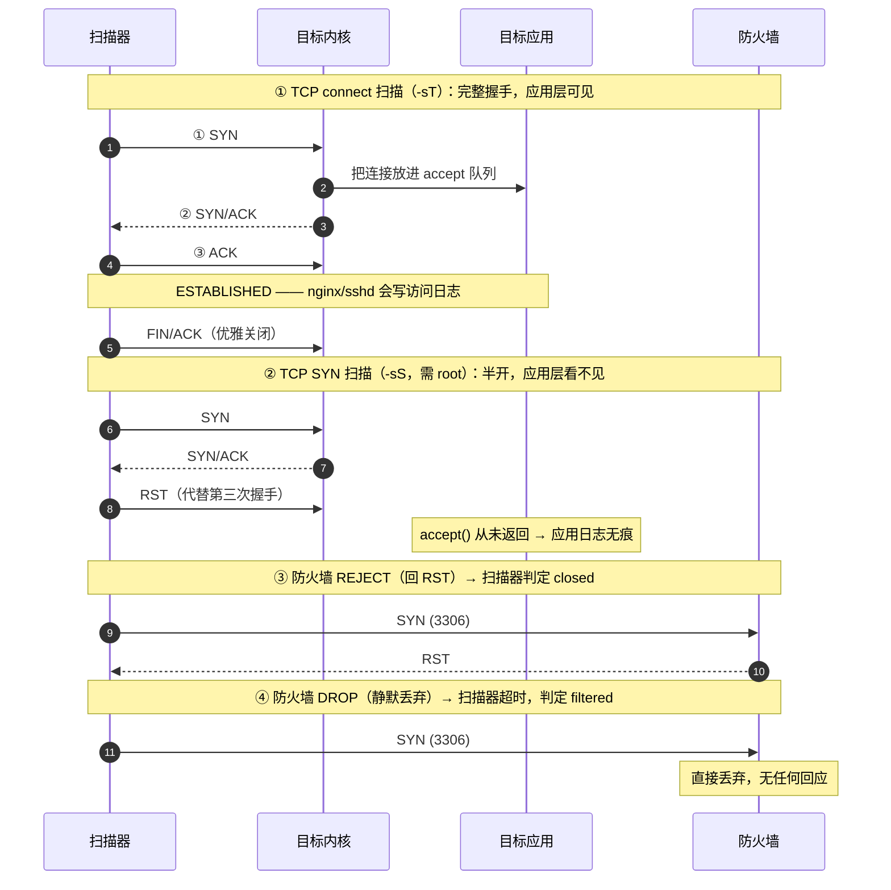
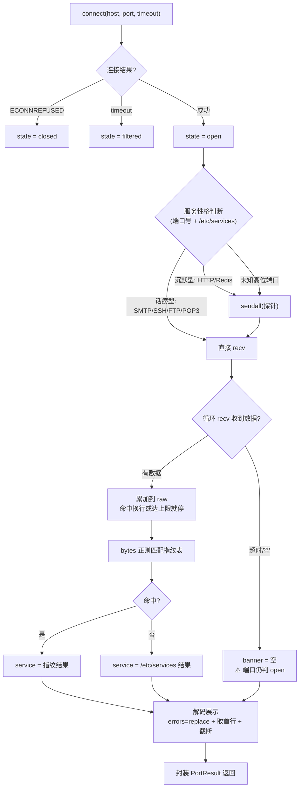
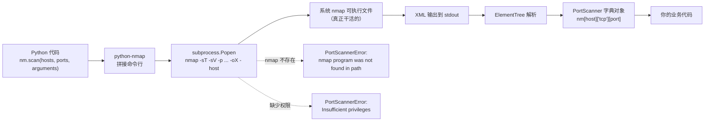

# Day 153 · 图解：端口扫描的原理、流程与架构

> 本目录只有文字图（Mermaid 代码块 + ASCII 图），**不生成任何图片文件**。
> Mermaid 块可以直接粘到支持 Mermaid 的 Markdown 渲染器里看。
> 所有图只描述**针对本机/自有资产**的教学场景。

---

## 图 1：TCP 三次握手与四种扫描类型的关系（Mermaid 时序图）



---

## 图 2：端口三态判定（ASCII）

```
                        扫描器 connect_ex((host, port))
                                     │
        ┌────────────────────────────┼────────────────────────────┐
        │                            │                            │
   返回 0                     返回 111 (ECONNREFUSED)      返回 110 (ETIMEDOUT)
        │                            │                            │
      open                        closed                     filtered
        │                            │                            │
 有进程在 listen            主机内核明确说"没有"            报文被中间设备丢弃
 进一步抓 banner             → 主机存活信息暴露              → 可能有防火墙/IDS
        │                            │                            │
        ▼                            ▼                            ▼
  查服务与版本               风险低，但说明主机可达         检查防火墙策略；
  对照 CVE 做评估            建议：不需要的服务关掉         这也是"你被看见了"的信号
```

---

## 图 3：banner 抓取决策流程（Mermaid 流程图）



---

## 图 4：八种服务性格与抓取策略（ASCII）

```
 性格              代表服务            抓取动作                     典型响应
 ─────────────────────────────────────────────────────────────────────────────
 话痨型     │ SMTP / FTP / SSH / POP3  │ 只 recv（不写）          │ 220 ... ESMTP
 握手型     │ MySQL / 部分工控协议      │ 只 recv（服务端先发）    │ \x0a + 版本号(二进制)
 请求-响应型│ HTTP / HTTPS             │ send GET 探针 → recv     │ HTTP/1.0 200 OK
 命令-应答型│ Redis / Memcached        │ send PING → recv         │ +PONG / -NOAUTH
 冰柜型     │ 无响应服务 / 黑洞         │ recv 直到超时            │ （空）
 反侦测型   │ 改 banner 的 SSH          │ 多探针 + 行为特征联合判断 │ 假版本号
 主动断开型 │ 严格 ACL 的服务            │ recv 立即收到 RST/FIN    │ （ConnectionReset）
 加密型     │ HTTPS / IMAPS / SMTPS    │ **必须先 TLS 握手**       │ TLS 证书 + 加密数据
```

---

## 图 5：并发扫描的时间线对比（ASCII）

```
【串行：1 个 worker】总耗时 = 各端口耗时之"和"
 t=0ms            600ms            1200ms           1800ms
  │                │                │                │
 22 ██ open (11ms)
 80 .....████████ closed（等满 600ms 超时）
443 ................████████ filtered
3306 ..............................████████ filtered
                                                    ↑ 总耗时 ≈ 1800ms

【并发：8 个 worker】总耗时 ≈ 最慢那个端口
 t=0ms            600ms
  │                │
 22 ██ open
 80 ████████████████ closed
443 ████████████████ filtered
3306 ████████████████ filtered
                   ↑ 总耗时 ≈ 620ms，提升 2.9 倍

【并发过高的代价：5000 workers】
 目标 conntrack 表被打满  →  正常用户连不进来（生产事故！）
 自己 fd 耗尽             →  OSError: [Errno 24] Too many open files
 触发 IPS/云 WAF 封禁     →  后续扫描结果全部失真
```

---

## 图 6：自动化扫描器整体架构（ASCII）

```
                ┌────────────────────────────────────────┐
                │           argparse 命令行参数            │
                │  --target --ports --workers --timeout   │
                └───────────────────┬────────────────────┘
                                    ▼
                ┌────────────────────────────────────────┐
                │       enforce_scope() 授权护栏           │
                │  非 127.0.0.1 → 必须 --i-own-this-target │
                └───────────────────┬────────────────────┘
                                    ▼
                ┌────────────────────────────────────────┐
                │  parse_ports("22,8000-8100")            │
                │  → 去重 / 排序 / 校验 1..65535           │
                └───────────────────┬────────────────────┘
                                    ▼
   ┌────────────────────────────────────────────────────────────┐
   │            ThreadPoolExecutor(max_workers=64)               │
   │  ┌─────────┐ ┌─────────┐ ┌─────────┐        ┌─────────┐    │
   │  │worker 1 │ │worker 2 │ │worker 3 │  ...   │worker N │    │
   │  └────┬────┘ └────┬────┘ └────┬────┘        └────┬────┘    │
   │       ▼           ▼           ▼                  ▼         │
   │   scan_one_port(): connect_ex → 三态 → 探针 → recv          │
   │                    → bytes 指纹匹配 → PortResult            │
   └───────────────────────────┬────────────────────────────────┘
                               ▼  as_completed（完成即收，边扫边打印）
                ┌────────────────────────────────────────┐
                │      results.sort(key=port) 确定性输出   │
                └───────────────────┬────────────────────┘
                                    │
              ┌─────────────────────┼──────────────────────┐
              ▼                     ▼                      ▼
     scan-result.json        scan-result.csv        scan-report.md
     （程序 / CI 消费）      （Excel / pandas）      （人读报告）
```

---

## 图 7：一次扫描的完整时序（ASCII）

```
 时间 ─────────────────────────────────────────────────────────────────▶

 用户   $ python3 03-auto-port-scanner.py --ports top
   │
   ├─▶ 启动演示服务（本机随机端口 HTTP + 假 SMTP）
   │     └─ 目的：保证任何环境跑都有非空结果，教学可见
   │
   ├─▶ 授权护栏检查：target == 127.0.0.1 ✅ 放行
   │
   ├─▶ 解析端口：top → 52 个端口，并入演示端口 → 54 个
   │
   ├─▶ 提交 54 个任务到 64 线程的线程池
   │     ├─ worker: 22/tcp   → connect 成功 → recv 到 SSH banner → ssh
   │     ├─ worker: 80/tcp   → ECONNREFUSED → closed
   │     ├─ worker: 631/tcp  → connect 成功 → 无 banner → ipp
   │     ├─ worker: 37083/tcp→ 未识别端口 → 发 GET → HTTP/1.0 200 OK → http
   │     └─ ...（并发进行，as_completed 边完成边打印）
   │
   ├─▶ 排序 → open=4 filtered=0 closed=50，耗时 0.61s
   │
   ├─▶ 导出 JSON / CSV / Markdown
   │
   └─▶ 退出码：有 filtered → 1；否则 → 0
        └─ 用途：接进 CI/cron，做"新增开放端口"告警
```

---

## 图 8：防御视角 —— 扫描行为在目标侧留下的痕迹（ASCII）

```
 目标侧能看到什么（以一次 SYN 扫描为例）：

   内核/网络层                                    应用层
   ┌─────────────────────────┐                   ┌──────────────────────┐
   │ 大量半开连接（SYN_RECV） │                   │ 什么都没有           │
   │ conntrack 表条目暴涨      │                   │ （accept 从未返回）   │
   │ 防火墙命中计数上升        │                   └──────────────────────┘
   │ IDS/IPS 产生告警          │
   └───────────┬─────────────┘
               │
               ▼
   可观测信号：
     · 单一源 IP 在短时间内请求了大量不同端口 ← 最明显的特征
     · RST 与 SYN 的比例异常（半开扫描会大量发 RST）
     · 访问目标的端口分布呈"顺序/均匀"特征（人类不会这样点）

   ✅ 建议处置：
     1. 先确认来源（内网资产扫描 / 外部攻击 / 被入侵的第三方主机）
     2. 对内网：联系对应团队确认是否在授权范围内
     3. 对外部：临时限速 + 加固暴露面 + 保留证据
     4. ⚠️ 不建议直接永久封禁源 IP：它可能是被入侵的第三方主机，
        封禁会切断真正的受害者的合法流量，也可能掩盖攻击链证据
```

---

## 图 9：Nmap 的调用栈（python-nmap 到底做了什么）



---

## 图 10：从端口扫描到漏洞评估（明日预告）

```
 扫描结果                    服务识别                   漏洞映射
 ┌──────────────┐     ┌──────────────────┐     ┌────────────────────┐
 │ 22/tcp open  │────▶│ SSH              │────▶│ 版本 7.4 < 8.0    │
 │              │     │ OpenSSH_7.4      │     │ CVE-2018-15473    │
 │              │     │                  │     │ （用户名枚举）      │
 └──────────────┘     └──────────────────┘     └────────────────────┘
         │
         │            ┌──────────────────┐     ┌────────────────────┐
         └───────────▶│ 仅知道"端口开着"  │────▶│ 无法做精确评估     │
                      │ （无 banner）     │     │ 只能标记"待人工确认" │
                      └──────────────────┘     └────────────────────┘
```

---

## 附：Mermaid 使用提示

把上面任意 ` ```mermaid ` 代码块粘到支持 Mermaid 的渲染器即可：

- GitHub / GitLab 的 Markdown 预览
- VS Code 的 Markdown Preview Mermaid Support 插件
- Typora、Obsidian
- <https://mermaid.live>（在线编辑器，可导出为 SVG/PNG）

> ⚠️ 本目录**不包含**任何生成的图片文件，所有图都以可编辑的文本形式保存，
> 方便你按自己的理解修改。
