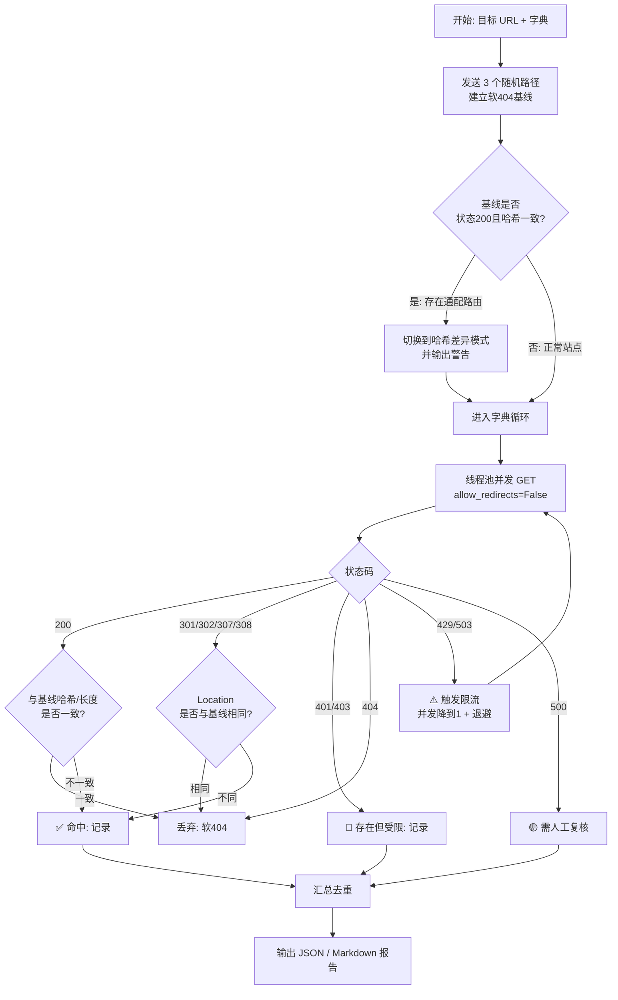

# Day 154 — 目录扫描与指纹识别：字典爆破、软 404 与资产发现

> 阶段：Phase 7 — 进阶与性能优化 · 主题：目录扫描与指纹识别
>
> 前置知识：Day 53 `requests` 入门、Day 116 TCP/UDP 协议、Day 153 端口扫描进阶、
> Day 152 XSS 与 Web 漏洞（HTTP 基础）。
> 昨天我们学会了"哪扇门开着"（端口扫描），今天学"门后面有哪些房间"
> （目录/文件枚举），并回答一个更工程化的问题：**这台服务器跑的是什么软件、
> 什么版本、什么框架**（指纹识别）。

---

## ⚠️ 使用前必读：法律与伦理边界

目录扫描（Directory Brute Force）本质上是**向目标服务器批量发送 HTTP 请求并
观察响应差异**。它不"破解"任何东西，但会产生大量请求，在未授权情况下依然是
一种探测行为，可能触犯：

| 法域 | 相关法条 |
|---|---|
| 中国大陆 | 《刑法》第 285 条、第 286 条；《网络安全法》第 27 条 |
| 美国 | CFAA, 18 U.S.C. § 1030 |
| 英国 | Computer Misuse Act 1990, s.1 |
| 欧盟 | 《网络犯罪公约》各缔约国转化条款 |

**允许使用本日内容的场景（白名单）：**

1. 你自己搭的机器 / 容器（本日示例统一硬编码 `127.0.0.1`）；
2. 组织资产且**持有书面授权**（写明域名、时间窗、请求速率上限、应急联系人）；
3. 授权靶场：自建 DVWA / VulnHub / HackTheBox / CTF 环境。

> 本日代码全部带 **"非本机目标必须显式声明授权"** 的护栏，并**强制限速**。
> 这不是形式主义：把安全边界写进代码，是安全工程师和"脚本小子"的分水岭。

---

## 一、概念解释

### 1.1 什么是"目录扫描"，它到底在解决什么问题

Web 服务器上的资源，理论上都应该被首页或导航链接引用。但现实里永远存在
**没有被任何页面链接指向的资源**：

- 备份文件：`backup.zip`、`www.tar.gz`、`index.php.bak`；
- 配置/调试入口：`.git/config`、`.env`、`phpinfo.php`、`debug.log`；
- 管理后台：`admin/`、`manager/html`、`wp-admin/`；
- API 文档与旧版本：`api/v1/`、`swagger.json`、`old/`；
- 编辑器残留：`index.php.swp`、`.DS_Store`。

这些资源**不可从页面发现**（unlinked），只能靠"猜名字"来枚举。这就是
**字典爆破（dictionary brute force）**：拿一份常见路径字典，逐个拼接成 URL
发请求，根据响应判断"存在与否"。

**为什么这招有效？** 两个历史原因：

1. **"通过隐藏来保证安全"（security by obscurity）** 是很多开发者的默认心智——
   他们把后台放在 `/admin-8f3k/` 以为没人猜得到；
2. **部署事故**：`.git/` 目录、`node_modules/`、`.env` 被误传到 Web 根目录，
   这类文件一旦可读，往往直接等于"源码泄露 + 凭据泄露"。

> 所以目录扫描的**真正价值在防御侧**：它是"我自己的站点有没有裸奔"的
> 最快自检手段。攻击者只是把同一套动作换成了恶意目的。

### 1.2 状态码：判断"存在"的第一依据

| 状态码 | 语义 | 扫描中的含义 |
|---|---|---|
| `200 OK` | 资源存在且返回内容 | **命中**（但要防"软 404"，见 1.4） |
| `204 No Content` | 成功但无响应体 | 命中，常见于 API 探活 |
| `301 / 308` | 永久重定向 | 常见于目录：`/admin` → `/admin/` |
| `302 / 307` | 临时重定向 | 常见于"未登录 → 跳转登录页"，**命中率极高** |
| `401 Unauthorized` | 需要认证 | **这是好线索**：说明资源存在，只是要登录 |
| `403 Forbidden` | 存在但禁止访问 | **同样是强线索**：存在！只是被规则挡住 |
| `200` 但内容为"页面不存在" | 软 404 | **误报源头**，必须过滤 |
| `404 Not Found` | 不存在 | 未命中 |
| `429 Too Many Requests` | 被限流 | **立即降速**，否则 IP 被封 |
| `500 / 503` | 服务端错误 | 可能是"参数不对"导致，需人工复核 |

**关键认知：**

- `403` 和 `401` **不是失败**，是"这个路径确实存在"的证据。很多扫描器默认只
  记录 200，会漏掉最有价值的发现（比如被 WAF 拦截的 `/admin`）。
- **路径长度与响应长度往往比状态码更可靠**：有的站点对所有不存在路径返回
  `200 + 自定义 404 页面`，只看状态码会得到 100% 误报。

### 1.3 字典从哪来，怎么选

| 字典 | 规模 | 特点 |
|---|---|---|
| `common.txt`（SecLists） | ~4700 行 | 通用性最好，适合日常自检 |
| `directory-list-2.3-small.txt` | ~8.7 万 | 平衡型，dirbuster 经典 |
| `directory-list-2.3-medium.txt` | ~22 万 | 全量，耗时长，需授权 |
| `raft-small-words.txt` | ~1 万 | 小写单词表，速度快 |
| 自建字典 | 任意 | **最优解**：从业务命名习惯提炼（如 `api`、`internal`、`v2`） |

**选择原则：**

1. **先小后大**：小字典跑完看趋势，再决定是否上大字典；
2. **加后缀变体**：`.bak`、`.old`、`.zip`、`.tar.gz`、`~`、`.swp`、`.1`；
3. **注意大小写**：Linux 文件系统区分大小写，`Admin` 和 `admin` 是两个路径，
   常见做法是"原词 + 首字母大写 + 全大写"三种变体。

### 1.4 软 404（Soft 404）：目录扫描最大的坑

**定义**：服务器对"不存在的资源"返回 `200 OK`，而响应体是一个自定义的
"页面不存在"页面。常见于：

- SPA（单页应用）：`nginx` 配置 `try_files $uri /index.html`，任何路径都返回首页；
- 框架路由：Django/Flask 的 catch-all 路由；
- 站点自定义 404 页面（返回 200 是为了"用户体验"或"SEO"）。

**后果**：如果你只看状态码，**每一个**请求都"命中"，扫描结果变成一份
字典的副本，毫无信息量。

**解决方案（工程上必须实现）：**

1. **基线比对（baseline diff）**：先请求 2~3 个**必然不存在**的随机路径
   （如 `/zzz-not-exist-a1b2c3`），记录其状态码与响应特征；
2. **响应体长度容差**：命中判定为 `abs(len(实际) - len(基线)) > 阈值`
   （或用**内容哈希**，比长度更稳）；
3. **页面标题/关键词过滤**：基线页面里抓 `<title>` 和 "not found" 等关键词，
   响应里出现同样内容则丢弃；
4. **拒绝"通配响应"**：如果随机路径返回 200 且长度一致，直接判定目标存在
   **通配路由**，本日工具应给出警告并切到"仅按哈希差异"模式。

> **一句话记住**：目录扫描的正确性，90% 取决于软 404 过滤做得好不好。
> 不会过滤软 404 的扫描器，只是一台"请求放大器"。

#### 1.4.1 软 404 和"通配路由"是两件事（本日工具能自动区分）

这两个现象**看起来一样**（未知路径都返回 200），但**成因和后果完全不同**，
必须分开处理，否则你的报告置信度就是一笔糊涂账：

| | 软 404（custom 404 page） | 通配路由（catch-all / SPA fallback） |
|---|---|---|
| 典型配置 | 应用层把 404 页面渲染成 200；`error_page` 写错 | `try_files $uri $uri/ /index.html` |
| 未知路径返回的内容 | **专用错误页**（与首页不同） | **首页本身**（与首页逐字节相同） |
| 响应体还有判别力吗 | ✅ 有：归一化哈希一过滤就干净了 | ❌ 没有：所有路径的正文完全一致 |
| 正确的判定依据 | 归一化哈希 + 长度容差 | 只能靠"与首页哈希的**差异**"或头部差异，置信度低 → 报告必须标注 |
| 扫描器该怎么办 | 照常扫，用基线过滤 | 明确警告"结果不可信"，改用协议层证据（见 2.8） |

**判定算法（3 步，`02`/`03` 都已实现）：**

```
1. 取 3 个随机路径（如 /zz-not-exist-<ts>-0..2），记录 (status, 归一化哈希)
2. 若三者 status 都是 200 且归一化哈希一致 → 存在 catch-all 响应
3. 再取首页 "/" 的归一化哈希做比对：
     == 基线哈希  → catch-all 的形态是「通配路由」（SPA）
     != 基线哈希  → catch-all 的形态是「软 404」（自定义错误页）
```

**在本日靶场上亲手验证（两个模式的输出完全不同）：**

```bash
python3 code/00-local-lab.py --port 8081 --mode soft404    # 默认
python3 code/00-local-lab.py --port 8082 --mode wildcard
python3 code/02-fingerprint-pitfalls.py --url http://127.0.0.1:8081   # → 检测到【软 404】
python3 code/02-fingerprint-pitfalls.py --url http://127.0.0.1:8082   # → 检测到【通配路由】
```

> **为什么这个区分值钱？** 实战里"抓到一堆 200"往往被误当成战果。
> 如果你把 SPA 的 `index.html` 当成"发现了 200 个目录"，报告就是垃圾；
> 反过来，如果因为站点是软 404 就放弃扫描，你会漏掉真正的 `/admin`、`/.env`。

### 1.5 Web 指纹识别（Fingerprinting）：识别"这是什么"

指纹识别的目标：**在不登录、不利用漏洞的前提下，判断目标的技术栈**。
它服务于三件事：

1. **资产管理**：我到底有多少台 nginx、多少个 WordPress；
2. **漏洞排查**：nginx 1.18.0 有已知 CVE，我要不要升级；
3. **攻击面评估（防御方也做）**：暴露的版本号本身就是风险。

**指纹证据来源（按可靠性排序）：**

| 证据 | 示例 | 可靠性 |
|---|---|---|
| `Server` 响应头 | `Server: nginx/1.24.0` | 高（但可伪造/可关闭） |
| `X-Powered-By` | `X-Powered-By: PHP/8.1.2` | 高（常被关闭） |
| `Set-Cookie` 名字 | `JSESSIONID`→Java、`PHPSESSID`→PHP、`csrftoken`→Django | 高 |
| 特殊路径响应 | `/wp-login.php` 存在 → WordPress | 高 |
| 页面特征字符串 | `<meta name="generator" content="WordPress 6.4">` | 中 |
| 静态资源哈希 | `/static/js/main.abc123.js` → 前端构建工具 | 中 |
| **favicon 哈希** | `mmh3(favicon.ico)` 与 Shodan/Fofa 库比对 | 中高 |
| 默认错误页 | nginx 的 `502` 页样式 | 中 |
| TCP/IP 栈特征 | TTL、TCP 窗口大小、选项顺序（p0f 思路） | 中（需原始套接字） |

**为什么 favicon 哈希是个好东西？** `favicon.ico` 是 Web 应用的"指纹"里
**最稳定**的部分之一：它很少随版本更新，且**跨域名共享**（同一个 CMS/产品
部署在不同 IP 上，favicon 哈希相同）。计算方式是：

```
mmh3.hash(base64(favicon_bytes))   # 得到 32 位有符号整数
```

把它丢进 Shodan（`http.favicon.hash:-1234567`）或 Fofa，经常能一把捞出
同一个产品部署的上百个实例。

### 1.6 多线程：为什么扫描必须并发

单线程扫描 1 万个路径，每个请求 RTT 100ms：

```
10000 × 0.1s = 1000s ≈ 16.7 分钟
```

用 50 个线程并行：

```
10000 × 0.1s / 50 ≈ 20s
```

**为什么用线程池而不是 asyncio？**

- `requests` 是同步阻塞库，配 `ThreadPoolExecutor` 改动最小、心智负担最低；
- 扫描是 **I/O 密集**（等网络），GIL 在 I/O 等待时会释放，线程池收益接近线性；
- 代价是每线程内存开销（~8MB 栈）和上下文切换；50~100 线程是甜点区间；
- 若追求极限，可换 `httpx.AsyncClient`（协程，单线程可开 500+ 并发），
  但要注意**服务端和 WAF 都会把你当 DDoS**。

### 1.7 限速：不是礼貌，是必需

三个层面必须限速：

1. **法律/合规层面**：授权书里通常写死"≤ N req/s"，超了就是违约；
2. **可用性层面**：快速扫描可能压垮小站（真事：某 2 核 2G 的 VPS 被
   `-T5` 级别的扫描打到 502）；
3. **反制层面**：绝大多数 WAF（Cloudflare、阿里云盾、ModSecurity）都有
   **请求速率阈值**，超限先 `429`，再封 IP 10~60 分钟——你的扫描直接中断。

**实战参数建议：**

- 自建靶场：10~50 并发无压力；
- 生产环境授权测试：**2~5 并发 + 每请求间 100~300ms 延迟**；
- 遇到 `429` / `503`：**立刻把并发降到 1**，并读取 `Retry-After` 头。

---
## 二、原理解释（底层机制与设计动机）

### 2.1 HTTP/1.1 请求-响应与"存在性"的判定依据

一次目录扫描请求在网络层发生了什么：

```
客户端                                       服务器
  |  TCP 三次握手 (SYN / SYN-ACK / ACK)         |
  |-------------------------------------------->|
  |  GET /admin HTTP/1.1                        |
  |  Host: 127.0.0.1                            |
  |  User-Agent: ...                            |
  |  Connection: keep-alive                     |
  |-------------------------------------------->|
  |                                             |  路由匹配
  |                                             |  ├─ 命中文件 → 200
  |                                             |  ├─ 目录无 / → 301
  |                                             |  ├─ 需要登录 → 302/401
  |                                             |  └─ 不存在   → 404
  |   HTTP/1.1 301 Moved Permanently            |
  |   Location: /admin/                         |
  |   Content-Length: 0                         |
  |<--------------------------------------------|
  |  (keep-alive 复用连接, 继续下一个路径)        |
```

**关键设计点：**

- **`Host` 头决定路由**：同一 IP 上不同虚拟主机（vhost）返回完全不同内容。
  扫描必须带上正确的 `Host`，否则可能扫到"默认站点"（default_server），
  拿到一堆与你目标无关的 200。
- **`Connection: keep-alive`**：复用 TCP 连接可以省掉每请求一次三次握手，
  在 1 万路径的扫描里能省掉 90%+ 的握手开销。`requests.Session` 默认开启。
- **HTTP/2 的影响**：多路复用让并发在协议层完成，但**请求速率**照样被服务端
  统计，不要以为 HTTP/2 就能无限并发。

### 2.2 为什么"不存在的路径"会有各种奇怪响应

这是理解软 404 的关键。响应由**多层中间件**共同决定：

```
请求 → CDN/WAF → 反向代理(nginx) → 应用服务器(gunicorn/uwsgi) → 框架路由 → 视图
         │              │                    │                    │
         │              │                    │                    └─ 无匹配 → 框架 404
         │              │                    └─ 进程挂了/超时 → 502
         │              └─ try_files 命中 index.html → 200 (软 404!)
         └─ 命中 WAF 规则 → 403 / 自定义拦截页
```

**设计动机拆解：**

1. 为什么 nginx 的 SPA 配置会制造软 404？

   ```nginx
   location / {
       try_files $uri $uri/ /index.html;   # 找不到就给 index.html
   }
   ```
   这是为了让前端路由（`/user/123`）在浏览器刷新后不 404。**代价**是任何路径
   都返回 200。这是"前端路由"和"HTTP 语义"的冲突，属于架构层面的取舍。

2. 为什么有人把 404 改成 200？
   搜索引擎优化（SEO）历史遗留 + "用户看到 404 不友好"。SEO 上其实是错的
   （软 404 会被 Google 降权），但存量站点很多。

3. 为什么 `/admin` 会 302 到 `/login`？
   应用层鉴权中间件统一处理："未认证 → 重定向到登录页"。这条规则对**所有**
   受保护路径生效，所以 `/admin`、`/api/users`、`/dashboard` 全都 302 到同一个
   URL —— **重定向目标相同**这个特征，本身就可以用来区分"真存在"和"不存在"。

### 2.3 软 404 检测算法（本日工具的核心）

```
输入: 目标 URL, 字典, 线程数
1. 生成 N=3 个随机路径:
     /a9f3k2-notexist, /z7x1m-notexist, /q2w8v-notexist
2. 记录基线集合 B = [(status, len, sha256(body), title), ...]
3. 对每个字典路径 P:
     r = GET(P)
     若 (r.status, sha256(r.body)) 与任一基线完全相同 → 丢弃
     若 r.status 在 B 的 status 集合内 且 |len(r.body) - len(baseline)| <= 容差 → 丢弃
     若 r.status in {401, 403, 500} → 记录为"存在但受限"
     若 r.status in {301, 302} 且 Location 与基线不同 → 记录
     否则 → 记录为命中
4. 输出: 命中列表 + 基线指纹（供人工复核）
```

**为什么要用 `sha256` 而不是只比长度？** 因为存在**动态页面**：页脚有随机
nonce、时间戳、"访问量"计数。长度会抖动，但**去掉动态部分后哈希一致**。
工程折中方案：

- 优先比哈希；哈希不同再比长度（容差 5%）；都不同就是命中。

### 2.4 favicon 哈希的完整计算原理

```
favicon.ico (二进制)
   ↓ base64 编码（因为 mmh3 对 "str" 编码敏感，base64 能消除换行/编码差异）
"AAABAAEAEBAAAAEAIABoBAAAFgAAACgAAAAQAAAAIAAAAAEAIAAAAAAAAAQA..."
   ↓ mmh3.hash(s, signed=True)   ← MurmurHash3 x86 32 位
-1234567890
   ↓ 查询指纹库（Shodan: http.favicon.hash:-1234567890 / Fofa）
"该哈希对应: Grafana 8.x 默认 icon"
```

**为什么用 MurmurHash3 而不是 MD5？**

- MurmurHash3 是**非加密哈希**，速度快、分布均匀，适合"当索引键"；
- Shodan/Fofa 的 favicon 索引就是这么建的，你算出的哈希必须**和它们一致**
  才能查到东西——这是"事实标准"，不是因为 mmh3 本身更优。
- **必须 base64（或统一为 UTF-8 字符串）**：mmh3 的 `hash()` 对 `str` 会先
  按 UTF-8 编码，对 `bytes` 直接算。为了跨工具一致，社区统一约定
  "base64 后取 hash"。

### 2.5 并发模型选型：线程池 vs 协程 vs 进程池

| 模型 | 适用 | 优点 | 缺点 |
|---|---|---|---|
| `ThreadPoolExecutor` | 同步库（requests）批量 I/O | 改动小、调试易 | 线程内存开销、GIL 切换 |
| `asyncio` + `httpx/aiohttp` | 高并发 I/O | 单线程数千并发 | 生态异步化成本、调试难 |
| `ProcessPoolExecutor` | CPU 密集 | 绕开 GIL | 进程开销大，I/O 场景完全没必要 |
| `multiprocessing.dummy` | — | 其实就是线程池 | 命名有误导性 |

**本日选线程池的理由**：扫描的瓶颈在网络 I/O，`requests.Session` 复用连接后
单线程也能到几百 req/s；50 线程足以在"不惹怒 WAF"的前提下把 1 万字典跑完。

### 2.6 指纹识别的"被动 vs 主动"路线

```
被动指纹 (passive)                      主动指纹 (active)
─────────────────                       ─────────────────
只看正常请求的响应                       额外发专门请求
 ├─ 响应头                                ├─ 访问 /wp-login.php 是否存在
 ├─ Cookie 名                             ├─ 读 /favicon.ico 算哈希
 ├─ HTML 特征                             ├─ 试探 /actuator/env (Spring)
 └─ 静态资源路径                           ├─ 试探 /.git/config
                                         └─ 读 /robots.txt, /sitemap.xml
优点: 不产生额外流量、风险低              优点: 准确率高、能识别版本
缺点: 目标关掉 Server 头就失效            缺点: 流量明显、可能触发告警
```

**工程建议：先被动，再少量主动。** 本日 `03` 示例实现"被动为主 + 若干
低风险主动探针（robots.txt / favicon / 已知路径）"的组合。

### 2.7 连接复用、连接池与 TIME_WAIT：为什么扫描必须用 Session

一次 HTTP 请求的真实成本，大部分不在"发字节"，而在**建连接**：

```
每个请求都新建连接（requests.get 直连）：
  SYN → SYN/ACK → ACK            (1.5 RTT 握手)
  → TLS 握手（HTTPS 还要 +1~2 RTT）
  → 请求/响应                     (1 RTT)
  合计 ≈ 3~4 RTT，而且每个连接都要经历 TCP 慢启动（cwnd 从 10 个 MSS 起涨）

用 Session 复用连接（keep-alive）：
  第 1 个请求付 3~4 RTT，之后每个请求只付 1 RTT
  → 1 万个路径：从 ~3.5 万 RTT 降到 ~1 万 RTT，省掉 70%+ 的等待
```

**这就是 `01` 示例里 `make_session()` 必须存在的理由**，也是"为什么加线程
比换库更划算"的原因：先把握手省掉，再谈并发。

**连接池是有限的（最常见的性能陷阱）：**

```python
adapter = requests.adapters.HTTPAdapter(pool_connections=100, pool_maxsize=100)
s.mount("http://", adapter); s.mount("https://", adapter)
```

| 症状 | 真因 | 处理 |
|---|---|---|
| 把线程从 20 加到 100，耗时没变 | `pool_maxsize` 默认只有 10，线程在**排队等连接**，不是等网络 | `pool_maxsize ≥ 线程数` |
| 报 `Connection pool is full, discarding connection` | 池满后 requests 会**丢弃**连接（日志是 warning，容易被忽略） | 同上；或显式降并发 |
| 扫描中途变慢、日志出现大量重连 | 服务端 `keepalive_timeout`（nginx 默认 75s）到期，或 `MaxClients` 达到上限 | 降并发；读服务端 `Connection: close` 响应头 |
| `ss -s` 里 TIME_WAIT 上千 | 短连接高频重连；主动关闭方要等 2×MSL（Linux 约 60s） | 复用连接；`SO_REUSEADDR`；必要时调 `tcp_tw_reuse`（谨慎） |
| `Cannot assign requested address` | 本地临时端口（默认约 2.8 万个）被 TIME_WAIT 耗尽 | 降速/复用连接 —— 这条报错本身就是"你扫太快了"的铁证 |

**观察命令（这些是自查"我是不是把对方打疼了"的第一手证据）：**

```bash
ss -s                                    # 全局 socket 统计（TIME_WAIT / estab 数量）
ss -tan state time-wait | wc -l          # 本机 TIME_WAIT 连接数
ss -tan state established '( dport = :80 or dport = :443 )' | wc -l
```

> **结论**：并发不是"越大越快"，而是 `连接数 × 服务端承受力 × 合规速率上限`
> 三者取最小值。`03` 示例把 `workers` 硬上限压到 50，就是这个道理。

### 2.8 当状态码和长度都不可信时：还有哪些"存在性"证据

通配路由/软 404 把"应用层渲染结果"变成噪音之后，**协议层语义**仍然可靠 ——
因为它们是 `nginx`（或任何前端）在**渲染之前**就决定的：

| 证据 | 判读规则 | 原理 / 为什么可靠 | 风险 |
|---|---|---|---|
| `HEAD` 与 `GET` 的差异 | `HEAD` 用的资源若存在，头与 `GET` 一致 | HEAD 不返回 body，绕开"模板渲染"这一层噪音 | 少数框架 HEAD 处理有 bug，需与 GET 交叉验证 |
| `405 Method Not Allowed` + `Allow` 头 | 405 = 资源存在但方法不允许 | 路由匹配成功才会返回 405 | 需要额外请求；对**每个**路径发 POST 会放大流量 |
| `ETag` / `Last-Modified` | 不存在的路径与你发现的软 404 页 ETag **相同** → 就是软 404 | ETag 由**内容**派生，与页面模板无关 | ETag 可能按请求生成（弱校验），需采样多次 |
| `Content-Length` 与实际下载字节数 | 声明 10000 字节，实际只收到 342 → 声明是假的 | `stream=True` + 读满能发现"伪造长度"的假响应 | 要真下载，流量成本高 |
| `Accept-Ranges: bytes` + `Range: bytes=0-9` | 用 Range 只取 10 字节就能确认资源实体存在 | 走的是**文件/后端实体读取**路径，不经过错误页模板 | 可能触发上游缓存不一致；先小范围探测 |
| 条件请求 `If-None-Match` | 返回 `304 Not Modified` → 资源存在且未变 | 304 只可能由"存在且命中校验"产生 | 仅对已知 ETag 的路径可用 |
| `Content-Type` / 二级路径差异 | 软 404 页是 `text/html`，真实 `.json/.js` 是相应类型 | 类型由**资源处理器**决定 | 需要对比基准 |
| 响应时间侧信道 | 不存在的路径走"错误页模板"，存在的路径走"真实处理链"，耗时分布不同 | 处理路径不同 → 时间不同 | 抖动大，需要多次采样与统计；**别据此下结论** |

**本机复现（对着靶场看差异，全程 127.0.0.1）：**

```bash
# 1) HEAD 也能拿到存在性证据（靶场对 HEAD 返回同样的头）
curl -s -I  http://127.0.0.1:8080/admin      # → 301, Location: /admin/
curl -s -I  http://127.0.0.1:8080/zz-nope    # → 200（软404），但仍可看 ETag/长度

# 2) Range 只取 10 字节（在"通配路由"站点上，这是少数还能用的证据）
curl -s -r 0-9 -D - -o /dev/null http://127.0.0.1:8080/favicon.ico
#    → Content-Range: bytes 0-9/790  ← 790 是真实实体长度

# 3) 条件请求：先取 ETag，再带回校验
curl -s -I http://127.0.0.1:8080/ | grep -i etag
```

> **工程结论**：把"状态码 → 哈希 → 协议层证据"当成**三级判据**。
> 级别越高（应用层）越容易被配置骗，级别越低（协议层）越接近事实，
> 但代价也越高（要额外请求/要下载）。
> `--self-test` 里锁住的正是这套分级逻辑：靶场上"未知路径 200"必须被过滤，
> 而 `/admin → 301`、`/admin/ → 401`、`/secret/ → 403` 必须被保留。

### 2.9 限速的数学：从固定间隔到自适应退避

**（1）固定间隔（`--delay`）的真实吞吐**

```
平均速率 ≈ 1 / (delay + RTT_avg)
   delay=0.1s、RTT=20ms  → 1/0.12 ≈ 8.3 req/s
   delay=0.0s、RTT=20ms  → 50 req/s（此时瓶颈变成服务端与网络）
```
有 N 个线程时，速率上限是 `N / (delay + RTT)`，**但 `delay` 是每线程各自
sleep**，所以多线程会让"限速"名存实亡。`03` 的做法是把 `delay` 放在
**全局共享的 RateLimiter** 里，所有线程都从它取等待时间。

**（2）令牌桶/漏桶：为什么要区分"突发"和"平均"**

| 模型 | 行为 | 适用 |
|---|---|---|
| 固定间隔 | 严格平均，突发为 0 | 合规要求写死"≤N req/s"时 |
| 令牌桶 | 允许短时间内用掉攒下的令牌（突发） | 抓取有"热点批量"特征的场景 |
| 漏桶 | 恒定流出，多余排队/丢弃 | 保护下游、平滑流量 |

**（3）自适应退避（`03` 的实现，也是 WAF 环境下唯一能跑完的策略）**

```
被限流:  backoff ← min( max(backoff × 2, Retry-After), 60 )
成功一次: backoff ← max( backoff / 2 − 0.05, 0 )
```

为什么这样设计：

- **指数上升**：连续被限流说明"当前速率一定超标"，要快速退到安全区；
- **`Retry-After` 优先**：服务端明确告诉你等多久，就听它的（这是唯一有官方语义的信号）；
- **封顶 60s**：避免 `2^n` 无限增长成"扫描器假死"；
- **成功减半（而不是归零）**：直接归零会立刻再次触限，形成"限流→恢复→限流"的振荡；
  减半是"缓慢爬回"的工程折中，代价是最坏情况下多花几分钟。

**在靶场上观察退避行为：**

```bash
# 靶场从第 4 个请求起返回 429 + Retry-After: 1
python3 code/00-local-lab.py --port 8083 --rate-limit 3 --mode strict404
python3 code/03-asset-discovery.py --url http://127.0.0.1:8083 --workers 1 --delay 0
# 输出里会出现：⚠️ 触发限流，退避 1.0s → 2.0s …（并最终把该请求标记为 RateLimited）
```

> `--self-test` 里对退避数学做了**精确断言**（1→2→…→60 封顶、成功后减半、`Retry-After` 生效），
> 因为这段数学跑错时**不会报错**，只会让你的扫描"莫名其妙很慢"或"忽然全 429"。

---
## 三、定义与使用方法（API 速查表）

### 3.1 `requests` 扫描必需部分速查

```python
import requests

# ── 会话：复用 TCP 连接，扫描时必用 ──
s = requests.Session()
s.headers.update({
    "User-Agent": "Mozilla/5.0 (compatible; OwnedSiteAudit/1.0)",  # 标识自己，礼貌
    "Accept": "*/*",
})

# ── 请求：超时必须是 (连接超时, 读取超时) 元组 ──
r = s.get(url, timeout=(3, 5), allow_redirects=False, verify=False)

# 参数说明：
#   timeout=(3, 5)       连接 3s、读取 5s 未完成就抛异常
#   allow_redirects=False 关键！需要自己看 301/302 的 Location，而不是被自动跟随
#   verify=False          仅用于自签名证书的靶场；会打印 InsecureRequestWarning
#   stream=True + r.raw.read(limit)  只读前 N 字节，适合大文件/伪造 content-length

# ── 响应属性 ──
r.status_code      # int: 200/301/404/...
r.headers          # CaseInsensitiveDict，r.headers.get("server") 小写也能取到
r.text             # str，按 apparent_encoding 解码
r.content          # bytes，算哈希/写文件用这个，避免解码带来的差异
r.url              # 最终 URL（allow_redirects=True 时可能已变化）
r.history          # list[Response]，重定向链
r.elapsed          # timedelta，本请求耗时

# ── 异常体系（必须按顺序捕获）──
requests.exceptions.ConnectTimeout      # 连接阶段超时
requests.exceptions.ReadTimeout         # 读取阶段超时
requests.exceptions.TooManyRedirects    # 重定向死循环
requests.exceptions.SSLError            # 证书错误
requests.exceptions.ConnectionError     # DNS 失败 / 拒绝连接（含上面几种的子类父类关系）
requests.exceptions.RequestException    # 所有异常的基类 ← 兜底写这个

# ── 关闭 ──
s.close()          # 或 with requests.Session() as s: ...
```

### 3.2 `concurrent.futures` 速查（扫描骨架）

```python
from concurrent.futures import ThreadPoolExecutor, as_completed

with ThreadPoolExecutor(max_workers=50) as ex:
    futures = {ex.submit(probe, url): url for url in urls}
    for fut in as_completed(futures):
        url = futures[fut]
        try:
            result = fut.result(timeout=0)     # 已在 as_completed 后，timeout 无意义
        except Exception as e:
            result = None                      # 单个任务失败不影响整体
```

| 方法 | 作用 | 注意 |
|---|---|---|
| `submit(fn, *args)` | 提交单个任务，返回 `Future` | 不阻塞 |
| `map(fn, iterable)` | 批量提交，返回**按输入顺序**的迭代器 | 会按顺序返回，慢任务会阻塞后面 |
| `as_completed(fs)` | 谁先完成先返回 | 扫描场景首选 |
| `Future.result()` | 取返回值，异常会在此**重新抛出** | 不写 try 会让整个循环崩掉 |
| `Future.cancel()` | 取消未开始的任务 | 已运行的取消不了 |
| `shutdown(wait=False)` | 不等任务结束 | `with` 语句会自动 `wait=True` |

### 3.3 哈希与 base64 速查（favicon / 内容比对）

```python
import base64, hashlib
try:
    import mmh3                      # pip install mmh3（可选）
except ImportError:
    mmh3 = None                      # ← 本仓库示例在没装 mmh3 时用内置的
                                     #   纯 Python MurmurHash3 x86_32 兜底
                                     #   （02/03 的 --self-test 用公开测试向量校验等价性）

data = open("favicon.ico", "rb").read()

# Shodan/Fofa 口径的 favicon 哈希
h = mmh3.hash(base64.encodebytes(data))        # 注意：encodebytes 带换行，社区两种口径都有
# 另一种常见口径：mmh3.hash(base64.b64encode(data))  （标准 b64，无换行）
print(h)                                       # 有符号 32 位整数，如 -1234567890

# 响应体内容指纹（用于软 404 比对，避免解码差异）
sha = hashlib.sha256(r.content).hexdigest()

# 归一化后再哈希（去掉动态数字/时间戳）
import re
norm = re.sub(rb"\d+", b"#", r.content)        # 把所有数字替换成 #
norm_hash = hashlib.sha256(norm).hexdigest()
```

### 3.4 常用指纹特征速查表

```python
FINGERPRINTS = {
    "Server 头": {
        r"nginx/([\d.]+)":      "nginx",
        r"Apache/([\d.]+)":     "Apache httpd",
        r"gunicorn/([\d.]+)":   "Gunicorn (Python WSGI)",
        r"uvicorn":             "Uvicorn (ASGI/FastAPI)",
        r"cloudflare":          "Cloudflare CDN",
        r"openresty":           "OpenResty (nginx+lua)",
        r"Microsoft-IIS/([\d.]+)": "IIS",
    },
    "X-Powered-By": {
        r"PHP/([\d.]+)":        "PHP",
        r"Express":             "Express (Node.js)",
        r"ASP\.NET":            "ASP.NET",
    },
    "Cookie 名": {
        r"PHPSESSID":   "PHP",
        r"JSESSIONID":  "Java Servlet (Tomcat/Jetty)",
        r"csrftoken":   "Django",
        r"sessionid":   "Django",
        r"laravel_session": "Laravel (PHP)",
        r"connect\.sid": "Express (Node.js)",
        r"ASP\.NET_SessionId": "ASP.NET",
        r"grafana_session": "Grafana",
    },
    "HTML 特征": {
        r'name="generator" content="WordPress ([\d.]+)"': "WordPress",
        r"wp-content/":  "WordPress",
        r"/_next/static/": "Next.js",
        r"/static/js/main\.[0-9a-f]+\.js": "React (CRA)",
        r"__NEXT_DATA__": "Next.js",
        r"Drupal\.settings": "Drupal",
        r"cdn\.shopify\.com": "Shopify",
    },
    "探针路径": {
        "/wp-login.php":   "WordPress",
        "/administrator/": "Joomla",
        "/user/login":     "Drupal",
        "/actuator/health":"Spring Boot Actuator",
        "/swagger-ui.html":"SpringFox Swagger",
        "/.git/HEAD":      "Git 目录泄露 ⚠️",
        "/.env":           ".env 泄露 ⚠️",
        "/phpinfo.php":    "phpinfo 泄露 ⚠️",
        "/server-status":  "Apache status ⚠️",
    },
}
```

### 3.5 响应头安全自查速查（防御侧）

| 响应头 | 期望值 | 缺失意味着 |
|---|---|---|
| `Strict-Transport-Security` | `max-age=31536000; includeSubDomains` | 可被 SSL 剥离降级 |
| `Content-Security-Policy` | 白名单式策略 | XSS 无第二道防线 |
| `X-Content-Type-Options` | `nosniff` | MIME 嗅探导致脚本执行 |
| `X-Frame-Options` / CSP `frame-ancestors` | `DENY` / `SAMEORIGIN` | 点击劫持 |
| `Referrer-Policy` | `strict-origin-when-cross-origin` | 敏感 URL 泄露给第三方 |
| `Permissions-Policy` | 按需关闭 | 摄像头/麦克风被滥用 |
| `Server` / `X-Powered-By` | **建议删除或模糊化** | 版本信息泄露 → 精准打 CVE |

> 扫描自己的站点时，**这份表就是产出物**：一份"缺失的安全头清单"比
> 一堆 `200` 的目录列表有用得多。

---
## 四、图解

> 完整图解（含 5 张 Mermaid/ASCII 图）见 [`diagrams/README.md`](diagrams/README.md)。
> 下面给出最核心的两张。

### 4.1 目录扫描决策流程（Mermaid）



### 4.2 指纹识别证据层次（ASCII）

```
可靠性  ┌──────────────────────────────────────────────┐
 高     │ 响应头: Server / X-Powered-By / Cookie 名     │  ← 先看这个
        ├──────────────────────────────────────────────┤
        │ 特殊路径存在性: /wp-login.php /actuator      │  ← 再主动探
        ├──────────────────────────────────────────────┤
        │ 页面特征: generator meta / 静态资源路径       │
        ├──────────────────────────────────────────────┤
        │ favicon mmh3 哈希 → Shodan/Fofa 库比对       │
        ├──────────────────────────────────────────────┤
 低     │ 默认错误页样式 / 目录列表样式                  │
        └──────────────────────────────────────────────┘
                          ↓
              证据加权 → 候选技术栈列表 → 人工确认
```

---

## 五、完整可运行实战代码

| 文件 | 行数 | 内容 | 运行方式 |
|---|---|---|---|
| `code/00-local-lab.py` | ~745 | **本地回环靶场**（纯标准库）：复现软 404 / 通配路由 / 301·401·403 / gzip / 慢接口 / 429 限流 / 危险文件 | `--self-test` 或直接起服务 |
| `code/01-dir-brute-basics.py` | ~565 | 基础：单线程 → 线程池目录扫描，显式观察 301/302/401/403，以及"没有软 404 过滤会怎样" | 联机 or `--self-test` |
| `code/02-fingerprint-pitfalls.py` | ~845 | 进阶：软 404 基线、catch-all 形态细分、favicon 哈希、9 个必须踩的坑（含 requests `get_all` 与 urljoin 两个真实 bug） | 联机 or `--self-test` |
| `code/03-asset-discovery.py` | ~875 | 实战：并发资产发现工具（扫描 + 指纹 + 安全头体检 + JSON/MD 报告 + 限速退避） | 联机 or `--self-test` |

### 5.1 依赖：请求库是"可选"的（两条等价路径）

| | 联机演示（方式 A） | 离线自检（方式 B） |
|---|---|---|
| `requests` | 有则优先使用（连接池 + keep-alive，快） | 不需要 |
| 没有 `requests` 时 | 自动降级 `00-local-lab.py` 里的 `StdlibSession`（纯 `urllib` 实现，接口与 requests 对齐） | 全部走标准库 |
| `mmh3` | 有则用 C 扩展（快） | 不需要 —— 内置**纯 Python MurmurHash3 x86_32**，结果与 mmh3 逐位一致（`--self-test` 用公开测试向量校验） |
| 需要网络 | 需要（只连 127.0.0.1） | **完全不需要** |
| 需要 sudo | 不需要 | 不需要 |

```bash
# 可选安装（不装也能跑，会自动降级）
pip install requests      # 更快，支持连接池
pip install mmh3          # 可选：favicon 哈希用 C 扩展加速
```

**运行前提（方式 A：联机演示，全部在回环地址上跑）：**

```bash
cd days/day-154-directory-scan-fingerprint/code

# 终端 1：起靶场（纯标准库，不装任何东西）
python3 00-local-lab.py --port 8080

# 终端 2：跑三个示例
python3 01-dir-brute-basics.py --url http://127.0.0.1:8080
python3 02-fingerprint-pitfalls.py --url http://127.0.0.1:8080
python3 03-asset-discovery.py --url http://127.0.0.1:8080 --workers 5 --delay 0.02
#   报告默认写进系统临时目录（不会污染仓库工作树），也可以显式指定：
#   ... --out-dir /tmp/out
```

**方式 B（离线自检，不联网、不装库、不写仓库）：**

```bash
# 在仓库根目录执行（本项目约定的自检入口）
python3 -B days/day-154-directory-scan-fingerprint/code/00-local-lab.py --self-test
python3 -B days/day-154-directory-scan-fingerprint/code/01-dir-brute-basics.py --self-test
python3 -B days/day-154-directory-scan-fingerprint/code/02-fingerprint-pitfalls.py --self-test
python3 -B days/day-154-directory-scan-fingerprint/code/03-asset-discovery.py --self-test
```

**护栏说明：** 三个脚本都要求目标为 `127.0.0.1 / localhost / ::1`；
若传入其他主机，必须同时加 `--i-have-authorization` 才继续，否则直接退出（`exit 2`）。
`00-local-lab.py` 的监听地址**硬编码** `127.0.0.1`，没有任何参数能改成对外监听。

---

## 六、代码案例逐节说明

> 这一节解释"每一段代码为什么这么写"。跳过它你能跑通工具，读完它你才能**改**工具。

### 6.1 `00-local-lab.py` —— 靶场：把真实世界的坑搬到回环地址上

| 小节 | 关键设计 | 为什么必须这样 |
|---|---|---|
| 顶部 `MODES` / `SERVER_HEADER` | 三种 404 策略 + 假的 `nginx/1.24.0` banner | 用一个开关复现"规范站点/软 404/SPA 通配"三类站点，测试才有对照 |
| `soft404_body(hits)` | 错误页里塞**每次递增**的计数器 | 让三种错误做法同时翻车：只看状态码（全 200）、只比原始哈希（每次都不同）、严格等长比对（9→10 位数变化）；只有"数字归一化后比哈希"能活下来 |
| `LabHandler.version_string()` | 返回假的 `nginx/1.24.0` | `http.server` 会自动把 `Server` 头塞进每个响应；同时说明**Server 头完全由服务端自填**，所以指纹必须多证据交叉验证 |
| `build_routes()` | 精确路由表：`/admin → 301`、`/admin/ → 401`、`/secret/ → 403`、`/login → 302`、`/gzip`、`/slow`、`/.env`(200)、`/.git/HEAD`(403) | 把"存在但受限""重定向""压缩体""慢接口""高价值泄露"这五类响应一次性准备好 |
| `_handle()` 里的限流 | 计数超阈值 → `429` + `Retry-After: 1`，**发生在路由之前** | 强调"429 与资源是否存在无关"，它只说明你该退避了 |
| `protocol_version = "HTTP/1.1"` + 精确 `Content-Length` | 支持 keep-alive 与 Range | 让 `Session` 的连接复用、`stream`/`Range` 实验都真实可做 |
| `StdlibSession` / `CIHeaders` / `StdlibResponse` | 用 `urllib` 复刻 requests 的接口（含 `allow_redirects=False` 语义与自动 gunzip 的 `.text`） | ① 没装 requests 也能跑；② 让你看清 requests 到底帮你封装了什么（重定向策略、大小写不敏感头、gzip、超时语义） |
| `--self-test` | 起临时端口 → 真发请求 → 断言 32 项 | 靶场自身也是代码，也会写错；靶场错了，后面所有实验的结论都是错的 |

**自检覆盖的关键断言（真实输出，节选）：**

```
✅ 软404模式：未知路径状态码: 200
✅ 软404页面：原始字节每次都不同（hits 计数器）
✅ /admin 状态码: 301        ✅ /admin/ 状态码: 401
✅ /secret/ 状态码: 403      ✅ /login Location: '/login?next=/admin/'
✅ gzip 解压后正文一致        ✅ 慢接口耗时 ≥200ms（实测 201ms）
✅ wildcard 模式：正文与首页完全相同: True
✅ 限流：前 3 个放行: [404, 404, 404]
✅ 限流：第 4/5 个返回 429: [429, 429]
```

### 6.2 `01-dir-brute-basics.py` —— 基础：把"扫描"拆成四步

| 小节 | 为什么这么写 |
|---|---|
| `INTERESTING = {...401, 403, 405...}` / `THROTTLE_CODES = {429, 503}` | 把"存在性证据"和"限流信号"分成两个集合。初学者最大的错误就是把 429 也当成"命中"，导致报告里全是噪音 |
| `load_lab()` + `importlib.util.spec_from_file_location` | 文件名以数字开头，**不能**直接 `import`；按路径加载是插件机制的标准做法（mitmproxy 的 `-s` 同理） |
| `make_session()` | 有 requests 就用连接池（`pool_maxsize=100`），没有就降级 `StdlibSession`。连接池大小必须 ≥ 线程数，否则线程在等连接而不是等网络 |
| `probe()`：`url = urljoin(base.rstrip("/") + "/", word)` | `urljoin("http://h/a", "b")` 会得到 `http://h/b`（把 `a` 当文件名替换），必须先把 base 规整成 `.../`；`word` 也不能带前导斜杠（见 8.1） |
| `probe()`：`allow_redirects=False` | 这一行决定了 301/302 是"证据"还是"被吞掉的噪音" |
| `probe()`：`except NET_ERRORS` | 单点失败必须隔离；`NET_ERRORS` 按后端切换（requests 用 `RequestException`，标准库用 `OSError`） |
| `scan_single()` vs `scan_threaded()` | 同一个 `probe`，两种调度：先看见串行的代价，再看到并发的收益（自检里实测 **5.9x**） |
| `interesting_of()`（从 `report()` 里抽出来） | 报告格式会变，但"什么算命中"的判定必须稳定且可测试 —— `--self-test` 锁的就是它 |
| `expand_suffixes()` | 备份文件是高频事故来源（`.bak/.old/~/.swp/.zip/.tar.gz/.1`）；同时自动把并发压到 5，避免字典膨胀 8 倍后变成 DDoS |
| `--self-test` | 34 项断言：URL 拼接、异常隔离、状态码语义、结果筛选排序、后缀展开，以及**对着靶场的端到端扫描**（含"软404 导致 7/7 全命中"这个故意缺陷的现场证明） |

### 6.3 `02-fingerprint-pitfalls.py` —— 进阶：9 个坑，每个都有反例和正解

| 坑 | 错误做法 | 正确做法 | 自检怎么证明 |
|---|---|---|---|
| 1 重定向被吞 | `session.get(url)`（默认跟随） | `allow_redirects=False`，自己读 `Location` | 靶场 `/admin` 不跟随拿 301，跟随会变 401/200 |
| 2 只看状态码 | `if r.status_code == 200: hit` | 先建基线再比对 | 靶场 soft404 模式下随机路径也是 200 |
| 3 只比长度 | `len(body) == len(baseline)` | **归一化后比哈希**，长度只作容差兜底 | 计数器 9→10 使长度变化 2 种，而归一化哈希始终 1 种 |
| 4 头大小写 | `r.headers["Server"]` | `r.headers.get("Server")` / `CLHeaders` | 三种写法实测都能取到 |
| 5 解码猜测 | `len(r.text)` 算哈希 | 用 `r.content` 算哈希，`r.text` 只给人看 | 非法字节场景演示 `UnicodeDecodeError` |
| 6 favicon 口径 | 随手 `b64encode` | 与 Shodan 一致用 `base64.encodebytes`，查不到再试另一种 | 实测两种口径哈希不同（-1691650584 vs 1790903055） |
| 7 无退避 | `while True: get()` | 429 → 指数退避 + 尊重 `Retry-After` | 靶场 `--rate-limit 3` 触发 |
| 8 **`hdrs.get_all()`** | `hdrs.get_all("Set-Cookie") or []` —— requests 的 `CaseInsensitiveDict` **没有**这个方法，线上必崩 | 封装 `header_values()`：`get_all()` → `raw.headers.getlist()` → `get()` 三级回退 | 断言 `hasattr(requests.Response().headers, "get_all") is False` |
| 9 **`urljoin` 吃掉 base 路径** | `urljoin("http://h/shop/", "/admin")` → `http://h/admin` | 字典不带前导斜杠，或手工 `base.rstrip('/') + '/' + word.lstrip('/')` | 两种写法实测结果对比 |

**核心算法（`Baseline` 类）的三个方法：**

- `collect(n=3)`：随机路径建基线；`wildcard` 表示"存在 catch-all"；
- `_classify_catch_all()`：**再取首页哈希比对** → 相同是 SPA 通配，不同是软 404（这就是 1.4.1 的实现）；
- `is_soft404(status, hash, norm_len, tolerance)`：状态码相同 + 哈希相同 → 铁定软 404；
  哈希不同但归一化长度在 5% 容差内 → 也算软 404（应对"页面上还有别的抖动"）。

**其他值得注意的实现细节：**

- `normalize()` 只做"数字→#、连续空白→单空格"：它的**已知局限**（随机字符串压不掉）
  在自检里被显式断言出来——把边界写进测试，比写进注释可靠；
- `looks_like_404()`：中英文关键词兜底（第三级判据），**明确标注为最弱的一级**；
- `favicon_hash(data, style)` + `murmur3_x86_32()`：纯 Python 实现按官方规范处理
  32 位溢出与有符号转换；若环境里有 mmh3，自检会**逐位交叉比对**，没有则用
  公开测试向量（`""→0`、`"foo"→-156908512`、`"hello"→613153351`）锁定。

### 6.4 `03-asset-discovery.py` —— 实战：把上面所有东西合成一个工具

| 组件 | 关键点 |
|---|---|
| `RateLimiter` | 全局共享（不是每线程一个）+ 指数退避 + 成功减半；`MAX_BACKOFF=60` 防止出现"扫描器假死" |
| `_get()` | 统一入口：限速 → 请求 → `429/503` 时按 `Retry-After` 退避重试（最多 3 次）→ 归一化哈希/长度 → 返回结构化 dict；**`content` 只在内存里用**，报告里会被剔除（bytes 不能进 JSON） |
| `build_baseline()` | 3 条随机基线 + 首页对比 → `catch_all_kind ∈ {normal, soft404, wildcard}`，并输出对应的处置建议 |
| `scan()` / `_classify()` / `_verdict()` | 线程池 + `as_completed`；404 丢弃 → 基线命中丢弃 → 其余按状态码分类（401/403 记为"存在但受限"）；命中的路径再过一遍高价值探针字典 |
| `fingerprint()` | 五路证据：`Server`/`Via` 头、`X-Powered-By`、Cookie 名、HTML 特征、favicon mmh3；**修复了原版的 `hdrs.get_all()` 崩溃点**，改用 `header_values()` |
| 安全头体检 | 6 个安全头逐个体检，产出"缺失清单"——这是**可以直接排期**的加固项 |
| `build_report()` / `write_reports()` | JSON（机器消费）+ Markdown（人读）；含 `catch_all_kind`、指纹、高价值发现、安全头、命中路径表 |
| `main()` | 默认输出目录 = `tempfile.mkdtemp()`，**绝不写进仓库工作树**；`--out-dir` 可覆盖 |
| `--self-test` | 54 项断言：纯函数、退避数学（含封顶/衰减边界）、哈希口径、**完整流水线**（对靶场扫描 → 命中/过滤/指纹/安全头/报告落盘/JSON 可反解析）、三种靶场形态（soft404/wildcard/strict404）、"永远 429"场景的退避耗尽 |

**一个真实的 bug 修复记录（值得你记住）：**

原版 `fingerprint()` 里写的是 `hdrs.get_all("Set-Cookie") or []`。
这在**单元测试**里永远测不出来（测试用的是自造 dict），但真实运行时会抛：

```
AttributeError: 'CaseInsensitiveDict' object has no attribute 'get_all'
```

正确路径是 `r.raw.headers.getlist("Set-Cookie")`（urllib3 的 `HTTPHeaderDict`）。
本日代码把它封装成 `header_values()`，两级回退 + `get()` 兜底，
并在 `02` 的自检里把"requests 没有 get_all"这条事实**断言固化**下来。

---

## 七、运行命令与预期输出示例

> 下面所有输出都是在本机实录（Python 3.12，只访问 127.0.0.1）。
> 端口号是随机的，以你实际运行输出为准；**关键数字**（命中数、哈希值、断言条数）是可复现的。

### 7.1 起靶场

```bash
$ python3 code/00-local-lab.py --port 8080
======================================================================
🎯 本地靶场已启动: http://127.0.0.1:8080  (mode=soft404)
======================================================================
可用端点：
  /                    首页（带 WordPress generator meta）
  /admin → /admin/     301 → 401（存在但需登录）
  /secret/             403（存在但被规则拒绝）
  /login               302 → /login?next=/admin/
  /gzip                gzip 压缩正文
  /slow                延迟返回（默认 0.2s）
  /.env                🚨 200（演示「危险文件泄露」场景）
  /.git/HEAD           403
  <未知路径>           200 + 自定义 404 页（带 hits 计数器）
```

### 7.2 `01` 联机：没有软 404 过滤会怎样（这是本示例故意保留的缺陷）

```bash
$ python3 code/01-dir-brute-basics.py --url http://127.0.0.1:8080
目标: http://127.0.0.1:8080
字典: 92 条 | 线程: 20
HTTP 后端: requests

[单线程] 30 个路径耗时 1.11s
[线程池 x20] 92 个路径耗时 0.20s
==============================================================================
命中/异常共 91 条（总请求 92 条）
==============================================================================
    状态        长度    耗时(ms)  路径 / 重定向
------------------------------------------------------------------------------
   200       364         7  /
   200       169        42  /.DS_Store     ← 软404页（长度会随计数器位数变化）
   200        51        44  /.env
   403         9        41  /.git/HEAD
   301         0         5  /admin  →  /admin/
   200        27        42  /actuator/env
   302         0         6  /login  →  /login?next=/admin/
...
状态码分布： {'200': 86, '301': 1, '302': 2, '403': 2, '404': 1}
```

> 说明：状态码分布、命中条数、各端点的**状态码与正文长度**都可在靶场上复现
> （`/`=364B、`/.env`=51B、`/.git/HEAD`=9B、`/actuator/env`=27B）；
> 耗时列随机器负载波动，不必逐毫秒对齐。

**怎么读这份输出（92 条请求，逐项对得上账）：**

- `92 个路径 → 91 条"命中"`：过滤完全没做，**86 个 200 里绝大多数是软 404 页**；
- 真正有价值的是那几条**非 200**（可复现，靶场路由固定）：
  `301 /admin`（目录补斜杠）、`302 /login` + `302 /logout`（未登录跳转）、
  `403 /.git/HEAD` + `403 /server-status`（存在但被拒）；
- **为什么表格里没有那条 404？** 因为 `404` 不在 `INTERESTING` 集合里，
  它只出现在上方的"状态码分布"统计中 —— `/phpinfo.php` 确实不存在，
  不该占用你的注意力（这就是"分类"和"统计"两件事的区别）；
- 单线程 30 条 ≈1.1s vs 线程池 92 条 ≈0.19s —— 并发收益来自"等 I/O 时释放 GIL"；
- 注意：`--delay` 只影响**每线程**的节奏，多线程下"限速"会名存实亡（见 2.9）。

### 7.3 `02` 联机：基线把噪音过滤掉，并能识别 catch-all 形态

```bash
$ python3 code/02-fingerprint-pitfalls.py --url http://127.0.0.1:8080
──────────────────────────────────────────────────────────────────────
坑 2｜软 404：随机路径也能返回 200
──────────────────────────────────────────────────────────────────────
  基线 0: status=200 raw_len=170 norm_len=163 hash=d07a558aae5db224 title='404 Not Found'
  基线 1: status=200 raw_len=170 norm_len=163 hash=d07a558aae5db224 title='404 Not Found'
  基线 2: status=200 raw_len=170 norm_len=163 hash=d07a558aae5db224 title='404 Not Found'
  ⚠️  检测到【软 404】：随机路径返回 200，但内容是专用错误页
      → 用「归一化哈希 + 长度容差」过滤即可正常扫描。

──────────────────────────────────────────────────────────────────────
坑 6｜favicon 哈希口径不一致 → 查不到指纹库
──────────────────────────────────────────────────────────────────────
  favicon 大小: 790 bytes  content-type: image/x-icon
  口径 A mmh3.hash(base64.encodebytes): -1691650584
  口径 B mmh3.hash(base64.b64encode)  : 1790903055
  （哈希引擎: 内置纯 Python MurmurHash3）
  → 去 Shodan 搜 `http.favicon.hash:-1691650584`，或 Fofa 搜 `icon_hash="-1691650584"`
```

> 注意这两行：**同一份 favicon、不同口径，哈希完全不同**。
> 用错口径 → 指纹库里"查无此物"，你会误判成"识别失败"。

### 7.4 `03` 联机：完整资产发现 + 报告

```bash
$ python3 code/03-asset-discovery.py --url http://127.0.0.1:8080 --workers 5 --delay 0.02
ℹ️ 未指定 --out-dir，报告写入临时目录 /tmp/day154-asset-9svaq67o
[1/4] 建立软 404 基线 …
     基线 0: status=200 len=170 title='404 Not Found'
     ⚠️ 检测到【软 404】：未知路径返回 200 的专用错误页
        → 已启用归一化哈希 + 长度容差过滤。
[2/4] 扫描 52 个路径（5 线程，基础延迟 0.02s）…
     进度 20/52  命中 5
     进度 40/52  命中 11
     完成，耗时 0.65s
[3/4] 指纹识别与安全头体检 …
     首页: HTTP 200  Server='nginx/1.24.0'
     favicon 790B → mmh3(Shodan口径)=-1691650584  (标准口径=1790903055)
     识别到技术栈: ['PHP', 'PHP 8.1.2', 'WordPress 6.4.2',
                    'favicon mmh3=-1691650584', 'nginx 1.24.0']
     缺失安全头 6/6: ['Strict-Transport-Security', 'Content-Security-Policy',
                     'X-Content-Type-Options', 'X-Frame-Options',
                     'Referrer-Policy', 'Permissions-Policy']

==================================================================
✅ 命中 12 条 | 指纹 5 项 | 高价值发现 4 条
   JSON 报告: /tmp/day154-asset-9svaq67o/asset-discovery-20260919-214712.json
   Markdown : /tmp/day154-asset-9svaq67o/asset-discovery-20260919-214712.md
==================================================================
```

**生成的 Markdown 报告长这样（节选，可直接进工单）：**

```markdown
- 目标: `http://127.0.0.1:8080/`
- catch-all 形态: `soft404`（未知路径返回 200 的专用错误页 → 已按哈希过滤）
- SPA 通配路由: 否
- 扫描路径: 52 | 命中: 12
- HTTP 后端: requests | 哈希后端: pure-python murmur3

## 技术栈指纹
- PHP   - PHP 8.1.2   - WordPress 6.4.2
- favicon mmh3=-1691650584   - nginx 1.24.0

## 高价值发现
- 🚨 /.env → .env 文件泄露 🚨 (HTTP 200)
- 🚨 /.git/HEAD → Git 目录泄露 🚨 (HTTP 403)
- 🚨 /server-status → Apache server-status ⚠️ (HTTP 403)
- 🚨 /actuator/env → Spring Boot Actuator (env 泄露) 🚨 (HTTP 200)

## 安全响应头体检
| 响应头 | 说明 | 状态 |
|---|---|---|
| `Strict-Transport-Security` | HSTS（防 SSL 剥离） | ❌ 缺失 |
| `Content-Security-Policy` | CSP（XSS 第二道防线） | ❌ 缺失 |
...
```

### 7.5 四个脚本的离线自检（**本日的可验证性证据**）

```bash
$ cd /root/code/Learn-Python
$ python3 -B days/day-154-directory-scan-fingerprint/code/00-local-lab.py --self-test
...
✅ 全部 32 项断言通过
SELF-TEST OK

$ python3 -B days/day-154-directory-scan-fingerprint/code/01-dir-brute-basics.py --self-test
✅ 并发收益：单线程 1214ms vs 6线程 207ms （提速 5.9x）
✅ 全部 34 项断言通过
SELF-TEST OK

$ python3 -B days/day-154-directory-scan-fingerprint/code/02-fingerprint-pitfalls.py --self-test
✅ murmur3("") = 0: 0
✅ murmur3("foo"): -156908512
✅ murmur3("hello"): 613153351
✅ 软404靶场：原始长度出现 2 种（计数器位数变化）
✅ 通配靶场：判定为 wildcard（内容 == 首页）: 'wildcard'
✅ 全部 42 项断言通过
SELF-TEST OK

$ python3 -B days/day-154-directory-scan-fingerprint/code/03-asset-discovery.py --self-test
✅ 报告：JSON 可被重新解析: 12
✅ 报告：输出目录在临时目录（不污染仓库）: True
✅ 全部 54 项断言通过
SELF-TEST OK
```

**为什么自检是"真验证"而不是走形式：**

1. 它**真的起服务、真的发请求**（在 127.0.0.1 上），不是 mock 掉网络层；
2. 它对着**三种靶场形态**（soft404 / wildcard / strict404）分别断言，
   覆盖了"过滤正确"和"识别准确"两件事；
3. 它把**已知错误做法**也断言下来（例如"严格等长比对会失效"），
   保证教学结论不会因为后续改动而失真；
4. 它**不写仓库**：所有产物都在 `tempfile` 临时目录里。

---

## 八、攻击面深挖：路径规范化、编码与解析差异

> 这一节是"目录扫描"的自然延伸，也是**防御方最该知道的一课**：
> 你以为被 `location ~ /admin` 挡住了，**不代表**资源不存在；
> 你以为 `404` 就安全了，**不代表**后端也这么认为。
> 下面所有例子都能在本机靶场上复现思路（`00-local-lab.py` 的路由表就是
> "前端只看 `urlparse().path`"这一种最朴素实现）。

### 8.1 归一化差异（normalization differential）：同一个资源有很多张脸

| 变体 | 为什么可能命中 | 涉及层 |
|---|---|---|
| `/admin` vs `/admin/` | 目录补斜杠重定向；某些框架两者都路由到同一 handler | nginx `try_files` / 应用路由 |
| `/ADMIN` vs `/admin` | Windows/IIS、macOS 默认文件系统**大小写不敏感** | 文件系统 |
| `/admin/./`  `/admin//`  `/./admin` | 多级路径拼接时未规范化 | 框架路由 |
| `/admin%2f` `/admin/..;/` | 分号参数、编码斜杠：**代理与后端解码次数不同** | WAF ↔ 反向代理 ↔ 应用 |
| `/admin;.css` | 有些 WAF 按后缀放行，后端用分号截断参数 | WAF |
| `/index.php.bak` `/index.php~` | 编辑器/运维留下的备份文件常被单独放行 | 部署流程 |
| `/admin::$DATA`（NTFS ADS） | Windows 备用数据流语法 | IIS/Windows |
| `/~1` + 8.3 短文件名 | IIS 曾用它枚举长文件名（`/a~1.txt`） | IIS |
| `/admin%00.html` | 老 PHP(<5.3.4)/IIS 的 NUL 截断 | 老中间件 |
| `%252e%252e%252f` | **双重编码**：WAF 解一次，后端再解一次 | WAF ↔ 后端 |
| `/admin/..%2fadmin/` | 同上，用"回退再进入"绕过前缀匹配规则 | 路由 |

**检测原理（防御方怎么自测）：** 对**同一资源**准备多条等价路径，
逐条发请求并记录 `(状态码, 长度, 归一化哈希)`：

```
/admin  → 301          /admin/     → 401
/ADMIN  → 404 ?        /admin/.    → 404 ?
/admin;.css → 200 ?    /admin%2f   → 404 ?
```

只要出现"**只有某一种写法能到达**"，就说明你的规则存在**规范化缺口**：
攻击者用那种写法就能绕开你的阻断，而监控看到的是"没人访问 /admin"。
**这份差异表本身就是最有价值的扫描产出**，比一堆 200 有用得多。

### 8.2 `urljoin` 与"越界探测"：一个字符串函数引发的合规事故

```python
from urllib.parse import urljoin
urljoin("http://127.0.0.1:8080/shop/", "/admin")   # → 'http://127.0.0.1:8080/admin'
urljoin("http://127.0.0.1:8080/shop/", "admin")    # → 'http://127.0.0.1:8080/shop/admin'
```

如果目标是**部署在子目录**的站点（`/shop/`），而你的字典里写了 `/admin`：

- 你以为在扫 `/shop/admin`；
- 实际上你在扫站点的**根目录** `/admin` —— 既扫错了目标，也越过了授权范围
  （授权书写的是 `/shop` 下的资产，你却在探测根路径）。

**规范做法：**

1. 字典词条**统一不带前导斜杠**，代码里用 `base.rstrip('/') + '/' + word.lstrip('/')`；
2. 扫描前先打印"实际请求的 URL 前缀"，人工核对一次；
3. 把"越界 URL"当成 bug 而不是特性 —— 授权范围是**代码里就能约束**的东西。

### 8.3 指纹识别里的"反指纹"与"假指纹"

| 手法 | 效果 | 代价 |
|---|---|---|
| 删除/篡改 `Server`、`X-Powered-By` | 抵御"看头识版本" | 运维排障变难；且**其他证据还在**（Cookie 名、静态路径、错误页样式） |
| 统一错误页（app 与 nginx 用同一套视觉） | 让软 404 更"真"，降低扫描收益 | 用户体验上略差 |
| 修改 `favicon.ico` | 破坏 mmh3 哈希比对 | 品牌识别度下降 |
| 重命名默认管理路径（`/admin-8f3k`） | 抵御字典扫描 | **不构成安全**：URL 会出现在日志/书签/邮件里，一旦泄露等于没有 |
| 反向代理改写响应体（去 `wp-content` 等特征） | 提高指纹难度 | 维护成本高，容易破坏页面 |

> **核心判断**：反指纹只增加"识别成本"，不提供"访问控制"。
> 把管理口放到 VPN/SSO 后面，比任何改名都有效 —— 见第九节。

---

## 九、防护与修复原理：把扫描的收益降到零

> 目录扫描能成功，只因为三件事：**有东西没人看的到（unlinked）**、
> **有东西不该在线上（.git/.env/备份）**、**有东西完全不设访客控制（限速/认证）**。
> 逐条消灭它们，扫描就从"有收获"变成"只有噪音"。

### 9.1 部署面（nginx 配置，直接可用）

```nginx
# ① 关掉目录列表：否则 /uploads/ 会直接把文件清单送给扫描器
autoindex off;

# ② 点文件/点目录（.git/.env/.svn/.DS_Store）一律 404
#    为什么是 404 而不是 403？→ 403 等于承认"这里有东西"，是给扫描器的强线索
location ~ /\.(?!well-known) { return 404; }

# ③ 备份与编辑器残留文件：同样 404
location ~* \.(bak|old|swp|swo|zip|tar|gz|sql|log|php\.txt)$ { return 404; }

# ④ SPA 的 try_files 会把"不存在"变成 200 → 这是软 404 的根源
#    正确做法：只把已知的前端路由交给 index.html，其余保持 404
location / {
    try_files $uri $uri/ /index.html;
    # 关键：静态资源与 API 前缀不该 fallback
}
location /api/ { try_files $uri =404; }          # API 未命中就老老实实 404
location /static/ { try_files $uri =404; }

# ⑤ 统一错误页但保持正确状态码（不要用 200 渲染 404 页面！）
error_page 404 /404.html;
```

**验收方法**：改完用本日工具自扫一遍，要求输出里
`catch_all_kind = normal`、且字典命中数从几十条降到"真实存在的那些"。

### 9.2 结构面（比配置更重要）

| 问题 | 错误做法 | 正确做法 |
|---|---|---|
| 管理后台暴露公网 | 改个难猜的路径 | 放到 VPN / 内网 / SSO（OIDC + MFA）后面，路径叫什么无所谓 |
| `.git` 目录上线 | 靠 nginx 规则挡 | CI/CD 里加"产物不含 `.git`/`.env`"的检查，从源头禁止 |
| 备份文件落在 web 根 | 事后删 | 备份写到 web 根之外；打包产物加 `.tar.gz` 白名单校验 |
| 未认证的 API 文档/Actuator | 关掉其中一个路径 | 全部收口到内网或加认证；`/actuator` 只暴露 `health` |
| 版本号外泄 | 藏 `Server` 头 | 升级到无已知 CVE 的版本（藏版本只是不让人"精准"打你） |

### 9.3 限速与封禁（把"批量"变成"一次一个"）

```nginx
# 定义 zone：按 IP 计，10MB 约可存 16 万个 IP 状态
limit_req_zone  $binary_remote_addr zone=scan:10m rate=5r/s;
limit_conn_zone $binary_remote_addr zone=conn:10m;

server {
    # burst=10 nodelay：允许 10 个突发，超出直接 503（比排队更省资源）
    limit_req  zone=scan burst=10 nodelay;
    limit_conn conn 20;                  # 同一 IP 最多 20 个并发连接
    limit_req_status 429;                # 明确返回 429 并带 Retry-After
}
```

```ini
# fail2ban 片段（把"短时间大量 404"当成扫描特征）
# /etc/fail2ban/filter.d/nginx-scan.conf
[Definition]
failregex = ^<HOST> -.*"(GET|POST|HEAD) .* HTTP/1\.[01]" 404
ignoreregex =

# /etc/fail2ban/jail.d/nginx-scan.local
[nginx-scan]
enabled  = true
filter   = nginx-scan
logpath  = /var/log/nginx/access.log
findtime = 60
maxretry = 30
bantime  = 3600
```

> ⚠️ 封禁要**留白名单**：监控探针、CDN 回源、压测都可能触发规则，
> 一刀切会把正常的可用性监控也封掉（这是最常见的"自己把自己打挂"）。

### 9.4 检测与告警（防守方的"金丝雀"）

**nginx 日志先补上关键字段：**

```nginx
log_format audit '$remote_addr - $remote_user [$time_local] "$request" '
                 '$status $body_bytes_sent "$http_referer" "$http_user_agent" '
                 '$request_time $upstream_response_time';
```

**扫描行为的可观测特征（按信噪比排序）：**

| 特征 | 说明 | 误报风险 |
|---|---|---|
| 单一 IP 短时间内 404 密集（且路径无规律） | 字典爆破的典型形态 | 低（正常用户不会连撞 30 个 404） |
| 404 与 403/401 混在一起 | 说明在探测"存在但受限"的路径 | 低 |
| `User-Agent` 为工具特征（`python-requests`、`curl`、`nuclei`…）或空 UA | 弱证据但好用 | 中（CI/监控也用 curl） |
| 无 `Referer`、无 Cookie、请求间隔**过于规律** | 机器特征 | 中 |
| 路径熵异常（大量随机字符串如 `zz-not-exist-*`） | 基线探测（本日工具就会这样） | 低 |
| 单个 IP 触发的 429 次数 | 你的限速真的在生效（可用性指标） | 低 |

**Sigma / 简化检测规则（伪规则，便于理解思路）：**

```yaml
title: 疑似目录扫描（Web 访问日志）
detection:
  selection_404:
    status: 404
  timeframe: 1m
  condition: selection_404 | count() by src_ip > 30
level: medium
```

**金丝雀（canary）目录 —— 最高性价比的一招：**

```
在 web 根放几个"永远不该被访问"的诱饵，例如
  /backup-2024.zip        （空文件，内容带唯一 token）
  /.env.demo              （假配置，值是 canary token）
  /admin-old/             （返回统一 404，但**记录访问者**）
规则：任何对这些路径的访问 = 100% 恶意探测（正常用户不可能点到）
动作：告警 + 记录来源 IP/UA + 可选 tarpit（拖延响应，消耗扫描器时间预算）
```

> 为什么有效？因为扫描器**无法区分**诱饵和真资源 —— 它不认识你的站点。
> 而人类用户（和搜索引擎）访问这些路径的概率为零，信噪比极高。

### 9.5 一旦泄露（.env / .git / 备份文件）的处置顺序

1. **先轮换凭证，再清理文件**：文件删了不等于秘密没泄露（CDN/代理/日志里都有副本）；
2. **清缓存**：CDN、反向代理缓存里的响应副本必须 purge；
3. **查访问日志**：确认是否被下载过、从哪些 IP、下载了多少次；
4. **查历史**：Git 历史、S3 版本控制、备份快照都要清理；
5. **改流程**：把"产物里不允许出现 `.git`/`.env`"写成 CI 卡点，
   而不是靠"下次注意"。

### 9.6 自检 SOP（把本日工具用在自己身上）

```bash
# 1) 起靶场先校准工具（确认你的工具没坏）
python3 code/00-local-lab.py --port 8080
python3 code/03-asset-discovery.py --url http://127.0.0.1:8080

# 2) 扫自己的预发/生产（必须先写授权范围！）
python3 code/03-asset-discovery.py --url https://staging.example.com \
        --i-have-authorization --workers 2 --delay 0.3 --out-dir ./audit-2026Q3

# 3) 把报告变成工单：高价值发现 → 立即；缺失安全头 → 排期；指纹 → 资产台账
# 4) 修完再扫一次，对比两次报告（这是唯一能证明"加固有效"的方法）
```

### 9.7 反面清单（照着做只会更糟）

- ❌ 把 404 页面改成 200 并假装"什么都没暴露"（软 404 反而让扫描器更难过滤，但**挡不住**任何人）；
- ❌ 只加 UA 黑名单（UA 是最容易伪造的字段，改一行代码就绕过）；
- ❌ 只靠 WAF、不改后端（WAF 负责挡批量，后端负责不敏感信息不出现在 Web 根）；
- ❌ 把隐藏版本号当"加固完成"；
- ❌ 用"改名/换端口"替代访问控制（obscurity ≠ security）；
- ❌ 对着别人的站点"测试一下自己的扫描器"（这是违法，不是学习）。

---

## 十、思考题

1. **为什么"只看状态码"的目录扫描器会产生大量误报？** 请从 SPA
   `try_files` 配置和框架 catch-all 路由两个角度解释，并说明你的过滤方案。

2. `403 Forbidden` 和 `404 Not Found`，哪一个对攻击者/审计者更有价值？
   为什么很多扫描器默认忽略 403 是设计缺陷？

3. favicon 哈希为什么能跨域名识别同一个产品？如果运维想"反指纹"，
   他应该怎么做？这样做有什么代价？

4. 你的扫描器把并发从 1 提到 50，命中率反而下降了，可能有哪些原因？
   （提示：连接池大小、`Retry-After`、WAF 的 sliding window、服务端 `MaxClients`）

5. **防御视角**：假设你是站长，无法改代码，只能改 nginx 配置。
   列出三条能显著降低目录扫描收益的配置，并说明每条的原理。

6. 如果目标站点对**每个**路径都返回 `200` 且响应长度完全相同，
   你还能用什么方法判断"文件是否真的存在"？（提示：HTTP 方法、
   `Accept-Ranges`、`Content-Length` 与实际下载字节数、ETag）

7. **实现题**：本日内置了纯 Python 的 MurmurHash3。请解释：
   为什么 favicon 指纹选**非加密**哈希而不是 MD5/SHA1？
   为什么最终要输出**有符号** 32 位整数（负数）而不是无符号？
   如果某天 Shodan 换成另一种哈希，你的指纹库要怎么迁移？

8. **检测题**：你只能改 nginx 日志配置 + 写一条检测规则，不能改代码。
   请给出"能抓到 80% 目录扫描、且误报可接受"的规则，
   并说明为什么你的阈值不会误伤搜索引擎爬虫和可用性监控。

---

## 附：本日文件清单

```
days/day-154-directory-scan-fingerprint/
├── README.md                     ← 本文（概念/原理/攻击面/防护/代码逐节/实测输出/思考题）
├── code/
│   ├── 00-local-lab.py           ← 本地回环靶场（纯标准库：软404/通配/限流/gzip/危险文件）
│   ├── 01-dir-brute-basics.py    ← 基础目录扫描（含并发收益实测）
│   ├── 02-fingerprint-pitfalls.py← 9 个坑 + 纯 Python MurmurHash3 + catch-all 形态细分
│   └── 03-asset-discovery.py     ← 实战资产发现工具（扫描+指纹+安全头+报告+退避）
├── diagrams/
│   └── README.md                 ← 5 张原理图（Mermaid + ASCII）
└── exercises/
    └── checklist.md              ← 完成清单 + 5 道练习（基础/进阶）
```

**自检命令（全部离线、无第三方依赖、不写仓库）：**

```bash
cd /root/code/Learn-Python
for f in days/day-154-directory-scan-fingerprint/code/*.py; do
  echo "== $f"; python3 -B "$f" --self-test | tail -2
done
# 每个脚本都必须以 SELF-TEST OK 结尾（退出码 0）
```
