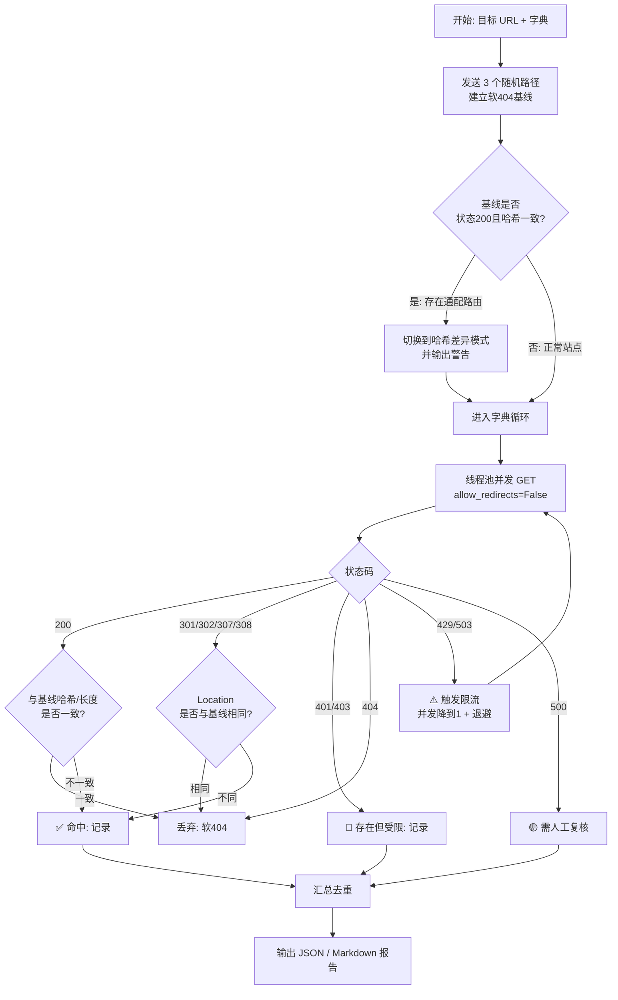

# Day 154 — 目录扫描与指纹识别：字典爆破、软 404 与资产发现

> 阶段：Phase 7 — 进阶与性能优化 · 主题：目录扫描与指纹识别
>
> 前置知识：Day 53 `requests` 入门、Day 116 TCP/UDP 协议、Day 153 端口扫描进阶、
> Day 152 XSS 与 Web 漏洞（HTTP 基础）。
> 昨天我们学会了"哪扇门开着"（端口扫描），今天学"门后面有哪些房间"
> （目录/文件枚举），并回答一个更工程化的问题：**这台服务器跑的是什么软件、
> 什么版本、什么框架**（指纹识别）。

---

## ⚠️ 使用前必读：法律与伦理边界

目录扫描（Directory Brute Force）本质上是**向目标服务器批量发送 HTTP 请求并
观察响应差异**。它不"破解"任何东西，但会产生大量请求，在未授权情况下依然是
一种探测行为，可能触犯：

| 法域 | 相关法条 |
|---|---|
| 中国大陆 | 《刑法》第 285 条、第 286 条；《网络安全法》第 27 条 |
| 美国 | CFAA, 18 U.S.C. § 1030 |
| 英国 | Computer Misuse Act 1990, s.1 |
| 欧盟 | 《网络犯罪公约》各缔约国转化条款 |

**允许使用本日内容的场景（白名单）：**

1. 你自己搭的机器 / 容器（本日示例统一硬编码 `127.0.0.1`）；
2. 组织资产且**持有书面授权**（写明域名、时间窗、请求速率上限、应急联系人）；
3. 授权靶场：自建 DVWA / VulnHub / HackTheBox / CTF 环境。

> 本日代码全部带 **"非本机目标必须显式声明授权"** 的护栏，并**强制限速**。
> 这不是形式主义：把安全边界写进代码，是安全工程师和"脚本小子"的分水岭。

---

## 一、概念解释

### 1.1 什么是"目录扫描"，它到底在解决什么问题

Web 服务器上的资源，理论上都应该被首页或导航链接引用。但现实里永远存在
**没有被任何页面链接指向的资源**：

- 备份文件：`backup.zip`、`www.tar.gz`、`index.php.bak`；
- 配置/调试入口：`.git/config`、`.env`、`phpinfo.php`、`debug.log`；
- 管理后台：`admin/`、`manager/html`、`wp-admin/`；
- API 文档与旧版本：`api/v1/`、`swagger.json`、`old/`；
- 编辑器残留：`index.php.swp`、`.DS_Store`。

这些资源**不可从页面发现**（unlinked），只能靠"猜名字"来枚举。这就是
**字典爆破（dictionary brute force）**：拿一份常见路径字典，逐个拼接成 URL
发请求，根据响应判断"存在与否"。

**为什么这招有效？** 两个历史原因：

1. **"通过隐藏来保证安全"（security by obscurity）** 是很多开发者的默认心智——
   他们把后台放在 `/admin-8f3k/` 以为没人猜得到；
2. **部署事故**：`.git/` 目录、`node_modules/`、`.env` 被误传到 Web 根目录，
   这类文件一旦可读，往往直接等于"源码泄露 + 凭据泄露"。

> 所以目录扫描的**真正价值在防御侧**：它是"我自己的站点有没有裸奔"的
> 最快自检手段。攻击者只是把同一套动作换成了恶意目的。

### 1.2 状态码：判断"存在"的第一依据

| 状态码 | 语义 | 扫描中的含义 |
|---|---|---|
| `200 OK` | 资源存在且返回内容 | **命中**（但要防"软 404"，见 1.4） |
| `204 No Content` | 成功但无响应体 | 命中，常见于 API 探活 |
| `301 / 308` | 永久重定向 | 常见于目录：`/admin` → `/admin/` |
| `302 / 307` | 临时重定向 | 常见于"未登录 → 跳转登录页"，**命中率极高** |
| `401 Unauthorized` | 需要认证 | **这是好线索**：说明资源存在，只是要登录 |
| `403 Forbidden` | 存在但禁止访问 | **同样是强线索**：存在！只是被规则挡住 |
| `200` 但内容为"页面不存在" | 软 404 | **误报源头**，必须过滤 |
| `404 Not Found` | 不存在 | 未命中 |
| `429 Too Many Requests` | 被限流 | **立即降速**，否则 IP 被封 |
| `500 / 503` | 服务端错误 | 可能是"参数不对"导致，需人工复核 |

**关键认知：**

- `403` 和 `401` **不是失败**，是"这个路径确实存在"的证据。很多扫描器默认只
  记录 200，会漏掉最有价值的发现（比如被 WAF 拦截的 `/admin`）。
- **路径长度与响应长度往往比状态码更可靠**：有的站点对所有不存在路径返回
  `200 + 自定义 404 页面`，只看状态码会得到 100% 误报。

### 1.3 字典从哪来，怎么选

| 字典 | 规模 | 特点 |
|---|---|---|
| `common.txt`（SecLists） | ~4700 行 | 通用性最好，适合日常自检 |
| `directory-list-2.3-small.txt` | ~8.7 万 | 平衡型，dirbuster 经典 |
| `directory-list-2.3-medium.txt` | ~22 万 | 全量，耗时长，需授权 |
| `raft-small-words.txt` | ~1 万 | 小写单词表，速度快 |
| 自建字典 | 任意 | **最优解**：从业务命名习惯提炼（如 `api`、`internal`、`v2`） |

**选择原则：**

1. **先小后大**：小字典跑完看趋势，再决定是否上大字典；
2. **加后缀变体**：`.bak`、`.old`、`.zip`、`.tar.gz`、`~`、`.swp`、`.1`；
3. **注意大小写**：Linux 文件系统区分大小写，`Admin` 和 `admin` 是两个路径，
   常见做法是"原词 + 首字母大写 + 全大写"三种变体。

### 1.4 软 404（Soft 404）：目录扫描最大的坑

**定义**：服务器对"不存在的资源"返回 `200 OK`，而响应体是一个自定义的
"页面不存在"页面。常见于：

- SPA（单页应用）：`nginx` 配置 `try_files $uri /index.html`，任何路径都返回首页；
- 框架路由：Django/Flask 的 catch-all 路由；
- 站点自定义 404 页面（返回 200 是为了"用户体验"或"SEO"）。

**后果**：如果你只看状态码，**每一个**请求都"命中"，扫描结果变成一份
字典的副本，毫无信息量。

**解决方案（工程上必须实现）：**

1. **基线比对（baseline diff）**：先请求 2~3 个**必然不存在**的随机路径
   （如 `/zzz-not-exist-a1b2c3`），记录其状态码与响应特征；
2. **响应体长度容差**：命中判定为 `abs(len(实际) - len(基线)) > 阈值`
   （或用**内容哈希**，比长度更稳）；
3. **页面标题/关键词过滤**：基线页面里抓 `<title>` 和 "not found" 等关键词，
   响应里出现同样内容则丢弃；
4. **拒绝"通配响应"**：如果随机路径返回 200 且长度一致，直接判定目标存在
   **通配路由**，本日工具应给出警告并切到"仅按哈希差异"模式。

> **一句话记住**：目录扫描的正确性，90% 取决于软 404 过滤做得好不好。
> 不会过滤软 404 的扫描器，只是一台"请求放大器"。

### 1.5 Web 指纹识别（Fingerprinting）：识别"这是什么"

指纹识别的目标：**在不登录、不利用漏洞的前提下，判断目标的技术栈**。
它服务于三件事：

1. **资产管理**：我到底有多少台 nginx、多少个 WordPress；
2. **漏洞排查**：nginx 1.18.0 有已知 CVE，我要不要升级；
3. **攻击面评估（防御方也做）**：暴露的版本号本身就是风险。

**指纹证据来源（按可靠性排序）：**

| 证据 | 示例 | 可靠性 |
|---|---|---|
| `Server` 响应头 | `Server: nginx/1.24.0` | 高（但可伪造/可关闭） |
| `X-Powered-By` | `X-Powered-By: PHP/8.1.2` | 高（常被关闭） |
| `Set-Cookie` 名字 | `JSESSIONID`→Java、`PHPSESSID`→PHP、`csrftoken`→Django | 高 |
| 特殊路径响应 | `/wp-login.php` 存在 → WordPress | 高 |
| 页面特征字符串 | `<meta name="generator" content="WordPress 6.4">` | 中 |
| 静态资源哈希 | `/static/js/main.abc123.js` → 前端构建工具 | 中 |
| **favicon 哈希** | `mmh3(favicon.ico)` 与 Shodan/Fofa 库比对 | 中高 |
| 默认错误页 | nginx 的 `502` 页样式 | 中 |
| TCP/IP 栈特征 | TTL、TCP 窗口大小、选项顺序（p0f 思路） | 中（需原始套接字） |

**为什么 favicon 哈希是个好东西？** `favicon.ico` 是 Web 应用的"指纹"里
**最稳定**的部分之一：它很少随版本更新，且**跨域名共享**（同一个 CMS/产品
部署在不同 IP 上，favicon 哈希相同）。计算方式是：

```
mmh3.hash(base64(favicon_bytes))   # 得到 32 位有符号整数
```

把它丢进 Shodan（`http.favicon.hash:-1234567`）或 Fofa，经常能一把捞出
同一个产品部署的上百个实例。

### 1.6 多线程：为什么扫描必须并发

单线程扫描 1 万个路径，每个请求 RTT 100ms：

```
10000 × 0.1s = 1000s ≈ 16.7 分钟
```

用 50 个线程并行：

```
10000 × 0.1s / 50 ≈ 20s
```

**为什么用线程池而不是 asyncio？**

- `requests` 是同步阻塞库，配 `ThreadPoolExecutor` 改动最小、心智负担最低；
- 扫描是 **I/O 密集**（等网络），GIL 在 I/O 等待时会释放，线程池收益接近线性；
- 代价是每线程内存开销（~8MB 栈）和上下文切换；50~100 线程是甜点区间；
- 若追求极限，可换 `httpx.AsyncClient`（协程，单线程可开 500+ 并发），
  但要注意**服务端和 WAF 都会把你当 DDoS**。

### 1.7 限速：不是礼貌，是必需

三个层面必须限速：

1. **法律/合规层面**：授权书里通常写死"≤ N req/s"，超了就是违约；
2. **可用性层面**：快速扫描可能压垮小站（真事：某 2 核 2G 的 VPS 被
   `-T5` 级别的扫描打到 502）；
3. **反制层面**：绝大多数 WAF（Cloudflare、阿里云盾、ModSecurity）都有
   **请求速率阈值**，超限先 `429`，再封 IP 10~60 分钟——你的扫描直接中断。

**实战参数建议：**

- 自建靶场：10~50 并发无压力；
- 生产环境授权测试：**2~5 并发 + 每请求间 100~300ms 延迟**；
- 遇到 `429` / `503`：**立刻把并发降到 1**，并读取 `Retry-After` 头。

---
## 二、原理解释（底层机制与设计动机）

### 2.1 HTTP/1.1 请求-响应与"存在性"的判定依据

一次目录扫描请求在网络层发生了什么：

```
客户端                                       服务器
  |  TCP 三次握手 (SYN / SYN-ACK / ACK)         |
  |-------------------------------------------->|
  |  GET /admin HTTP/1.1                        |
  |  Host: 127.0.0.1                            |
  |  User-Agent: ...                            |
  |  Connection: keep-alive                     |
  |-------------------------------------------->|
  |                                             |  路由匹配
  |                                             |  ├─ 命中文件 → 200
  |                                             |  ├─ 目录无 / → 301
  |                                             |  ├─ 需要登录 → 302/401
  |                                             |  └─ 不存在   → 404
  |   HTTP/1.1 301 Moved Permanently            |
  |   Location: /admin/                         |
  |   Content-Length: 0                         |
  |<--------------------------------------------|
  |  (keep-alive 复用连接, 继续下一个路径)        |
```

**关键设计点：**

- **`Host` 头决定路由**：同一 IP 上不同虚拟主机（vhost）返回完全不同内容。
  扫描必须带上正确的 `Host`，否则可能扫到"默认站点"（default_server），
  拿到一堆与你目标无关的 200。
- **`Connection: keep-alive`**：复用 TCP 连接可以省掉每请求一次三次握手，
  在 1 万路径的扫描里能省掉 90%+ 的握手开销。`requests.Session` 默认开启。
- **HTTP/2 的影响**：多路复用让并发在协议层完成，但**请求速率**照样被服务端
  统计，不要以为 HTTP/2 就能无限并发。

### 2.2 为什么"不存在的路径"会有各种奇怪响应

这是理解软 404 的关键。响应由**多层中间件**共同决定：

```
请求 → CDN/WAF → 反向代理(nginx) → 应用服务器(gunicorn/uwsgi) → 框架路由 → 视图
         │              │                    │                    │
         │              │                    │                    └─ 无匹配 → 框架 404
         │              │                    └─ 进程挂了/超时 → 502
         │              └─ try_files 命中 index.html → 200 (软 404!)
         └─ 命中 WAF 规则 → 403 / 自定义拦截页
```

**设计动机拆解：**

1. 为什么 nginx 的 SPA 配置会制造软 404？

   ```nginx
   location / {
       try_files $uri $uri/ /index.html;   # 找不到就给 index.html
   }
   ```
   这是为了让前端路由（`/user/123`）在浏览器刷新后不 404。**代价**是任何路径
   都返回 200。这是"前端路由"和"HTTP 语义"的冲突，属于架构层面的取舍。

2. 为什么有人把 404 改成 200？
   搜索引擎优化（SEO）历史遗留 + "用户看到 404 不友好"。SEO 上其实是错的
   （软 404 会被 Google 降权），但存量站点很多。

3. 为什么 `/admin` 会 302 到 `/login`？
   应用层鉴权中间件统一处理："未认证 → 重定向到登录页"。这条规则对**所有**
   受保护路径生效，所以 `/admin`、`/api/users`、`/dashboard` 全都 302 到同一个
   URL —— **重定向目标相同**这个特征，本身就可以用来区分"真存在"和"不存在"。

### 2.3 软 404 检测算法（本日工具的核心）

```
输入: 目标 URL, 字典, 线程数
1. 生成 N=3 个随机路径:
     /a9f3k2-notexist, /z7x1m-notexist, /q2w8v-notexist
2. 记录基线集合 B = [(status, len, sha256(body), title), ...]
3. 对每个字典路径 P:
     r = GET(P)
     若 (r.status, sha256(r.body)) 与任一基线完全相同 → 丢弃
     若 r.status 在 B 的 status 集合内 且 |len(r.body) - len(baseline)| <= 容差 → 丢弃
     若 r.status in {401, 403, 500} → 记录为"存在但受限"
     若 r.status in {301, 302} 且 Location 与基线不同 → 记录
     否则 → 记录为命中
4. 输出: 命中列表 + 基线指纹（供人工复核）
```

**为什么要用 `sha256` 而不是只比长度？** 因为存在**动态页面**：页脚有随机
nonce、时间戳、"访问量"计数。长度会抖动，但**去掉动态部分后哈希一致**。
工程折中方案：

- 优先比哈希；哈希不同再比长度（容差 5%）；都不同就是命中。

### 2.4 favicon 哈希的完整计算原理

```
favicon.ico (二进制)
   ↓ base64 编码（因为 mmh3 对 "str" 编码敏感，base64 能消除换行/编码差异）
"AAABAAEAEBAAAAEAIABoBAAAFgAAACgAAAAQAAAAIAAAAAEAIAAAAAAAAAQA..."
   ↓ mmh3.hash(s, signed=True)   ← MurmurHash3 x86 32 位
-1234567890
   ↓ 查询指纹库（Shodan: http.favicon.hash:-1234567890 / Fofa）
"该哈希对应: Grafana 8.x 默认 icon"
```

**为什么用 MurmurHash3 而不是 MD5？**

- MurmurHash3 是**非加密哈希**，速度快、分布均匀，适合"当索引键"；
- Shodan/Fofa 的 favicon 索引就是这么建的，你算出的哈希必须**和它们一致**
  才能查到东西——这是"事实标准"，不是因为 mmh3 本身更优。
- **必须 base64（或统一为 UTF-8 字符串）**：mmh3 的 `hash()` 对 `str` 会先
  按 UTF-8 编码，对 `bytes` 直接算。为了跨工具一致，社区统一约定
  "base64 后取 hash"。

### 2.5 并发模型选型：线程池 vs 协程 vs 进程池

| 模型 | 适用 | 优点 | 缺点 |
|---|---|---|---|
| `ThreadPoolExecutor` | 同步库（requests）批量 I/O | 改动小、调试易 | 线程内存开销、GIL 切换 |
| `asyncio` + `httpx/aiohttp` | 高并发 I/O | 单线程数千并发 | 生态异步化成本、调试难 |
| `ProcessPoolExecutor` | CPU 密集 | 绕开 GIL | 进程开销大，I/O 场景完全没必要 |
| `multiprocessing.dummy` | — | 其实就是线程池 | 命名有误导性 |

**本日选线程池的理由**：扫描的瓶颈在网络 I/O，`requests.Session` 复用连接后
单线程也能到几百 req/s；50 线程足以在"不惹怒 WAF"的前提下把 1 万字典跑完。

### 2.6 指纹识别的"被动 vs 主动"路线

```
被动指纹 (passive)                      主动指纹 (active)
─────────────────                       ─────────────────
只看正常请求的响应                       额外发专门请求
 ├─ 响应头                                ├─ 访问 /wp-login.php 是否存在
 ├─ Cookie 名                             ├─ 读 /favicon.ico 算哈希
 ├─ HTML 特征                             ├─ 试探 /actuator/env (Spring)
 └─ 静态资源路径                           ├─ 试探 /.git/config
                                         └─ 读 /robots.txt, /sitemap.xml
优点: 不产生额外流量、风险低              优点: 准确率高、能识别版本
缺点: 目标关掉 Server 头就失效            缺点: 流量明显、可能触发告警
```

**工程建议：先被动，再少量主动。** 本日 `03` 示例实现"被动为主 + 若干
低风险主动探针（robots.txt / favicon / 已知路径）"的组合。

---
## 三、定义与使用方法（API 速查表）

### 3.1 `requests` 扫描必需部分速查

```python
import requests

# ── 会话：复用 TCP 连接，扫描时必用 ──
s = requests.Session()
s.headers.update({
    "User-Agent": "Mozilla/5.0 (compatible; OwnedSiteAudit/1.0)",  # 标识自己，礼貌
    "Accept": "*/*",
})

# ── 请求：超时必须是 (连接超时, 读取超时) 元组 ──
r = s.get(url, timeout=(3, 5), allow_redirects=False, verify=False)

# 参数说明：
#   timeout=(3, 5)       连接 3s、读取 5s 未完成就抛异常
#   allow_redirects=False 关键！需要自己看 301/302 的 Location，而不是被自动跟随
#   verify=False          仅用于自签名证书的靶场；会打印 InsecureRequestWarning
#   stream=True + r.raw.read(limit)  只读前 N 字节，适合大文件/伪造 content-length

# ── 响应属性 ──
r.status_code      # int: 200/301/404/...
r.headers          # CaseInsensitiveDict，r.headers.get("server") 小写也能取到
r.text             # str，按 apparent_encoding 解码
r.content          # bytes，算哈希/写文件用这个，避免解码带来的差异
r.url              # 最终 URL（allow_redirects=True 时可能已变化）
r.history          # list[Response]，重定向链
r.elapsed          # timedelta，本请求耗时

# ── 异常体系（必须按顺序捕获）──
requests.exceptions.ConnectTimeout      # 连接阶段超时
requests.exceptions.ReadTimeout         # 读取阶段超时
requests.exceptions.TooManyRedirects    # 重定向死循环
requests.exceptions.SSLError            # 证书错误
requests.exceptions.ConnectionError     # DNS 失败 / 拒绝连接（含上面几种的子类父类关系）
requests.exceptions.RequestException    # 所有异常的基类 ← 兜底写这个

# ── 关闭 ──
s.close()          # 或 with requests.Session() as s: ...
```

### 3.2 `concurrent.futures` 速查（扫描骨架）

```python
from concurrent.futures import ThreadPoolExecutor, as_completed

with ThreadPoolExecutor(max_workers=50) as ex:
    futures = {ex.submit(probe, url): url for url in urls}
    for fut in as_completed(futures):
        url = futures[fut]
        try:
            result = fut.result(timeout=0)     # 已在 as_completed 后，timeout 无意义
        except Exception as e:
            result = None                      # 单个任务失败不影响整体
```

| 方法 | 作用 | 注意 |
|---|---|---|
| `submit(fn, *args)` | 提交单个任务，返回 `Future` | 不阻塞 |
| `map(fn, iterable)` | 批量提交，返回**按输入顺序**的迭代器 | 会按顺序返回，慢任务会阻塞后面 |
| `as_completed(fs)` | 谁先完成先返回 | 扫描场景首选 |
| `Future.result()` | 取返回值，异常会在此**重新抛出** | 不写 try 会让整个循环崩掉 |
| `Future.cancel()` | 取消未开始的任务 | 已运行的取消不了 |
| `shutdown(wait=False)` | 不等任务结束 | `with` 语句会自动 `wait=True` |

### 3.3 哈希与 base64 速查（favicon / 内容比对）

```python
import base64, hashlib
try:
    import mmh3                      # pip install mmh3
except ImportError:
    mmh3 = None

data = open("favicon.ico", "rb").read()

# Shodan/Fofa 口径的 favicon 哈希
h = mmh3.hash(base64.encodebytes(data))        # 注意：encodebytes 带换行，社区两种口径都有
# 另一种常见口径：mmh3.hash(base64.b64encode(data))  （标准 b64，无换行）
print(h)                                       # 有符号 32 位整数，如 -1234567890

# 响应体内容指纹（用于软 404 比对，避免解码差异）
sha = hashlib.sha256(r.content).hexdigest()

# 归一化后再哈希（去掉动态数字/时间戳）
import re
norm = re.sub(rb"\d+", b"#", r.content)        # 把所有数字替换成 #
norm_hash = hashlib.sha256(norm).hexdigest()
```

### 3.4 常用指纹特征速查表

```python
FINGERPRINTS = {
    "Server 头": {
        r"nginx/([\d.]+)":      "nginx",
        r"Apache/([\d.]+)":     "Apache httpd",
        r"gunicorn/([\d.]+)":   "Gunicorn (Python WSGI)",
        r"uvicorn":             "Uvicorn (ASGI/FastAPI)",
        r"cloudflare":          "Cloudflare CDN",
        r"openresty":           "OpenResty (nginx+lua)",
        r"Microsoft-IIS/([\d.]+)": "IIS",
    },
    "X-Powered-By": {
        r"PHP/([\d.]+)":        "PHP",
        r"Express":             "Express (Node.js)",
        r"ASP\.NET":            "ASP.NET",
    },
    "Cookie 名": {
        r"PHPSESSID":   "PHP",
        r"JSESSIONID":  "Java Servlet (Tomcat/Jetty)",
        r"csrftoken":   "Django",
        r"sessionid":   "Django",
        r"laravel_session": "Laravel (PHP)",
        r"connect\.sid": "Express (Node.js)",
        r"ASP\.NET_SessionId": "ASP.NET",
        r"grafana_session": "Grafana",
    },
    "HTML 特征": {
        r'name="generator" content="WordPress ([\d.]+)"': "WordPress",
        r"wp-content/":  "WordPress",
        r"/_next/static/": "Next.js",
        r"/static/js/main\.[0-9a-f]+\.js": "React (CRA)",
        r"__NEXT_DATA__": "Next.js",
        r"Drupal\.settings": "Drupal",
        r"cdn\.shopify\.com": "Shopify",
    },
    "探针路径": {
        "/wp-login.php":   "WordPress",
        "/administrator/": "Joomla",
        "/user/login":     "Drupal",
        "/actuator/health":"Spring Boot Actuator",
        "/swagger-ui.html":"SpringFox Swagger",
        "/.git/HEAD":      "Git 目录泄露 ⚠️",
        "/.env":           ".env 泄露 ⚠️",
        "/phpinfo.php":    "phpinfo 泄露 ⚠️",
        "/server-status":  "Apache status ⚠️",
    },
}
```

### 3.5 响应头安全自查速查（防御侧）

| 响应头 | 期望值 | 缺失意味着 |
|---|---|---|
| `Strict-Transport-Security` | `max-age=31536000; includeSubDomains` | 可被 SSL 剥离降级 |
| `Content-Security-Policy` | 白名单式策略 | XSS 无第二道防线 |
| `X-Content-Type-Options` | `nosniff` | MIME 嗅探导致脚本执行 |
| `X-Frame-Options` / CSP `frame-ancestors` | `DENY` / `SAMEORIGIN` | 点击劫持 |
| `Referrer-Policy` | `strict-origin-when-cross-origin` | 敏感 URL 泄露给第三方 |
| `Permissions-Policy` | 按需关闭 | 摄像头/麦克风被滥用 |
| `Server` / `X-Powered-By` | **建议删除或模糊化** | 版本信息泄露 → 精准打 CVE |

> 扫描自己的站点时，**这份表就是产出物**：一份"缺失的安全头清单"比
> 一堆 `200` 的目录列表有用得多。

---
## 四、图解

> 完整图解（含 5 张 Mermaid/ASCII 图）见 [`diagrams/README.md`](diagrams/README.md)。
> 下面给出最核心的两张。

### 4.1 目录扫描决策流程（Mermaid）



### 4.2 指纹识别证据层次（ASCII）

```
可靠性  ┌──────────────────────────────────────────────┐
 高     │ 响应头: Server / X-Powered-By / Cookie 名     │  ← 先看这个
        ├──────────────────────────────────────────────┤
        │ 特殊路径存在性: /wp-login.php /actuator      │  ← 再主动探
        ├──────────────────────────────────────────────┤
        │ 页面特征: generator meta / 静态资源路径       │
        ├──────────────────────────────────────────────┤
        │ favicon mmh3 哈希 → Shodan/Fofa 库比对       │
        ├──────────────────────────────────────────────┤
 低     │ 默认错误页样式 / 目录列表样式                  │
        └──────────────────────────────────────────────┘
                          ↓
              证据加权 → 候选技术栈列表 → 人工确认
```

---

## 五、完整可运行实战代码

| 文件 | 行数 | 内容 |
|---|---|---|
| `code/01-dir-brute-basics.py` | ~230 | 基础：单线程 → 线程池目录扫描，显式观察 301/302/401/403 |
| `code/02-fingerprint-pitfalls.py` | ~280 | 进阶：软 404 基线、favicon 哈希、编码/重定向/Cookie 的 7 个坑 |
| `code/03-asset-discovery.py` | ~330 | 实战：并发资产发现工具（扫描 + 指纹 + 安全头体检 + JSON/MD 报告） |

**运行前提：**

```bash
# 建议用本地靶场（DVWA / 自建 nginx）验证，默认目标是 127.0.0.1:8080
pip install requests
pip install mmh3          # 可选；未安装时 02/03 会退化为"跳过 favicon 哈希"

python3 code/01-dir-brute-basics.py
python3 code/02-fingerprint-pitfalls.py
python3 code/03-asset-discovery.py --url http://127.0.0.1:8080
```

**护栏说明：** 三个脚本都要求目标为 `127.0.0.1 / localhost / ::1`；
若传入其他主机，必须同时加 `--i-have-authorization` 才继续，否则直接退出。

---

## 六、思考题

1. **为什么"只看状态码"的目录扫描器会产生大量误报？** 请从 SPA
   `try_files` 配置和框架 catch-all 路由两个角度解释，并说明你的过滤方案。

2. `403 Forbidden` 和 `404 Not Found`，哪一个对攻击者/审计者更有价值？
   为什么很多扫描器默认忽略 403 是设计缺陷？

3. favicon 哈希为什么能跨域名识别同一个产品？如果运维想"反指纹"，
   他应该怎么做？这样做有什么代价？

4. 你的扫描器把并发从 1 提到 50，命中率反而下降了，可能有哪些原因？
   （提示：连接池大小、`Retry-After`、WAF 的 sliding window、服务端 `MaxClients`）

5. **防御视角**：假设你是站长，无法改代码，只能改 nginx 配置。
   列出三条能显著降低目录扫描收益的配置，并说明每条的原理。

6. 如果目标站点对**每个**路径都返回 `200` 且响应长度完全相同，
   你还能用什么方法判断"文件是否真的存在"？（提示：HTTP 方法、
   `Accept-Ranges`、`Content-Length` 与实际下载字节数、ETag）

---

## 附：本日文件清单

```
days/day-154-directory-scan-fingerprint/
├── README.md                     ← 本文（概念/原理/API/图解/实战/思考题）
├── code/
│   ├── 01-dir-brute-basics.py    ← 基础目录扫描
│   ├── 02-fingerprint-pitfalls.py← 软404与指纹识别避坑
│   └── 03-asset-discovery.py     ← 实战资产发现工具
├── diagrams/
│   └── README.md                 ← 5 张原理图（Mermaid + ASCII）
└── exercises/
    └── checklist.md              ← 完成清单 + 5 道练习（基础/进阶）
```
